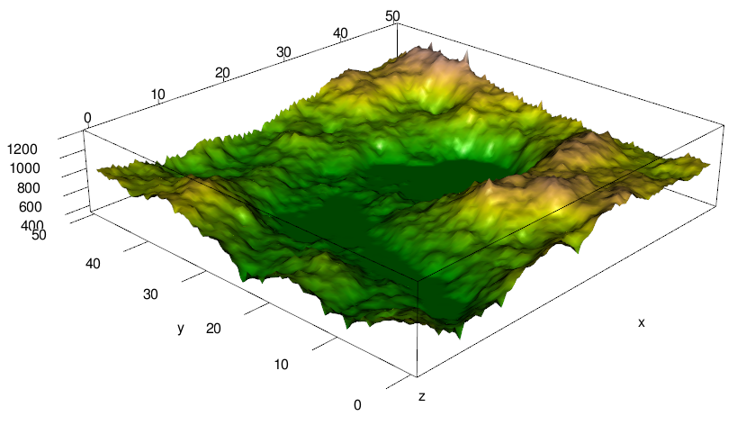

Week 12: Model selection uncertainty with AICc and Bootstrapping
========================================================

Background and Math
-------------------

As described in the Anderson et al. paper, traditional methods of model selection have a lot of problems.  They advocate an alternative approach using Akaike's Information Criterion,

\[
AIC = -2 \log \mathcal L + 2 k 
\]

where $\mathcal L$ is the model's likelihood and $k$ is the number of fitted parameters in the model.  The absolute value of $AIC$ is not informative, but within a set of models--*provided they are fit to the same data*--the model with the *lowest* $AIC$ is theoretically the best, in terms of optimizing the bias-variance tradeoff.

The corrected version for small sample sizes ($AICc$) adds another term on the end:
\[
AICc = -2 \log \mathcal L + 2 k + \frac{2k(k+1)}{n - k - 1}
\]
Here, $n$ is the number of data points.  The original $AIC$ tends to be too liberal when sample sizes are small, encouraging overfitting.  The extra penalty term in $AIC_c$ corrects for this.  As $n$ gets much larger than the number of parameters, the two versions converge, so there's no reason not to use $AICc$ all the time.  There a bunch of criteria like this, similar to or derived from $AIC$, and all work more or less the same way.  For generality, I'll use "AIC" as a catch-all term here.

Again, the absolute value of $AIC$ is meaningless--it is the relative values within a set of candidate models that is important.  As such, we are usually more interested in the difference between a given model's $AIC$ value and the lowest value in the set:

\[
\Delta_i = AIC_i - AIC_{min}
\]

This allows us to rank the models from best to worst.  As a rule of thumb, models with delta-AIC values less than 2 or 3 units apart have a pretty similar level of support.  If several models are close to the best one, we can't really be confident that the model ranking would remain the same if we were able to collect a new data set and do the model-selection procedure again.  

To get at this uncertaintly more rigorously, we can calculate the "Akaike weight" for each model:
\[
w_i = \frac{\exp \left(-\Delta_i/2 \right)}{\sum_{r=1}^{R} \exp \left( -\Delta_r / 2 \right)}
\]
The weights add up to 1, and represent the probability that each model would be chosen as the best if the model selection procedure were run again on a new dataset generated by the same underlying process.

Data and coding
---------------

All of the AIC-based procedures are conveniently available in the `AICcmodavg` package.

```r
library(AICcmodavg)
```


There is another approach to calculating the model-selection uncertainty, which should have popped into your head as soon as you read "a new dataset generated by the same underlying process," however--bootstrapping!  In this approach, replicate bootstrap datasets are selected from the original, and the model selection procedure is repeated many times.  We keep track of how many times each model is selected as the "best," and can calculate the selection probabilities empirically.


We will be using some data from a simulated survey of an imaginary mountain valley.  



You have spent an imaginary summer hiking all over the place, sampling random locations.  At each location, you have recorde whether the bird of interest was present, along with the percent cover of each of three plant species.  The high elevations are mostly bare rock and the valley floor is mostly farmland; there are variables coding for these types of cover as well.

The data are stored in "bird_habitat.csv."

```r
birds <- read.csv("bird_habitat.csv")
head(birds)
```

```
##   easting northing elevation rock farm  plant1 plant2   plant3
## 1   3.906    39.45     781.0    0    0 0.00000 0.1365 0.000000
## 2  37.109    39.45     602.3    0    0 0.14123 0.0000 0.057361
## 3  46.484    36.72     790.6    0    0 0.04335 0.0000 0.002638
## 4   7.812    10.16     423.4    0    0 0.00000 0.0000 0.001071
## 5  20.703    21.88     498.4    0    0 0.06864 0.3956 0.065702
## 6  21.094    33.59     340.0    0    1 0.00000 0.0000 0.000000
##   bird.present
## 1            0
## 2            0
## 3            0
## 4            0
## 5            0
## 6            0
```


Our goal--a common one in ecology--is to figure out which variables define the birds' habitat.  This boils down to choosing an appropriate model, using our available information, to predict the presence or absence of the bird.

The information-theoretic/AIC approach to model selection is easy with `AICcmodavg`.  We define a set of candidate models and, using `aictab`, calculate a table with the AICc scores, deltas, and weights.


```r
mod1 <- glm(bird.present ~ elevation, birds, family = binomial)
mod2 <- glm(bird.present ~ farm, birds, family = binomial)
mod3 <- glm(bird.present ~ northing + easting, birds, family = binomial)
aictab(list(mod1, mod2, mod3), modnames = c("Elevation", "Farm", "Position"))
```

```
## 
## Model selection based on AICc :
## 
##           K  AICc Delta_AICc AICcWt Cum.Wt     LL
## Farm      2 220.7       0.00   0.90   0.90 -108.3
## Position  3 225.9       5.24   0.07   0.97 -109.9
## Elevation 2 227.4       6.71   0.03   1.00 -111.7
```


Out of these three candidate models, the one using farmland as a predictor is heavily favored.
