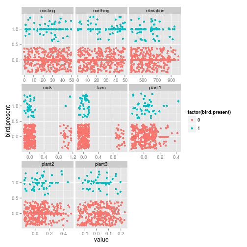

```r
library(AICcmodavg)
library(ggplot2)
library(reshape)
```

```
## Loading required package: plyr
## 
## Attaching package: 'reshape'
## 
## The following objects are masked from 'package:plyr':
## 
##     rename, round_any
```

```r

birds <- read.csv("bird_habitat.csv")
head(birds)
```

```
##   easting northing elevation rock farm  plant1 plant2   plant3
## 1   3.906    39.45     781.0    0    0 0.00000 0.1365 0.000000
## 2  37.109    39.45     602.3    0    0 0.14123 0.0000 0.057361
## 3  46.484    36.72     790.6    0    0 0.04335 0.0000 0.002638
## 4   7.812    10.16     423.4    0    0 0.00000 0.0000 0.001071
## 5  20.703    21.88     498.4    0    0 0.06864 0.3956 0.065702
## 6  21.094    33.59     340.0    0    1 0.00000 0.0000 0.000000
##   bird.present
## 1            0
## 2            0
## 3            0
## 4            0
## 5            0
## 6            0
```

```r
birds.m <- melt(birds, id = "bird.present")
ggplot(birds.m, aes(x = value, y = bird.present, color = factor(bird.present))) + 
    geom_point() + geom_jitter() + facet_wrap(~variable, scales = "free_x")
```

 


```r
hypotheses <- list(LandType = bird.present ~ 0 + rock + farm, Elevation = bird.present ~ 
    elevation + I(elevation^2), Plants = bird.present ~ plant1 + plant2 + plant3, 
    EcoZone = bird.present ~ elevation + I(elevation^2) + plant1 + I(plant1^2) + 
        plant2 + I(plant2^2) + plant3 + I(plant3^2), Regional = bird.present ~ 
        easting + northing)

models <- llply(hypotheses, glm, data = birds, family = binomial)
model.comparison <- aictab(models, modnames = names(models))
model.comparison
```

```
## 
## Model selection based on AICc :
## 
##           K  AICc Delta_AICc AICcWt Cum.Wt     LL
## Elevation 3 225.7       0.00   0.50   0.50 -109.8
## Regional  3 225.9       0.24   0.44   0.95 -109.9
## Plants    4 230.4       4.70   0.05   0.99 -111.1
## EcoZone   9 234.5       8.79   0.01   1.00 -107.9
## LandType  2 351.0     125.32   0.00   1.00 -173.5
```


The land-type model is clearly the best one.  Check out the parameter estimates:


```r
summary(models$LandType)
```

```
## 
## Call:
## FUN(formula = X[[1L]], family = ..2, data = ..1)
## 
## Deviance Residuals: 
##    Min      1Q  Median      3Q     Max  
## -1.177  -1.177  -1.177  -0.265   2.595  
## 
## Coefficients:
##      Estimate Std. Error z value Pr(>|z|)   
## rock    -3.33       1.02   -3.27   0.0011 **
## farm   -17.57     761.37   -0.02   0.9816   
## ---
## Signif. codes:  0 '***' 0.001 '**' 0.01 '*' 0.05 '.' 0.1 ' ' 1
## 
## (Dispersion parameter for binomial family taken to be 1)
## 
##     Null deviance: 415.89  on 300  degrees of freedom
## Residual deviance: 346.96  on 298  degrees of freedom
## AIC: 351
## 
## Number of Fisher Scoring iterations: 16
```


So birds are basically not found on farms or bare rocks.  Try the remaining hypotheses on the subset of non-rock, non-farm data:


```r
birds.veg <- subset(birds, !farm & !rock)
hypotheses2 <- hypotheses[2:5]
models2 <- llply(hypotheses2, glm, data = birds.veg, family = binomial)
model.comparison2 <- aictab(models2, modnames = names(models2))
model.comparison2
```

```
## 
## Model selection based on AICc :
## 
##           K  AICc Delta_AICc AICcWt Cum.Wt      LL
## Regional  3 206.8       0.00   0.55   0.55 -100.35
## Plants    4 208.3       1.46   0.27   0.82 -100.05
## Elevation 3 209.1       2.30   0.18   1.00 -101.50
## EcoZone   9 216.5       9.71   0.00   1.00  -98.87
```


On the subset of undeveloped, vegetataed samples, the "best" hypothesis is much less certain.  The AICc weights give one estimate of how likely each model is to be chosen again.  A bootstrap gives another.


```r
n.boot <- 500
best.models <- rep("", n.boot)
n <- nrow(birds.veg)

for (i in 1:n.boot) {
    boot.models <- llply(hypotheses2, glm, data = birds.veg[sample(n, n, replace = T), 
        ], family = binomial)
    best.models[i] <- as.character(aictab(boot.models, names(boot.models))$Modnames[1])
}
boot.results <- melt(table(best.models)/n.boot)
names(boot.results) <- c("Modnames", "BootProb")
boot.results <- join(model.comparison2, boot.results)
boot.results[c("Modnames", "AICcWt", "BootProb")]
```

```
##    Modnames   AICcWt BootProb
## 1  Regional 0.553840    0.426
## 2    Plants 0.266605    0.282
## 3 Elevation 0.175243    0.140
## 4   EcoZone 0.004311    0.152
```

