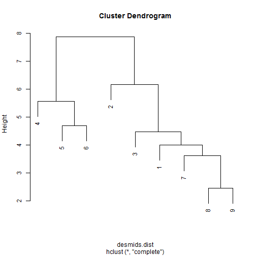
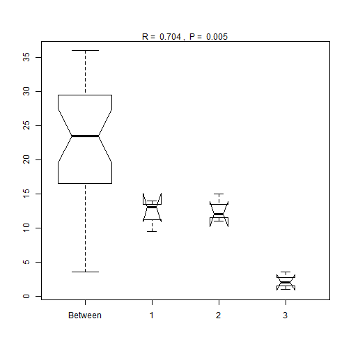
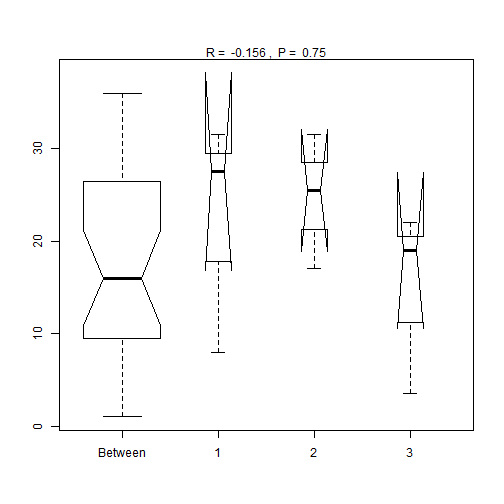

Week 13
========================================================

Read in data


```r
require(vegan)
```

```
## Loading required package: vegan
## Loading required package: permute
## Loading required package: lattice
## This is vegan 2.0-9
```

```r
require(ggplot2)
```

```
## Loading required package: ggplot2
```

```r
setwd("C:/Users/Ben/Documents/PermuteSeminar-2014")
a <- read.csv("Week-13/Svoboda_Supp_T2_longform.csv", row.names = 1)

env <- read.csv("Week-13/Svoboda_T2_csv.csv")

# reformat matrix
require(reshape)
```

```
## Loading required package: reshape
## Loading required package: plyr
## 
## Attaching package: 'reshape'
## 
## The following objects are masked from 'package:plyr':
## 
##     rename, round_any
```

```r

envA <- data.frame(colsplit(env$X, c("_"), c("ecosystem", "site")), env)

# Swamp pools for Ben

dat <- a[a$ecosystem == "Swamp", ]

require(reshape)
```


Using the anosim function in vegan to compare rank dis.

```r

data(dune)
data(dune.env)
dune.dist <- vegdist(dune)
attach(dune.env)
dune.ano <- anosim(dune.dist, Management)
summary(dune.ano)
```

```
## 
## Call:
## anosim(dat = dune.dist, grouping = Management) 
## Dissimilarity: bray 
## 
## ANOSIM statistic R: 0.258 
##       Significance: 0.01 
## 
## Based on  999  permutations
## 
## Upper quantiles of permutations (null model):
##   90%   95% 97.5%   99% 
## 0.127 0.182 0.218 0.253 
## 
## Dissimilarity ranks between and within classes:
##         0%   25%    50%    75%  100%   N
## Between  4 58.50 104.00 145.50 188.0 147
## BF       5 15.25  25.50  41.25  57.0   3
## HF       1  7.25  46.25  68.12  89.5  10
## NM       6 64.75 124.50 156.25 181.0  15
## SF       3 32.75  53.50  99.25 184.0  15
```

```r
plot(dune.ano)
```

```
## Warning: some notches went outside hinges ('box'): maybe set notch=FALSE
```

 


Make our data look like his data


```r
require(reshape)

dat.f <- t(cast(dat, Taxon ~ site + pool))
dist.all <- vegdist(dat.f)
distA <- melt(as.matrix(dist.all))

# split columns back out
reformat1 <- data.frame(distA, colsplit(distA$X1, "_", c("siteTo", "poolTo")))

reformat2 <- data.frame(reformat1, colsplit(distA$X2, "_", c("siteFrom", "poolFrom")))


ggplot(reformat2, aes(y = value, x = factor(poolTo), col = factor(poolTo))) + 
    geom_boxplot() + facet_grid(~siteTo)
```

 


Aggregate and compute means among versus between


```r

unique(dat$Taxon)
```

```
##  [1] Actinotaenium_cruciferum_(De_Bary)_Teiling              
##  [2] Actinotaenium_cucurbita_(Ralfs)_Teiling                 
##  [3] Actinotaenium_silvae-nigrae_(Rabanus)_Kouwets_et_Coesel 
##  [4] Closterium_cf._abruptum_W._West                         
##  [5] Closterium_angustatum_Ralfs                             
##  [6] Closterium_attenuatum_Ralfs                             
##  [7] Closterium_baillyanum_(Ralfs)_Br_b.                     
##  [8] Closterium_calosporum_Wittr.                            
##  [9] Closterium_costatum_Ralfs                               
## [10] Closterium_dianae_Ralfs                                 
## [11] Closterium_directum_W._Archer                           
## [12] Closterium_gracile_Ralfs                                
## [13] Closterium_juncidum_Ralfs                               
## [14] Closterium_lineatum_Ralfs                               
## [15] Closterium_lunula_Ralfs                                 
## [16] Closterium_cf._macilentum_Br_b.                         
## [17] Closterium_navicula_(Br_b.)_LÙtkem.                     
## [18] Closterium_parvulum_N_geli                              
## [19] Closterium_pronum_Br_b.                                 
## [20] Closterium_setaceum_Ralfs                               
## [21] Closterium_striolatum_Ralfs                             
## [22] Cosmarium_amoenum_Ralfs                                 
## [23] Cosmarium_angulosum_Br_b.                               
## [24] Cosmarium_blyttii_Wille                                 
## [25] Cosmarium_contractum_Kirchn.                            
## [26] Cosmarium_difficile_LÙtkem.                             
## [27] Cosmarium_discrepans___astn__et_Kouwets                 
## [28] Cosmarium_goniodes_var._subturgidum_W._et_G._S._West    
## [29] Cosmarium_margaritiferum_Ralfs                          
## [30] Cosmarium_messikommeri_Coesel                           
## [31] Cosmarium_obsoletum_(Hantzsch)_Reinsch                  
## [32] Cosmarium_ordinatum_(BÀrges.)_W._et_G_.S._West          
## [33] Cosmarium_ornatum_Ralfs                                 
## [34] Cosmarium_paragranatoides_Skuja                         
## [35] Cosmarium_prominulum_var._subundulatum_W._et_G._S._West 
## [36] Cosmarium_pseudoornatum_B._Eichler_et_Gutw.             
## [37] Cosmarium_pseudopyramidatum__P._Lundell                 
## [38] Cosmarium_cf._pseudoretusum_F._Ducell                   
## [39] Cosmarium_pyramidatum_Ralfs                             
## [40] Cosmarium_regnellii_Wille                               
## [41] Cosmarium_sphagnicolum_W._et_G._S._West                 
## [42] Cosmarium_tinctum_Ralfs                                 
## [43] Cosmarium_sp._1                                         
## [44] Cosmarium_sp._2_(smaller_C._contractum)                 
## [45] Cosmarium_sp._3                                         
## [46] Cylindrocystis_brebissonii_De_Bary                      
## [47] Cylindrocystis_crassa_De_Bary                           
## [48] Cylindrocystis_gracilis_I._Hirn                         
## [49] Euastrum_ansatum_Ralfs                                  
## [50] Euastrum_binale_Ralfs                                   
## [51] Euastrum_denticulatum_F._Gay                            
## [52] Euastrum_elegans_Ralfs                                  
## [53] Euastrum_gayanum_De_Toni                                
## [54] Euastrum_humerosum_Ralfs                                
## [55] Euastrum_insigne_Ralfs                                  
## [56] Euastrum_oblongum_Ralfs                                 
## [57] Euastrum_pectinatum_Ralfs                               
## [58] Euastrum_pinnatum_Ralfs                                 
## [59] Euastrum_verrucosum_Ralfs                               
## [60] Haplotaenium_minutum_(Ralfs)_Bando                      
## [61] Haplotaenium_rectum_(Delponte)_Bando                    
## [62] Mesotaenium_endlicherianum_N_geli                       
## [63] Micrasterias_jenneri_Ralfs                              
## [64] Micrasterias_oscitans_Ralfs                             
## [65] Micrasterias_rotata_Ralfs                               
## [66] Micrasterias_thomasiana_var._notata_(Nordstedt)_Gr_nblad
## [67] Micrasterias_truncata_Ralfs                             
## [68] Netrium_digitus_Itzigs._et_Rothe                        
## [69] Netrium_oblongum_(De_Bary)_LÙtkem.                      
## [70] Penium_cylindrus_Ralfs                                  
## [71] Penium_spirostriolatum_J._Barker                        
## [72] Pleurotaenium_ehrenbergii_(Ralfs)_De_Bary               
## [73] Staurastrum_aculeatum_Ralfs                             
## [74] Staurastrum_hirsutum_Ralfs                              
## [75] Staurastrum_hystrix_Ralfs                               
## [76] Staurastrum_inflexum_Br_b.                              
## [77] Staurastrum_micron_W._et_G._S._West                     
## [78] Staurastrum_minimum_Coesel                              
## [79] Staurastrum_polymorphum_Ralfs                           
## [80] Staurastrum_punctulatum_Ralfs                           
## [81] Staurastrum_scabrum_Ralfs                               
## [82] Staurastrum_simonyi_Heimerl                             
## [83] Staurastrum_teliferum_Ralfs                             
## [84] Staurastrum_tetracerum_Ralfs                            
## [85] Staurastrum_sp._1                                       
## [86] Staurastrum_sp._2                                       
## [87] Staurastrum_sp._3                                       
## [88] Staurodesmus_dejectus_(Ralfs)_Teiling                   
## [89] Staurodesmus_extensus_(Borge)_Teiling                   
## [90] Staurodesmus_incus_(Br_b.)_Teiling                      
## [91] Tetmemorus_brebissonii_Ralfs                            
## [92] Tetmemorus_granulatus_Ralfs                             
## [93] Tetmemorus_laevis_Ralfs                                 
## [94] Xanthidium_antilopaeum_var._laeve_Schmidle              
## [95] Xanthidium_armatum_Ralfs                                
## 95 Levels: Actinotaenium_cruciferum_(De_Bary)_Teiling ...
```

```r

desmids.t <- cast(dat, ecosystem + site + pool ~ Taxon)
desmids.dist <- dist(desmids.t[, 3:98])
plot(hclust(desmids.dist))
```

 


By site

```r
bysite <- anosim(desmids.dist, desmids.t$site)
bysite
```

```
## 
## Call:
## anosim(dat = desmids.dist, grouping = desmids.t$site) 
## Dissimilarity: euclidean 
## 
## ANOSIM statistic R: 0.704 
##       Significance: 0.005 
## 
## Based on  999  permutations
```

```r
plot(bysite)
```

```
## Warning: some notches went outside hinges ('box'): maybe set notch=FALSE
```

 


By pool

```r
bypool <- anosim(desmids.dist, desmids.t$pool)
bypool
```

```
## 
## Call:
## anosim(dat = desmids.dist, grouping = desmids.t$pool) 
## Dissimilarity: euclidean 
## 
## ANOSIM statistic R: -0.156 
##       Significance: 0.75 
## 
## Based on  999  permutations
```

```r
plot(bypool)
```

```
## Warning: some notches went outside hinges ('box'): maybe set notch=FALSE
```

 


