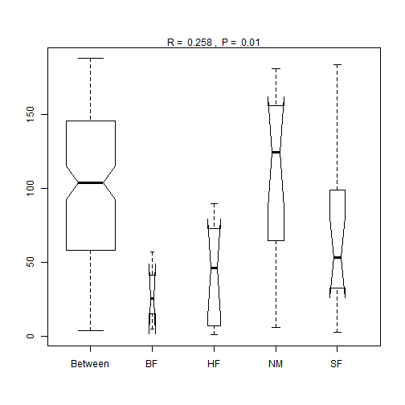
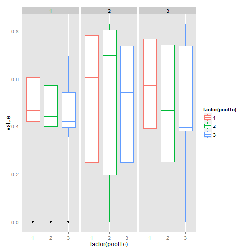

Week 13
========================================================

Read in data


```r
require(vegan)
```

```
## Loading required package: vegan
## Loading required package: permute
## Loading required package: lattice
## This is vegan 2.0-9
```

```r
require(ggplot2)
```

```
## Loading required package: ggplot2
```

```r
setwd("C:/Users/Ben/Documents/PermuteSeminar-2014")
a <- read.csv("Week-13/Svoboda_Supp_T2_longform.csv", row.names = 1)

env <- read.csv("Week-13/Svoboda_T2_csv.csv")

# reformat matrix
require(reshape)
```

```
## Loading required package: reshape
## Loading required package: plyr
## 
## Attaching package: 'reshape'
## 
## The following objects are masked from 'package:plyr':
## 
##     rename, round_any
```

```r

envA <- data.frame(colsplit(env$X, c("_"), c("ecosystem", "site")), env)

# Swamp pools for Ben

dat <- a[a$ecosystem == "Swamp", ]

require(reshape)
```


Using the anosim function in vegan to compare rank dis.

```r

data(dune)
data(dune.env)
dune.dist <- vegdist(dune)
attach(dune.env)
dune.ano <- anosim(dune.dist, Management)
summary(dune.ano)
```

```
## 
## Call:
## anosim(dat = dune.dist, grouping = Management) 
## Dissimilarity: bray 
## 
## ANOSIM statistic R: 0.258 
##       Significance: 0.009 
## 
## Based on  999  permutations
## 
## Upper quantiles of permutations (null model):
##   90%   95% 97.5%   99% 
## 0.115 0.161 0.193 0.234 
## 
## Dissimilarity ranks between and within classes:
##         0%   25%    50%    75%  100%   N
## Between  4 58.50 104.00 145.50 188.0 147
## BF       5 15.25  25.50  41.25  57.0   3
## HF       1  7.25  46.25  68.12  89.5  10
## NM       6 64.75 124.50 156.25 181.0  15
## SF       3 32.75  53.50  99.25 184.0  15
```

```r
plot(dune.ano)
```

```
## Warning: some notches went outside hinges ('box'): maybe set notch=FALSE
```

 


Make our data look like his data


```r
require(reshape)

dat.f <- t(cast(dat, Taxon ~ site + pool))
dist.all <- vegdist(dat.f)
distA <- melt(as.matrix(dist.all))

# split columns back out
reformat1 <- data.frame(distA, colsplit(distA$X1, "_", c("siteTo", "poolTo")))

reformat2 <- data.frame(reformat1, colsplit(distA$X2, "_", c("siteFrom", "poolFrom")))


ggplot(reformat2, aes(y = value, x = factor(poolTo), col = factor(poolTo))) + 
    geom_boxplot() + facet_grid(~siteTo)
```

 


Aggregate and compute means among versus between


```r
anosim(env, "")
```

```
## Error: 'x' must be numeric
```

```r

```
