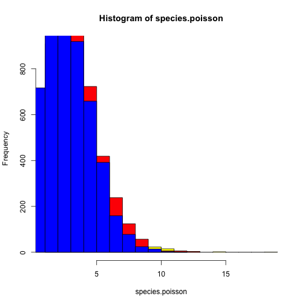
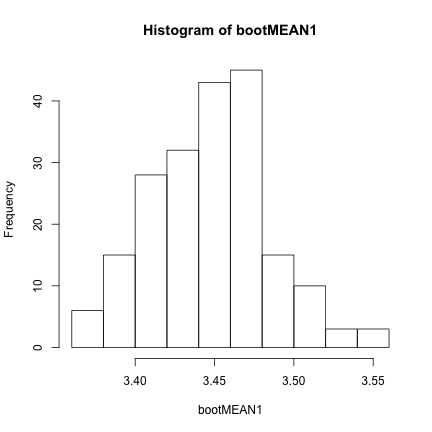
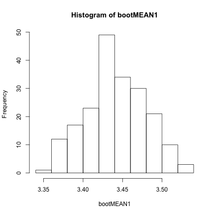

Clutch Size Dataset
========================================================


```r
setwd("C:/Users/Ben/Documents/PermuteSeminar-2014")
dat <- read.csv("Week-2/ClutchSize.csv")
```


Visualize the data

```r
head(dat)
```

```
##   Family Genus_name             Species_name Clutch_size
## 1      3   Dromaius Dromaius novaehollandiae        8.98
## 2      4    Apteryx        Apteryx australis        2.00
## 3      4    Apteryx          Apteryx haastii        1.00
## 4      4    Apteryx           Apteryx owenii        1.00
## 5      6    Ortalis           Ortalis vetula        2.88
## 6      7   Alectura         Alectura lathami       14.78
##              English_name
## 1                     Emu
## 2              Brown Kiwi
## 3      Great Spotted Kiwi
## 4     Little Spotted Kiwi
## 5        Plain Chachalaca
## 6 Australian Brush-turkey
```

```r
mean(dat$Clutch_size)
```

```
## [1] 3.448
```

```r
fitdistr(dat$Clutch_size, "gamma")
```

```
## Error: could not find function "fitdistr"
```


Visualize the distribution

```r
require(ggplot2)
```

```
## Loading required package: ggplot2
```

```r
qplot(dat$Clutch_size)
```

```
## stat_bin: binwidth defaulted to range/30. Use 'binwidth = x' to adjust this.
```

 


```r
fitdistr(dat$Clutch_size, "gamma")
```

```
## Error: could not find function "fitdistr"
```

```r
ks.test(x = dat$Clutch_size, y = "pgamma", shape = 4.1, rate = 1.19)
```

```
## Warning: ties should not be present for the Kolmogorov-Smirnov test
```

```
## 
## 	One-sample Kolmogorov-Smirnov test
## 
## data:  dat$Clutch_size
## D = 0.084, p-value = 4.552e-15
## alternative hypothesis: two-sided
```


True mean

```r
mean(dat$Clutch_size)
```

```
## [1] 3.448
```


Boostrap all clutches without regard for structure

```r
withoutspecies <- replicate(1000, mean(sample(size = nrow(dat), dat$Clutch_size, 
    replace = TRUE)))
qplot(withoutspecies)
```

```
## stat_bin: binwidth defaulted to range/30. Use 'binwidth = x' to adjust this.
```

 

```r

# mean estimate
mean(withoutspecies)
```

```
## [1] 3.449
```


By genus

```r
# How many FAMILY?
nfamily <- length(table(dat$Family))

# Get list of familes
fout <- vector()
for (x in 1:1000) {
    f <- sample(size = 107, dat$Family, replace = TRUE)
    out <- vector()
    for (i in f) {
        out <- c(out, dat[dat$Family %in% f, "Clutch_size"])
    }
    fout <- c(fout, mean(out))
}

# Plot

qplot(fout)
```

```
## stat_bin: binwidth defaulted to range/30. Use 'binwidth = x' to adjust this.
```

 

```r
mean(fout)
```

```
## [1] 3.471
```

```r
sd(fout)
```

```
## [1] 0.0613
```


Where we are so far, comparison of true, species and family means

```r
mean(dat$Clutch_size)
```

```
## [1] 3.448
```

```r
mean(withoutspecies)
```

```
## [1] 3.449
```

```r
mean(fout)
```

```
## [1] 3.471
```

```r

# sd(dat$Clutch_size)
sd(withoutspecies)
```

```
## [1] 0.03817
```

```r
sd(fout)
```

```
## [1] 0.0613
```

```r

hist(withoutspecies, col = "blue", breaks = seq(3, 4, 0.01))
hist(fout, col = "red", add = TRUE, breaks = seq(3, 4, 0.01))
abline(v = mean(dat$Clutch_size), lty = "dashed")
```

 


Red is family
blue is species
