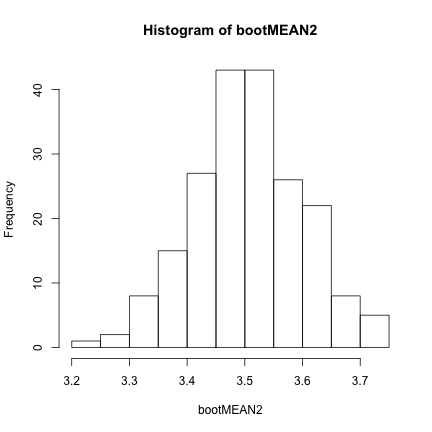
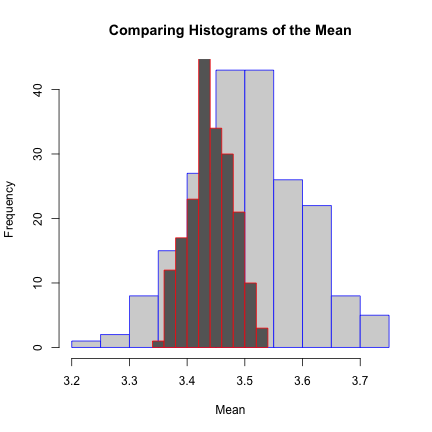

Week 2 Borrelli
================================================================


\mbox{ordinary text within an equation}  

"\left(" gives a big paren around a large equation "\right" closes
  
Read in data downloaded from blackboard  

```r
setwd("~/Dropbox/PermuteSeminar/")
ClutchSize <- read.csv("ClutchSize.csv")
```


The LaTeX test:  
$$
\LARGE{
\lim_{\epsilon\rightarrow 0_{+}} \frac{\int_{a_i}^{a_i+\epsilon}\sqrt{1+(x-\mu)^2}dx}{\phi (\epsilon)}
}
$$

**Census** - whole population  
**Sample** - some portion of the larger population, requires statistical inference to describe the whole pop  

**Statistic** - anything calculated from data  
**Parameter** - some function of the distribution (*F*)  

**Plug in principle** - we want to know some parameter that is a function of some distribution $F$. Your estimate is the same function applied to your data, so you can use your data in lieu of the underlying distribution. It is the best (not necessarily good) unbiased estimator of the parameter.  

*When would you want to use a parametric distribution?*  
If you know anything about the underlying distribution and the data is sparse  


```r
head(ClutchSize)
```

```
  Family Genus_name             Species_name Clutch_size
1      3   Dromaius Dromaius novaehollandiae        8.98
2      4    Apteryx        Apteryx australis        2.00
3      4    Apteryx          Apteryx haastii        1.00
4      4    Apteryx           Apteryx owenii        1.00
5      6    Ortalis           Ortalis vetula        2.88
6      7   Alectura         Alectura lathami       14.78
             English_name
1                     Emu
2              Brown Kiwi
3      Great Spotted Kiwi
4     Little Spotted Kiwi
5        Plain Chachalaca
6 Australian Brush-turkey
```


*What is the best distribution for clutch size?*  
  

```r
require(MASS)
```

  
Use the `fitdistr` function to determine the best fit parameters for lognormal and gamma distributions  


```r
fitdistr(ClutchSize$Clutch_size, "lognormal")
```

```
   meanlog     sdlog  
  1.111122   0.502051 
 (0.010265) (0.007259)
```

```r
fitdistr(ClutchSize$Clutch_size, "gamma")
```

```
    shape     rate  
  4.10623   1.19089 
 (0.11424) (0.03524)
```

  
Plot the histogram and density functions for best fit lognormal and gamma distributions  


```r
hist(ClutchSize$Clutch_size, freq = F)
points(dlnorm(1:20, 1.1111, 0.50205), typ = "l", col = "blue")
points(dgamma(1:20, 4.106, 1.1908), typ = "l", col = "red")
```

 


The log normal seems to fit the best

*Get bootstrap statistic*

1. *Sample with replacement from species*  
   

```r
bootMEAN1 <- c()
for (i in 1:200) {
    boot <- sample(1:nrow(ClutchSize), nrow(ClutchSize), replace = T)
    bootSAMPLE <- ClutchSize$Clutch_size[boot]
    bootMEAN1[i] <- mean(bootSAMPLE)
}
```


```r
hist(bootMEAN1)
```

 


2. *Sample with replacement from family*
  

```r
bootMEAN2 <- c()
for (i in 1:200) {
    boot <- sample(ClutchSize$Family, max(ClutchSize$Family), replace = T)
    boots <- c()
    for (i in 1:length(boot)) {
        boots <- c(boots, ClutchSize$Clutch_size[which(ClutchSize$Family == 
            boot[i])])
    }
    bootMEAN2 <- c(bootMEAN2, mean(boots))
}
```


```r
hist(bootMEAN2)
```

 

  
3. *Bootstrap at all levels*  
  

```r
bootFAM <- sample(ClutchSize$Family, max(ClutchSize$Family), replace = T)
for (i in 1:length(bootFAM)) {
    
}
```

  
Compare the distributions
------------------------------------

```r
hist(bootMEAN2, border = "blue", col = "lightgrey", main = "Comparing Histograms of the Mean", 
    xlab = "Mean")
hist(bootMEAN1, border = "red", col = "grey40", add = T)
```

 


