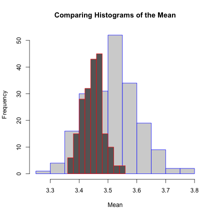

Week 2 Exercises 
========================================================
**Rocio Ng**


**LateX notes**
------------------
We can show equations in R markdown. We use double dollar signs to start a LateX equation.

$$
\pi=3.14
$$

This is how we can say $\pi=3.14$ inline text.

Superscripts $x^{3}$ and subscripts $x_{3}$ can be done too.

Here is a fraction: $\frac{13}{100}$

Here is a combination: $\frac{x_{3}}{5}$

Greek letters:
---------------
Beta $\beta$
gamma $\gamma$
Gamma $\Gamma$

Text
-------
$\mbox{standard deviation}$

$\sqrt{25}$

Symbols
--------
hat: $\hat{\alpha}$ , $\hat{\theta}$

Lim: $\lim_{n\rightarrow3}$

Integral: $\int_{0}^{10}$

Sum: $\sum$

Sim: $\sim 3$

Approx: $\approx 3$

Complicated expression:
$$\lim_{\epsilon\rightarrow 0_{+}} \frac{\int_{a_{i}}^{a_{i}+\epsilon}\sqrt{1+(x-\mu)^{2}dx}}{\Phi(\epsilon)}$$

--------------------------------------------------------------


**In Class Excercises**
------------------------

**Using clutch size data**

We were given data on bird clutch size for a variety of species.
1. What's the best distribution for clutch size?
2. What's the mean clutch size, using three nonparametric bootstrap techniques:

  A. Sample with replacement from species (irregardless of higher taxonomy)
  B. Sample with replacement from family, then sample the species from that list with     replacement, bootstrapping the species samples.
  C. Bootstrap across all levels by sampling with replacement from family, then sampling within this for genera, and then within this for species (hierarchical sampling).


set working directory:


```r
setwd("C:/Users/rocio_000/Google Drive/Courses_Seminars/Stats_Seminar/PermuteSeminar-2014/Week-2")
```


Read the file and define variables:


```r
data <- read.csv("ClutchSize.csv")
clutch <- c(data$Clutch_size)  #vector containing all the clutch sizes
```


load the needed libraries

```r
library("ggplot2")
library("MASS")
```


**Determine which distribution may best fit Clutch Size Data**


```r
head(data)
```

```
##   Family Genus_name             Species_name Clutch_size
## 1      3   Dromaius Dromaius novaehollandiae        8.98
## 2      4    Apteryx        Apteryx australis        2.00
## 3      4    Apteryx          Apteryx haastii        1.00
## 4      4    Apteryx           Apteryx owenii        1.00
## 5      6    Ortalis           Ortalis vetula        2.88
## 6      7   Alectura         Alectura lathami       14.78
##              English_name
## 1                     Emu
## 2              Brown Kiwi
## 3      Great Spotted Kiwi
## 4     Little Spotted Kiwi
## 5        Plain Chachalaca
## 6 Australian Brush-turkey
```

```r

hist(data$Clutch_size)
```

 

```r
qplot(data$Clutch_size)
```

```
## stat_bin: binwidth defaulted to range/30. Use 'binwidth = x' to adjust this.
```

 


Use the `fitdistr` function to determine the best fit parameters for lognormal and gamma distributions from MASS package


```r
fitdistr(data$Clutch_size, "lognormal")
```

```
##    meanlog     sdlog  
##   1.111122   0.502051 
##  (0.010265) (0.007259)
```

```r
fitdistr(data$Clutch_size, "gamma")
```

```
##     shape     rate  
##   4.10623   1.19089 
##  (0.11424) (0.03524)
```

```r

ks.test(x = data$Clutch_size, y = "pgamma", shape = 4.1, rate = 1.19)  # finish this
```

```
## Warning: ties should not be present for the Kolmogorov-Smirnov test
```

```
## 
## 	One-sample Kolmogorov-Smirnov test
## 
## data:  data$Clutch_size
## D = 0.084, p-value = 4.552e-15
## alternative hypothesis: two-sided
```

```r
ks.test(x = data$clutch_size, y = "plnorm", meanlog = 1.1, sdlog = 0.5)
```

```
## Warning: is.na() applied to non-(list or vector) of type 'NULL'
```

```
## Error: not enough 'x' data
```


what is the true clutch size mean:


```r
mean(data$Clutch_size)
```

```
## [1] 3.448
```


**Get Bootstrap estimates**

By species:


```r
boot_species <- c()
for (i in 1:1000) {
    sample <- sample(data$Clutch_size, nrow(data), replace = T)
    boot_species[i] <- mean(sample)
}
```


Vizualization using `qplot` (quickplot) from ggplot2 package

```r
qplot(boot_species)
```

```
## stat_bin: binwidth defaulted to range/30. Use 'binwidth = x' to adjust this.
```

 


By family

```r

# figure out how many unique families:
numFam <- length(unique(data$Family))  #There are 108 in this case

boot_family <- c()

for (i in 1:1000) {
    
    fsample <- sample(data$Family, numFam, replace = T)  #resamples all the families and randomly picks out 108 
    
    # subsets data to include only rows where family is in fsample!
    data.sub <- subset(data, data$Family %in% fsample)
    
    boot_family[i] <- mean(sample(data.sub$Clutch_size, nrow(data.sub), replace = T))
    
    # print(paste('this loop has been run', i, 'times'))
}
```


Display mean and histogram 


```r
mean(boot_family)
```

```
## [1] 3.465
```

```r

qplot(boot_family)
```

```
## stat_bin: binwidth defaulted to range/30. Use 'binwidth = x' to adjust this.
```

```
## Warning: position_stack requires constant width: output may be incorrect
```

 

```r
qplot(boot_species)
```

```
## stat_bin: binwidth defaulted to range/30. Use 'binwidth = x' to adjust this.
```

 


overlay two distributions (family and species)


```r
hist(boot_family, border = "blue")
hist(boot_species, add = T)
```

 
