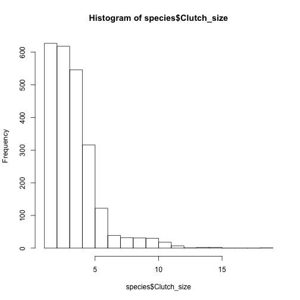
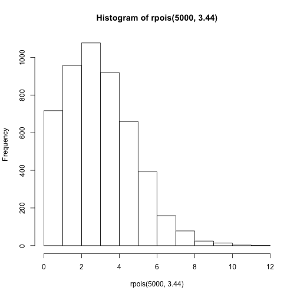

Title Rebecca and Chloe's Week 2 Assignment
========================================================


```r
species <- read.csv("/Users/rebeccakulp/Documents/Classes/2014/Stats II/PermuteSeminar-2014/Week-2/ClutchSize.csv", 
    head = T)
hist(species$Clutch_size)
```

 

Distribution looks like a poisson or gamma distribution, so will need to test the two different distributions.


```r

library(MASS)
species.poisson <- round(species$Clutch_size)
Poisson <- fitdistr(species.poisson, "Poisson")
gamma <- fitdistr(species.poisson, "gamma")
pois <- hist(rpois(5000, 3.44))
```

 

```r
gam <- hist(rgamma(5000, shape = 3.99, rate = 1.16))
```

 

Will graph the three different graphs on top of each other, so can see how the different distributions compare to the originial histogram.

```r
hist(species.poisson, col = "yellow")
plot(gam, col = "red", add = T)
plot(pois, col = "blue", add = T)
```

 

The Poisson distribution matches the rounded distribution of the raw clutch distribution.

Now on to determinig how to bootstrap with entire dataset, and not considering the heirarchy.


```r
bootstrap.species <- matrix(nrow = 1000, ncol = 1)
for (i in 1:1000) {
    d <- sample(species.poisson, 2392, replace = T)
    e <- mean(d)
    bootstrap.species[i] <- e
}
overall.mean.species <- mean(bootstrap.species)
```


Now bootstrap, if first selecting from families.

```r
bootstrap.species <- sample(species.poisson, 2392, replace = T)
families <- unique(species$Family)
length(families)
```

```
## [1] 108
```

```r
length(species.poisson)
```

```
## [1] 2392
```

Working code

```r
column <- cbind(species$Family, species$Clutch_size)
family.matrix <- matrix(1000, 2)
```

