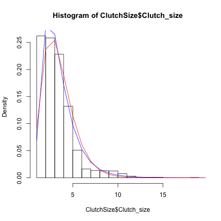

Sam's Adventures in Heirarchical Bootstrapping
========================================================


```r
library(MASS)  # for fitdistr
library(VGAM)  # for rayleight distribution
clutch <- read.csv("ClutchSize.csv")
```


Try a few positive, skewed distributions for the histogram of clutch size:

```r
hist(clutch$Clutch_size, 20, freq = F)
xx <- 0:15
fit_gamma <- fitdistr(clutch$Clutch_size, dgamma, list(shape = 1))
points(dgamma(xx, fit_gamma$estimate[1]), pch = 1)

fit_lognorm <- fitdistr(clutch$Clutch_size, dlnorm, list(meanlog = 0, sdlog = 1))
points(dlnorm(xx, fit_lognorm$estimate[1], fit_lognorm$estimate[2]), pch = 2)

fit_rayleigh <- fitdistr(clutch$Clutch_size, drayleigh, list(scale = 1))
points(drayleigh(xx, fit_rayleigh$estimate[1]), pch = 3)
```

 


Flat bootstrapping at the species level

```r
N <- dim(clutch)[1]
N_reps <- 500
bootstrap_means <- rep(0, N_reps)

for (i in 1:N_reps) {
    bootstrap_means[i] <- mean(sample(clutch$Clutch_size, N, replace = T))
}
hist(bootstrap_means, 20)
```

 

```r
mean(bootstrap_means)
```

```
## [1] 3.446
```


Bootstrapping from families.  This produces the right mean value, but a very non-normal looking histogram.


```r
N_reps <- 500
family_means <- rep(0, N_reps)
for (i in 1:N_reps) {
    family <- sample(clutch$Family, 1)
    family_means[i] <- mean(clutch$Clutch_size[clutch$Family == family])
}
hist(family_means, 20)
```

 

```r
mean(family_means)
```

```
## [1] 3.454
```


We had some disagreement/confusion in our group as to what exactly we were supposed to do at the family level, so I did this another way. 


```r
N_families <- length(unique(clutch$Family))
family_means_2 <- rep(0, N_reps)
these_means <- rep(0, N_families)

for (i in 1:N_reps) {
    for (j in 1:N_families) {
        family <- sample(clutch$Family, 1)
        these_means[j] <- mean(clutch$Clutch_size[clutch$Family == family])
    }
    family_means_2[i] <- mean(these_means)
}
hist(family_means_2, 20)
```

 

```r
mean(family_means_2)
```

```
## [1] 3.444
```

