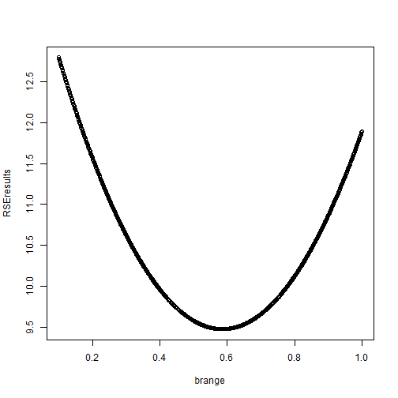
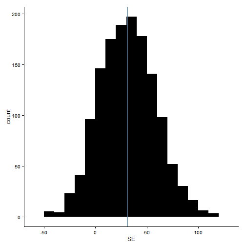
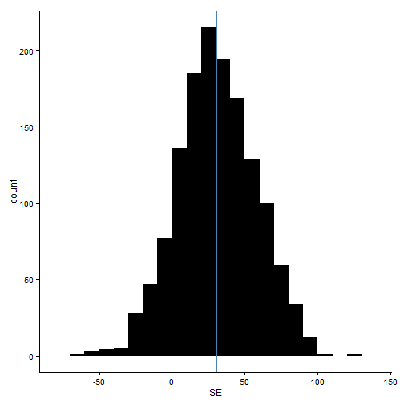

Week 4 Notes and Exercises
========================================================
For this week, we read Chapter 8 in Efron and Tibshirani, and notes on bootstrapping dependent data (Steigerwald; posted to GitHub and on Blackboard).  This chapter provides an overview of bootstrapping procedues for more complicated data structures than the one-sample model, such as time-dependent data or otherwise non-IID data.

In-class discussion:
---------------------

The goal of the bootstrap algorithm is to estimate the probability distribution that underlies our data.  We can use our empirical distribution in lieu of the full distribution to understand the distribution of statisics of interest.

Bootstraps are often used to estimate standard errors.  We select $B$ independent bootstrap samples, calculate our test statistic using the bootstrap samples, and use the standard deviation of the $B$ replications as an estimate of the standard error of the unknown distribution $F$ that underlies our empirical data.  This works for both a single unknown distribution (see Figure 8.1 in E&T) or a more complicated underlying process or a whole set of unknown distributions (see Figure 8.3 in E&T). We could easily imagine some biological measure influenced by many processes (i.e., many underlying and unknown statistical distributions). 

*Goals for the Lutenizing Hormone example*
Today's examples will focus on data of lutenizing hormone over time.  We will model this as an autoregressive model of period 1.
$$
AR(1): z_{t} = \beta z+{t-1} + \epsilon_{t}
$$
1) Look at a histogram of the level values (ignoring the time data).
2) Find the value of $\hat{b}$ as described in E&T equation 8.20 using two methods:
2a) Sample with replacement from the random deviations $\epsilon
2b) Using the moving blocks method


Examples from Efron and Tibshirani:
---------------------

<<<<<<< HEAD
**(8.3) The two-sample problem**

Sixteen mice were randomly assigned to a treatment group (n=7) or a control group (n=9), and their survival times following a surgery were recorded.  Let $z$ indicate the treatment observations, and $y$ indicate the control observations.


```r
z <- c(94, 197, 16, 38, 99, 141, 23)
y <- c(52, 104, 146, 10, 51, 30, 40, 27, 46)
```


Together, we will consider the observed data as a vector $x=(z,y).$ and a probability model $P=(F,G)$ where $F$ represents the unknown probability distrbution underlying observed treatment data $z$, and $G$ indicates the unknown probability model from which observed control data $y$ were drawn.  We wish to estimate $P$.  The estimate of P is $\hat{P}=(\hat{F}, \hat{G})$.  A bootstrap sample $x^{*}$ is taken as $\hat{P} \rightarrow x$.  


```r
theta = mean(z) - mean(y)
theta
```

```
## [1] 30.63
```


The difference of the treatment and control means $\hat{\theta}= 30.63$.  

We can also take a bootstrap estimate, and use that to estimate standard error:


```r
meanz <- NULL
meany <- NULL
thetabs <- NULL
for (i in 1:1400) {
    bootz = sample(z, 7, replace = TRUE)
    booty = sample(y, 9, replace = TRUE)
    meanz = append(meanz, mean(bootz))
    meany = append(meany, mean(booty))
    thetabs = append(thetabs, mean(bootz) - mean(booty))
}

se <- sqrt(sum((thetabs - theta)^2)/1399)
```


The bootstrap estimate of standard error for $\hat{\theta}$ is

```r
se
```

```
## [1] 27.41
```


so $\hat{\theta}$ is only


```r
mean(thetabs)/se
```

```
## [1] 1.073
```


standard errors above zero.  


```r
=======
**(8.5 Lutenizing hormone)**

This data set shows the levels of a lutenizing hormone for 48 consecutive 10-minute intervals in one woman.  These data are not a random sample from a distribution; they instead are an example of a time series (see the figure below). 

Let's look at a histogram of the data first just for fun:

```r
lh <- read.csv("hormone_data.csv", header = TRUE)
hist(lh$level)
```

 


Looks pretty normal!  Which is rad, but unhelpful, because the data aren't IID - it's a time series.


```r

>>>>>>> fac17bcafcf5203220017ba1395863b2947e6670
require(ggplot2)
```

```
## Loading required package: ggplot2
```

```r
<<<<<<< HEAD
seplot <- data.frame(thetabs)
names(seplot) = "SE"
mean = mean(seplot$SE)
ggplot(seplot, aes(SE)) + geom_histogram(fill = "black", binwidth = 10) + theme_classic() + 
    geom_vline(xintercept = mean, col = "steelblue")
```

 


**(8.5 Lutenizing hormone)**

This data set shows the levels of a lutenizing hormone for 48 consecutive 10-minute intervals in one woman.  These data are not a random sample from a distribution; they instead are an example of a time series (see the figure below). 

Let's look at a histogram of the data first just for fun:

```r
lh <- read.csv("hormone_data.csv", header = TRUE)
hist(lh$level)
```

 


Looks pretty normal!  Which is rad, but unhelpful, because the data aren't IID - it's a time series.


```r

require(ggplot2)
=======
>>>>>>> fac17bcafcf5203220017ba1395863b2947e6670
ggplot(lh, aes(period, level)) + geom_line(col = "black") + theme_classic() + 
    labs(title = "Lutenizing Hormone Data")
```

<<<<<<< HEAD
 
=======
 
>>>>>>> fac17bcafcf5203220017ba1395863b2947e6670


We will assume that these data follow a first order autoregressive scheme.  First, we will define the centered measurements $z_{t}=y_{t}-\mu$, where all $z_{t}$ have expectation $0$.

Each $z_{t}$ is a linear combination of the previous value $z_{t-1}$ and an independent disturbance term $\epsilon_{t}$, where the $\epsilon_{t}$ is assumed to be a random sample from an unknown distribution $F$ with expectation $0$.

$$F \rightarrow (\epsilon_{U}, \epsilon_{U+1}, \epsilon_{U+2}, \cdots, \epsilon_{V})  
[E_{F}(\epsilon)=0]$$

The dates $U$ and $V$ are the beginning and end of the time period; $U=2$; $V=48$.  We define $z_{u} = \beta z_{U-1} + \epsilon_{U}$, and $z_{U-1} = z_{1}$. $\beta$ is an unknown parameter varying between $-1$ and $1$. 

We can estimate the value of $\beta$ using a least squares approach.  First, we estimate the expectation $\mu$ to be the observed average $\bar{y}$, so that $z_{t} = y_{t} - \bar{y}$.


```r
lhc <- lh$level - mean(lh$level)
lh$c = lhc  #defining the new z(t) as y(t) - mean(y) and adding it to the existing data frame
ggplot(lh, aes(period, c)) + geom_line(col = "black") + theme_classic() + labs(title = "Centered Data")  #plot z
```

<<<<<<< HEAD
 
=======
 
>>>>>>> fac17bcafcf5203220017ba1395863b2947e6670


We expect that $RSE(b)$ has expectation $E(RSE(b))$ and is minimized when $b = \beta$.  We can calculate $RSE(b)$ asa function of $b$, and choose the value that minimizes this function to serve as our estimate of $\beta$.  Remember that $\beta$ varies between $-1$ and $1$.

```r
Z = data.frame(t1 = c(lh$c[1:47]), t2 = c(lh$c[2:48]))
optimize(f = )  #I'm stuck on how to actually calculate the least-squares estimate of beta.
```

```
## Error: 'interval' is missing
```


We can use bootstrap to see how accurate our estimate of $\hat{\beta}$ is.  


```r
mu = mean(lh$level)
beta = 0.586  #This is the beta estimate given in Efron and Tibshirani
e = (Z$t2) - beta * (Z$t1)  #create the estimated value of espilon for each t
# I'm not sure where to go from here
```


**(8.6) The moving blocks bootstrap**

This is a different approach to bootstrapping time series data that is closer to the approach used in one-sample problems than what is used above.  To generate a bootstrapped version of an observed time series, we choose a particular block length and consider all possible contiguous blocks of this length in the observed data.  We sample these blocks with replacement, instead of sampling single values with replacement.  This preserves some of the autocorrelation in the bootstrapped dataset.  The sampled blocks are pasted together to form a bootstrap time series, so we only want to sample as many blocks as we need to recreate a series approximately the same length as the observed series.  (So if the block length is $l$, we sample $k$ blocks where $n \approx k \cdot l$. 


```r
size = 3

data = NULL
for (i in 1:length(lh$level)) {
    block = lh$level[i:(i + (size - 1))]
    s = sample(block, 1)
    data = append(data, s)
}

par(mfrow = c(1, 1))
plot(lh$period, lh$level, type = "l")
points(lh$period, data, type = "l", col = "steelblue")
```

<<<<<<< HEAD
 
=======
 
>>>>>>> fac17bcafcf5203220017ba1395863b2947e6670


If we make the block size larger, we lose the pattern in the original time series:


```r
size2 = 10

data2 = NULL
for (i in 1:length(lh$level)) {
    block2 = lh$level[i:(i + (size2 - 1))]
    s2 = sample(block2, 1)
    data2 = append(data2, s2)
}

par(mfrow = c(1, 1))
plot(lh$period, lh$level, type = "l")
points(lh$period, data2, type = "l", col = "steelblue")
```

<<<<<<< HEAD
=======
 


**(8.3) The two-sample problem**

Sixteen mice were randomly assigned to a treatment group (n=7) or a control group (n=9), and their survival times following a surgery were recorded.  Let $z$ indicate the treatment observations, and $y$ indicate the control observations.


```r
z <- c(94, 197, 16, 38, 99, 141, 23)
y <- c(52, 104, 146, 10, 51, 30, 40, 27, 46)
```


Together, we will consider the observed data as a vector $x=(z,y).$ and a probability model $P=(F,G)$ where $F$ represents the unknown probability distrbution underlying observed treatment data $z$, and $G$ indicates the unknown probability model from which observed control data $y$ were drawn.  We wish to estimate $P$.  The estimate of P is $\hat{P}=(\hat{F}, \hat{G})$.  A bootstrap sample $x^{*}$ is taken as $\hat{P} \rightarrow x$.  


```r
theta = mean(z) - mean(y)
theta
```

```
## [1] 30.63
```


The difference of the treatment and control means $\hat{\theta}= 30.63$.  

We can also take a bootstrap estimate, and use that to estimate standard error:


```r
meanz <- NULL
meany <- NULL
thetabs <- NULL
for (i in 1:1400) {
    bootz = sample(z, 7, replace = TRUE)
    booty = sample(y, 9, replace = TRUE)
    meanz = append(meanz, mean(bootz))
    meany = append(meany, mean(booty))
    thetabs = append(thetabs, mean(bootz) - mean(booty))
}

se <- sqrt(sum((thetabs - theta)^2)/1399)
```


The bootstrap estimate of standard error for $\hat{\theta}$ is

```r
se
```

```
## [1] 27.27
```


so $\hat{\theta}$ is only


```r
mean(thetabs)/se
```

```
## [1] 1.143
```


standard errors above zero.  


```r
require(ggplot2)
seplot <- data.frame(thetabs)
names(seplot) = "SE"
mean = mean(seplot$SE)
ggplot(seplot, aes(SE)) + geom_histogram(fill = "black", binwidth = 10) + theme_classic() + 
    geom_vline(xintercept = mean, col = "steelblue")
```

>>>>>>> fac17bcafcf5203220017ba1395863b2947e6670
 

