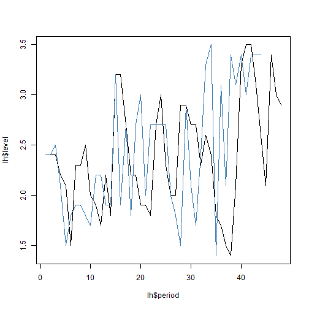

Week 4 - Time Structured Data (Copied/modified from Ben's)
========================================================

Goal 1:
====
Find beta hat eq 820 (p94), fit the time series to find beta that minimizes the total error. Validate answer in 8.22

That will give you beta hat, the best value, we still din't know the standard error

Goal 2:
====
Sample with replacement from the random deviations. Then resample using moving blocks in the autocorrelations and new time series.


Read in data


```r
dat <- read.csv("/Users/emilypetchler/Documents/GitHub/PermuteSeminar-2014.test/Week-4//hormone_data.csv")
```


Step 1, following 8.19 - the residuals for each y values

```r
dat$z <- dat$level - mean(dat$level)
```


Create a sequence of beta values from -1 to 1


```r
# potential betas
pB <- seq(-1, 1, 0.001)
```


Define a function that computes equation 8.20


```r

foo <- function(b, x) {
    (dat$z[x] - b * dat$z[x - 1])^2
}

bvals <- sapply(pB, function(f) {
    
    # Get the estimates for the entire time series
    vals <- sapply(2:max(dat$period), foo, b = f)
    
    # append first value to the vector
    final <- c(dat$z[1], vals)
})

colnames(bvals) <- pB

# Sum the matrix rows; RSE=resid. sq. error
rowS <- data.frame(B = pB, RSE = apply(bvals, 2, sum))

hist(rowS$RSE)
```

 

```r

# which beta value minimizes the value
rowS[which.min(rowS$RSE), ]
```

```
##           B   RSE
## 0.586 0.586 9.479
```


Now, trying to sample with replacement from the random deviations within the standard error.
Use eqn8.23; find the epsilon.

```r
epi <- function(x) {
    dat$level[x] - (0.568 * dat$level[x - 1])
}

## 0.568 is the calculated beta from above.

## Now calculating the residuals.
sapply(2:nrow(dat), epi)
```

```
##  [1] 1.0368 1.0368 0.8368 0.8504 0.3072 1.4480 0.9936 1.1936 0.5800 0.7640
## [11] 0.6208 1.2344 0.5504 2.1776 1.3824 0.8824 0.6664 0.9504 0.6504 0.8208
## [21] 0.7208 1.6776 1.4664 0.5960 0.6936 0.8640 1.7640 1.2528 1.0528 1.1664
## [31] 0.7664 1.2936 0.9232 0.4368 0.6776 0.5344 0.5480 1.3048 2.1072 1.6256
## [41] 1.5120 1.1120 0.8392 0.6232 2.2072 1.0688 1.1960
```


Recalc the values from resampled epi data.

```r
resample <- sample(epival, replace = T)
```

```
## Error: object 'epival' not found
```


Now, sample from dat time series residuals, and create a new time series. 
Once resample, refit the time series and calculate the BetaHat again.

Create a function to refit beta.

```r


findBeta <- function() {
}
foo <- function(b, x) {
    (dat$z[x] - b * dat$z[x - 1])^2
}

bvals <- sapply(pB, function(f) {
    
    # Get the estimates for the entire time series
    vals <- sapply(2:max(dat$period), foo, b = f)
    
    # append first value to the vector
    final <- c(dat$z[1], vals)
})

colnames(bvals) <- pB

# Sum the matrix rows; RSE=resid. sq. error
rowS <- data.frame(B = pB, RSE = apply(bvals, 2, sum))

hist(rowS$RSE)
```

 

```r

# which beta value minimizes the value
rowS[which.min(rowS$RSE), ]
```

```
##           B   RSE
## 0.586 0.586 9.479
```

