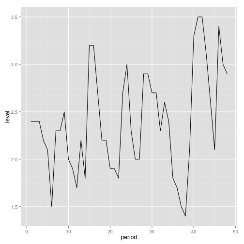

Title
========================================================

We'll be looking at the luteinizing hormone data from Efron and Tibshirani Chapter 8. Those authors used the AR(1) model: $$z{t} = /betaz{t - 1} + /epsilon{t}$$.

Step 1: Find beta-hat using Equation (8.20)


```r
data <- read.csv("hormone_data.csv")
brange <- seq(0.1, 1, by = 0.001)
RSEresults <- c()
resids <- data$level - mean(data$level)
for (j in 1:length(brange)) {
    b <- brange[j]
    formula <- c()
    for (i in 1:(length(data$level) - 1)) {
        formula <- c(formula, (resids[i + 1] - b * resids[i])^2)
    }
    RSEresults <- c(RSEresults, sum(formula))
}
beta.hat <- brange[which.min(RSEresults)]
plot(x = brange, y = RSEresults)
```

 

We just have beta-hat, we don't have any confidence intervals or standard error. To get those, sample with replacement from those error terms. First, we need to calculate all our epsilons from our data, using our beta-hat.


```r
epsilons <- c()  #these are the empirical epsilons
for (k in 2:length(resids)) {
    epsilons <- c(epsilons, resids[k] - beta.hat * resids[k - 1])
}
beta.star <- c()  #boot-strapped collection of beta estimates
for (l in 1:500) {
    epsilon.star <- sample(epsilons, length(epsilons), replace = T)
    resid.star <- rep(0, times = length(resids))
    for (m in 2:length(resids)) {
        resid.star[m] <- beta.hat * resid.star[m - 1] + epsilon.star[m - 1]
    }
    # Now use the bootstrap-created residuals to re-estimate beta-hat
    # (bootstrap)
    RSEstar <- c()
    for (n in 1:length(brange)) {
        b <- brange[n]
        formula <- c()
        for (o in 1:length(resid.star) - 1) {
            formula <- c(formula, (resid.star[o + 1] - b * resid.star[o])^2)
        }
        RSEstar <- c(RSEstar, sum(formula))
    }
    beta.star <- c(beta.star, brange[which.min(RSEstar)])
}
hist(beta.star)
```

 

```r
sd(beta.star)
```

```
## [1] 0.1275
```

This distribution and value for the standard error of beta-hat, 0.115, is similar to that found by Efron and Tibshirani for 200 replications (0.116, see page 97). I think it may be slightly different because of the range I gave for possible-beta values or that I have more bootstrap replications (and standard deviation would be related to the number of replications).

Another way to use bootstrap methods to estimate our confidence in beta-hat for these data is a moving-block bootstrap. Sample-with-replacement from chunks of time to create new times series, then use the new residuals to re-calculate beta-hat.


```r
beta.star.window <- c()
for(p in 1:200) #bootstrapping
{
  #Resample beginnings of chunks (chunk length of three, can't select last two datapoints)
  indices <- sample(1:(length(data$level) - 2), length(data$level)/3, replace = T)
  #Create the new time series
  level.star <- c()
  for(q in 1:length(indices))
  {
    level.star <- c(level.star, data$level[indices[q]:(indices[q]+2)])
  }
  resids.star <- level.star - mean(level.star)
  #Recalculate beta using new residuals
  RSE.star <- c()
  for(r in 1:length(brange))
  {
    b <- brange[r]
    formula <- c()
    for(s in 1:length(resids.star) - 1)
    {
      formula <- c(formula, (resids.star[s+1] - b*resids.star[s])^2)
    }
    RSE.star <- c(RSE.star, sum(formula))
  }
  beta.star.window <- c(beta.star.window, brange[which.min(RSE.star)])
}
hist(beta.star.window)
```

 

```r
sd(beta.star.window)
```

```
## [1] 0.1208
```

One run of this gave a value of 0.119 from 200 bootstrap replicates, which is close to Efron and Tibshirani's value of 0.120 for the moving-block bootstrap with a block-length of 3.
