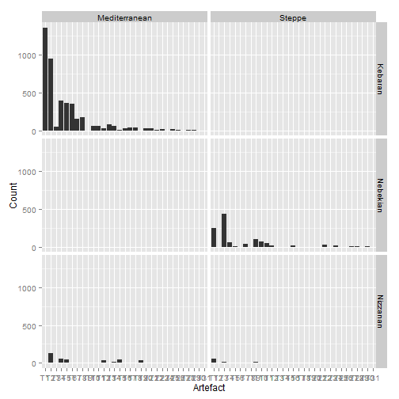
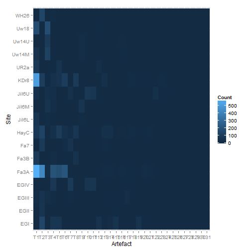
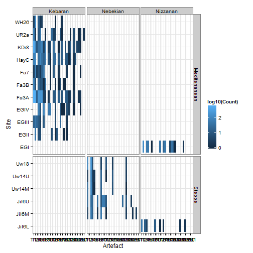
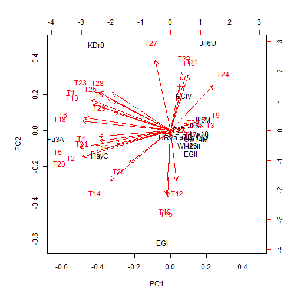
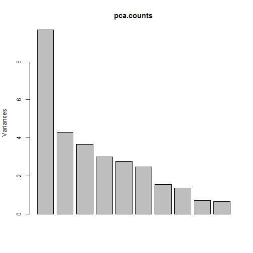
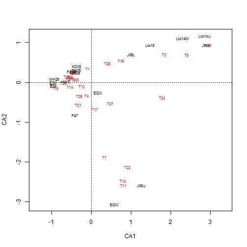
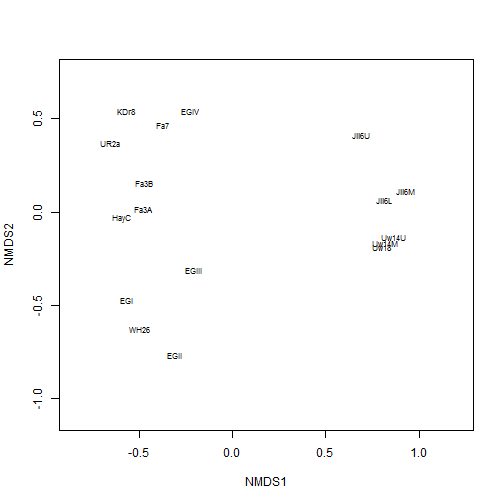
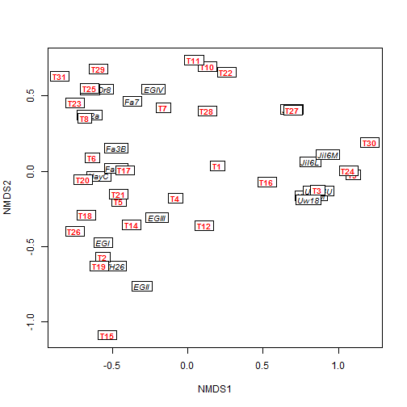

Week 11 Summary
========================================================

Manly 1996 and Stutz and Eastabrook 2004
========================================================

In archeology, patterns of similarity between assemblages that vary in the number of artefacts have been analyzed using multivariate statistics. 

For presence/absence data of artefacts, Manly 1996 used a reduced metrics, Dij, 

$$
Dij = \sqrt{(x_{i1} - x_{j1})^2 + (x_{i2} - x_{j2})^2 + ... + (x_{in} - x_{jn})^2}
$$

which measures the difference between the two burials based on the presence(1) and absence(0) of artefact type. This reduced the number of variables for ordination analysis and allowed the groupings of burials that are simliar to each other.

Grouping of burials was also attempted for count data in Stutz and Eastabrook 2004 in which 

$$
Dij=\frac{\sum_{m}^{c}\left|f_{mi} - f_{mj}\right|}{2}
$$

was used as the difference between any two assemblages.

Based on the ordination results, the paper tried to test two hypotheses, H1: The microlith assemblages within the same geogrphical region are more typologically similar.
H2: The microlith assemblages within the same archaeological culture are more similar regardless of geographic location.

Using ordination techniques, the authors first searched for significant clusters among assemblages and tested the 'gooodness of grouping' with the Dij value above (less Dij value represent better grouping).


Exercise
=========

1) Using the dataset in Stutz and Eastabrook 2004 (counts of 31 types of artefacts in 17 different sites for 3 distinct time periods and 2 distinct regions), we explored the similarities between the burials and artefacts using several ordination techniques such as Principal Component Aanalysis (PCA), Non-metric multidimensional scaling (NMDS), and Canonical Correspondence Analysis (CCA). 

2) Based on the results from several techniques, we tried to group the burials or artefacts together into groups that represent similar types.

Loading the data
----------------

Import data from GitHub


```r
require(RCurl)
```

```
## Loading required package: RCurl
## Loading required package: bitops
```

```r
options(RCurlOptions = list(cainfo = system.file("CurlSSL", "cacert.pem", package = "RCurl")))

raw <- getURL("https://raw.githubusercontent.com/PermuteSeminar/PermuteSeminar-2014/master/Week%2011/epipalassemblages.csv")
data <- read.csv(text = raw)
```


Using the function 'melt' in package 'reshape2', one can convert an object into a molten data frame which helps to visualize the data in a nicer fashion.


```r
library(reshape2)

molten.data <- melt(data, id.var = c("Site", "Total", "Period", "Region"))
head(molten.data)
```

```
##    Site Total   Period        Region variable value
## 1  KDr8   951  Kebaran Mediterranean       T1   516
## 2  HayC   537  Kebaran Mediterranean       T1    68
## 3   EGI   391 Nizzanan Mediterranean       T1     0
## 4  EGII    82  Kebaran Mediterranean       T1     0
## 5 EGIII   142  Kebaran Mediterranean       T1    16
## 6  EGIV   287  Kebaran Mediterranean       T1     0
```


Creating graphs of the data
----------------------------

To generate graphs of counts of each type of artefacts in the burials by different regions and periods, function 'ggplot' can be used in package 'ggplot2'.


```r
library(ggplot2)

# The variables in the molten data frame are the types of artefacts and the
# values are the counts of each artefact in the site
names(molten.data)[5:6] <- c("Artefact", "Count")

# ggplot function is used to show the counts of each artefact type separated
# by region and period as a bar graph
ggplot(molten.data, aes(x = Artefact, y = Count)) + geom_bar(stat = "identity") + 
    facet_grid(Period ~ Region)
```

 

```r
# same count data can be shown in a heat map form using ggplot here,
# absolute count of each artefact type is shown in each site
ggplot(molten.data, aes(x = Artefact, y = Site, fill = Count)) + geom_tile()
```

 

```r
# the heat map can be divided into different regions and periods in log
# scale
ggplot(subset(molten.data, Count > 0), aes(x = Artefact, y = Site, fill = log10(Count))) + 
    geom_tile() + facet_grid(Region ~ Period, scales = "free_y", space = "free_y") + 
    theme_bw()
```

 


1) Ordination
==================

In multivariate analysis, ordination is a method of data clustering in which objects that are characterized by values on multiple variables are ordered so that similar objects are near each other and dissimilar objects are farther from each other. These relationships between the objects, on each of several axes (one for each variable), are then characterized numerically and/or graphically.  


1. Principal Component Analysis (PCA)
---------------------------------------
Principal component analysis (PCA) is a statistical procedure that identifies a set of uncorrelated variables (called principal components) that accounts for the variability in the data set. The first principal component explains the largest variance in the data, and the succeeding components account for the next highest variance under the circumstance that they are uncorrelated to the preceeding components.   

In R, function 'prcomp' in package 'vegan' is used for PCA.

When using PCA, it is important that the units are standardized for different variables so that the results are relevant. 


```r
require(vegan)
```

```
## Loading required package: vegan
## Loading required package: permute
## Loading required package: lattice
## This is vegan 2.0-10
```

```r
counts <- data[, 2:32]
rownames(counts) <- data$Site
counts
```

```
##        T1  T2  T3  T4  T5  T6 T7 T8 T9 T10 T11 T12 T13 T14 T15 T16 T17 T18
## KDr8  516  93   9  32  45  86  3 77  0   3   6   0  30   0   0   1   0  14
## HayC   68 121   0  30  85  34 15 57  0   9   1   0  26  29   0  11   0  14
## EGI     0 128   0  54  49   0  1  0  0   0   0  38   0  19  47   0   0   4
## EGII    0  51   0   7   6   0  0  0  0   0   0   7   0   1   8   0   0   0
## EGIII  16  45  23  12   3   0 12  0  0   0   0   0   0   5   0   0  24   0
## EGIV    0   0   0  69   7   0 79  0  0  51  54   0   0   4   0   0   9   1
## UR2a   75   2   0   9  41   0  0  1  0   0   0  25   3   3   0   0   6   1
## Fa3B   85   6   0  18   7  10  1 39  0   0   1   0   0   1   0   1   6   0
## Fa3A  595 428  15 196 172 205  3  3  0   2   0   0  12  14   0  14   0   9
## Fa7     3  80   3   7   2  15 44  0  0   0   1   0  12   0   0   2   0   0
## WH26    3 128   0  14   2   3  0  0  0   0   0   0   0   1   0   0   0   2
## Jil6L  55   0  13   4   0   0  0  0 13   0   0   1   0   2   0   0   0   0
## Jil6M   4   0  48  17   0   0  2  0 49   0   0   1   0   0   0   0   0   0
## Jil6U  35   0  30  21   0   0 33  0  9  65  53   9   0   0   0   0   0   0
## Uw14M  42   0 109   5   1   0  0  0 17   0   0   0   0   0   0   8   0   0
## Uw14U   3   0  85   4   2   0  0  0 19   0   0   1   0   0   0  11   0   0
## Uw18  166   0 167   7   0   0  0  0  4   0   0   9   0   0   0   3   0   0
##       T19 T20 T21 T22 T23 T24 T25 T26 T27 T28 T29 T30 T31
## KDr8    0   5   0   3  13   0   7   0   4   3   1   0   0
## HayC    0  10  11   1   6   0   2   7   0   0   0   0   0
## EGI    40   8   1   0   0   0   0   2   0   0   0   0   0
## EGII    1   0   1   0   0   0   0   0   0   0   0   0   0
## EGIII   0   0   2   0   0   0   0   0   0   0   0   0   0
## EGIV    1   0   7   3   0   0   1   0   0   0   1   0   0
## UR2a    0   0   0   0   1   0   6   0   0   1   2   0   2
## Fa3B    1   1   0   0   0   0   1   0   0   0   0   0   0
## Fa3A    0  15  12   2   3   0   3   0   0   2   2   0   0
## Fa7     0   0   2   0   0   0   1   0   0   0   1   0   0
## WH26    0   0   0   0   0   0   0   0   0   0   0   0   0
## Jil6L   0   0   0   0   0   2   0   0   2   0   0   0   0
## Jil6M   0   0   0   0   0   3   0   0   0   2   0   3   0
## Jil6U   0   0   0  26   0   8   0   0   3   0   0   0   0
## Uw14M   0   0   0   0   0   1   0   0   0   0   0   0   0
## Uw14U   0   0   0   0   0   3   0   0   0   0   0   0   0
## Uw18    0   0   0   0   0   4   0   0   0   0   0   0   0
```

```r
# scale=T in function 'prcomp' to standardize the units
pca.counts <- prcomp(counts, scale = T)
biplot(pca.counts)
```

 

```r
plot(pca.counts)
```

 

```r
summary(pca.counts)
```

```
## Importance of components:
##                          PC1   PC2   PC3    PC4    PC5    PC6    PC7
## Standard deviation     3.112 2.073 1.917 1.7331 1.6624 1.5769 1.2542
## Proportion of Variance 0.312 0.139 0.119 0.0969 0.0891 0.0802 0.0507
## Cumulative Proportion  0.312 0.451 0.570 0.6665 0.7556 0.8358 0.8865
##                           PC8    PC9   PC10    PC11    PC12    PC13   PC14
## Standard deviation     1.1718 0.8528 0.8168 0.48562 0.46845 0.37691 0.3148
## Proportion of Variance 0.0443 0.0235 0.0215 0.00761 0.00708 0.00458 0.0032
## Cumulative Proportion  0.9308 0.9543 0.9758 0.98343 0.99051 0.99510 0.9983
##                           PC15    PC16     PC17
## Standard deviation     0.16588 0.15932 3.38e-16
## Proportion of Variance 0.00089 0.00082 0.00e+00
## Cumulative Proportion  0.99918 1.00000 1.00e+00
```


2. Canonical Correspondence Analysis (CCA)
-------------------------------------------
Canonical Correspondence analysis (CCA) is conceptually similar to principal component analysis, but applies to categorical rather than continuous data.

In R, function 'cca' in package 'vegan' is used for CCA.


```r
library(vegan)

cca.counts <- cca(counts)
cca.counts
```

```
## Call: cca(X = counts)
## 
##               Inertia Rank
## Total            2.19     
## Unconstrained    2.19   16
## Inertia is mean squared contingency coefficient 
## 
## Eigenvalues for unconstrained axes:
##      CA1      CA2      CA3      CA4      CA5      CA6      CA7      CA8 
## 0.582558 0.515972 0.329085 0.177881 0.142526 0.114697 0.094262 0.064363 
##      CA9     CA10     CA11     CA12     CA13     CA14     CA15     CA16 
## 0.061294 0.047783 0.021915 0.013921 0.009355 0.006944 0.004962 0.000966
```

```r
plot(cca.counts)
```

 

```r
summary(cca.counts)
```

```
## 
## Call:
## cca(X = counts) 
## 
## Partitioning of mean squared contingency coefficient:
##               Inertia Proportion
## Total            2.19          1
## Unconstrained    2.19          1
## 
## Eigenvalues, and their contribution to the mean squared contingency coefficient 
## 
## Importance of components:
##                         CA1   CA2   CA3    CA4    CA5    CA6    CA7    CA8
## Eigenvalue            0.583 0.516 0.329 0.1779 0.1425 0.1147 0.0943 0.0644
## Proportion Explained  0.266 0.236 0.150 0.0813 0.0651 0.0524 0.0431 0.0294
## Cumulative Proportion 0.266 0.502 0.652 0.7336 0.7987 0.8511 0.8942 0.9236
##                          CA9   CA10   CA11    CA12    CA13    CA14    CA15
## Eigenvalue            0.0613 0.0478 0.0219 0.01392 0.00936 0.00694 0.00496
## Proportion Explained  0.0280 0.0218 0.0100 0.00636 0.00427 0.00317 0.00227
## Cumulative Proportion 0.9516 0.9735 0.9835 0.98984 0.99412 0.99729 0.99956
##                           CA16
## Eigenvalue            0.000966
## Proportion Explained  0.000440
## Cumulative Proportion 1.000000
## 
## Scaling 2 for species and site scores
## * Species are scaled proportional to eigenvalues
## * Sites are unscaled: weighted dispersion equal on all dimensions
## 
## 
## Species scores
## 
##        CA1      CA2     CA3     CA4     CA5     CA6
## T1  -0.081  0.34127 -0.5047 -0.2509  0.0338 -0.0519
## T2  -0.592  0.07518  0.4097  0.5125  0.0507 -0.2534
## T3   1.839  0.70295  0.2843  0.0413  0.5663 -0.1016
## T4  -0.115 -0.33150  0.1826  0.0967 -0.1192  0.0283
## T5  -0.518  0.12884  0.1256 -0.1679 -0.1003  0.1570
## T6  -0.479  0.23341 -0.4357  0.2047 -0.1602 -0.2384
## T7   0.331 -1.87879 -0.0392  0.7152  0.2385  0.4133
## T8  -0.455  0.25513 -0.7568 -0.3207 -0.2877  0.7820
## T9   2.401  0.68923  0.7082  0.5020 -1.9585  0.4320
## T10  0.798 -2.47906 -0.3037 -0.4301 -0.1217 -0.3379
## T11  0.815 -2.59018 -0.3281 -0.3684 -0.0564 -0.2287
## T12 -0.233 -0.10115  1.3790 -1.3293  0.1810  0.2682
## T13 -0.477  0.07923 -0.4101  0.2554 -0.1703  0.2987
## T14 -0.526 -0.10653  0.6668 -0.0924 -0.0269  0.5643
## T15 -0.942 -0.07602  2.8567 -1.2871  0.0128 -0.0474
## T16  0.759  0.54289  0.1328  0.3693  0.3267 -0.0578
## T17  0.106 -0.67681  0.0926  0.7536  1.4730  2.4223
## T18 -0.532  0.11850 -0.1148 -0.0607 -0.2234  0.1822
## T19 -0.893 -0.14727  2.7839 -1.4562 -0.0111  0.1477
## T20 -0.606  0.15079  0.3118 -0.1849 -0.2013  0.0662
## T21 -0.315 -0.56266  0.0312  0.5461  0.0640  0.3999
## T22  0.910 -2.13053 -0.4108 -0.9336 -0.3263 -1.0614
## T23 -0.455  0.27841 -0.6694 -0.2779 -0.2666  0.2989
## T24  1.792 -0.38502  0.1243 -0.4016 -0.4847 -0.5125
## T25 -0.381  0.07525 -0.4491 -0.5468 -0.0150  0.6771
## T26 -0.701 -0.00795  0.5745 -0.0551 -0.3454  0.7555
## T27  0.480 -0.52532 -0.6963 -0.8372 -0.5765 -0.4385
## T28  0.414  0.48357 -0.1454 -0.0472 -1.2898  0.4566
## T29 -0.290 -0.34953 -0.2037 -0.0865  0.1430  0.4635
## T30  2.914  0.93135  1.2880  1.3047 -4.8129  1.4441
## T31 -0.409  0.24778  0.0137 -1.8943  0.3573  1.7827
## 
## 
## Site scores (weighted averages of species scores)
## 
##          CA1      CA2     CA3    CA4     CA5     CA6
## KDr8  -0.365  0.40310 -1.0727 -0.602 -0.2692  0.1153
## HayC  -0.632  0.01537 -0.1104  0.377 -0.4378  0.9397
## EGI   -0.942 -0.08958  2.9713 -1.567 -0.0221  0.1106
## EGII  -0.942  0.00364  2.1833  0.357  0.2177 -0.9755
## EGIII  0.177 -0.25969  0.5268  1.899  2.5852  3.2513
## EGIV   0.578 -3.06481 -0.1940  0.499  0.3221  0.9498
## UR2a  -0.409  0.24778  0.0137 -1.894  0.3573  1.7827
## Fa3B  -0.372  0.31209 -1.1355 -0.796 -0.1340  1.9546
## Fa3A  -0.506  0.27441 -0.2673  0.358 -0.1210 -0.6820
## Fa7   -0.409 -0.82940  0.3480  2.572  0.4753 -0.0217
## WH26  -0.917  0.08987  1.0500  2.435  0.1727 -1.8048
## Jil6L  0.997  0.70377 -0.4147 -0.632 -1.4270  0.0994
## Jil6M  2.914  0.93135  1.2880  1.305 -4.8129  1.4441
## Jil6U  1.263 -2.58260 -0.3821 -1.287 -0.4192 -1.5354
## Uw14M  2.294  1.11309  0.3994  0.165  1.1994 -0.3139
## Uw14U  2.865  1.17372  0.9567  0.609  0.6943 -0.1405
## Uw18   1.477  0.93491 -0.1594 -0.696  1.7965 -0.5684
```


3. Multidimensional Scaling (MDS)
----------------------------------------------

Multidimensional scaling (MDS) is a means of visualizing the level of similarity of individual cases of a dataset. 

An MDS algorithm aims to place each object in N-dimensional space such that the between-object distances are preserved as well as possible. Each object is then assigned coordinates in each of the N dimensions. The number of dimensions of an MDS plot N can exceed 2 and is specified a priori. Choosing N=2 optimizes the object locations for a two-dimensional scatterplot.

Non-metric multidimensional scaling (NMDS) is a special type of MDS that
finds both a non-parametric monotonic relationship between the dissimilarities in the item-item matrix and the Euclidean distances between items, and the location of each item in the low-dimensional space. 

In R, function 'metaMDS' in package 'vegan' performs Non-metric Multidimensional Scaling (NMDS). 


```r
library(vegan)

nmds.counts <- metaMDS(counts, distance = "bray", trymax = 20, trace = 1)
```

```
## Square root transformation
## Wisconsin double standardization
## Run 0 stress 0.1402 
## Run 1 stress 0.1837 
## Run 2 stress 0.1882 
## Run 3 stress 0.1384 
## ... New best solution
## ... procrustes: rmse 0.03474  max resid 0.1053 
## Run 4 stress 0.1797 
## Run 5 stress 0.1384 
## ... New best solution
## ... procrustes: rmse 6.304e-05  max resid 0.0001746 
## *** Solution reached
```

```r
# plot sites
plot(nmds.counts, type = "n")
text(nmds.counts, display = "sites", cex = 0.7)
```

 

```r
# plot artefact types
plot(nmds.counts, type = "n")
text(nmds.counts, display = "species", cex = 0.7)
```

 

```r
# overlay the two plots on top of one another
plot(nmds.counts)
ordilabel(nmds.counts, display = "sites", font = 3, col = "black")
ordilabel(nmds.counts, display = "species", font = 2, col = "red")
```

 


2) K-mean clustering
======================

Based on the above ordination techniques, one can perform a clustering analysis to group the items that are similar to each other. The number of clusters (k) is given a priori by the user and this can be determined based on the results from the ordination methods. 

In R, the function 'kmeans' conducts k-means clustering which partitions n observations into k clusters.


```r
# k-means clustering with 2 clusters
kmeans.counts2 <- kmeans(counts, 2)
kmeans.counts2
```

```
## K-means clustering with 2 clusters of sizes 15, 2
## 
## Cluster means:
##      T1    T2    T3     T4     T5      T6    T7     T8  T9   T10   T11
## 1  37.0  37.4 31.87  18.53  13.67   4.133 12.47  6.467 7.4 8.333 7.333
## 2 555.5 260.5 12.00 114.00 108.50 145.500  3.00 40.000 0.0 2.500 3.000
##     T12    T13   T14   T15 T16 T17    T18   T19    T20 T21 T22    T23 T24
## 1 6.067  2.733 4.333 3.667 2.4   3  1.467 2.867  1.267 1.6 2.0 0.4667 1.4
## 2 0.000 21.000 7.000 0.000 7.5   0 11.500 0.000 10.000 6.0 2.5 8.0000 0.0
##      T25 T26    T27 T28    T29 T30    T31
## 1 0.7333 0.6 0.3333 0.2 0.2667 0.2 0.1333
## 2 5.0000 0.0 2.0000 2.5 1.5000 0.0 0.0000
## 
## Clustering vector:
##  KDr8  HayC   EGI  EGII EGIII  EGIV  UR2a  Fa3B  Fa3A   Fa7  WH26 Jil6L 
##     2     1     1     1     1     1     1     1     2     1     1     1 
## Jil6M Jil6U Uw14M Uw14U  Uw18 
##     1     1     1     1     1 
## 
## Within cluster sum of squares by cluster:
## [1] 152831  91147
##  (between_SS / total_SS =  72.2 %)
## 
## Available components:
## 
## [1] "cluster"      "centers"      "totss"        "withinss"    
## [5] "tot.withinss" "betweenss"    "size"         "iter"        
## [9] "ifault"
```

```r
# Using 2 groups there's a vector of the clusters
clustergroups2 <- c(1, 2, 2, 2, 2, 2, 2, 2, 1, 2, 2, 2, 2, 2, 2, 2, 2)
comparison2 <- data.frame(data$Period, data$Region, clustergroups2)
comparison2
```

```
##    data.Period   data.Region clustergroups2
## 1      Kebaran Mediterranean              1
## 2      Kebaran Mediterranean              2
## 3     Nizzanan Mediterranean              2
## 4      Kebaran Mediterranean              2
## 5      Kebaran Mediterranean              2
## 6      Kebaran Mediterranean              2
## 7      Kebaran Mediterranean              2
## 8      Kebaran Mediterranean              2
## 9      Kebaran Mediterranean              1
## 10     Kebaran Mediterranean              2
## 11     Kebaran Mediterranean              2
## 12    Nizzanan        Steppe              2
## 13    Nebekian        Steppe              2
## 14    Nebekian        Steppe              2
## 15    Nebekian        Steppe              2
## 16    Nebekian        Steppe              2
## 17    Nebekian        Steppe              2
```

```r
# k-means clustering with 3 clusters
kmeans.counts3 <- kmeans(counts, 3)
kmeans.counts3
```

```
## K-means clustering with 3 clusters of sizes 5, 2, 10
## 
## Cluster means:
##      T1    T2   T3    T4    T5    T6   T7   T8   T9  T10  T11 T12  T13
## 1  14.8 101.6  0.6  22.4  28.8  10.4 12.0 11.4  0.0  1.8  0.4 9.0  7.6
## 2 555.5 260.5 12.0 114.0 108.5 145.5  3.0 40.0  0.0  2.5  3.0 0.0 21.0
## 3  48.1   5.3 47.5  16.6   6.1   1.0 12.7  4.0 11.1 11.6 10.8 4.6  0.3
##    T14 T15 T16 T17  T18 T19  T20 T21 T22 T23 T24 T25 T26 T27 T28 T29 T30
## 1 10.0  11 2.6 0.0  4.0 8.2  3.6 3.0 0.2 1.2 0.0 0.6 1.8 0.0 0.0 0.2 0.0
## 2  7.0   0 7.5 0.0 11.5 0.0 10.0 6.0 2.5 8.0 0.0 5.0 0.0 2.0 2.5 1.5 0.0
## 3  1.5   0 2.3 4.5  0.2 0.2  0.1 0.9 2.9 0.1 2.1 0.8 0.0 0.5 0.3 0.3 0.3
##   T31
## 1 0.0
## 2 0.0
## 3 0.2
## 
## Clustering vector:
##  KDr8  HayC   EGI  EGII EGIII  EGIV  UR2a  Fa3B  Fa3A   Fa7  WH26 Jil6L 
##     2     1     1     1     3     3     3     3     2     1     1     3 
## Jil6M Jil6U Uw14M Uw14U  Uw18 
##     3     3     3     3     3 
## 
## Within cluster sum of squares by cluster:
## [1] 26166 91147 79997
##  (between_SS / total_SS =  77.5 %)
## 
## Available components:
## 
## [1] "cluster"      "centers"      "totss"        "withinss"    
## [5] "tot.withinss" "betweenss"    "size"         "iter"        
## [9] "ifault"
```

```r
# Using 3 groups there's a vector of the clusters
clustergroups3 <- c(1, 2, 2, 2, 2, 2, 2, 2, 1, 2, 2, 2, 2, 2, 3, 3, 3)
comparison3 <- data.frame(data$Period, data$Region, clustergroups3)
comparison3
```

```
##    data.Period   data.Region clustergroups3
## 1      Kebaran Mediterranean              1
## 2      Kebaran Mediterranean              2
## 3     Nizzanan Mediterranean              2
## 4      Kebaran Mediterranean              2
## 5      Kebaran Mediterranean              2
## 6      Kebaran Mediterranean              2
## 7      Kebaran Mediterranean              2
## 8      Kebaran Mediterranean              2
## 9      Kebaran Mediterranean              1
## 10     Kebaran Mediterranean              2
## 11     Kebaran Mediterranean              2
## 12    Nizzanan        Steppe              2
## 13    Nebekian        Steppe              2
## 14    Nebekian        Steppe              2
## 15    Nebekian        Steppe              3
## 16    Nebekian        Steppe              3
## 17    Nebekian        Steppe              3
```

```r
# k-means clustering with 4 clusters
kmeans.counts4 <- kmeans(counts, 4)
kmeans.counts4
```

```
## K-means clustering with 4 clusters of sizes 10, 1, 1, 5
## 
## Cluster means:
##      T1    T2   T3    T4    T5    T6   T7   T8   T9  T10  T11 T12  T13
## 1  48.1   5.3 47.5  16.6   6.1   1.0 12.7  4.0 11.1 11.6 10.8 4.6  0.3
## 2 516.0  93.0  9.0  32.0  45.0  86.0  3.0 77.0  0.0  3.0  6.0 0.0 30.0
## 3 595.0 428.0 15.0 196.0 172.0 205.0  3.0  3.0  0.0  2.0  0.0 0.0 12.0
## 4  14.8 101.6  0.6  22.4  28.8  10.4 12.0 11.4  0.0  1.8  0.4 9.0  7.6
##    T14 T15  T16 T17  T18 T19  T20  T21 T22  T23 T24 T25 T26 T27 T28 T29
## 1  1.5   0  2.3 4.5  0.2 0.2  0.1  0.9 2.9  0.1 2.1 0.8 0.0 0.5 0.3 0.3
## 2  0.0   0  1.0 0.0 14.0 0.0  5.0  0.0 3.0 13.0 0.0 7.0 0.0 4.0 3.0 1.0
## 3 14.0   0 14.0 0.0  9.0 0.0 15.0 12.0 2.0  3.0 0.0 3.0 0.0 0.0 2.0 2.0
## 4 10.0  11  2.6 0.0  4.0 8.2  3.6  3.0 0.2  1.2 0.0 0.6 1.8 0.0 0.0 0.2
##   T30 T31
## 1 0.3 0.2
## 2 0.0 0.0
## 3 0.0 0.0
## 4 0.0 0.0
## 
## Clustering vector:
##  KDr8  HayC   EGI  EGII EGIII  EGIV  UR2a  Fa3B  Fa3A   Fa7  WH26 Jil6L 
##     2     4     4     4     1     1     1     1     3     4     4     1 
## Jil6M Jil6U Uw14M Uw14U  Uw18 
##     1     1     1     1     1 
## 
## Within cluster sum of squares by cluster:
## [1] 79997     0     0 26166
##  (between_SS / total_SS =  87.9 %)
## 
## Available components:
## 
## [1] "cluster"      "centers"      "totss"        "withinss"    
## [5] "tot.withinss" "betweenss"    "size"         "iter"        
## [9] "ifault"
```

```r
# Using 4 groups there's a vector of the clusters
clustergroups4 <- c(2, 3, 3, 3, 4, 4, 4, 4, 1, 3, 3, 4, 4, 4, 4, 4, 4)
comparison4 <- data.frame(data$Period, data$Region, clustergroups4)
comparison4
```

```
##    data.Period   data.Region clustergroups4
## 1      Kebaran Mediterranean              2
## 2      Kebaran Mediterranean              3
## 3     Nizzanan Mediterranean              3
## 4      Kebaran Mediterranean              3
## 5      Kebaran Mediterranean              4
## 6      Kebaran Mediterranean              4
## 7      Kebaran Mediterranean              4
## 8      Kebaran Mediterranean              4
## 9      Kebaran Mediterranean              1
## 10     Kebaran Mediterranean              3
## 11     Kebaran Mediterranean              3
## 12    Nizzanan        Steppe              4
## 13    Nebekian        Steppe              4
## 14    Nebekian        Steppe              4
## 15    Nebekian        Steppe              4
## 16    Nebekian        Steppe              4
## 17    Nebekian        Steppe              4
```


These groupings don't seem to be related to the Period or Region groups. Why?

Analysis of Similarities (ANOSIM)
=================================

Analysis of similarities (ANOSIM) provides a way to test statistically whether there is a significant difference between two or more groups of sampling units.

Function 'anosim' in package 'vegan' is used.


```r
library(vegan)

# make a dataframe for just the groupings of sites
data.grp <- data[c(1, 34:35)]

# test differences among periods
anosim(counts, data.grp$Period, permutations = 999, distance = "bray")
```

```
## 
## Call:
## anosim(dat = counts, grouping = data.grp$Period, permutations = 999,      distance = "bray") 
## Dissimilarity: bray 
## 
## ANOSIM statistic R: 0.423 
##       Significance: 0.001 
## 
## Based on  999  permutations
```

```r
# test differences between regions
anosim(counts, data.grp$Region, permutations = 999, distance = "bray")
```

```
## 
## Call:
## anosim(dat = counts, grouping = data.grp$Region, permutations = 999,      distance = "bray") 
## Dissimilarity: bray 
## 
## ANOSIM statistic R: 0.643 
##       Significance: 0.001 
## 
## Based on  999  permutations
```


