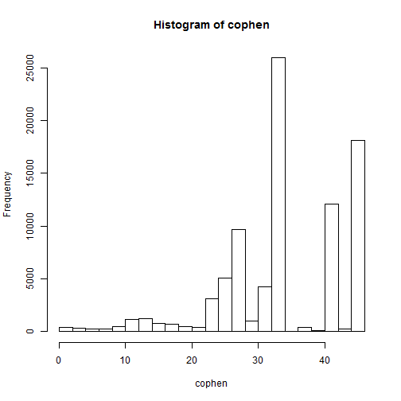
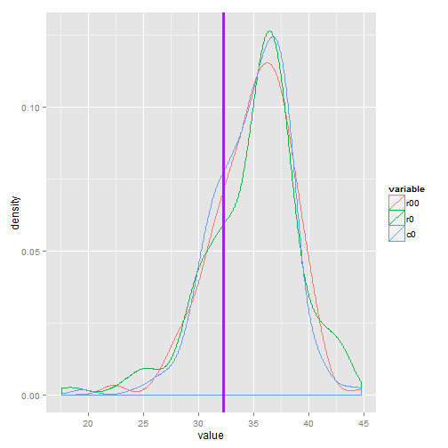

Week 14 Summary
========================================================

Readings for Week 14
---------------------

Webb, C.O. 2000.  Exploring the phylogenetic structure of ecological communities: An exampel for rain forest trees.  The American Naturalist 156: 145-155
Gotelli, N.J. and G.L. Entsminger. 2001. Swap and fill algorithms in null model analysis: rethinking the knight's tour.  Oecologia 129:281-291
Gotelli, N.J. and G.L. Entsminger. 2003. Swap algorithms in null model analysis. Ecology 84:532-535
Miklós, I. and J. Podani.  Randomization of Presence-Absence Matrices: Comments and New Algorithms.  Ecology 85:86-92

Overview
---------

Phylogenetic trees are a useful tool in the analysis of patterns in ecological communities.  Phylogenetic diversity is a potential metric that can be used to describe the structure of a community, in the same way as other measures of diversity (such as species richness, Shannon diversity, and so on). If we assume that traits are generally conserved in the evolution of a lineage, we should expect a positive relationship between the phylogenetic relatedness of a pair of species and the similarity of those species in ecological or life history traits.  Therefore, the phylogenetic structure of a community provides some understanding of the ecological processes that played a role in the organization of that community.  (For instance - if species are more related than one would expect due to chance, perhaps some environmental variable is limiting which species can be present in that community by requiring a certain suite of traits; if species are less related than expected due to chance, we might suspect that competition between similar species played a role in community assembly.)  To perform this analysis, we need to determine what sort of phylogenetic structure might be expected in a community due to chance alone

Exercise
----------

We will be testing the phylogenetic structure of a series of hummingbird communities.  To do this, we will use the package 'picante', which provides a series of functions for phylogenetic community analysis, as well as 'vegan', which provides various tools for community ecology.  Our goal is to generate null models of phylogenetic community structure, and determine if each community is significantly overdispersed or clustered relative to that null.  (Overdispersed = species in the community are less related to one another than you would expect by chance; clustered = species in the community are more related to one another than you would expect by chance.)


Code
-----

Load libraries

```r
require(picante)
```

```
## Loading required package: picante
```

```
## Warning: package 'picante' was built under R version 3.0.3
```

```
## Loading required package: ape
## Loading required package: vegan
## Loading required package: permute
## Loading required package: lattice
## This is vegan 2.0-9
## Loading required package: nlme
```

```r
require(vegan)
require(ggplot2)
```

```
## Loading required package: ggplot2
```

```r
require(RCurl)
```

```
## Loading required package: RCurl
## Loading required package: bitops
```

```r
require(reshape)
```

```
## Loading required package: reshape
## Loading required package: plyr
## 
## Attaching package: 'reshape'
## 
## The following objects are masked from 'package:plyr':
## 
##     rename, round_any
```


Read in the data

```r
options(RCurlOptions = list(cainfo = system.file("CurlSSL", "cacert.pem", package = "RCurl")))

# Site by species matrix of hummingbird communities; setting row.names=1
# will make some things easier later
raw1 <- getURL("https://raw.githubusercontent.com/PermuteSeminar/PermuteSeminar-2014/master/Week%2014/SiteXspp.csv")
sitesp <- read.csv(text = raw1, row.names = 1)

# Hummingbird phylogeny - Newick/parenthetic format (.tre)
raw2 <- getURL("https://raw.githubusercontent.com/PermuteSeminar/PermuteSeminar-2014/master/Week%2014/newtree.tre")
tree <- read.tree(text = raw2)
```


Calculate the cophenetic distance matrix of the tree (a matrix of pairwise distances between each pair of species in the tree, as defined by the branch lengths in the tree)

```r
cophen <- cophenetic(tree)
hist(cophen)
```

 


We need to check that the species in our tree and the species in the site by species matrix match, because we'll need to remove any species in a community that aren't found in the tree from our analyses.

```r
# Counts how many species in the site by species matrix aren't in the tree
sum(!colnames(sitesp[, 2:ncol(sitesp)]) %in% tree$tip.label)
```

```
## [1] 40
```

```r
# Counts how many species in the tree aren't in the matrix (we don't need to
# know this, but let's look at it anyway)
sum(!tree$tip.label %in% colnames(sitesp[, 2:ncol(sitesp)]))
```

```
## [1] 202
```


There are 40 species in the species matrix that aren't in our tree.  We can subsample the site by species matrix to use only those species that are included in our phylogeny.

Calculate the mean phylogenetic distance (a test statistic) for each site, and make a data frame that lists that MPD for each site

```r
mpd <- mpd(sitesp[, colnames(sitesp) %in% tree$tip.label], cophen)
MPDtable <- as.data.frame(mpd)
row.names(MPDtable) <- row.names(sitesp)
```


We want to test the observed MPD for each site against a null expectation of community MPD given our species pool. We will do this by randomizing the site by species matrix and resampling MPD 100 times.  The package 'vegan' provides a number of methods for randomization within the function 'commsimulator'.  We will use three:

r00 = Maintains the number of presences, but refills them in the matrix completely randomly (not maintaining row or column sums)
r0 = Maintains row sums, but not column sums
c0 = Maintains column sums, but not row sums

This will generate the null models against which we can test the observed MPD statistic for each site.


```r
# Making tables to store randomization output
MPD_r00 <- MPDtable
MPD_r0 <- MPDtable
MPD_c0 <- MPDtable

# r00
for (i in 1:100) {
    randcom = commsimulator(sitesp, "r00")
    randmpd = mpd(randcom[, colnames(randcom) %in% tree$tip.label], cophen)
    MPD_r00 = cbind(MPD_r00, randmpd)
}

# r0
for (i in 1:100) {
    randcom = commsimulator(sitesp, "r0")
    randmpd = mpd(randcom[, colnames(randcom) %in% tree$tip.label], cophen)
    MPD_r0 = cbind(MPD_r0, randmpd)
}

# c0
for (i in 1:100) {
    randcom = commsimulator(sitesp, "c0")
    randmpd = mpd(randcom[, colnames(randcom) %in% tree$tip.label], cophen)
    MPD_c0 = cbind(MPD_c0, randmpd)
}
```


Let's just look at the plot for the site 'Acacias', since there are too many sites to be worth looking at individually for our purposes.


```r
# This is the most circuitous plotting code ever and I sincerely apologize,
# but it works!
Acacias_r00 <- melt(MPD_r00[5])
```

```
## Using  as id variables
```

```r
Acacias_r0 <- melt(MPD_r0[5])
```

```
## Using  as id variables
```

```r
Acacias_c0 <- melt(MPD_c0[5])
```

```
## Using  as id variables
```

```r

Acacias <- cbind(Acacias_r00, Acacias_r0$value, Acacias_c0$value)
colnames(Acacias) <- c("MPD", "r00", "r0", "c0")

Acacias2 <- melt(Acacias[2:4])
```

```
## Using  as id variables
```

```r

ggplot(Acacias2, aes(x = value, color = variable)) + geom_density() + geom_vline(xintercept = MPDtable[5, 
    1], color = "purple", size = 1.2)
```

```
## Warning: Removed 2 rows containing non-finite values (stat_density).
## Warning: Removed 2 rows containing non-finite values (stat_density).
## Warning: Removed 1 rows containing non-finite values (stat_density).
```

 


This shows the three null distributions (r00, r0 and c0) of the test statistic MPD for the Acacias site - note that our choices about whether or not to fix row or column sums when we randomize changes the shape of the null model!  The vertical bar (purple) plots the observed MPD for the Acacias site.
