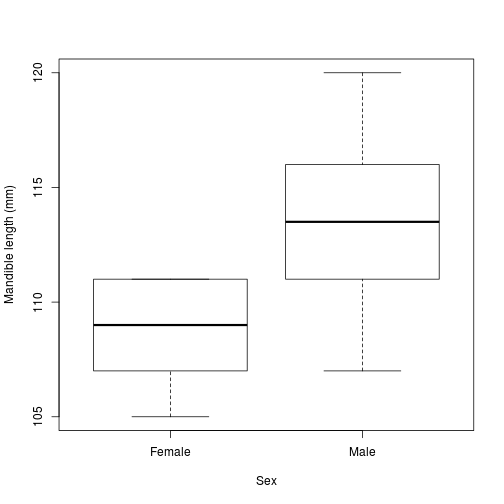

Week 5: Randomization, simple and less simple
========================================================

Randomization is a method for formulating and testing a null hypothesis of "randomness" given a particular set of data.  In this conception, our alternative hypothesis (i.e., that there *is* some effect, difference, correlation, etc.) corresponds to a certain level of organization or structure in our data.  If this is the case, then shuffling the order of our measurements (randomizing) will destroy that structure and change the value of our test statistic.  If, on the other hand, the null hypothesis is true, and ther is *not* any structure, then reshuffling the data won't produce much change in the chosen test statistic.

A randomization test simply reshuffles the data and calculates the test statistic many times, counting what proportion of test statistics are at least as extreme as the one calculated from the original data.  The shuffling may be a simple reordering, or it may attempt to preserve certain features of the original data or the process that generated it.  One example mentioned in class was phylogenetic trees: if you just shuffle the order of species, OF COURSE you're going to get a significant result, since the process that created the species (evolution) is branching and autocorrelated.  To get meaningful significance levels, you would need to come up with a randomization scheme that preserves some of these characteristics.

Design of a randomization scheme for taxonomic relationships under the assumption of Intelligent Design is left as an exercise for the reader.


Jackal jaws
-------------
To show the idea of randomization in action, I re-created the example of the jackal jaws from the reading.

```r
jackals <- data.frame(mandible = c(120, 107, 110, 116, 114, 111, 113, 117, 114, 
    112, 110, 111, 107, 108, 110, 105, 107, 106, 111, 111), sex = rep(c("Male", 
    "Female"), each = 10))
boxplot(mandible ~ sex, jackals, xlab = "Sex", ylab = "Mandible length (mm)")
```

 

So it definitely appears like males have larger mandibles.  But how sure are we?  For a standard statistical test of the difference in means, we can just use R's `lm()` function (this is equivalent to doing a two-sample T-test, and gives us the same p-value).

```r
mod <- lm(mandible ~ sex, jackals)
summary(mod)
```

```
## 
## Call:
## lm(formula = mandible ~ sex, data = jackals)
## 
## Residuals:
##    Min     1Q Median     3Q    Max 
##   -6.4   -1.8    0.1    2.4    6.6 
## 
## Coefficients:
##             Estimate Std. Error t value Pr(>|t|)    
## (Intercept)  108.600      0.974  111.49   <2e-16 ***
## sexMale        4.800      1.378    3.48   0.0026 ** 
## ---
## Signif. codes:  0 '***' 0.001 '**' 0.01 '*' 0.05 '.' 0.1 ' ' 1
## 
## Residual standard error: 3.08 on 18 degrees of freedom
## Multiple R-squared:  0.403,	Adjusted R-squared:  0.37 
## F-statistic: 12.1 on 1 and 18 DF,  p-value: 0.00265
```

```r
difference.observed <- mod$coefficients[["sexMale"]]
```

Looking at the results from this model, we can see that the male mandibles are
an average of 4.8 mm longer than the females,' and that we can be pretty confident this difference is real, given the small p-value (0.0026).

Now, to do the same thing using randomization.  I started by defining a function to do the randomization: it takes a vector of data values from two groups (`x`) and an integer `k`, which says how many of the items in `x` belong to group 1 (in our case, this will always be 10, the number of males).  The fuction shuffles the vector and assigns the first `k` values to group 1, then returns the difference beween the mean of the randomized "group 1" and "group 2."

This is a pretty simple randomization, so the advantage of writing a separate function to do it is debatable.  However, for more complicated randomizations, which may have more than one step, keeping distinct tasks separated in defined functions tends to make code cleaner and easier to debug and modify.

```r
randomized.difference <- function(x, k) {
    n <- length(x)
    x.random <- sample(x, n, replace = FALSE)
    return(mean(x.random[1:k]) - mean(x.random[(k + 1):n]))
}
```


We repeat this randomizing and difference-finding procedure a large number of times.  Because Ben doesn't like when people do 999 shuffles to get a "nice" total sample of 1000, I decided to do 4029 shuffles to land on a [weird number](http://en.wikipedia.org/wiki/Weird_number) instead.

```r
set.seed(70)
n.shuffles <- 4029
n.males <- sum(jackals$sex == "Male")
differences <- rep(0, n.shuffles)
for (i in 1:n.shuffles) {
    differences[i] <- randomized.difference(jackals$mandible, n.males)
}

p.rand <- (sum(differences >= difference.observed) + 1)/(n.shuffles + 1)
```

The p-value given by the randomization procedure (0.002) is, as we would hope, pretty close to the one from our parametric model (0.0026).

Dolphin Association Data
------------------------
A more complicated randomization problem comes up when we try to test whether the dolphins in Porpoise Bay associate with each other in non-random groups.  Bejder et al. record their dolphin observations in a table, where each row represents an "encounter" with a group of dolphins, and each column represents one animal.  Ones or zeros indicate whether a particular group included a particular dolphin.


```r
dolphins <- read.csv("Dolphin_data.csv")
dolphins <- as.matrix(dolphins[, 2:ncol(dolphins)])
```


### Measuring pairwise association

We want to know whether some dolphins are found together more freqently than we would expect based on random chance.  The first step is to come up with some statistic that tells us how often a given pair of dolphins are found together.  Bejder et al. use Cairns and Schwager's (1987) "half-weight index," or HWI:

\[
HWI = \frac{x}{x + y_{ab} + 0.5 (y_a + y_b)}
\]
where $x$ is the number of encounters including both dolphins a and b, $y_a$ and $y_b$ are the number of encounters with *only* dolphin a or b.  I didn't really understand what $y_{ab}$ meant, but Bejder et al. say it's always 0 for our purposes, so we don't have to worry about it.

I coded the HWI as a function:


```r
hwi <- function(a, b, m) {
  # m : co-occurrence matrix (individuals in columns, groups in rows)
  # a, b : column numbers for a pair of individuals
  both.present <- rowSums(m[ , c(a, b)]) == 2
  y.a  <- sum(m[! both.present , a]) # encounters with only a
  y.b  <- sum(m[! both.present , b]) # encounters with only b
  x <- sum(both.present)             # number of encounters with both a and b
  r
  eturn(x / (x + 0.5 * (y.a + y.b)))
}
```

This is a little terse, so the line-by line explanation is as follows:


```r
both.present <- rowSums(m[, c(a, b)]) == 2
```


Going from the innermost parentheses outwards, this line selects two comlumns from the co-occurrence matrix corresponding two the two dolphins (`m[ , c(a, b)]`), and sums them by row (`rowSums`).  This returns a vector with 0, 1, or 2 in each cell.  The cells with "2" in them correspond to encounters with both dolphins a and b, so I use the logical operator `==` to make a boolean vector that can be used to subset the encounters in the next three lines.


```r
y.a <- sum(m[!both.present, a])
y.b <- sum(m[!both.present, b])
```


These lines both do the same thing: use the indexing vector `! both.present` to select the rows in column `a` or `b` where *only* that dolphin is present, then adding up the number of ones in that subset to get $y_a$ and $y_b$.


```r
x <- sum(both.present)
```

This line just adds up the `TRUE`'s in `both.present` to get the number of shared encounters.

```r
return(x/(x + 0.5 * (y.a + y.b)))
```

This line calculates the HWI and returns it, ignoring $y_{ab}$ (wich is =0).

### Measuring overall association
With HWI in hand, we can calculate an association number for each pair of dolphins.  But we also want some overall, "population" measure of association. Belder et al. suggest using Manly's (1995) $S$ statistic:
\[
S = \sum_{i=1}^D \sum_{j=1}^D \frac{(o_{ij} - e_{ij})^2}{D^2}
\]
where $o_{ij}$ is the HWI value for dolphins $i$ and $j$, and $e_{ij}$ is the expected value of $o_{ij}$ if associations are random.

We want to compare the observed value of $S$ to a bunch of random values, to see how likely our data are under the null hypothesis of randomness.  To do this, we need to generate a bunch of randomized data matrices. But there are a few problems:

1. We need to generate the all the random matrices and $o_{ij}$'s *before* we can calculate the $e_{ij}$'s.

2. We don't want our random matrices to be *too* random.  Bejder et al. decided they wanted to preserve the row and column sums of the observed data matrix.  To do this, they randomly choose two rows and two columns of the matrix, and if the four cells at their intersections have either of the following patterns
```
0 1       1 0
1 0       0 1
```
they are swapped around to the other pattern.  This preserves the row and column sums, BUT...

3. Each swap only changes a few cells of the matrix, meaning that most of the HWIs will remain the same from one iteration to the next.  As a result, the series of random $S$-values will be highly autocorrelated, and we will need to deal with that fact to make sure we have enough truly random samples.
