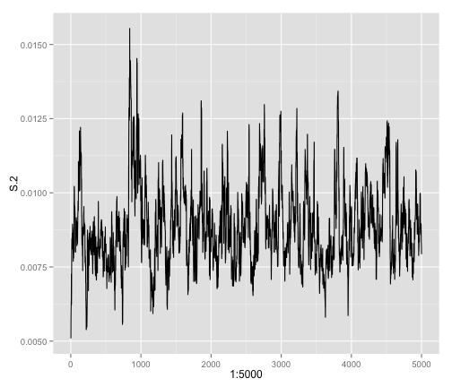

Week 6: Markov Chain Monte Carlo, chain convergence, & more 
===========================================================
Part 1: reviewing the dolphin permutation problem with swapping
---------------------------------------------------------------
We first reviewed our code that we were to have preprared for class that involved a functioning permutation script using with the dolphin data from Manly (1995). (See Sam's notes, week 5 for details on the problem). It seemed that everyone was on the same page in terms of having a working code in terms fo being able to swap the matrices.

Having a functioning swap and permute algorithm was critical to extend for MCMC chain convergence. For this week's summary, I will show what we did using Jon Borelli's code.

Part 2: Markov Chain Monte Carlo overview and discussion
-----------------------------------------------------
Heather provided a background on MCMC searches and chain convergence using slides written by Patrick Lim from Harvard (http://www.people.fas.harvard.edu/~plam/teaching/methods/convergence/convergence_print.pdf). THe main segway in this topic was from the dolphin project, in that an MCMC is searching association matrices based on the previous matrix swap. The point is that each next search is closely related to the search before it. 

First I will summarize chain diagnostics from the lecture and then show the code and plots to diagnose convergence of an MCMC chain using our dolphin data. 

Chain Diagnostics:  
*The "convergence" of the chain occurs when the sampling reaches a stable distribution.  
*If you would like to examine convergence diagnositics the "coda" package in R is good or there is a GUI program "tracer" in which you load traceplots into and can visualize.  
*Converence can be visualized with a trace plot. If the traceplot looks very jagged and does not have a solid median ("hairy caterpillar look"), then the sampling has not converged and has gotten stuck in parameter space when sampling. The "hairy caterpillar" look can be a good thing.  
*We also disscussed burn-in. There is a general acceptance of discarding a proportion of the initial sampling of parameter space.  

*A fundamental question from this discussion: How many pair-switches do we need to feel like we sampled the space? For example: do we make 3 chains, each with length 400, and have a burn-in of 200 (keeping the last 200 of each chain) OR we have one chain of 1200 with 50% burn-in. Which is more informative?  

Part 3: Gelman-Rubin Multiple Sequence Diagnostic
-----------------------------------------------------

We then proceeded to discuss the Gelman & Rubin Diagnostic which addresses the following concepts:  
*never use multiple chains because you want to sample different parts of space  
*want to send out multiple chains so they end up in the same place  
*how much variation is within each of these chains  
*G&B quantifies within chain variances (mean of within chain variances) and then like between chain variance (just like an anova!)  

Steps (for each parameter) for GB:
1. Run m ≥ 2 chains of length 2n from overdispersed starting
values.  
2. Discard the first n draws in each chain.  
3. Calculate the within-chain and between-chain variance.  
4. Calculate the estimated variance of the parameter as a
weighted sum of the within-chain and between-chain variance.  
5. Calculate the potential scale reduction factor.  

The GB diagnostic can be run in R. The steps involve running out multiple chains of your simulation `mcmc()`, combinining your chains into a list `mcmc.list()`, and running the GB diagnostic on the list of chains `gelman.diag() `.  

Part 4: Implementation of plotting chain convergence of dolphin data  
-----------------------------------------------------
We want to visualize the MCMC run and view if there is a convergence on an interpretable distribution.  We use Jon Borelli's code to compare short-chain and long-chain runs. We will then look at the plots and try to diagnose convergence.

```r
require(ggplot2)
```

```
## Loading required package: ggplot2
```

```r
require(RCurl)
```

```
## Loading required package: RCurl
## Loading required package: bitops
```

```r
url <- getURL("https://raw.github.com/PermuteSeminar/PermuteSeminar-2014/master/Week-5/Dolphin+data.csv")
dolphins <- read.csv(text = url, row.names = 1, header = F)
colnames(dolphins) <- LETTERS[1:18]
colSums(dolphins)
```

```
##  A  B  C  D  E  F  G  H  I  J  K  L  M  N  O  P  Q  R 
## 20 24  7 12 18  8  9  5  2  9  3 15 24  2  2 11  4  2
```

```r


get_hwi <- function(mat) {
    hwi <- matrix(nrow = ncol(mat), ncol = ncol(mat))
    for (i in 1:ncol(mat)) {
        for (j in 1:ncol(mat)) {
            x <- sum(mat[, i] == 1 & mat[, j] == 1)
            ya <- sum(mat[, i] == 1 & mat[, j] == 0)
            yb <- sum(mat[, i] == 0 & mat[, j] == 1)
            hwi[i, j] <- x/(x + 0.5 * (ya + yb))
        }
    }
    return(hwi)
}

get_hwi(dolphins)
```

```
##          [,1]   [,2]   [,3]   [,4]   [,5]   [,6]   [,7]   [,8]    [,9]
##  [1,] 1.00000 0.6364 0.3704 0.4375 0.4211 0.4286 0.3448 0.1600 0.09091
##  [2,] 0.63636 1.0000 0.2581 0.5000 0.5238 0.3125 0.4242 0.2069 0.00000
##  [3,] 0.37037 0.2581 1.0000 0.3158 0.3200 0.1333 0.2500 0.0000 0.00000
##  [4,] 0.43750 0.5000 0.3158 1.0000 0.4667 0.3000 0.4762 0.1176 0.28571
##  [5,] 0.42105 0.5238 0.3200 0.4667 1.0000 0.3077 0.5185 0.1739 0.10000
##  [6,] 0.42857 0.3125 0.1333 0.3000 0.3077 1.0000 0.5882 0.1538 0.20000
##  [7,] 0.34483 0.4242 0.2500 0.4762 0.5185 0.5882 1.0000 0.4286 0.18182
##  [8,] 0.16000 0.2069 0.0000 0.1176 0.1739 0.1538 0.4286 1.0000 0.28571
##  [9,] 0.09091 0.0000 0.0000 0.2857 0.1000 0.2000 0.1818 0.2857 1.00000
## [10,] 0.27586 0.3636 0.2500 0.3810 0.5185 0.1176 0.2222 0.0000 0.00000
## [11,] 0.26087 0.2222 0.2000 0.1333 0.2857 0.3636 0.3333 0.0000 0.00000
## [12,] 0.34286 0.3590 0.3636 0.5185 0.6667 0.2609 0.5000 0.4000 0.23529
## [13,] 0.68182 0.7083 0.3226 0.4444 0.5238 0.3125 0.4848 0.2759 0.07692
## [14,] 0.18182 0.1538 0.0000 0.2857 0.1000 0.2000 0.1818 0.0000 0.00000
## [15,] 0.09091 0.1538 0.2222 0.1429 0.2000 0.0000 0.1818 0.0000 0.00000
## [16,] 0.45161 0.4571 0.2222 0.3478 0.4828 0.5263 0.5000 0.0000 0.15385
## [17,] 0.08333 0.1429 0.1818 0.1250 0.1818 0.1667 0.3077 0.2222 0.00000
## [18,] 0.18182 0.1538 0.0000 0.1429 0.0000 0.0000 0.0000 0.0000 0.00000
##        [,10]  [,11]  [,12]   [,13]  [,14]   [,15]  [,16]   [,17]  [,18]
##  [1,] 0.2759 0.2609 0.3429 0.68182 0.1818 0.09091 0.4516 0.08333 0.1818
##  [2,] 0.3636 0.2222 0.3590 0.70833 0.1538 0.15385 0.4571 0.14286 0.1538
##  [3,] 0.2500 0.2000 0.3636 0.32258 0.0000 0.22222 0.2222 0.18182 0.0000
##  [4,] 0.3810 0.1333 0.5185 0.44444 0.2857 0.14286 0.3478 0.12500 0.1429
##  [5,] 0.5185 0.2857 0.6667 0.52381 0.1000 0.20000 0.4828 0.18182 0.0000
##  [6,] 0.1176 0.3636 0.2609 0.31250 0.2000 0.00000 0.5263 0.16667 0.0000
##  [7,] 0.2222 0.3333 0.5000 0.48485 0.1818 0.18182 0.5000 0.30769 0.0000
##  [8,] 0.0000 0.0000 0.4000 0.27586 0.0000 0.00000 0.0000 0.22222 0.0000
##  [9,] 0.0000 0.0000 0.2353 0.07692 0.0000 0.00000 0.1538 0.00000 0.0000
## [10,] 1.0000 0.1667 0.4167 0.24242 0.0000 0.18182 0.4000 0.15385 0.1818
## [11,] 0.1667 1.0000 0.0000 0.22222 0.0000 0.40000 0.4286 0.28571 0.0000
## [12,] 0.4167 0.0000 1.0000 0.51282 0.1176 0.11765 0.3846 0.21053 0.0000
## [13,] 0.2424 0.2222 0.5128 1.00000 0.1538 0.07692 0.4571 0.28571 0.1538
## [14,] 0.0000 0.0000 0.1176 0.15385 1.0000 0.00000 0.1538 0.00000 0.0000
## [15,] 0.1818 0.4000 0.1176 0.07692 0.0000 1.00000 0.3077 0.00000 0.0000
## [16,] 0.4000 0.4286 0.3846 0.45714 0.1538 0.30769 1.0000 0.26667 0.0000
## [17,] 0.1538 0.2857 0.2105 0.28571 0.0000 0.00000 0.2667 1.00000 0.0000
## [18,] 0.1818 0.0000 0.0000 0.15385 0.0000 0.00000 0.0000 0.00000 1.0000
```

```r

permutes <- function(mat, iter = 100) {
    pattern1 <- matrix(c(0, 1, 1, 0), nrow = 2, ncol = 2)
    pattern2 <- matrix(c(1, 0, 0, 1), nrow = 2, ncol = 2)
    count <- 0
    mat.list <- list()
    hwi.list <- list()
    
    while (count < iter) {
        srow <- sample(1:nrow(mat), 2)
        scol <- sample(1:ncol(mat), 2)
        
        test <- mat[srow, scol]
        
        if (sum(test == pattern1) == 4) {
            count <- count + 1
            mat[srow, scol] <- pattern2
            mat.list[[count]] <- mat
            hwi.list[[count]] <- get_hwi(mat)
            next
        } else if (sum(test == pattern2) == 4) {
            count <- count + 1
            mat[srow, scol] <- pattern1
            mat.list[[count]] <- mat
            hwi.list[[count]] <- get_hwi(mat)
            next
        } else {
            next
        }
    }
    return(list(permuted.matrices = mat.list, hwi = hwi.list))
}
# short-chain
system.time(pdolph <- permutes(dolphins, iter = 100)  #short-chain
)
```

```
##    user  system elapsed 
##   5.089   0.012   5.101
```

```r
mat.ij <- t(sapply(pdolph$hwi, FUN = function(x) {
    x[which(lower.tri(x))]
}))
e.ij <- colMeans(mat.ij)


S <- c()
for (i in 1:nrow(mat.ij)) {
    top <- (mat.ij[i, ] - e.ij)^2
    bottom <- ncol(dolphins)^2
    S[i] <- sum(top/bottom)
}
# long chain
system.time(pdolph.long <- permutes(dolphins, iter = 5000)  #short-chain
)
```

```
##    user  system elapsed 
## 260.053   0.328 260.388
```

```r
long.mat.ij <- t(sapply(pdolph.long$hwi, FUN = function(x) {
    x[which(lower.tri(x))]
}))
e.ij <- colMeans(mat.ij)


S.2 <- c()
for (i in 1:nrow(long.mat.ij)) {
    top <- (long.mat.ij[i, ] - e.ij)^2
    bottom <- ncol(dolphins)^2
    S.2[i] <- sum(top/bottom)
}
```


Plots of the short-chain and long-chain runs.  


```r
ggplot(data.frame(S = S), aes(x = 1:100, y = S)) + geom_line()
```

 

```r
ggplot(data.frame(S.2 = S.2), aes(x = 1:5000, y = S.2)) + geom_line()
```

 


We can see in the longer chain there is convergence around a mean around 0.08. In the short-chain, we cannot identify a distribution that the sampling is converging on. It has not sampled enough space!  
