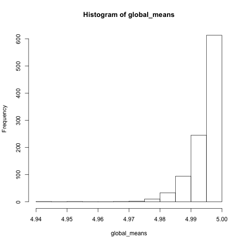
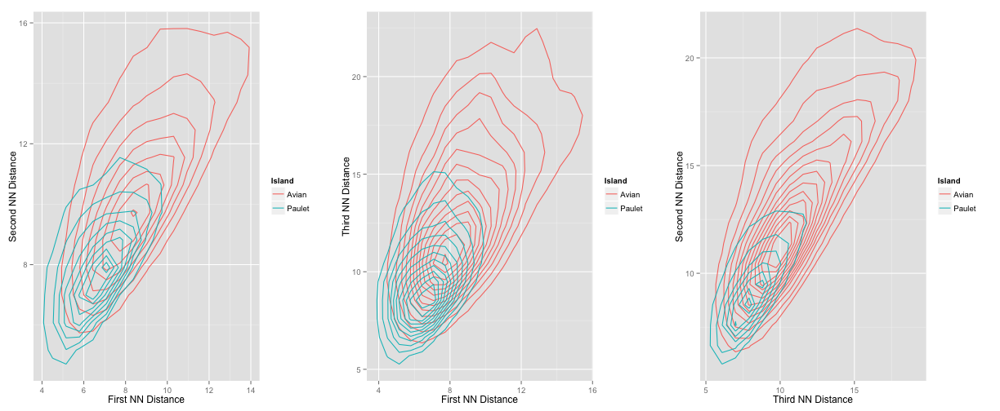
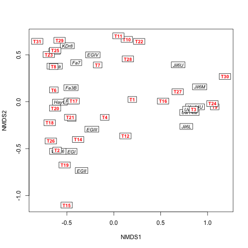

Week #1 Summary
========================================================

What we did:
-------------
1. Installed GitHub and introduced how to use a GitHub repository
2. Reviewed the non-parametric bootstrap
3. Worked through several exercises to demonstrate the use of the bootstrap and cases where the bootstrap fails

Basic idea behind the bootstrap:

We will get into more details in the next few chapters of Efron and Tibshirani, but the basic idea behind the bootstrap is that we can generate a statistical distribution for an estimator by sampling with replacement from the original data. (Ideally, you could generate this same distribution by  simply re-doing your experiment [or collecting another random sample from the population of interest] many many times. Each new experiment would yield another estimate for the parameter of interest, and the distribution of these estimates would give you information about the bias and variance of the estimator.)

Throughout our discussion of bootstrap, we will adopt Efron & Tibshirani's notation. Our original data will be called $x$ and bootstrapped datasets will be denoted $x^{*}$. The parameter of interest will be called $\theta$, and its estimation using the actual empirical (original) data will be called $\hat{\theta}$. We can use each bootstrapped dataset $x^{*}$ to calculate the bootstrapped estimate $\hat{\theta^{*}}$. Generally speaking, and in a way that will become clear over the next few weeks, bootstrapping 'works' if the distribution of the bootstrapped estimator relative to the original empirical estimate converges to that of the empirical estimate relative to the true population value

$$
\hat{\theta^{*}}-\hat{\theta} \rightarrow \hat{\theta}-\theta
$$

In the Week #1 seminar, we worked through three case studies to demonstrate both bootstrap 'working' and bootstrap 'failing'.

Case Study #1: When bootstrap works
----------------------------

To demonstrate bootstrap working, we did two things:

1. We drew 100 samples from 

$$
X \sim N(\mu=1,\sigma=3)
$$

and calculated the sample mean of each. This simulates doing the experiment 100 times (something we can rarely do in practice).

2. We drew 1 sample from 

$$
X \sim N(\mu=1,\sigma=3)
$$

and then created 99 bootstrapped replicates of the original dataset (so the original plus the 99 bootstrapped samples is equivalent to the 100 samples from the true underlying population). We then calculated the sample mean of each of these samples (one original+99 bootstrapped). 

To the extent to which these two distributions are approximately the same, and become more similar as the sample size increases, is a measure of whether bootstrapping has 'worked'. 

I show some example code below (slightly edited for formatting), in part to demonstrate some of the ways in which different people write code for the very same exercise (even when, in this case, the exercise is quite straightforward). [NB: Most people drew 100 bootstrapped datasets, as opposed to 99 bootstrapped datasets to add to the original empirical dataset. In practice, I don't think it matters, but we can certainly discuss this...]

From Jon Borrelli:

Exercise 1 - Normal

Drawing 1000 samples of 100 randomly drawn values from a normal


```r
opts_chunk$set(cache = T)
samples <- matrix(nrow = 1000, ncol = 100)
for (i in 1:1000) {
    samples[i, ] <- rnorm(100, 1, 3)
}

meansSAMPLE <- rowMeans(samples)
```

  
Bootstrapping 


```r
norm1 <- rnorm(100, 1, 3)
boot <- matrix(nrow = 1000, ncol = 100)
for (i in 1:1000) {
    boot[i, ] <- sample(norm1, 100, replace = T)
}

meansBOOT <- rowMeans(boot)
```


Plot the histograms (blue=sample result, red=boostrapping result)


```r
hist(meansBOOT, border = "red", main = NA, lwd = 3)
abline(v = mean(meansBOOT), col = "red", lwd = 2)
hist(meansSAMPLE, border = "blue", add = T, main = NA, lwd = 3)
abline(v = mean(meansSAMPLE), col = "blue", lwd = 2)
```

 


From Ben Weinstein:


```r
# Seminar 1 - Bootstrap test
require(ggplot2)
# Repeat the experiment 1000 times
global_means <- replicate(1000, mean(rnorm(100, mean = 1, sd = 3)))  #HJL: Changed mean to 1
hist(global_means)
```

 

```r
# make a dataframe
draws <- data.frame(d = global_means)

# 1000 bootstrap replicates of 1 experiment
j <- rnorm(100, mean = 1, sd = 3)  #HJL: Changed mean to 1
b <- replicate(1000, mean(sample(j, replace = TRUE)))
boots <- data.frame(b = b)

# compare histograms
ggplot() + geom_histogram(data = draws, aes(x = d), fill = "blue") + geom_histogram(data = boots, 
    aes(x = b), fill = "red", alpha = 0.4)
```

```
## stat_bin: binwidth defaulted to range/30. Use 'binwidth = x' to adjust this.
## stat_bin: binwidth defaulted to range/30. Use 'binwidth = x' to adjust this.
```

 


If you run this several times, you'll notice that the two histograms are not always right on top of one another. As you make the sample sizes (not the number of bootstraps, but the size of the original dataset) bigger, there is closer (and more robust) correspondence between the two histograms. However, even when the bootstrap distribution is off (in the sense of shifted from the original), its variance is usually pretty close. This is good news, since we are often interested in using the standard deviation of the bootstrapped estimates to estimated an estimates standard error. This is a good illustration of the fact that bootstrap gets better as sample sizes get better (and special caution should be applied when bootstrapping small datasets).

Case Study #2: When bootstrap fails because of the sample statistic
------------------------------------------------------------------------------------------------

One of the times when bootstrap is known to fail is when you are interested in the extremes of a distribution. To demonstrate this, we worked through a classic example is which the bootstrap fails:

$$
X \sim Unif(0,5)
$$

with $\theta = max(X)$ (a.k.a. $X_{(n)}$).

From Jon Borrelli:

Exercise 2 - Uniform

Drawing 1000 samples of 100 randomly drawn values from a uniform


```r
samples2 <- matrix(nrow = 1000, ncol = 1000)
for (i in 1:1000) {
    samples2[i, ] <- runif(1000, 0, 5)
}

maxSAMPLE <- apply(samples2, 1, max)
```

  
Bootstrapping 


```r
unifsampl <- runif(1000, 0, 5)
boot2 <- matrix(nrow = 1000, ncol = 1000)
for (i in 1:1000) {
    boot2[i, ] <- sample(unifsampl, 1000, replace = T)
}

maxBOOT <- apply(boot2, 1, max)
```


Plot the histograms


```r
hist(maxSAMPLE, border = "blue", main = NA, lwd = 3)
hist(maxBOOT, border = "red", add = T, lwd = 3)
```

 


Probability of getting the largest value in original in the bootstrapped sample is

$$
\LARGE{
1 - (1 - \frac{1}{n})^n
}
$$
  
Therefore, bootstrap is not very good with __extreme__ values.  

From Ben Weinstein:


```r
# Seminar 1 - Bootstrap test
require(ggplot2)
# Repeat the experiment 1000 times
global_means <- replicate(1000, max(runif(1000, 0, 5)))
hist(global_means)
```

 

```r
# make a dataframe
draws <- data.frame(d = global_means)

# 1000 bootstrap replicates of 1 experiment
j <- runif(1000, 0, 5)
b <- replicate(1000, max(sample(j, replace = TRUE)))
boots <- data.frame(b = b)

# compare histograms
ggplot() + geom_histogram(data = draws, aes(x = d), fill = "blue") + geom_histogram(data = boots, 
    aes(x = b), fill = "red", alpha = 0.4)
```

```
## stat_bin: binwidth defaulted to range/30. Use 'binwidth = x' to adjust this.
## stat_bin: binwidth defaulted to range/30. Use 'binwidth = x' to adjust this.
```

 

```r
ggplot() + geom_density(data = draws, aes(x = d), fill = "blue") + geom_density(data = boots, 
    aes(x = b), fill = "red", alpha = 0.4)
```

 


Case Study #3: When bootstrap fails because the distribution has ill defined moments
----------------------------

One of the other times when bootstrap is known to fail is when you have a distribution will is poorly behaved, which is to say that it has moments that are ill defined. We demonstrated this with a classic porrly-behaved distribution, the Cauchy distribution (which has an undefined mean and variance)[The parameters are fairly arbitrary here]:

$$
X \sim Cauchy(1,2) 
$$

with $\theta = var(X)$.

I've included Jon and Ben's code below, but because the Cauchy is so pathalogical, the histograms aren't much use. Its better to just play around with the code to get a sense for what's going on.

From Jon Borrelli:


```r
hist(rcauchy(1000, 1, 2))
```

 


Drawing 1000 samples of 100 randomly drawn values from a cauchy distribution


```r
samples3 <- matrix(nrow = 1000, ncol = 1000)
for (i in 1:1000) {
    samples3[i, ] <- rcauchy(1000, 1, 2)
}

varSAMPLE <- apply(samples3, 1, var)
```


Bootstrapping 


```r
cauchysampl <- rcauchy(1000, 1, 2)
boot3 <- matrix(nrow = 1000, ncol = 1000)
for (i in 1:1000) {
    boot3[i, ] <- sample(cauchysampl, 1000, replace = T)
}

varBOOT <- apply(boot3, 1, var)
```


Plot the histograms


```r
hist(varSAMPLE, border = "blue", main = NA, lwd = 3, freq = F)
hist(varBOOT, border = "red", lwd = 3, add = T, freq = F)
```

 


Additional Reading:
-----------------

For more information about Week #1's topics, a few helpful references are:

Athreya, K.B. 1987. Bootstrap of the mean in the infinite variance case. The Annals of Statistics 15(2): 724-731.

Bickel, P.J., and D. A. Freedman. 1981. Some asymptotic theory for the bootstrap. The Annals of Statistics 9(6): 1196-1217.

-------------------------------------------------------------------------------------

<br/>
Week #2 Summary
========================================================

What we did:
-------------
1. We discussed uses for **R Markdown**. This is a general-purpose package which will generate .Rmd, .md and .html files. R Markdown is useful because it can write files which may variously contain and run .r script within the document, and will generate any associated figures, etc.    
>>(**NOTE:** If you have not yet, please install the knitr package (which will also install the markdown package)  

2. We discussed **LaTeX**, which is a typsetting program especially powerful for writing mathematical formulas. Several LaTeX texts were posted on Blackboard, and are useful for both general introduction to the program and as a reference for LaTeX coding.  

3. We discussed a few key points from the reading (Ch. 3-8 in Efron and Tibshirani).  

4. We worked on a bootstrapping problem in pairs during class. Each group then posted their R Markdown files containing their answers to the problem on GitHub. Lastly, we discussed which of the 3 approaches we tried for bootstrapping is the best method.  

<br/>
<br/>

A few R Markdown Basics  
----------------
+ To write code that will run as embedded within R Markdown:  
Type: ```{r} 
summary(cars)
``` 
The output would actually look like this:

```r
summary(cars)
```

```
##      speed           dist    
##  Min.   : 4.0   Min.   :  2  
##  1st Qu.:12.0   1st Qu.: 26  
##  Median :15.0   Median : 36  
##  Mean   :15.4   Mean   : 43  
##  3rd Qu.:19.0   3rd Qu.: 56  
##  Max.   :25.0   Max.   :120
```

<br/>
If you wanted to have the code show, but not run, leave off the '{r}'.
```
summary(cars)
```
<br/>
+ You can also embed plots, for example:


```r
plot(cars)
```

 


(Here I have borrowed some of the default text that comes with a new R Markdown project)  


<br/>
<br/>
<br/>

A few LaTeX formulas  
----------------
+ LaTex's strongest point is its ability to write mathematical formulas clearly.  
+ LaTex code will generally contain a backslash to indicate what needs to use LaTex.   

> + A double dollar sign surrounding LaTex code instructs R to write the formula on a separate line.  

> + A single surrounding LaTex code instructs R to write the formula within a line of text.  

<br/>

Examples of LaTex writing:  
As a separate line of code, write as follows (although don't separate dollar signs with a space):  
$ $  
\pi=3.14  
$ $    **... will output:**       
      $$
         \pi=3.14
      $$  

Within a single line of code, separate with a single dollar sign (again, leave out spaces between the dollar signs and within the LaTex code):    
> blah blah $ \ pi=3.14 $ blah blah ...**will output**... blah blah $\pi=3.14$ blah blah.

<br/>

Here are a few examples of LaTex coding for other equations. Again, leave out spaces to have the code compile.    
+ Superscript: $X^{3}$ is written as $ X^{3} $  
+ Subscript: $X_{3}$ is written as $ X_{3} $  
+ Fractions: $\frac{2}{7}$ is written as $ \ frac{2}{7} $    
+ Greek letters: $\Omega$ and $\omega$ are written as $ \Omega $ and $ \omega $  
+ Square roots: $\sqrt{5}$ is written as $ \sqrt{5} $  
+ Hats: $\hat{alpha}$ is written as $ \hat{alpha} $  
+ Limits: $\lim_{n\rightarrow5}$ is written as $ \lim_{n\rightarrow5} $  
+ Integrals: $\int_{0}^{10}$ is written as $ \int_{0}^{10} $; note that LaTex is smart enough that the order you enter the numbers for your limits doesn't matter.  
+ Sum: $\sum{(x:y)}$ is written $ \sum{(x:y)} $  
+ Approx.: $\sim3$ is $ \sim3 $; $\approx3$ is $ \approx3 $  
<br/>  

Putting it all together to write a complex expression example:    
$$
\lim_{\epsilon\rightarrow0_{+}}
\frac{\int_{\alpha_{i}}^{\alpha_{i+\epsilon}} 
      \sqrt{1+(x-\mu)^2}dx}
     {\phi(\epsilon)}
$$  
**... is written as:**   
$ $  
\lim_ {\epsilon\rightarrow0_{+}}  
\frac{\int_ {\alpha_ {i}} ^ {\alpha_ {i+\epsilon}}  
      \sqrt { 1 + (x- \ mu) ^2 } dx}  
     { \phi (\epsilon) }  dx
$ $  

<br/>
<br/>
<br/>

Discussing a few key points from Ch. 3-8 in E+T
---------------------
What's the difference between a **census** and a **sample**?  

>>A census observes the entire population, whereas a sample looks at only a representative part of
the entire population. With a census, you can just run mathematical calculations to say something descriptive about the population (ie., mean, mode, etc.). In contrast, a sample must use statistics with the data, because the information you have represents part of the larger population whole, which you can use to infer larger, population-descriptive relationships.  

<br/>

What's the difference between a **parameter** and a **statistic**?  
>> A parameter belongs to the distribution of a population- it is a function of the distribution *F*. A statistic is any metric calculated from your data, and is a function of *x* as drawn from *F*. Statistics are used to estimate parameters of interest for the population.  

<br/>

What is the **plug-in principle**?  
>>This is the core of E+T's book, and of bootstrapping. The plug-in principle says that although you would like to know a whole-population parameter $\Theta\$ = t(*F*), you probably can't sample the whole population. Therefore, take a random sample of that population to estimate $\hat{\Theta}$, which will be applied to your data/the emperical distribution (= t($\hat{F}$)).  

>> Note that your unbiased estimate for $\hat{\Theta}$ is the best estimate that you can get for $\Theta$, as you are assuming that your data (the emperical distribution) is a good representitive of the unknown distribution for the entire population.  

>> This doesn't mean that your estimate for $\Theta$ is *good*, it's just the best you can do given your data!  

<br/>
Note that E+T mostly focus on non-parametric bootstraps. A parametric distribution/bootstrap should be used if your data is so sparse that you would get more options for fitting a $\hat{\Theta}$ if you assumed a distribution from which to draw. Additionally, if you have *a priori* knowledge of the population from which you draw your sample and know it fits a particular distribution, a parameteric bootstrap can be used.  

The ultimate goal of bootstrapping is to try to recreate the process that generated the data. The method used for bootstrapping should reflect this, and take into consideration the hypothesis that is being tested.  

<br/>
<br/>
<br/>

In-class problem
---------------
We were given data on bird clutch size for a variety of species.  
1. What's the best distribution for clutch size?  
2. What's the mean clutch size, using three nonparametric bootstrap techniques:  
>A. Sample with replacement from **species** (irregardless of higher taxonomy)  
>B. Sample with replacement from **family**, then sample the species from that list with replacement, bootstrapping the species samples.  
>C. Bootstrap **across all levels** by sampling with replacement from family, then sampling within this for genera, and then within this for species (hierarchical sampling).  

<br/>

### Here is the code, as run by Sarah Supp and Emily Rollinson.  

First, we read in the data on Clutch Size.

```r
library(ggplot2)
library(MASS)
require(RCurl)
options(RCurlOptions = list(cainfo = system.file("CurlSSL", "cacert.pem", package = "RCurl")))
url <- getURL("https://raw.githubusercontent.com/PermuteSeminar/PermuteSeminar-2014/master/ClutchSize.csv")
clutch <- read.csv(text = url, header = T)

print(nrow(clutch))
```

```
## [1] 2392
```


<br/>

**1. What is the best distribution for the clutch size data?**

The data are continuous, long right tail

```r
ggplot(clutch, aes(Clutch_size)) + geom_histogram(col = "white") + theme_classic() + 
    theme(text = element_text(size = 20))
```

```
## stat_bin: binwidth defaulted to range/30. Use 'binwidth = x' to adjust this.
```

 

```r

fitdistr(clutch$Clutch_size, densfun = "lognormal")
```

```
##    meanlog     sdlog  
##   1.111122   0.502051 
##  (0.010265) (0.007259)
```

```r

avg = mean(clutch$Clutch_size)
med = median(clutch$Clutch_size)
stdev = sd(clutch$Clutch_size)
```


<br/>

**2. What is the statistic mean? Sample with replacement from:**  
**a) species**


```r
print(avg)
```

```
## [1] 3.448
```

```r
n = nrow(clutch)

est = NULL
for (i in 1:1000) {
    boot = sample(clutch$Clutch_size, n, replace = TRUE)
    mean.1 = mean(boot)
    est = append(est, mean.1)
}

mean(est)
```

```
## [1] 3.448
```


<br/>

**b) family**  

```r
f = length(unique(clutch$Family))

est2 = NULL
for (i in 1:1000) {
    fam = sample(clutch$Family, f, replace = TRUE)
    subdat = clutch[which(clutch$Family %in% fam), ]
    boot = sample(subdat$Clutch_size, n, replace = TRUE)
    mean.2 = mean(boot)
    est2 = append(est2, mean.2)
}

mean(est2)
```

```
## [1] 3.468
```


<br/>

**c) bootstrap at all levels - sample with replacement for families, we used the total number of unique families. Within those families, count the number of unique genera, and sample from the genera. Within those genera, sample from the species, such that n = the length of the original dataset**

```r
f = length(unique(clutch$Family))

est3 = NULL
for (i in 1:1000) {
    fam = sample(clutch$Family, f, replace = TRUE)
    subdat = clutch[which(clutch$Family %in% fam), ]
    g = length(unique(subdat$Genus_name))  #this is not exactly what Heather was saying
    gen = sample(subdat$Genus_name, g, replace = TRUE)
    subdat2 = subdat[which(subdat$Genus_name %in% gen), ]
    boot = sample(subdat2$Clutch_size, n, replace = TRUE)
    mean.3 = mean(boot)
    est3 = append(est3, mean.3)
}

mean(est3)
```

```
## [1] 3.458
```


<br/>

**Plot the data as histograms. The first method matches the mean of the original data and has lower variance. The second two methods are similar (in the way that we implemented them) but have wider variance.**


```r
bootdata = data.frame(est, est2, est3)

ggplot(bootdata, aes(est, fill = "species")) + geom_histogram(alpha = 0.5) + 
    theme_classic() + theme(text = element_text(size = 20)) + geom_histogram(aes(est2, 
    fill = "family"), alpha = 0.5) + geom_histogram(aes(est3, fill = "hierarchical"), 
    alpha = 0.5) + geom_vline(data = clutch, aes(xintercept = mean(Clutch_size)), 
    linetype = "longdash")
```

```
## stat_bin: binwidth defaulted to range/30. Use 'binwidth = x' to adjust this.
## stat_bin: binwidth defaulted to range/30. Use 'binwidth = x' to adjust this.
## stat_bin: binwidth defaulted to range/30. Use 'binwidth = x' to adjust this.
```

```
## Warning: position_stack requires constant width: output may be incorrect
## Warning: position_stack requires constant width: output may be incorrect
## Warning: position_stack requires constant width: output may be incorrect
```

 


<br/>

The population mean is 3.448.
The data bootstrapped by species is 3.4476, by family is 3.4684, and by family hierarchically is 3.4584.

<br/>
<br/>
<br/>
<br/>
<br/>
Assigned Readings:
----------
Downes, M. Short Math Guide for LATEX. version 1.09. http://www.ams.org/tex/short-math-guide.html, 2002
<br/>
Additional Reading:
--------------------
Efron, B., and R. Tibshirani. 1986. Bootstrap methods for standard errors, confidence intervals, and other measures of statistical accuracy. Statistical science:54–75.

-------------------------------------------------------------------------------------

<br/>
Week #4 Summary 
========================================================

**How to read files (such as .csv) from Github on Rmarkdown documents:**

Install the RCurl package
> Use getURL() function:


```r
require(RCurl)
```


I was experiencing a certificate error with getURL().  The following code seems to fix the problem in case you experience the same:


```r
options(RCurlOptions = list(cainfo = system.file("CurlSSL", "cacert.pem", package = "RCurl")))

raw <- getURL("https://raw.githubusercontent.com/PermuteSeminar/PermuteSeminar-2014/master/Week-2/ClutchSize.csv")
clutch <- read.csv(text = raw)  #make sure to upload RAW data file
head(clutch)
```

```
##   Family Genus_name             Species_name Clutch_size
## 1      3   Dromaius Dromaius novaehollandiae        8.98
## 2      4    Apteryx        Apteryx australis        2.00
## 3      4    Apteryx          Apteryx haastii        1.00
## 4      4    Apteryx           Apteryx owenii        1.00
## 5      6    Ortalis           Ortalis vetula        2.88
## 6      7   Alectura         Alectura lathami       14.78
##              English_name
## 1                     Emu
## 2              Brown Kiwi
## 3      Great Spotted Kiwi
## 4     Little Spotted Kiwi
## 5        Plain Chachalaca
## 6 Australian Brush-turkey
```


Lecture Notes 
==============
adapted from Emily Rollinsion
-------------------------------

> For this week, we read Chapter 8 in Efron and Tibshirani, and notes on bootstrapping dependent data (Steigerwald; posted to GitHub and on Blackboard).  This chapter provides an overview of bootstrapping procedues for more complicated data structures than the one-sample model, such as time-dependent data or otherwise non-IID data.

In-class discussion:
---------------------

The goal of the bootstrap algorithm is to estimate the probability distribution that underlies our data.  We can use our empirical distribution in lieu of the full distribution to understand the distribution of statisics of interest (mean, variance, etc.).

Bootstraps are often used to estimate standard errors.  We select $B$ independent bootstrap samples, calculate our test statistic using the bootstrap samples, and use the standard deviation of the $B$ replications as an estimate of the standard error of the unknown distribution $F$ that underlies our empirical data.  Resampled populations should equal the number of orginal samples. *'s are used to indicate resampled items.

This works for both a single unknown distribution (see Figure 8.1 in E&T) or a more complicated underlying process or a whole set of unknown distributions (see Figure 8.3 in E&T). We could easily imagine some biological measure influenced by many processes (i.e., many underlying and unknown statistical distributions). 


Today's example:
-------------------

We used the data from Leutenizing hormone example in Efron and Tibshirani (Ch. 8).  This formed a time series with some temporal stucture.
the whole distirbution may be normal.

We will model this using an autoregressive model of period 1.
$$
AR(1): z_{t} = \beta_{z_{t-1}} + \epsilon_{t}
$$
> where $z_{t}$ has an expectation 0 and $\beta$ is an unknown parameter, a number between -1 and 1.  


In class Excercises
--------------------
**Use dataset from book:**

**1. Estimate $\hat{\beta}$ **
-------------------------------

Solution: Adapted from Jon Borrelli

Load Required Packages


```r
require(RCurl)
require(ggplot2)
```


Load Dataset:


```r
options(RCurlOptions = list(cainfo = system.file("CurlSSL", "cacert.pem", package = "RCurl")))

raw <- getURL("https://raw.githubusercontent.com/PermuteSeminar/PermuteSeminar-2014/master/Week-4/hormone_data.csv")
hormone <- read.csv(text = raw)
head(hormone)
```

```
##   period level
## 1      1   2.4
## 2      2   2.4
## 3      3   2.4
## 4      4   2.2
## 5      5   2.1
## 6      6   1.5
```


Calculate $z_t$ for each data point: $z_t = y_t-\mu$


```r
z.t <- hormone$level - mean(hormone$level)
z.t
```

```
##  [1]  0.0  0.0  0.0 -0.2 -0.3 -0.9 -0.1 -0.1  0.1 -0.4 -0.5 -0.7 -0.2 -0.6
## [15]  0.8  0.8  0.3 -0.2 -0.2 -0.5 -0.5 -0.6  0.3  0.6 -0.1 -0.4 -0.4  0.5
## [29]  0.5  0.3  0.3 -0.1  0.2  0.0 -0.6 -0.7 -0.9 -1.0 -0.3  0.9  1.1  1.1
## [43]  0.7  0.2 -0.3  1.0  0.6  0.5
```


Calculate residual squared errors for each value of $z_t$ and all possible values of $b$.
$$
RSE(b) = \sum_{t-U}^{V}(z_t - bz_{t-1})^2
$$

Generate a function that does this calculation over these values and picks out the best value for $b$ that minimizes RSE.


```r
rse <- function(zt, b) {
    est.b <- c()
    for (i in 1:length(b)) {
        res <- c()
        for (j in 2:length(zt)) {
            res[j - 1] <- (zt[j] - b[i] * zt[j - 1])^2  #RSE equation
        }
        est.b[i] <- sum(res)
    }
    bhat <- b[which.min(est.b)]
    return(bhat)
}
```


Run the function and get $\hat{\beta}$


```r
b <- seq(-1, 1, 0.001)  #generates a sequence of possible values for b
bhat <- rse(z.t, b)  #runs the function 
bhat
```

```
## [1] 0.586
```


**So our estimate of $\hat{\beta}$ is 0.586**

 2a. See how good our estimate of $\hat{\beta}$ is by figuring out confidence intervals (Standard error) of $\beta$ by bootstrapping methods
-----------------------------------------------------------------------------------------------------

We need to estimate $P = (\beta,F)$ from the data.

Since we have $\hat{\beta}$ we can use it to estimate $F$ distribution of the distubances and calculate $\epsilon_{t} = z_{t} - \beta z_{t-1}$ for every $t$  


```r
eps <- c()  #collects all the calculate values of epsilon

for (i in 1:length(z.t)) {
    eps[i] <- z.t[i] - bhat * z.t[i - 1]
}
```


A histrogram of the approximate disturbances. It is not a normal distribution.   The Mean = 0.0062


```r
hist(eps)
```

 


Resample $F$ Distribtuion of values of $\epsilon$ with replacement:


```r
boot.eps <- matrix(nrow = 200, ncol = 47)
for (rep in 1:200) {
    boot.eps[rep, ] <- sample(eps[2:48], 47, replace = T)
}
```


Generate bootstrap values for time series $z_{t}*$: 


```r
z.tmat <- matrix(nrow = 200, ncol = 48)
z.tmat[, 1] <- z.t[1]
for (rep in 1:200) {
    for (cols in 1:47) {
        z.tmat[rep, cols + 1] <- bhat * z.tmat[rep, cols] + boot.eps[rep, cols]
    }
}
```


Generate bootsrap replications of $\hat{\beta}$ 


```r
b.test <- seq(0, 1, 0.001)
bhatboot <- apply(z.tmat, 1, rse, b = b.test)  #Uses RSE function created above
```


Histogram of the generated $\hat{\beta}$ values. The mean = 0.5793  


```r
hist(bhatboot, freq = F)
```

 


2b. Use a moving blocks bootstrap
--------------------------------------


```r
head(hormone)
```

```
##   period level
## 1      1   2.4
## 2      2   2.4
## 3      3   2.4
## 4      4   2.2
## 5      5   2.1
## 6      6   1.5
```


```r
block <- matrix(nrow = 3, ncol = 46)
for (i in 1:46) {
    block[1, i] <- z.t[i]
    block[2, i] <- z.t[i + 1]
    block[3, i] <- z.t[i + 2]
}

boot.block <- matrix(nrow = 500, ncol = 48)
for (i in 1:500) {
    bcol <- sample(1:46, 16, replace = T)
    boot.block[i, ] <- as.vector(block[, bcol])
}

b.test <- seq(0, 1, 0.001)

bhatboot2 <- apply(boot.block, 1, rse, b = b.test)
```


Histogram of estimates generatated from the Moving Blocks BootStrap with mean of 0.3925


```r
hist(bhatboot2)
```

 


Assigned Reading:
-------------
Efron, B., and R.J. Tibshirani 1994. An introduction to the bootstrap (Vol. 57). CRC press. Chapter8

Additional reading:
----------------------
More on the moving block boostrap:
<br/>
<br/>
Lahiri, S. 1993. On the moving block bootstrap under long range dependence. Statistics & Probability Letters 18(5):4.5-413.


-------------------------------------------------------------------------------------

<br/>
Week #5 Summary
========================================================

Randomization is a method for formulating and testing a null hypothesis of "randomness" given a particular set of data.  In this conception, our alternative hypothesis (i.e., that there *is* some effect, difference, correlation, etc.) corresponds to a certain level of organization or structure in our data.  If this is the case, then shuffling the order of our measurements (randomizing) will destroy that structure and change the value of our test statistic.  If, on the other hand, the null hypothesis is true, and ther is *not* any structure, then reshuffling the data won't produce much change in the chosen test statistic.

A randomization test simply reshuffles the data and calculates the test statistic many times, counting what proportion of test statistics are at least as extreme as the one calculated from the original data.  The shuffling may be a simple reordering, or it may attempt to preserve certain features of the original data or the process that generated it.  One example mentioned in class was phylogenetic trees: if you just shuffle the order of species, OF COURSE you're going to get a significant result, since the process that created the species (evolution) is branching and autocorrelated.  To get meaningful significance levels, you would need to come up with a randomization scheme that preserves some of these characteristics.

Design of a randomization scheme for taxonomic relationships under the assumption of Intelligent Design is left as an exercise for the reader.


Jackal jaws
-------------
To show the idea of randomization in action, the following is a re-created example of the jackal jaws from the reading.

```r
jackals <- data.frame(mandible = c(120, 107, 110, 116, 114, 111, 113, 117, 114, 
    112, 110, 111, 107, 108, 110, 105, 107, 106, 111, 111), sex = rep(c("Male", 
    "Female"), each = 10))
boxplot(mandible ~ sex, jackals, xlab = "Sex", ylab = "Mandible length (mm)")
```

 

So it definitely appears like males have larger mandibles.  But how sure are we?  For a standard statistical test of the difference in means, we can just use R's `lm()` function (this is equivalent to doing a two-sample T-test, and gives us the same p-value).

```r
mod <- lm(mandible ~ sex, jackals)
summary(mod)
```

```
## 
## Call:
## lm(formula = mandible ~ sex, data = jackals)
## 
## Residuals:
##    Min     1Q Median     3Q    Max 
##   -6.4   -1.8    0.1    2.4    6.6 
## 
## Coefficients:
##             Estimate Std. Error t value Pr(>|t|)    
## (Intercept)  108.600      0.974  111.49   <2e-16 ***
## sexMale        4.800      1.378    3.48   0.0026 ** 
## ---
## Signif. codes:  0 '***' 0.001 '**' 0.01 '*' 0.05 '.' 0.1 ' ' 1 
## 
## Residual standard error: 3.08 on 18 degrees of freedom
## Multiple R-squared: 0.403,	Adjusted R-squared: 0.37 
## F-statistic: 12.1 on 1 and 18 DF,  p-value: 0.00265
```

```r
difference.observed <- mod$coefficients[["sexMale"]]
print(difference.observed)
```

```
## [1] 4.8
```

Looking at the results from this model, we can see that the male mandibles are
an average of 4.8 mm longer than the females,' and that we can be pretty confident this difference is real, given the small p-value (0.0026).

Now, we need to compare the observed mean effect statistic to a the distribution of mean effects from randomized samples. 
<br/>
>>First, we define a function to do the randomization: it takes a vector of data values from two groups (`x`) and an integer `k`, which says how many of the items in `x` belong to each factor/category (in our case, this will always be 10, the number of males).  The fuction shuffles the vector and assigns the first `k` values to group 1, then returns the difference beween the mean of the randomized "group 1" and "group 2."


```r
randomized.difference <- function(x, k) {
    n <- length(x)
    x.random <- sample(x, n, replace = FALSE)
    return(mean(x.random[1:k]) - mean(x.random[(k + 1):n]))
}
```


We repeat this randomizing and recalcuate the test statistic (in this case the mean effect between gender) each iteration. There are 4029 shuffles because we wanted to land on a weird number (the sum of all the divisor is greater than the number, and no subset of divisors equal the number).

```r
set.seed(70)
n.shuffles <- 4029
n.males <- sum(jackals$sex == "Male")
differences <- rep(0, n.shuffles)
for (i in 1:n.shuffles) {
    differences[i] <- randomized.difference(jackals$mandible, n.males)
}
p.rand <- (sum(differences >= difference.observed) + 1)/(n.shuffles + 1)
p.rand
```

```
## [1] 0.001985
```

The p-value given by the randomization procedure (0.002) is, as we would hope, pretty close to the one from our linear model (0.0026).  As such, we can conclude that the males are significantly different from females.
<br/>
Dolphin Association Data
------------------------
A more complicated randomization problem comes up when we try to test whether the a given dolphin individual in Porpoise Bay is more likely to associate with another dolphin individual in non-random groups (aka form non-random social groups).  Bejder et al. (1998) record their dolphin observations in a presence/absence table, where each row represents an "encounter" with a group of dolphins and each column represents a dolphin individual.  Ones or zeros indicate whether a presence and absence of a dolphin individual in a group.


```r
require(RCurl)
options(RCurlOptions = list(cainfo = system.file("CurlSSL", "cacert.pem", package = "RCurl")))
url <- getURL("https://raw.githubusercontent.com/PermuteSeminar/PermuteSeminar-2014/master/Week-5/Dolphin+data.csv")
dolphins <- read.csv(text = url, row.names = 1, header = F)
dolphins <- as.matrix(dolphins[, 2:ncol(dolphins)])
```


### Measuring pairwise association

We want to know whether some dolphins are found together more freqently than we would expect based on random chance.  The first step is to come up with some statistic that tells us how often a given pair of dolphins are found together.  Bejder et al. (1998) use Cairns and Schwager's (1987) "half-weight index," or HWI:

\[
HWI = \frac{x}{x + y_{ab} + 0.5 (y_a + y_b)}
\]
where $x$ is the number of encounters including both dolphins a and b, $y_a$ and $y_b$ are the number of encounters with *only* dolphin a or b.   $y_{ab}$ is considering the number of groups that have both dolphin a and b at the same time.  But since this is not physically possible, it is 0.

I coded the HWI as a function:


```r
hwi <- function(a, b, m) {
  # m : co-occurrence matrix (individuals in columns, groups in rows)
  # a, b : column numbers for a pair of individuals
  both.present <- rowSums(m[ , c(a, b)]) == 2
  y.a  <- sum(m[! both.present , a]) # encounters with only a
  y.b  <- sum(m[! both.present , b]) # encounters with only b
  x <- sum(both.present)             # number of encounters with both a and b
  return(x / (x + 0.5 * (y.a + y.b)))
}
```

The line-by line explanation is as follows:


```r
both.present <- rowSums(m[, c(a, b)]) == 2
```


Going from the innermost parentheses outwards, this line selects two columns from the co-occurrence matrix corresponding to the two dolphins (`m[ , c(a, b)]`), and sums them by row (`rowSums`).  This returns a vector with 0, 1, or 2 in each cell.  The cells with "2" in them correspond to encounters with both dolphins a and b, so I use the logical operator `==` to make a boolean vector that can be used to subset the encounters in the next three lines.


```r
y.a <- sum(m[!both.present, a])
y.b <- sum(m[!both.present, b])
```


The indexing vector `! both.present` selects the rows in column `a` or `b` where *only* that dolphin is present, then adding up the number of ones in that subset to get $y_a$ and $y_b$.


```r
x <- sum(both.present)
```

This line just adds up the `TRUE`'s in `both.present` to get the number of shared encounters.

```r
return(x/(x + 0.5 * (y.a + y.b)))
```

This line calculates the HWI and returns it, ignoring $y_{ab}$ (which is =0).

### Measuring overall association
With HWI in hand, we can calculate an association number for each pair of dolphins.  But we also want some overall, "population" measure of association. Belder et al. (1998) suggests using Manly's (1995) $S$ statistic:
\[
S = \sum_{i=1}^D \sum_{j=1}^D \frac{(o_{ij} - e_{ij})^2}{D^2}
\]
where $o_{ij}$ is the HWI value for dolphins $i$ and $j$, and $e_{ij}$ is the expected value of $o_{ij}$ if associations are random.

We want to compare the observed value of $S$ to a bunch of random values in order to see how likely our data is under the null hypothesis of randomness.  To do this, we need to generate a lot of randomized data matrices. But there are a few problems:

1. We need to generate all the random matrices and $o_{ij}$'s *before* we can calculate the $e_{ij}$'s.

2. We don't want our random matrices to be *too* random, as we want to preserve the within and between group structure (i.e. we want to preseve the number of dolphins in a group and total number of times a given dolphin was observed).  To do this, they randomly selected two rows and two columns of the matrix, and if the four cells at their intersections have either of the following 2x2 matrix values, then the positions of the 1s are switched for the 0s in each row to produce the other matrix option:
>>if the matrix is:
```
0 1    
1 0
```
>>then after the swap, it becomes:
```
1 0
0 1
```
>>and vice versa
 
<br/>
This preserves the row and column sums, *BUT*...

3. Each swap only changes one 2x2 group inside the matrix, meaning that most of the HWIs will remain the same from one iteration to the next.  This method of using the randomized matrix to generate the next randomized matrix is called Markov Chain Monte Carlo. As a result of using this technique, the series of random $S$-values will be highly autocorrelated, and we will need to deal with that fact to make sure we have enough truly random samples.  For instance, you will need to make sure you have done enough iterations to end-up with a matrix that different than the original matrix.
<br/>
*Working Code for matrix swap*
<br/>
First develop a function to detect for the locations where a swap could occur

```r
swap <- function(m) {
    # Searches an encounter-individual matrix randomly for a set of four cells
    # on the corners of a rectangular sub-matrix that form a diagonal 2x2
    # matrix on their own, and swaps the diagonals.
    # 
    # Arguments: m : co-occurrence matrix (individuals in columns, groups in
    # rows) Value: The same matrix as supplied, but with the four cells
    # swapped
    while (TRUE) {
        i <- sample.int(nrow(m), 2)
        j <- sample.int(ncol(m), 2)
        
        if (all(m[i, j] == c(1, 0, 0, 1)) | all(m[i, j] == c(0, 1, 1, 0))) {
            m[i, j] <- m[i, j][2:1, ]
            return(m)
        }
    }
}

association.matrix <- function(m) {
    # Calculates the HWI for each pair of individuals across all encounters.
    # 
    # Arguments: m : co-occurrence matrix (individuals in columns, groups in
    # rows) Value: A square association matrix, with the upper triangle filled
    # with HWIs between each pair of individuals.  The lower triangle is all
    # zeros.
    D <- ncol(m)
    result <- matrix(0, D, D)
    for (i in 1:D) {
        for (j in i:D) {
            result[i, j] <- hwi(i, j, m)
        }
    }
    return(result)
}

S <- function(assoc.mat, e.mat) {
    # Calculate the S-statistic from an association matrix and its expected
    # value.
    # 
    # Arguments: assoc.mat : the association matrix e.mat : the matrix of
    # expexted HWIs Value: The association matrix's S-statistic
    D <- nrow(assoc.mat)
    # don't have to worry about the upper triangle, since the lower one is all
    # zeros
    sum((assoc.mat - e.mat)^2)/D^2
}

randomized.S <- function(m, n.swaps) {
    # This function doesn't run any faster than the loop below, but uses a lot
    # less memory because it dosn't store all the intermediate association
    # matrices.  Because it calculates the mean HWI matrix (e.matrix) on the
    # fly, there needs to be a burn-in period for e.matrix to converge to its
    # mean
    D <- ncol(m)
    e.matrix <- matrix(0, D, D)
    S.trace <- rep(0, n.swaps)
    
    for (i in 1:n.swaps) {
        o.matrix <- association.matrix(m)
        e.matrix <- e.matrix + o.matrix
        S.trace[i] <- S(o.matrix, e.matrix/i)
        m <- swap(m)
    }
    return(S.trace)
}
```

Use the functions to perform the permutation of the S statistic

```r
library(gdata)

library(plyr)
```

```r
image(dolphins)
```

 

```r

image(dolphins == swap(dolphins))  #shows the code works
```

 

```r

m <- dolphins
D <- ncol(m)
n.swaps <- 1000
stack <- array(0, c(D, D, n.swaps))

for (i in 1:n.swaps) {
    stack[, , i] <- association.matrix(m)
    m <- swap(m)
}

e.matrix <- aaply(stack, c(1, 2), mean)
S.trace <- aaply(stack, 3, S, e.mat = e.matrix)
plot(S.trace, ty = "l")
```

 

```r

acf(S.trace, 100)
```

 

```r
acf(diff(S.trace), 40)
```

 

```r

o.matrix.observed <- association.matrix(dolphins)
S.observed <- S(o.matrix.observed, e.matrix)

S.observed
```

```
## [1] 0.005534
```

```r
burn.in <- 500
sum(S.trace[burn.in:n.swaps] >= S.observed)/(n.swaps - burn.in)
```

```
## [1] 0.856
```

<br/>
Readings:
---------

Bejder, L., D. Fletcher, and S. BrÄger. 1998. A method for testing association patterns of social animals. Animal behaviour 56:719–725.
<br/>
Manly, B. F. 1995. A note on the analysis of species co-occurrences. Ecology:1109–1115.
<br/>
Additional Readings:
--------------------
Combined with week #6 summary
<br/>

-------------------------------------------------------------------------------------

<br/>
Week # 6 Summary
===========================================================
Part 1: reviewing the dolphin permutation problem with swapping
---------------------------------------------------------------
We first reviewed our code that we were to have preprared for class that involved a functioning permutation script using with the dolphin data from Manly (1995). (See the end of week 5 for details on the problem). It seemed that everyone was on the same page in terms of having a working code in terms fo being able to swap the matrices.

Having a functioning swap and permute algorithm was critical to extend for MCMC chain convergence. For this week's summary, I will show what we did using Jon Borelli's code.

Part 2: Markov Chain Monte Carlo overview and discussion
-----------------------------------------------------
Heather provided a background on MCMC searches and chain convergence using slides written by Patrick Lim from Harvard (http://www.people.fas.harvard.edu/~plam/teaching/methods/convergence/convergence_print.pdf). THe main segway in this topic was from the dolphin project, in that an MCMC is searching association matrices based on the previous matrix swap. The point is that each next search is closely related to the search before it. 

First I will summarize chain diagnostics from the lecture and then show the code and plots to diagnose convergence of an MCMC chain using our dolphin data. 

Chain Diagnostics:  
*The "convergence" of the chain occurs when the sampling reaches a stable distribution.  
*If you would like to examine convergence diagnositics the "coda" package in R is good or there is a GUI program "tracer" in which you load traceplots into and can visualize.  
*Converence can be visualized with a trace plot. If the traceplot looks very jagged and does not have a solid median ("hairy caterpillar look"), then the sampling has not converged and has gotten stuck in parameter space when sampling. The "hairy caterpillar" look can be a good thing.  
*We also disscussed burn-in. There is a general acceptance of discarding a proportion of the initial sampling of parameter space.  

*A fundamental question from this discussion: How many pair-switches do we need to feel like we sampled the space? For example: do we make 3 chains, each with length 400, and have a burn-in of 200 (keeping the last 200 of each chain) OR we have one chain of 1200 with 50% burn-in. Which is more informative?  

Part 3: Gelman-Rubin Multiple Sequence Diagnostic
-----------------------------------------------------

We then proceeded to discuss the Gelman & Rubin Diagnostic which addresses the following concepts:  
*never use multiple chains because you want to sample different parts of space  
*want to send out multiple chains so they end up in the same place  
*how much variation is within each of these chains  
*G&B quantifies within chain variances (mean of within chain variances) and then like between chain variance (just like an anova!)  

Steps (for each parameter) for GB:
1. Run m ≥ 2 chains of length 2n from overdispersed starting
values.  
2. Discard the first n draws in each chain.  
3. Calculate the within-chain and between-chain variance.  
4. Calculate the estimated variance of the parameter as a
weighted sum of the within-chain and between-chain variance.  
5. Calculate the potential scale reduction factor.  

The GB diagnostic can be run in R. The steps involve running out multiple chains of your simulation `mcmc()`, combinining your chains into a list `mcmc.list()`, and running the GB diagnostic on the list of chains `gelman.diag() `.  

Part 4: Implementation of plotting chain convergence of dolphin data  
-----------------------------------------------------
We want to visualize the MCMC run and view if there is a convergence on an interpretable distribution.  We use Jon Borelli's code to compare short-chain and long-chain runs. We will then look at the plots and try to diagnose convergence.

```r
require(ggplot2)
require(RCurl)
options(RCurlOptions = list(cainfo = system.file("CurlSSL", "cacert.pem", package = "RCurl")))
url <- getURL("https://raw.githubusercontent.com/PermuteSeminar/PermuteSeminar-2014/master/Week-5/Dolphin+data.csv")
dolphins <- read.csv(text = url, row.names = 1, header = F)
colnames(dolphins) <- LETTERS[1:18]

# function for finding hwi of an association matrix
get_hwi <- function(mat) {
    hwi <- matrix(nrow = ncol(mat), ncol = ncol(mat))
    for (i in 1:ncol(mat)) {
        for (j in 1:ncol(mat)) {
            x <- sum(mat[, i] == 1 & mat[, j] == 1)
            ya <- sum(mat[, i] == 1 & mat[, j] == 0)
            yb <- sum(mat[, i] == 0 & mat[, j] == 1)
            hwi[i, j] <- x/(x + 0.5 * (ya + yb))
        }
    }
    return(hwi)
}

# this function permtes the matrix while keeping most structure intact
permutes <- function(mat, iter) {
    pattern1 <- matrix(c(0, 1, 1, 0), nrow = 2, ncol = 2)
    pattern2 <- matrix(c(1, 0, 0, 1), nrow = 2, ncol = 2)
    count <- 0
    mat.list <- list()
    hwi.list <- list()
    
    while (count < iter) {
        srow <- sample(1:nrow(mat), 2)
        scol <- sample(1:ncol(mat), 2)
        
        test <- mat[srow, scol]
        
        if (sum(test == pattern1) == 4) {
            count <- count + 1
            mat[srow, scol] <- pattern2
            mat.list[[count]] <- mat
            hwi.list[[count]] <- get_hwi(mat)
            next
        } else if (sum(test == pattern2) == 4) {
            count <- count + 1
            mat[srow, scol] <- pattern1
            mat.list[[count]] <- mat
            hwi.list[[count]] <- get_hwi(mat)
            next
        } else {
            next
        }
    }
    return(list(permuted.matrices = mat.list, hwi = hwi.list))
}

# short-chain
pdolph <- permutes(dolphins, iter = 100)
mat.ij <- t(sapply(pdolph$hwi, FUN = function(x) {
    x[which(lower.tri(x))]
}))
e.ij <- colMeans(mat.ij)


S <- c()
for (i in 1:nrow(mat.ij)) {
    top <- (mat.ij[i, ] - e.ij)^2
    bottom <- ncol(dolphins)^2
    S[i] <- sum(top/bottom)
}

# long chain
pdolph.long <- permutes(dolphins, iter = 1000)
long.mat.ij <- t(sapply(pdolph.long$hwi, FUN = function(x) {
    x[which(lower.tri(x))]
}))
e.ij <- colMeans(mat.ij)


S.2 <- c()
for (i in 1:nrow(long.mat.ij)) {
    top <- (long.mat.ij[i, ] - e.ij)^2
    bottom <- ncol(dolphins)^2
    S.2[i] <- sum(top/bottom)
}
```


Plots of the short-chain and long-chain runs.  


```r
ggplot(data.frame(S = S), aes(x = 1:100, y = S)) + geom_line()
```

 

```r
ggplot(data.frame(S.2 = S.2), aes(x = 1:1000, y = S.2)) + geom_line()
```

 


We can see in the longer chain there is convergence around a mean around 0.08. In the short-chain, we cannot identify a distribution that the sampling is converging on. It has not sampled enough space!  

<br/>
Assigned Readings:
------------------
Fridley, J. D., R. L. Brown, and J. F. Bruno. 2004. Null models of exotic invasion and scale-dependent patterns of native and exotic species richness. Ecology 85:3215–3222.

Additional Reading:
-------------------
<br/>
Can use the MCMC to perform a multiple imputations, which can be used for estimating missing data.  The following are two references that explain the R package and the second explains in more detail how the imputation works.

<br/>
<br/>
Osburn, J. Best practices in data cleaning. Ch. 6: Dealing with missing or incomplete data: debunking the myth of emptiness. SAGE Publications, INC., 2013:pp.104-138.
<br/>

Buuren, S., Groothuis-Oudshoorn, K., Robitzsch, A., Vink, G., Doove, L., and Jolani, S. Package 'mice'. http://www.stefvanbuuren.nl , http://www.multiple-imputation.com, 2014.

<br/>
Casella, G., and E. I. George. 1992. Explaining the Gibbs sampler. The American Statistician 46:167–174.
<br/>

-------------------------------------------------------------------------------------

<br/>

Week #7 Summary
========================================================

What we did:
-------------
Read and discussed papers:

1. Besag J & Diggle PJ. (1977)

2. Lancaster J and Downes BJ. (2004)

3. Crowley PH. (1992)


Monte Carlo  vs. MCMC
----------------------

we first clarified that the term Monte Carlo does not only refer to Markov Chain Monte Carlo (MCMC) methods. A Monte Carlo process is any random draw process. Markov Chain Monte Carlo methods, on the other hand, only relate to the preceeding time step. However, note that because the preceeding time step is always correlated with its corresponding previous time step, you could get very long correlation times. MCMC methods can sometimes be used to get likelihoods- when you don't know a likelihood function, but would like to sample from it, you might use MCMC. This is also relevant because this is in contrast to Bayesian methods, where you don't have a final distribution you can draw from.


Besag and Diggle (1977)
------------------
The Besag and Diggle paper focused on general Monte Carlo methods.
Monte Carlo processes can be very useful when full randomisation tests would be useful but are computationally difficult. They can also be used to test for spatial randomness in data. Here, the null would be complete spatial randomness, and you would use a test statistic to test this. For example, a test statistic proposed by Clarke and Evans (1954) uses nearest neighbor distances. A large sum of the nearest neighbor distances shows a tendency towards regularity, while a small sum shows clustering.

The next test using Monte Carlo methods is testing for pattern transference, for example, from small-scale migration to larger scales.

The third test was for space-time interaction. They give the example of disease outbreak, where to test if there is an outbreak, you need to see a large number of infected individuals in the SAME time step- you cannot collapse the data over time or over space and deduce an outbreak. Monte Carlo methods can help with this.

The fourth and last test is for patterns of scale, where you partition the area into blocks of different sizes and test for patterns over various combinations of blocks.

Jacknife vs. Bootstrap. Crowley (1992)
----------------------
The Crowley paper contrasted different randomisation methods (monte Carlo, jacknife, bootstrap; and their applications in Ecology and Evolution). We first discussed when one would use jacknife over bootstrap methods. Jacknife only gives you standard errors, unlike bootstrap which also gives you percentile values. So the bootstrap gives you more information than the jacknife does. The bootstrap also simulates a rerun of your experiment, while the jacknife is a more independent test.

However, you might want to use jacknife rather than bootstrap if you are running species distribution models (SDMs). When you bootstrap in SDMs, you might be assuming that your environmental variables are coming from a bigger set of variables, in which case you are testing the effect of your variables as opposed to that bigger set. So doesn't make as much sense as doing a jacknife- where you are testing the effect of any one variable at a time on the distribution.

Reviewing some concepts
-----------------------
We then reviewed a few concepts (just to be clear!):
A parametric bootstrap is when you fit your data to a distribution and sample from the distribution rather than from the original data (which is a non-parametric bootstrap, of course).
We defined power- the probability that you will correctly reject the null hypothesis. This is also the opposite of a Type II error. Non-parametric methods are rank-based methods, like Wilcoxon's signed-rank test. These methods have low power. Parametric tests, on the other hand, have high power given that their assumptions are met.

When you do randomisation tests, you get high power (which also means a high false alarm rate), high rate of Type I errors, and low rate of type II errors. If you violate the assumptions of the t-test, your power increases, but you no longer know what your level of sginificance is. This is linked to why experimental design in frequentist statistics is subjective- depending on the design of your experiment, your thresholds of significance change. Thus, you need to have considerable transparency when you are publishing significance levels after performing frequentist statistics.

Spatial autocorrelation. Lancaster and Downes (2004)
-----------------------
We then continued by discussing the Lancaster and Downes (2004) paper and parts of the Crowley (1992) paper in parallel, as their themes overlapped. The Lancaster and Downes paper addressed spatial point pattern analysis, given patchiness vs regularity of resource availability.

The first problem is that of autocorrelation. It does not allow you to easily write down likelihoods, as they would be functions of other likelihoods. Here arises the difference between independent variables, and conditionally independent variables. In this case, the spatial structure of covariates and responses is important. You only have to account for spatial autocorrelation when you create a joint probability of all likelihoods- when there is conditional independence. For example:

P(brown hair AND blue eyes) = P(brown hair)*P(blue eyes)

is true only if the two terms on the right are independent. Otherwise, you don't know the interaction term where they intersect. In these situations of conditional probability, randomisation methods come in handy. In our partcular interest here- with spatial autocorrelation- you would use MCMC methods, because even though you can't write down the likelihood function, you can sample from the likelihood distribution. The Knox test is one technique, where you hold space constant and permute time, and the other way around. This technique is not used much, because specifying a cut-off is difficult.

We then moved to the exciting issue of edge correction. Drawing an amorphous form on the board, which was then christened a lake, we discussed different ways of correcting for sampling from edges. To determine how resource availability and species presence are related, for instance in stated lake, we might sample a point at random from within the lake. We would then draw a circle of radius 't' with that ,point at the center, and count how many points in total that circle encompasses. The Lancaster and Downes paper focuses on how you can correct for the inevitable bias of sampling points near the edge of this lake- the circles around those points would encompass much fewer points than those at the center, simply because half the circle would fall outside the habitat edge.

Using this formula, you can describe a cumulative frequency distribution of all point-to-point distances: 
\[
K(t) = n^{-2}A\sum_{i=i}^{n} \sum_{j\neq i}^{n}w_{ij}I_{t}(u_{ij})
\]

This K(t) function is often represented as a linearised L function:
\[
L(t) = \sqrt{K(t)/\pi} - t
\]

So, if you are dealing with datasets with complex edges that you want to compensate for, these are some possible tools to use. Note that it is not always prudent to do edge corrections. In some cases, it does not change the results at all, in others it in fact confounds the results. Thus it should only be performed when there is a biological/ecological basis to use edge corrections.

<br/>
Assigned Papers:
-----------------
<br/>

Besag J & Diggle PJ. 1977. Simple Monte Carlo Tests for Spatial Pattern. Journal of the Royal Statistical Society. Series C (Applied Statistics), Vol. 26, No. 3, pp. 327-333.
</br>
Lancaster J and Downes BJ. 2004. Spatial Point Pattern Analysis of Available and Exploited Resources. Ecography, Vol. 27, No. 1, pp. 94-102.
<br/>

Crowley PH. 1992. Resampling methods for computation-intensive data analysis in ecology and evolution. Annual Review of Ecology, Evolution and  Systematics, 23:405-47.
<br/>
Additional Papers:
------------------
<br/> 
Refer to summary # 8

<br/>

-------------------------------------------------------------------------------------

<br/>
Week #8 Summary
==============

<br/>
Loosmore and Ford (2006)
-------------------------
A common way to test for differences between an observed point pattern and a null model (often CSR) is to generate a large number of random point patterns, calculate a statistic such as Ripley's K for all patterns, and compare the observed to the distribution of values under the null mode. Often if the observed is outside the 95th percentile of this 'envelope' at some distance, then it is reported that the pattern significantly deviated from the null at that distance. However this is incorrect as, over the range of distances for which the statistic is calculated, multiple comparisons are actually being made. In the Loosmore and Ford paper, they report that for their simulated data, the type 1 error rate using this method would actually be 0.74, rather than the assumed 0.1. As the statistics calculated at each distance are not independent it is not sufficient to use a correction factor such as the Bonferroni correction.

They suggest a goodness-of-fit test to test for differences between observed and null models by reducing the patterns to a single statistic, and comparing the rank of the observed statistic to the simulations. This reduces the number of caparisons being made and provides the correct type 1 error rate. They also provide a method to calculate uncertainty in the p value estimated.

<br/>
Examples of Spatial Stats Using Seal Data
------------------------------------------

```r
require(spatstat)
```


```r

library(igraph)
require(ggplot2)
require(gridExtra)
require(rgdal)
require(RCurl)
```


Loading the data
----------------


```r

url.avian <- getURL("https://raw.githubusercontent.com/PermuteSeminar/PermuteSeminar-2014/master/Weekly%20Summaries/Week%208%20Summary/data/AVIA_table.txt")
url.paulet <- getURL("https://raw.githubusercontent.com/PermuteSeminar/PermuteSeminar-2014/master/Weekly%20Summaries/Week%208%20Summary/data/Paulet_table.txt")
avian <- read.table(text = url.avian, sep = ",", col.names = c("lat", "lon"))
paulet <- read.table(text = url.paulet, sep = ",", col.names = c("lat", "lon"))
```


The data points are in a geographic coordinate system (lat,lon) with a unit of decimal degrees. To work with meters these points need to be in a projected coordinate system. This can be done using `spTransform` from the package `rgdal`, requiring the geographic coordinate system, and a suitable projected system. Polar Stereographic is appropriate for these latitudes.

```r

coordinates(avian) <- ~lon + lat
proj4string(avian) <- CRS("+proj=longlat +ellps=WGS84")
avian <- as.data.frame(spTransform(avian, CRS("+proj=stere  +units=m +ellps=WGS84")))

coordinates(paulet) <- ~lon + lat
proj4string(paulet) <- CRS("+proj=longlat +ellps=WGS84")
paulet <- as.data.frame(spTransform(paulet, CRS("+proj=stere  +units=m +ellps=WGS84")))
```


Creating a point pattern object with `spatstat`
------------------------------------------
`spatstat` has a function `ppp()` which takes a vector of x coordinates, a vector of y coordinates, and a window which defines the boundaries of the point process. The function returns an object of class `ppp` which can be analysed using spatial statistics in `spatstat`.
To create the window we took a convex hull of the points, either using..
- `chull {chull}`
- `convex.hull {igraph}`
- `convexhull {spatstat}`


```r
avianBoundary = convex.hull(as.matrix(avian))$rescoords
avian.ppp = ppp(avian$lon, avian$lat, poly = list(x = rev(avianBoundary[, 1]), 
    y = rev(avianBoundary[, 2])))
```


```r
pauletBoundary = convex.hull(as.matrix(paulet))$rescoords
paulet.ppp = ppp(paulet$lon, paulet$lat, poly = list(x = rev(pauletBoundary[, 
    1]), y = rev(pauletBoundary[, 2])))
```


 


However this convex hull includes a lot of space in which there are no seals, probably due to the terrain rather than a second order point interaction. In this case simulating a Poisson point process over the whole window would be inappropriate, as we know that the intensity of the process varies over the window. This leads to a problem called 'virtual clustering' where points appear to be under-dispersed in statistics such as Ripleys K, while the points may actually be distributed completely randomly within the available space. A more appropriate null would be to simulate a PPP in the region that is actually available to seals. 
>see 'Handbook of Spatial Point-Pattern Analysis in Ecology'. Wiegand, Thorsten, and Kirk A. Moloney. CRC Press, 2013. pg 121

This was dealt with by sub-setting the data into regions where the intensity appeared to be constant, either through selecting a smaller window, or by selecting a subset of the points and fitting a convex hull to those points.


```r
avianSub <- avian[which(avian$lon < -7967000), ]
avianSubBoundary = as.data.frame(convex.hull(as.matrix(avianSub))$rescoords)


avianSub.ppp = ppp(avianSub$lon, avianSub$lat, poly = list(x = rev(avianSubBoundary[, 
    1]), y = rev(avianSubBoundary[, 2])))
```


```r
pauletSub <- paulet[which(paulet$lat < -18230000 & paulet$lon > -7540000), ]
pauletSubBoundary = as.data.frame(convex.hull(as.matrix(pauletSub))$rescoords)


pauletSub.ppp = ppp(pauletSub$lon, pauletSub$lat, poly = list(x = rev(pauletSubBoundary[, 
    1]), y = rev(pauletSubBoundary[, 2])))
```


 


There are several other options for dealing with heterogeneity, such as:
- **Heterogeneous Poisson Process with Nonparametric Intensity Estimate** - Non-parametric kernel estimates of the intensity function are used in reconstructing the point process acting as a null model. Deviations from the statistics expected under the non-stationary PPP then indicate interactions between points (at distances less than the bandwidth of the kernel)

- **Heterogeneous Poisson Process with Parametric Intensity Estimate** - The heterogeneous Poisson process can also be characterized using parametrically estimated intensity functions. This requires additional environmental covariates and if misspecified can result apparent departures from CSR at larger distances. Estimating the parameters of the intensity function is the basis of habitat suitability modelling.


---


 

> A demonstration of virtual clustering. In the first example a Poisson point process has been generate with intensity 300 (300 points within 1x1 area). Ripley's K for this plot closely matches the expect under CSR and is well within the limits of the envelope created by calculating Ripleys K from 99 simulated Poisson Point Processes ($\lambda=300$) within the 1x1 window. In the second example the same points are used but the window is extended beyond the limits of the PPP. When Ripleys K is caluclated there appears to be clustering at all scales, when actually there is no interaction between points in the region where the PPP operates. In the third example the points are generated from two poisson point process (blue intensity = 300, red intensity = 100). Ripleys K again show clustering at all scales, despite the points being randomly distributed.

---

---


Calculating Spatial Statistics with `spatstat`
----------------------------------------------

A range of spatial statistics are available in `spatstat`. To analyse the seal data we used second-order statistics which deal with distances between points. First-order statistics deal with the intensity of points in a point process. The statistics that were used were:

- `Kest()` - Estimates Ripley's reduced second moment function K(r) from a point pattern in a window of arbitrary shape.
- `Gest()` - Estimates the nearest neighbor distance distribution function G(r) from a point pattern in a window of arbitrary shape.

These statistics are calculated from all points and are expected to represent the typical point, however we can get an estimate of the variability between points, and use this to construct confidence intervals for our statistic.
- `varblock` - estimates the variance of any summary statistic (such as the K-function) by spatial subdivision of a single point pattern data-set.

These functions can be used to calculate the required statistic for an observed point pattern, however we often want to test if the stats generated from the observed are different from those expected from a null point process, such as CSR.
The `envelope()` function in the `spatstat` package can be used to create a set of simulated point processes within a window,and calculate any spatial statistic for both the simulated processes and the observed process. These can then be plotted to examine departures from the null point process, but remember the issue of multiple comparisons!
- `envelope()`  - Computes simulation envelopes of a summary function.

`spatstat` also has a function to perform the GoF test discussed in the Loosemore and Ford (2006) paper.
- `dclf.test()`  - Perform the Diggle (1986) / Cressie (1991) / Loosmore and Ford (2006) test or the Maximum Absolute Deviation test for a spatial point pattern.

---

**Avian Island - Southern Elephant Seals**

```r
env.K = envelope(verbose = F, avianSub.ppp, fun = Kest, nsim = 199)
env.G = envelope(verbose = F, avianSub.ppp, fun = Gest, nsim = 199)
```

 


---

**Paulet - Antarctic Fur Seals**

```r
env.K = envelope(verbose = F, pauletSub.ppp, fun = Kest, nsim = 199)
env.G = envelope(verbose = F, pauletSub.ppp, fun = Gest, nsim = 199)
```


 


---

Both point patterns seem to show over-dispersion at short ranges, with no nearest neighbor distances less than ~4m. This would be expected if there were repulsion between the points. There appears to be clustering at larger spatial scales, which is likely due to the inhomogenous point process rather than interaction between the points.


Distributions of k nearest neighbor distances
--------------------------------------------
As we are actually interested in the differences between the two point patterns rather than between those point patterns and CSR, a comparison of the distributions of neighbor distances was suggested.

>Code from Sams script


```r
nearest.distances <- data.frame(Island = c(rep("Avian", avian.ppp$n), rep("Paulet", 
    paulet.ppp$n)), first = c(nndist(avian.ppp), nndist(paulet.ppp)), second = c(nndist(avian.ppp, 
    k = 2), nndist(paulet.ppp, k = 2)), third = c(nndist(avian.ppp, k = 3), 
    nndist(paulet.ppp, k = 3)))

ggplot(nearest.distances, aes(x = first)) + geom_histogram() + facet_grid(Island ~ 
    .)
```

 

```r
p1 = ggplot(nearest.distances, aes(x = first, y = second, color = Island)) + 
    geom_density2d() + labs(y = "Second NN Distance", x = "First NN Distance")
p2 = ggplot(nearest.distances, aes(x = first, y = third, color = Island)) + 
    geom_density2d() + labs(y = "Third NN Distance", x = "First NN Distance")
p3 = ggplot(nearest.distances, aes(x = second, y = third, color = Island)) + 
    geom_density2d() + labs(y = "Second NN Distance", x = "Third NN Distance")
grid.arrange(p1, p2, p3, ncol = 3)
```

 

<br/>
Assigned Readings:
-----------------
<br/>
Loosmore, N. B., and E. D. Ford. 2006. Statistical inference using the G or K point pattern spatial statistics. Ecology 87:1925–1931.
<br/>

Additional References:
---------------------
<br/>

Reference deals with spatial analysis of other groups of organisms using various techniques.

<br/>

Cole, R. G., and C. Syms. 1999. Using spatial pattern analysis to distinguish causes of mortality: an example from kelp in north‐eastern New Zealand. Journal of Ecology 87:963–972.

<br/>

Svoboda, P., J. Kulichová, and J. Št’astný. 2013. Spatial and temporal community structure of desmids on a small spatial scale. Hydrobiologia 722:291–303.

</br/>

Fahrig, L., and J. Paloheimo. 1988. Effect of spatial arrangement of habitat patches on local population size. Ecology 69:468–475.

<br/>

-------------------------------------------------------------------------------------

Week #9 Summary
=============

Null Models
==========

The first issue is to clarify the definition of a null model. That is, what constitutes a truly null biological model? A null model needs to provide the simplest possible answer to a question. Ideally, a null model requires no knowledge of a system, and should include no process of biological relevance. it is "the most boring explanation possible that could be observed".
<br/>
However, null models are devised to test specific aspects of biology, and as such are drawn with respect to parameters (for example, one could decide to design a null model with respect to species richness, and therefore should keep species richness constant.) The trick is to understad what must be kept constant when bootstraping to test aginst a null model (for example, if we consider our dolphin dataset (weeks 5-6), part of the issue was deciding if we wanted to keep the rows, colums or both constant). Those could be considered biological factors that go into the model. Then, a null model is one that would produce "biological randomness".
<br/>
In short, we want to determine how much biology there is in a system: if we consider null models to have no biology, any deviation from such a model will be a clue that there is in fact a biologically relevant process at work. If, for example, we want to look at species distribution, we need to first identify that there is a deviation from randomness. Only then can we identify areas of large deviance and study them in more details.
<br/>
We examined a null model described in Colwell & Lees (2000): the Mid Domain Effect (MDE)
<br/>
The MDE is a purely geometric model that predicts that the greatest richness of species will be found in the middle of given 2-D areas (as given by such gradients as latitude or elevation along a mountain flank)
<br/>
What we did:
===========
We wanted to test two datasets against the MDE null model.


```r
require("RCurl")
require("reshape2")

url.humming <- getURL("https://raw.githubusercontent.com/PermuteSeminar/PermuteSeminar-2014/master/Null%20models/Hummingbirds.csv")
url.hylids <- getURL("https://raw.githubusercontent.com/PermuteSeminar/PermuteSeminar-2014/master/Null%20models/Hylids.csv")
humming <- read.csv(text = url.humming, header = T, row.names = 1)
hylids <- read.csv(text = url.hylids, header = T, row.names = 1)

elev.hu <- as.numeric(gsub("Elev_", "", rownames(humming)))
elev.hy <- as.numeric(gsub("Elev_", "", rownames(hylids)))
```


The two datasets were presence/absence matrices for Hylids and Hummingbirds for given elevation on a mountain flank. Here, it was decided to keep the range of each species constant, as it is a primary predictor of the MDE.

Simply put, we wanted to randomize the range of each species to obtain a random distribution of species richness at each elevation, to compare the actual data with.

A good idea was to use the function 'rle', which returns the number of times a certain value is repeated consecutively (like 0s and 1s in our data set.) However, There are the possibilities that rle returns different vectors if ranges are located at the edge of the elevation gradient, so this would complicate the code by introducing several if conditions, as seen in Heather's code:


```r
matrix.store <- list()
maxit <- 500
colsum.matrix <- matrix(NA, ncol = maxit, nrow = 25)
for (i in 1:maxit) {
    #open fori
    matrix.ran <- c()
    for (j in 1:ncol(humming)) {
        #open forj
        temp <- rle(humming[, j])
        if (length(temp$lengths) == 3) 
            {
                #open if: The following 3 if conditions set the different outcomes of the rle function
                temp
                shift <- sample(seq(-temp$lengths[1], temp$lengths[3]), size = 1)
                temp$lengths[1] <- temp$lengths[1] + shift
                temp$lengths[3] <- temp$lengths[3] - shift
                matrix.ran <- cbind(matrix.ran, inverse.rle(temp))
            }  #close if
        if ((length(temp$lengths) == 2) & (temp$values[1] == 0)) 
            {
                #open if
                temp
                shift <- sample(seq(0, temp$lengths[1]), size = 1)
                temp$lengths[1] <- temp$lengths[1] - shift
                temp$lengths[3] <- shift
                temp$values[1] <- 0
                temp$values[2] <- 1
                temp$values[3] <- 0
                matrix.ran <- cbind(matrix.ran, inverse.rle(temp))
            }  #close if
        if ((length(temp$lengths) == 2) & (temp$values[1] == 1)) 
            {
                #open if
                temp
                shift <- sample(seq(0, temp$lengths[2]), size = 1)
                range.length <- temp$length[1]
                c <- temp$lengths[2] - shift
                temp$lengths[1] <- shift
                temp$lengths[2] <- range.length
                temp$lengths[3] <- c
                temp$values[1] <- 0
                temp$values[2] <- 1
                temp$values[3] <- 0
                matrix.ran <- cbind(matrix.ran, c(rep(0, times = shift), rep(1, 
                  times = range.length), rep(0, times = c)))
            }  #close if
    }  #close forj
    matrix.store[[i]] <- matrix.ran
    colsum.matrix[, i] <- apply(matrix.store[[i]], 1, sum)
}  #close fori
```


When we plot the output of that code superimposing the real data, we obtain the graph "Heather's_plot_Hummingbird.png"

Jon decided to bypass the rle issue, and instead used summing and randomly assinging a single starting point for the ranges, and setting the following n-1 elevations to have a presence record for a species with range n.


```r
require(ggplot2)
ggplot(humming, aes(x = elev.hu, y = rowSums(humming[, 1:50]))) + geom_path()
```

 

```r

## Function to permute ranges
permute_range <- function(data) {
    #open function
    elev <- as.numeric(gsub("Elev_", "", rownames(data)))  # replaces the first colums of the dataset with their actual value
    # Calculate range sizes for each species
    rangeSize <- colSums(data)  #creates a vector for each species indicating the size of their range
    # Create matrix to fill with new ranges
    new.ranges <- matrix(nrow = length(elev), ncol = length(rangeSize))  #creates an empty matrix to recieve the randomized data
    # For loop to shift range for each species
    for (i in 1:length(rangeSize)) {
        #open for
        perm.mat <- matrix(0, nrow = length(elev), ncol = 1)  #creates a matrix with 1 column full of 0
        upperlim <- length(elev) - rangeSize[i]  #no clue creates a value that substracts the range size for spp i from the number of elevation points
        # this should be the number of 0s in the random data set
        start <- sample(c(1:upperlim), 1)  #will sample a random number between 1 an the number of 0s in the dataset
        perm.mat[start:(start + rangeSize[i]), ] <- 1  #gives that random number and the range size for spp i and sets it to 1
        new.ranges[, i] <- perm.mat  #Huzzah
    }  # close for
    return(list(ranges = new.ranges, tot.num = rowSums(new.ranges)))
}  #close function

## Function to wrap the permute function across any number of permutations
wrapper <- function(n, data) {
    p.ranges <- matrix(nrow = n, ncol = nrow(data))
    for (i in 1:n) {
        numSpec <- permute_range(data)$tot.num
        p.ranges[i, ] <- numSpec
    }
    return(p.ranges)
}

test <- wrapper(5000, humming)
boxplot(test)
points(1:25, rowSums(humming), typ = "l", col = "blue")
```

 

```r

# get quantiles
quant.hu <- apply(test, 2, quantile, probs = c(0.025, 0.975))
q.dat <- melt(data.frame(t(quant.hu)))
```

```
## Using  as id variables
```

```r
q.dat2 <- cbind(q.dat, num = rep(1:25, 2))

## Make it pretty with ggplot2
colnames(test) <- elev.hu
mtest <- melt(test, id.vars = colnames(test))
g <- ggplot(mtest, aes(x = factor(Var2), y = value)) + geom_boxplot()
g <- g + geom_path(data = humming, aes(x = 1:25, y = rowSums(humming[, 1:50])), 
    col = "blue")
g <- g + geom_point(data = humming, aes(x = 1:25, y = rowSums(humming[, 1:50])), 
    col = "blue", size = 3)
g + geom_line(data = q.dat2, aes(x = num, y = value, col = variable))
```

```
## Error: object 'Var2' not found
```


For a reason I havent been able to recognize (but that probably has to do with the way the ranges were assigned to the randomized matrix), Jon's richness values are shifted upwards by a small number (less than 5).

The graphical representation of Jon's output can be found at "Jon_plot_Hummingbird.png"

For both datasets, the real data falls between the  97.5 and 2.5 quantiles in either cases. However, there is an intriguing trend that the data seems to "hug" the quantiles for both organisms. A way to test if there is any significance to this would be to preform a "bootstrap of the bootstrap", to test how probable this trend actually is

<br/>

-------------------------------------------------------------------------------------
Summary Week 10
========================================================
Most studies correlating the native to exotic species richness have found negative and positive correlations at small and large scales, respectively.  Researchers have proposed that at smaller scales native species competitively exclude exotic species.  Conversely, at larger scales researchers have proposed that environmental effects mask the negative effects of native species richness on exotics, leading to a positive correlation.  

Fridley et al. (2004) proposed that the spatial relationships could not be due to biological interactions between native and exotics.  Instead, the spatial correlation may be due to chance.  As such, they tested two datasets relating native to exotic species against a null distribution, and found that the null distrubution fit both datasets well.  As such, they concluded that native species may have no biological influence on exotic species, and the patterns seen at various spatial scales may be due primarily to stastical artifacts (i.e chance).
<br/>

*Two main objectives*
----------------------
>>1) Use the code published with Fridley et al. (2004) to recreate the null distribution used by Fridley et al.
<br/>
>>2) Test sample dataset of exotic: native species to determine whether the null distribution fits the dataset

<br/>
Objective 1:
--------------

```r
###### Defining all variables

reps <- 100  #Number of replicates for each sample size

samps <- c(5, 10, 20, 50, 100, 800)  #sample sizes, in number of represented individuals

pool.range <- c(20, 100)

NEprop <- c(0.75, 0.15, 0.1)  #proportion of, respectively, natives, exotics, and bare spaces in pool (totals to 1)

tot.pool <- round(runif(reps, pool.range[1], pool.range[2]))  #randomly generate [reps]-length vector of total pool sizes

# make a output matrix to fill all the different simulations (why we have
# a third dimension, so that it does not replace the earlier matrix)

output <- array(0, dim = c(2, length(samps), reps))

# loop to simulate the matrixes

for (j in 1:reps) {
    
    # determine pool composition for replicate
    
    natives <- paste("N", c(1:round(NEprop[1] * tot.pool[j])))  #list of native species
    
    exotics <- paste("E", c(1:round(NEprop[2] * tot.pool[j])))  #list of exotic species
    
    zeros <- paste("Z", c(1:round(NEprop[3] * tot.pool[j])))
    # list of free spaces
    
    allspp <- c(natives, exotics, zeros)
    # list of all species and blanks
    
    # randomly construct simulated community
    
    ind.vec <- floor(rlnorm(length(allspp), 8, 1))
    # create list of abundances for each species, from lognormal abundance
    # distribution
    
    comm <- rep(allspp[1], ind.vec[1])
    # populate first species in pool with its associated abundance
    
    for (i in 2:length(allspp)) {
        # loop over all remaining species
        
        comm <- c(comm, rep(allspp[i], ind.vec[i]))
        # populate remaining species with associated abundances
        
    }  #close loop
    
    for (i in 1:length(samps)) {
        # Loop for different sample sizes
        
        rs <- sample(comm, samps[i])  #draw randomly from community pool of individuals with given sample size
        
        output[1, i, j] <- length(unique(rs[is.element(rs, natives)]))  #total richness of natives in the sample
        
        output[2, i, j] <- length(unique(rs[is.element(rs, exotics)]))  #total richness of exotics in the sample
        
    }
}  #end sample size loop
```


Recreate Figure 1 from Fridley et al. (2004)

```r
par(mfrow = c(2, 3))
# Graph N=800
plot(output[1, 6, ], output[2, 6, ], pch = ".", xlab = "native richness", ylab = "exotic richness", 
    xlim = c(0, max(output[1:2, 6, ])), ylim = c(0, max(output[1:2, 6, ])))

abline(lsfit(output[1, 6, ], output[2, 6, ]))
# least-squares regression line

# Graph N=100
plot(output[1, 5, ], output[2, 5, ], pch = ".", xlab = "native richness", ylab = "exotic richness", 
    xlim = c(0, samps[5]), ylim = c(0, samps[5]))

abline(lsfit(output[1, 5, ], output[2, 5, ]))  #least-squares regression line

abline(samps[5], -1, lty = 4)
# data constraint envelope, based on sample size

# Graph N=50
plot(output[1, 4, ], output[2, 4, ], pch = ".", xlab = "native richness", ylab = "exotic richness", 
    xlim = c(0, samps[4]), ylim = c(0, samps[4]))

abline(lsfit(output[1, 4, ], output[2, 4, ]))
# least-squares regression line

abline(samps[4], -1, lty = 4)
# data constraint envelope, based on sample size

# Graph N=20
plot(jitter(output[1, 3, ]), jitter(output[2, 3, ]), pch = ".", xlab = "native richness", 
    ylab = "exotic richness", xlim = c(0, samps[3]), ylim = c(0, samps[3]))

abline(lsfit(output[1, 3, ], output[2, 3, ]))
# least-squares regression line

abline(samps[3], -1, lty = 4)
# data constraint envelope, based on sample size

# Graph N=10
plot(jitter(output[1, 2, ]), jitter(output[2, 2, ]), pch = ".", xlab = "native richness", 
    ylab = "exotic richness", xlim = c(0, samps[2]), ylim = c(0, samps[2]))

abline(lsfit(output[1, 2, ], output[2, 2, ]))
# least-squares regression line

abline(samps[2], -1, lty = 4)
# data constraint envelope, based on sample size

# Graph N=5
plot(jitter(output[1, 1, ]), jitter(output[2, 1, ]), pch = ".", xlab = "native richness", 
    ylab = "exotic richness", xlim = c(0, samps[1]), ylim = c(0, samps[1]))

abline(lsfit(output[1, 1, ], output[2, 1, ]))
# least-squares regression line and have a data constraint envelope, based
# on sample size
abline(samps[1], -1, lty = 4)
```

 

<br/>
Objective 2:
-------------

```r
require(RCurl)

options(RCurlOptions = list(cainfo = system.file("CurlSSL", "cacert.pem", package = "RCurl")))

url <- getURL("https://raw.githubusercontent.com/PermuteSeminar/PermuteSeminar-2014/master/Week-10/speciescounts.csv")

species <- read.csv(text = url, header = T)

library(reshape)
```

First, sum up invasive and native species to get totals, but need to make sure species are not double counted. 

```r
sites <- aggregate(Count ~ Site + Origin + Species, data = species, FUN = "sum")

sites$Count <- factor(sites$Count)

sites$count = 1

sites.new <- aggregate(count ~ Site + Origin, data = sites, FUN = "sum")
# does not have zeros for when invasive/natives are absent

colnames(sites.new) <- c("Site", "Origin", "value")

site.sp.quad <- cast(sites.new, Origin ~ Site)

site.sp.quad[is.na(site.sp.quad)] <- 0

column.quad <- melt(site.sp.quad, id = c("Site", "Origin"))
```

Correlate the number of exotics and natives to see how their abundances compare.

```r
# first need to pull the natives and invasives into two columnes
natives <- subset(column.quad, column.quad$Origin %in% c("N"))

natives$Origin <- factor(natives$Origin)

invasives <- subset(column.quad, column.quad$Origin %in% c("I"))

invasives$Origin <- factor(invasives$Origin)

# now bind the two
data.graph <- cbind(natives[, c(2, 3)], invasives$value)

# graph invasives against natives
plot(invasives$value ~ value, data = data.graph, ylab = "Invasive Species Richness", 
    xlab = "Native Species Richness")

data.lm <- lm(invasives$value ~ value, data = data.graph)

abline(data.lm)
```

 

When visually looking at the scatterplot, and the line of best fit from the linear model, does not look as if there is a strong positive relationship between native and invasive abundances.

```r
lm.r <- summary(data.lm)

r.square.O <- sqrt(lm.r$r.squared)
print(r.square.O)
```

```
## [1] 0.307
```

```r
s.O <- lm.r$coefficients[2]
print(s.O)
```

```
## [1] 0.1008
```

The R squared value is 0.1008 (not a good fit at all); maybe another function will have a better fit.  Further exploration could involve using a different model and comparing the new test statistic to a null distribution.  Yet, since we are mimicking Fridley et al. (2004), we will still use the null distribution of the correlation coefficient and s statistics.

To this, we will use permutation:
>>1)need to have the full species pool
<br/>
>>2)randomly assign native or invasive to each species, keeping the total number of species in overall pool + species richness for each quadrate constant (randomly shuffling the N/I labels)
<br/>
>>3) calculate the r and s statistics
<br/>
>>4) repeat 499 times to create a null distribution, and compare the r and s values from the data to find p value.

```r
require(RCurl)

options(RCurlOptions = list(cainfo = system.file("CurlSSL", "cacert.pem", package = "RCurl")))

url <- getURL("https://raw.githubusercontent.com/PermuteSeminar/PermuteSeminar-2014/master/Week-10/speciescounts.csv")

species <- read.csv(text = url, header = T)

# create two matrices for r and s statistics
matrix.r <- matrix(0, nrow = 500, ncol = 1)

matrix.s <- matrix(0, nrow = 500, ncol = 1)

# use loop for 500 permutations
for (i in 1:500) {
    new.data.Origin <- sample(species$Origin, size = length(species$Origin), 
        replace = F)
    
    species$Origin <- new.data.Origin
    
    # redo all the data manipulation listed earlier for the original dataset
    sites <- aggregate(Count ~ Site + Origin + Species, data = species, FUN = "sum")
    
    sites$Count <- factor(sites$Count)
    
    sites$count = 1
    
    sites.new <- aggregate(count ~ Site + Origin, data = sites, FUN = "sum")
    
    colnames(sites.new) <- c("Site", "Origin", "value")
    
    site.sp.quad <- cast(sites.new, Origin ~ Site)
    
    site.sp.quad[is.na(site.sp.quad)] <- 0
    
    column.quad <- melt(site.sp.quad, id = c("Site", "Origin"))
    
    natives <- subset(column.quad, column.quad$Origin %in% c("N"))
    
    natives$Origin <- factor(natives$Origin)
    
    invasives <- subset(column.quad, column.quad$Origin %in% c("I"))
    
    invasives$Origin <- factor(invasives$Origin)
    
    data.graph <- cbind(natives[, c(2, 3)], invasives$value)
    
    data.lm <- lm(invasives$value ~ value, data = data.graph)
    
    lm.r <- summary(data.lm)
    
    r.square <- sqrt(lm.r$r.squared)
    
    s <- lm.r$coefficients[2]
    
    matrix.r[i, ] <- r.square
    
    matrix.s[i, ] <- s
}
```

Now will compare the r and s statistics from the original dataset against the permutated distribution of r and s 

```r
# to get the original dataset values, the r and s values code is re-run
# from the original dataset (since r and s object names were used later)


hist(matrix.r, ylab = "Frequency", xlab = "R values", main = "")
abline(v = r.square.O, col = "blue", lwd = 5)  #value of the r.square from dataset
```

 

```r
p.value.r <- length(subset(matrix.r, matrix.r[, 1] <= r.square))/length(matrix.r)
print(p.value.r)
```

```
## [1] 0.966
```

```r

hist(matrix.s, ylab = "Frequency", xlab = "S values", main = "")
abline(v = s.O, col = "blue", lwd = 5)
```

 

```r
p.value.s <- length(subset(matrix.s, matrix.s[, 1] <= s))/length(matrix.s)
print(p.value.s)
```

```
## [1] 0.986
```

<br/>
Conclusions: 
-------------
Based on the dataset given in class, the correlation coefficient and slope were not significantly different from the null distribution.  This matches the findings from Fridley et al. (2004), where the r statistic and slope for a 1 $m^{2}$ and 0.1 $m^{2}$ scale was not significantly different from the null distribution, but not the slope (Table 1; Fridley et al., 2004).
<br/>
Assigned Readings:
-----------------
Fridley, J. D., R. L. Brown, and J. F. Bruno. 2004. Null models of exotic invasion and scale-dependent patterns of native and exotic species richness. Ecology 85:3215–3222.

<br/>
Additional Readings:
---------------------

<br/>

Colwell, R. K., and D. W. Winkler. 1984. A null model for
null models in biogeography. Pages 344–359 in D. R.
Strong, Jr., D. Simberloff, L. G. Abele, and A. B. Thistle,
editors. Ecological communities: conceptual issues and the
evidence. Princeton University Press, Princeton, New Jersey,
USA.

Oksanen, J. 1996. Is the humped relationship between species richness and biomass an artefact due to plot size? Journal of Ecology:293–295.

<br/>

-------------------------------------------------------------------------------------  

Week #11 Summary
========================================================

Manly 1996 and Stutz and Eastabrook 2004
========================================================

In archeology, patterns of similarity between assemblages that vary in the number of artefacts have been analyzed using multivariate statistics. 

For presence/absence data of artefacts, Manly 1996 used a reduced metrics, Dij, 

$$
Dij = \sqrt{(x_{i1} - x_{j1})^2 + (x_{i2} - x_{j2})^2 + ... + (x_{in} - x_{jn})^2}
$$

which measures the difference between the two burials based on the presence(1) and absence(0) of artefact type. This reduced the number of variables for ordination analysis and allowed the groupings of burials that are simliar to each other.

Grouping of burials was also attempted for count data in Stutz and Eastabrook 2004 in which 

$$
Dij=\frac{\sum_{m}^{c}\left|f_{mi} - f_{mj}\right|}{2}
$$

was used as the difference between any two assemblages.

Based on the ordination results, the paper tried to test two hypotheses, H1: The microlith assemblages within the same geogrphical region are more typologically similar.
H2: The microlith assemblages within the same archaeological culture are more similar regardless of geographic location.

Using ordination techniques, the authors first searched for significant clusters among assemblages and tested the 'gooodness of grouping' with the Dij value above (less Dij value represent better grouping).


Exercise
=========

1) Using the dataset in Stutz and Eastabrook 2004 (counts of 31 types of artefacts in 17 different sites for 3 distinct time periods and 2 distinct regions), we explored the similarities between the burials and artefacts using several ordination techniques such as Principal Component Aanalysis (PCA), Non-metric multidimensional scaling (NMDS), and Canonical Correspondence Analysis (CCA). 

2) Based on the results from several techniques, we tried to group the burials or artefacts together into groups that represent similar types.

Loading the data
----------------

Import data from GitHub


```r
require(RCurl)
options(RCurlOptions = list(cainfo = system.file("CurlSSL", "cacert.pem", package = "RCurl")))

raw <- getURL("https://raw.githubusercontent.com/PermuteSeminar/PermuteSeminar-2014/master/Week%2011/epipalassemblages.csv")
data <- read.csv(text = raw)
```


Using the function 'melt' in package 'reshape2', one can convert an object into a molten data frame which helps to visualize the data in a nicer fashion.


```r
library(reshape2)

molten.data <- melt(data, id.var = c("Site", "Total", "Period", "Region"))
head(molten.data)
```

```
##    Site Total   Period        Region variable value
## 1  KDr8   951  Kebaran Mediterranean       T1   516
## 2  HayC   537  Kebaran Mediterranean       T1    68
## 3   EGI   391 Nizzanan Mediterranean       T1     0
## 4  EGII    82  Kebaran Mediterranean       T1     0
## 5 EGIII   142  Kebaran Mediterranean       T1    16
## 6  EGIV   287  Kebaran Mediterranean       T1     0
```


Creating graphs of the data
----------------------------

To generate graphs of counts of each type of artefacts in the burials by different regions and periods, function 'ggplot' can be used in package 'ggplot2'.


```r
library(ggplot2)

# The variables in the molten data frame are the types of artefacts and
# the values are the counts of each artefact in the site
names(molten.data)[5:6] <- c("Artefact", "Count")

# ggplot function is used to show the counts of each artefact type
# separated by region and period as a bar graph
ggplot(molten.data, aes(x = Artefact, y = Count)) + geom_bar(stat = "identity") + 
    facet_grid(Period ~ Region)
```

 

```r
# same count data can be shown in a heat map form using ggplot here,
# absolute count of each artefact type is shown in each site
ggplot(molten.data, aes(x = Artefact, y = Site, fill = Count)) + geom_tile()
```

 

```r
# the heat map can be divided into different regions and periods in log
# scale
ggplot(subset(molten.data, Count > 0), aes(x = Artefact, y = Site, fill = log10(Count))) + 
    geom_tile() + facet_grid(Region ~ Period, scales = "free_y", space = "free_y") + 
    theme_bw()
```

 


1) Ordination
==================

In multivariate analysis, ordination is a method of data clustering in which objects that are characterized by values on multiple variables are ordered so that similar objects are near each other and dissimilar objects are farther from each other. These relationships between the objects, on each of several axes (one for each variable), are then characterized numerically and/or graphically.  


1. Principal Component Analysis (PCA)
---------------------------------------
Principal component analysis (PCA) is a statistical procedure that identifies a set of uncorrelated variables (called principal components) that accounts for the variability in the data set. The first principal component explains the largest variance in the data, and the succeeding components account for the next highest variance under the circumstance that they are uncorrelated to the preceeding components.   

In R, function 'prcomp' in package 'vegan' is used for PCA.

When using PCA, it is important that the units are standardized for different variables so that the results are relevant. 


```r
require(vegan)
```

```
## Loading required package: vegan
```

```
## Warning: package 'vegan' was built under R version 2.15.3
```

```
## Loading required package: permute
```

```
## Warning: package 'permute' was built under R version 2.15.3
```

```
## 
## Attaching package: 'permute'
## 
## The following object(s) are masked from 'package:deldir':
## 
##     getCol
## 
## Loading required package: lattice
## This is vegan 2.0-10
```

```r
counts <- data[, 2:32]
rownames(counts) <- data$Site
counts
```

```
##        T1  T2  T3  T4  T5  T6 T7 T8 T9 T10 T11 T12 T13 T14 T15 T16 T17 T18
## KDr8  516  93   9  32  45  86  3 77  0   3   6   0  30   0   0   1   0  14
## HayC   68 121   0  30  85  34 15 57  0   9   1   0  26  29   0  11   0  14
## EGI     0 128   0  54  49   0  1  0  0   0   0  38   0  19  47   0   0   4
## EGII    0  51   0   7   6   0  0  0  0   0   0   7   0   1   8   0   0   0
## EGIII  16  45  23  12   3   0 12  0  0   0   0   0   0   5   0   0  24   0
## EGIV    0   0   0  69   7   0 79  0  0  51  54   0   0   4   0   0   9   1
## UR2a   75   2   0   9  41   0  0  1  0   0   0  25   3   3   0   0   6   1
## Fa3B   85   6   0  18   7  10  1 39  0   0   1   0   0   1   0   1   6   0
## Fa3A  595 428  15 196 172 205  3  3  0   2   0   0  12  14   0  14   0   9
## Fa7     3  80   3   7   2  15 44  0  0   0   1   0  12   0   0   2   0   0
## WH26    3 128   0  14   2   3  0  0  0   0   0   0   0   1   0   0   0   2
## Jil6L  55   0  13   4   0   0  0  0 13   0   0   1   0   2   0   0   0   0
## Jil6M   4   0  48  17   0   0  2  0 49   0   0   1   0   0   0   0   0   0
## Jil6U  35   0  30  21   0   0 33  0  9  65  53   9   0   0   0   0   0   0
## Uw14M  42   0 109   5   1   0  0  0 17   0   0   0   0   0   0   8   0   0
## Uw14U   3   0  85   4   2   0  0  0 19   0   0   1   0   0   0  11   0   0
## Uw18  166   0 167   7   0   0  0  0  4   0   0   9   0   0   0   3   0   0
##       T19 T20 T21 T22 T23 T24 T25 T26 T27 T28 T29 T30 T31
## KDr8    0   5   0   3  13   0   7   0   4   3   1   0   0
## HayC    0  10  11   1   6   0   2   7   0   0   0   0   0
## EGI    40   8   1   0   0   0   0   2   0   0   0   0   0
## EGII    1   0   1   0   0   0   0   0   0   0   0   0   0
## EGIII   0   0   2   0   0   0   0   0   0   0   0   0   0
## EGIV    1   0   7   3   0   0   1   0   0   0   1   0   0
## UR2a    0   0   0   0   1   0   6   0   0   1   2   0   2
## Fa3B    1   1   0   0   0   0   1   0   0   0   0   0   0
## Fa3A    0  15  12   2   3   0   3   0   0   2   2   0   0
## Fa7     0   0   2   0   0   0   1   0   0   0   1   0   0
## WH26    0   0   0   0   0   0   0   0   0   0   0   0   0
## Jil6L   0   0   0   0   0   2   0   0   2   0   0   0   0
## Jil6M   0   0   0   0   0   3   0   0   0   2   0   3   0
## Jil6U   0   0   0  26   0   8   0   0   3   0   0   0   0
## Uw14M   0   0   0   0   0   1   0   0   0   0   0   0   0
## Uw14U   0   0   0   0   0   3   0   0   0   0   0   0   0
## Uw18    0   0   0   0   0   4   0   0   0   0   0   0   0
```

```r
# scale=T in function 'prcomp' to standardize the units
pca.counts <- prcomp(counts, scale = T)
biplot(pca.counts)
```

 

```r
plot(pca.counts)
```

 

```r
summary(pca.counts)
```

```
## Importance of components:
##                          PC1   PC2   PC3    PC4    PC5    PC6    PC7
## Standard deviation     3.112 2.073 1.917 1.7331 1.6624 1.5769 1.2542
## Proportion of Variance 0.312 0.139 0.119 0.0969 0.0891 0.0802 0.0507
## Cumulative Proportion  0.312 0.451 0.570 0.6665 0.7556 0.8358 0.8865
##                           PC8    PC9   PC10    PC11    PC12    PC13   PC14
## Standard deviation     1.1718 0.8528 0.8168 0.48562 0.46845 0.37691 0.3148
## Proportion of Variance 0.0443 0.0235 0.0215 0.00761 0.00708 0.00458 0.0032
## Cumulative Proportion  0.9308 0.9543 0.9758 0.98343 0.99051 0.99510 0.9983
##                           PC15    PC16     PC17
## Standard deviation     0.16588 0.15932 3.38e-16
## Proportion of Variance 0.00089 0.00082 0.00e+00
## Cumulative Proportion  0.99918 1.00000 1.00e+00
```


2. Canonical Correspondence Analysis (CCA)
-------------------------------------------
Canonical Correspondence analysis (CCA) is conceptually similar to principal component analysis, but applies to categorical rather than continuous data.

In R, function 'cca' in package 'vegan' is used for CCA.


```r
library(vegan)

cca.counts <- cca(counts)
cca.counts
```

```
## Call: cca(X = counts)
## 
##               Inertia Rank
## Total            2.19     
## Unconstrained    2.19   16
## Inertia is mean squared contingency coefficient 
## 
## Eigenvalues for unconstrained axes:
##      CA1      CA2      CA3      CA4      CA5      CA6      CA7      CA8 
## 0.582558 0.515972 0.329085 0.177881 0.142526 0.114697 0.094262 0.064363 
##      CA9     CA10     CA11     CA12     CA13     CA14     CA15     CA16 
## 0.061294 0.047783 0.021915 0.013921 0.009355 0.006944 0.004962 0.000966
```

```r
plot(cca.counts)
```

 

```r
summary(cca.counts)
```

```
## 
## Call:
## cca(X = counts) 
## 
## Partitioning of mean squared contingency coefficient:
##               Inertia Proportion
## Total            2.19          1
## Unconstrained    2.19          1
## 
## Eigenvalues, and their contribution to the mean squared contingency coefficient 
## 
## Importance of components:
##                         CA1   CA2   CA3    CA4    CA5    CA6    CA7    CA8
## Eigenvalue            0.583 0.516 0.329 0.1779 0.1425 0.1147 0.0943 0.0644
## Proportion Explained  0.266 0.236 0.150 0.0813 0.0651 0.0524 0.0431 0.0294
## Cumulative Proportion 0.266 0.502 0.652 0.7336 0.7987 0.8511 0.8942 0.9236
##                          CA9   CA10   CA11    CA12    CA13    CA14    CA15
## Eigenvalue            0.0613 0.0478 0.0219 0.01392 0.00936 0.00694 0.00496
## Proportion Explained  0.0280 0.0218 0.0100 0.00636 0.00427 0.00317 0.00227
## Cumulative Proportion 0.9516 0.9735 0.9835 0.98984 0.99412 0.99729 0.99956
##                           CA16
## Eigenvalue            0.000966
## Proportion Explained  0.000440
## Cumulative Proportion 1.000000
## 
## Scaling 2 for species and site scores
## * Species are scaled proportional to eigenvalues
## * Sites are unscaled: weighted dispersion equal on all dimensions
## 
## 
## Species scores
## 
##        CA1      CA2     CA3     CA4     CA5     CA6
## T1  -0.081  0.34127 -0.5047 -0.2509  0.0338 -0.0519
## T2  -0.592  0.07518  0.4097  0.5125  0.0507 -0.2534
## T3   1.839  0.70295  0.2843  0.0413  0.5663 -0.1016
## T4  -0.115 -0.33150  0.1826  0.0967 -0.1192  0.0283
## T5  -0.518  0.12884  0.1256 -0.1679 -0.1003  0.1570
## T6  -0.479  0.23341 -0.4357  0.2047 -0.1602 -0.2384
## T7   0.331 -1.87879 -0.0392  0.7152  0.2385  0.4133
## T8  -0.455  0.25513 -0.7568 -0.3207 -0.2877  0.7820
## T9   2.401  0.68923  0.7082  0.5020 -1.9585  0.4320
## T10  0.798 -2.47906 -0.3037 -0.4301 -0.1217 -0.3379
## T11  0.815 -2.59018 -0.3281 -0.3684 -0.0564 -0.2287
## T12 -0.233 -0.10115  1.3790 -1.3293  0.1810  0.2682
## T13 -0.477  0.07923 -0.4101  0.2554 -0.1703  0.2987
## T14 -0.526 -0.10653  0.6668 -0.0924 -0.0269  0.5643
## T15 -0.942 -0.07602  2.8567 -1.2871  0.0128 -0.0474
## T16  0.759  0.54289  0.1328  0.3693  0.3267 -0.0578
## T17  0.106 -0.67681  0.0926  0.7536  1.4730  2.4223
## T18 -0.532  0.11850 -0.1148 -0.0607 -0.2234  0.1822
## T19 -0.893 -0.14727  2.7839 -1.4562 -0.0111  0.1477
## T20 -0.606  0.15079  0.3118 -0.1849 -0.2013  0.0662
## T21 -0.315 -0.56266  0.0312  0.5461  0.0640  0.3999
## T22  0.910 -2.13053 -0.4108 -0.9336 -0.3263 -1.0614
## T23 -0.455  0.27841 -0.6694 -0.2779 -0.2666  0.2989
## T24  1.792 -0.38502  0.1243 -0.4016 -0.4847 -0.5125
## T25 -0.381  0.07525 -0.4491 -0.5468 -0.0150  0.6771
## T26 -0.701 -0.00795  0.5745 -0.0551 -0.3454  0.7555
## T27  0.480 -0.52532 -0.6963 -0.8372 -0.5765 -0.4385
## T28  0.414  0.48357 -0.1454 -0.0472 -1.2898  0.4566
## T29 -0.290 -0.34953 -0.2037 -0.0865  0.1430  0.4635
## T30  2.914  0.93135  1.2880  1.3047 -4.8129  1.4441
## T31 -0.409  0.24778  0.0137 -1.8943  0.3573  1.7827
## 
## 
## Site scores (weighted averages of species scores)
## 
##          CA1      CA2     CA3    CA4     CA5     CA6
## KDr8  -0.365  0.40310 -1.0727 -0.602 -0.2692  0.1153
## HayC  -0.632  0.01537 -0.1104  0.377 -0.4378  0.9397
## EGI   -0.942 -0.08958  2.9713 -1.567 -0.0221  0.1106
## EGII  -0.942  0.00364  2.1833  0.357  0.2177 -0.9755
## EGIII  0.177 -0.25969  0.5268  1.899  2.5852  3.2513
## EGIV   0.578 -3.06481 -0.1940  0.499  0.3221  0.9498
## UR2a  -0.409  0.24778  0.0137 -1.894  0.3573  1.7827
## Fa3B  -0.372  0.31209 -1.1355 -0.796 -0.1340  1.9546
## Fa3A  -0.506  0.27441 -0.2673  0.358 -0.1210 -0.6820
## Fa7   -0.409 -0.82940  0.3480  2.572  0.4753 -0.0217
## WH26  -0.917  0.08987  1.0500  2.435  0.1727 -1.8048
## Jil6L  0.997  0.70377 -0.4147 -0.632 -1.4270  0.0994
## Jil6M  2.914  0.93135  1.2880  1.305 -4.8129  1.4441
## Jil6U  1.263 -2.58260 -0.3821 -1.287 -0.4192 -1.5354
## Uw14M  2.294  1.11309  0.3994  0.165  1.1994 -0.3139
## Uw14U  2.865  1.17372  0.9567  0.609  0.6943 -0.1405
## Uw18   1.477  0.93491 -0.1594 -0.696  1.7965 -0.5684
```


3. Multidimensional Scaling (MDS)
----------------------------------------------

Multidimensional scaling (MDS) is a means of visualizing the level of similarity of individual cases of a dataset. 

An MDS algorithm aims to place each object in N-dimensional space such that the between-object distances are preserved as well as possible. Each object is then assigned coordinates in each of the N dimensions. The number of dimensions of an MDS plot N can exceed 2 and is specified a priori. Choosing N=2 optimizes the object locations for a two-dimensional scatterplot.

Non-metric multidimensional scaling (NMDS) is a special type of MDS that
finds both a non-parametric monotonic relationship between the dissimilarities in the item-item matrix and the Euclidean distances between items, and the location of each item in the low-dimensional space. 

In R, function 'metaMDS' in package 'vegan' performs Non-metric Multidimensional Scaling (NMDS). 


```r
library(vegan)

nmds.counts <- metaMDS(counts, distance = "bray", trymax = 20, trace = 1)
```

```
## Square root transformation
## Wisconsin double standardization
## Run 0 stress 0.1402 
## Run 1 stress 0.1402 
## ... New best solution
## ... procrustes: rmse 0.0006043  max resid 0.001671 
## *** Solution reached
```

```r
# plot sites
plot(nmds.counts, type = "n")
text(nmds.counts, display = "sites", cex = 0.7)
```

 

```r
# plot artefact types
plot(nmds.counts, type = "n")
text(nmds.counts, display = "species", cex = 0.7)
```

 

```r
# overlay the two plots on top of one another
plot(nmds.counts)
ordilabel(nmds.counts, display = "sites", font = 3, col = "black")
ordilabel(nmds.counts, display = "species", font = 2, col = "red")
```

 


2) K-mean clustering
======================

Based on the above ordination techniques, one can perform a clustering analysis to group the items that are similar to each other. The number of clusters (k) is given a priori by the user and this can be determined based on the results from the ordination methods. 

In R, the function 'kmeans' conducts k-means clustering which partitions n observations into k clusters.


```r
# k-means clustering with 2 clusters
kmeans.counts2 <- kmeans(counts, 2)
kmeans.counts2
```

```
## K-means clustering with 2 clusters of sizes 15, 2
## 
## Cluster means:
##      T1    T2    T3     T4     T5      T6    T7     T8  T9   T10   T11
## 1  37.0  37.4 31.87  18.53  13.67   4.133 12.47  6.467 7.4 8.333 7.333
## 2 555.5 260.5 12.00 114.00 108.50 145.500  3.00 40.000 0.0 2.500 3.000
##     T12    T13   T14   T15 T16 T17    T18   T19    T20 T21 T22    T23 T24
## 1 6.067  2.733 4.333 3.667 2.4   3  1.467 2.867  1.267 1.6 2.0 0.4667 1.4
## 2 0.000 21.000 7.000 0.000 7.5   0 11.500 0.000 10.000 6.0 2.5 8.0000 0.0
##      T25 T26    T27 T28    T29 T30    T31
## 1 0.7333 0.6 0.3333 0.2 0.2667 0.2 0.1333
## 2 5.0000 0.0 2.0000 2.5 1.5000 0.0 0.0000
## 
## Clustering vector:
##  KDr8  HayC   EGI  EGII EGIII  EGIV  UR2a  Fa3B  Fa3A   Fa7  WH26 Jil6L 
##     2     1     1     1     1     1     1     1     2     1     1     1 
## Jil6M Jil6U Uw14M Uw14U  Uw18 
##     1     1     1     1     1 
## 
## Within cluster sum of squares by cluster:
## [1] 152831  91147
##  (between_SS / total_SS =  72.2 %)
## 
## Available components:
## 
## [1] "cluster"      "centers"      "totss"        "withinss"    
## [5] "tot.withinss" "betweenss"    "size"
```

```r
# Using 2 groups there's a vector of the clusters
clustergroups2 <- c(1, 2, 2, 2, 2, 2, 2, 2, 1, 2, 2, 2, 2, 2, 2, 2, 2)
comparison2 <- data.frame(data$Period, data$Region, clustergroups2)
comparison2
```

```
##    data.Period   data.Region clustergroups2
## 1      Kebaran Mediterranean              1
## 2      Kebaran Mediterranean              2
## 3     Nizzanan Mediterranean              2
## 4      Kebaran Mediterranean              2
## 5      Kebaran Mediterranean              2
## 6      Kebaran Mediterranean              2
## 7      Kebaran Mediterranean              2
## 8      Kebaran Mediterranean              2
## 9      Kebaran Mediterranean              1
## 10     Kebaran Mediterranean              2
## 11     Kebaran Mediterranean              2
## 12    Nizzanan        Steppe              2
## 13    Nebekian        Steppe              2
## 14    Nebekian        Steppe              2
## 15    Nebekian        Steppe              2
## 16    Nebekian        Steppe              2
## 17    Nebekian        Steppe              2
```

```r
# k-means clustering with 3 clusters
kmeans.counts3 <- kmeans(counts, 3)
kmeans.counts3
```

```
## K-means clustering with 3 clusters of sizes 15, 1, 1
## 
## Cluster means:
##    T1    T2    T3     T4     T5      T6    T7     T8  T9   T10   T11   T12
## 1  37  37.4 31.87  18.53  13.67   4.133 12.47  6.467 7.4 8.333 7.333 6.067
## 2 516  93.0  9.00  32.00  45.00  86.000  3.00 77.000 0.0 3.000 6.000 0.000
## 3 595 428.0 15.00 196.00 172.00 205.000  3.00  3.000 0.0 2.000 0.000 0.000
##      T13    T14   T15  T16 T17    T18   T19    T20  T21 T22     T23 T24
## 1  2.733  4.333 3.667  2.4   3  1.467 2.867  1.267  1.6   2  0.4667 1.4
## 2 30.000  0.000 0.000  1.0   0 14.000 0.000  5.000  0.0   3 13.0000 0.0
## 3 12.000 14.000 0.000 14.0   0  9.000 0.000 15.000 12.0   2  3.0000 0.0
##      T25 T26    T27 T28    T29 T30    T31
## 1 0.7333 0.6 0.3333 0.2 0.2667 0.2 0.1333
## 2 7.0000 0.0 4.0000 3.0 1.0000 0.0 0.0000
## 3 3.0000 0.0 0.0000 2.0 2.0000 0.0 0.0000
## 
## Clustering vector:
##  KDr8  HayC   EGI  EGII EGIII  EGIV  UR2a  Fa3B  Fa3A   Fa7  WH26 Jil6L 
##     2     1     1     1     1     1     1     1     3     1     1     1 
## Jil6M Jil6U Uw14M Uw14U  Uw18 
##     1     1     1     1     1 
## 
## Within cluster sum of squares by cluster:
## [1] 152831      0      0
##  (between_SS / total_SS =  82.6 %)
## 
## Available components:
## 
## [1] "cluster"      "centers"      "totss"        "withinss"    
## [5] "tot.withinss" "betweenss"    "size"
```

```r
# Using 3 groups there's a vector of the clusters
clustergroups3 <- c(1, 2, 2, 2, 2, 2, 2, 2, 1, 2, 2, 2, 2, 2, 3, 3, 3)
comparison3 <- data.frame(data$Period, data$Region, clustergroups3)
comparison3
```

```
##    data.Period   data.Region clustergroups3
## 1      Kebaran Mediterranean              1
## 2      Kebaran Mediterranean              2
## 3     Nizzanan Mediterranean              2
## 4      Kebaran Mediterranean              2
## 5      Kebaran Mediterranean              2
## 6      Kebaran Mediterranean              2
## 7      Kebaran Mediterranean              2
## 8      Kebaran Mediterranean              2
## 9      Kebaran Mediterranean              1
## 10     Kebaran Mediterranean              2
## 11     Kebaran Mediterranean              2
## 12    Nizzanan        Steppe              2
## 13    Nebekian        Steppe              2
## 14    Nebekian        Steppe              2
## 15    Nebekian        Steppe              3
## 16    Nebekian        Steppe              3
## 17    Nebekian        Steppe              3
```

```r
# k-means clustering with 4 clusters
kmeans.counts4 <- kmeans(counts, 4)
kmeans.counts4
```

```
## K-means clustering with 4 clusters of sizes 1, 5, 10, 1
## 
## Cluster means:
##      T1    T2   T3    T4    T5    T6   T7   T8   T9  T10  T11 T12  T13
## 1 516.0  93.0  9.0  32.0  45.0  86.0  3.0 77.0  0.0  3.0  6.0 0.0 30.0
## 2  14.8 101.6  0.6  22.4  28.8  10.4 12.0 11.4  0.0  1.8  0.4 9.0  7.6
## 3  48.1   5.3 47.5  16.6   6.1   1.0 12.7  4.0 11.1 11.6 10.8 4.6  0.3
## 4 595.0 428.0 15.0 196.0 172.0 205.0  3.0  3.0  0.0  2.0  0.0 0.0 12.0
##    T14 T15  T16 T17  T18 T19  T20  T21 T22  T23 T24 T25 T26 T27 T28 T29
## 1  0.0   0  1.0 0.0 14.0 0.0  5.0  0.0 3.0 13.0 0.0 7.0 0.0 4.0 3.0 1.0
## 2 10.0  11  2.6 0.0  4.0 8.2  3.6  3.0 0.2  1.2 0.0 0.6 1.8 0.0 0.0 0.2
## 3  1.5   0  2.3 4.5  0.2 0.2  0.1  0.9 2.9  0.1 2.1 0.8 0.0 0.5 0.3 0.3
## 4 14.0   0 14.0 0.0  9.0 0.0 15.0 12.0 2.0  3.0 0.0 3.0 0.0 0.0 2.0 2.0
##   T30 T31
## 1 0.0 0.0
## 2 0.0 0.0
## 3 0.3 0.2
## 4 0.0 0.0
## 
## Clustering vector:
##  KDr8  HayC   EGI  EGII EGIII  EGIV  UR2a  Fa3B  Fa3A   Fa7  WH26 Jil6L 
##     1     2     2     2     3     3     3     3     4     2     2     3 
## Jil6M Jil6U Uw14M Uw14U  Uw18 
##     3     3     3     3     3 
## 
## Within cluster sum of squares by cluster:
## [1]     0 26166 79997     0
##  (between_SS / total_SS =  87.9 %)
## 
## Available components:
## 
## [1] "cluster"      "centers"      "totss"        "withinss"    
## [5] "tot.withinss" "betweenss"    "size"
```

```r
# Using 4 groups there's a vector of the clusters
clustergroups4 <- c(2, 3, 3, 3, 4, 4, 4, 4, 1, 3, 3, 4, 4, 4, 4, 4, 4)
comparison4 <- data.frame(data$Period, data$Region, clustergroups4)
comparison4
```

```
##    data.Period   data.Region clustergroups4
## 1      Kebaran Mediterranean              2
## 2      Kebaran Mediterranean              3
## 3     Nizzanan Mediterranean              3
## 4      Kebaran Mediterranean              3
## 5      Kebaran Mediterranean              4
## 6      Kebaran Mediterranean              4
## 7      Kebaran Mediterranean              4
## 8      Kebaran Mediterranean              4
## 9      Kebaran Mediterranean              1
## 10     Kebaran Mediterranean              3
## 11     Kebaran Mediterranean              3
## 12    Nizzanan        Steppe              4
## 13    Nebekian        Steppe              4
## 14    Nebekian        Steppe              4
## 15    Nebekian        Steppe              4
## 16    Nebekian        Steppe              4
## 17    Nebekian        Steppe              4
```


These groupings don't seem to be related to the Period or Region groups. Why?

Analysis of Similarities (ANOSIM)
=================================

Analysis of similarities (ANOSIM) provides a way to test statistically whether there is a significant difference between two or more groups of sampling units.

Function 'anosim' in package 'vegan' is used.


```r
library(vegan)

# make a dataframe for just the groupings of sites
data.grp <- data[c(1, 34:35)]

# test differences among periods
anosim(counts, data.grp$Period, permutations = 999, distance = "bray")
```

```
## 
## Call:
## anosim(dat = counts, grouping = data.grp$Period, permutations = 999,      distance = "bray") 
## Dissimilarity: bray 
## 
## ANOSIM statistic R: 0.423 
##       Significance: 0.005 
## 
## Based on  999  permutations
```

```r
# test differences between regions
anosim(counts, data.grp$Region, permutations = 999, distance = "bray")
```

```
## 
## Call:
## anosim(dat = counts, grouping = data.grp$Region, permutations = 999,      distance = "bray") 
## Dissimilarity: bray 
## 
## ANOSIM statistic R: 0.643 
##       Significance: 0.002 
## 
## Based on  999  permutations
```


Assigned Papers:
-----------------
Manly, B.F. 1996. The statistical analysis of artefacts in graves: presence and absence data. Journal of Archaeological Science 23(4): 473-484.

Stutz, A.J., and G.F. Estabrook. 2004. Computationally intensive multivariate statistics and relative frequency distribution in archaeology (with an application to the Early Epipaleolithic of the Levant) Journal of Archaeological Science 31:1643-1658.

Additional references:
-----------------------
on Non-metric multidimensional scaling:
Kruskal, J.B. 1964. Nonmetric multidimensional scaling: A numerical method. Psychometrika 29(2):115-129.

On ANOSIM:
Chapman, M.G., and A.J. Underwood. 1999. Ecological patterns in multivariate assemblages: information and interpretation of negative values in ANOSIM tests. Marine ecology progress series 180:257-265.

<br/>

-------------------------------------------------------------------------------------  
Week 12 Summary
========================================================
Note below adapted from Sam, Emily R and Rome
Note that the Anderson et al. paper is kind of a short version of their book on the same subject


Thre traditional approach to model selection now is the Akaike Information Criterion (AIC) but the Anderson et al. paper suggests it my not be the best way to select a model

The idea of models is that you are trying to fit complex "real world" mechanisms to simplistic explanations. The less parameters you have, the more simplistic your model is. But whaen your model gets too complex, you could end up just fitting noise, which is meaningless. Additionally, when adding parameters, there is a tradeoff between bias and variance. This is why AIC weighs the likelihoods of models with penalty costs to the number of parameters they have.

AIc holds an advantage over stepwise regression because AIC can compare any model using the same data, not just nested ones.

Background and Math - Thanks to Emily R for these notes
------------------------------------------------------
  
  As described in the Anderson et al. paper, traditional methods of model selection have a lot of problems.  They advocate an alternative approach using Akaike's Information Criterion,

\[
AIC = -2 \log \mathcal L + 2 k 
\]

where $\mathcal L$ is the model's likelihood and $k$ is the number of fitted parameters in the model.  The absolute value of $AIC$ is not informative, but within a set of models--*provided they are fit to the same data*--the model with the *lowest* $AIC$ is theoretically the best, in terms of optimizing the bias-variance tradeoff.

The corrected version for small sample sizes ($AICc$) adds another term on the end:
  \[
    AICc = -2 \log \mathcal L + 2 k + \frac{2k(k+1)}{n - k - 1}
    \]
Here, $n$ is the number of data points.  The original $AIC$ tends to be too liberal when sample sizes are small, encouraging overfitting.  The extra penalty term in $AIC_c$ corrects for this.  As $n$ gets much larger than the number of parameters, the two versions converge, so there's no reason not to use $AICc$ all the time.  There a bunch of criteria like this, similar to or derived from $AIC$, and all work more or less the same way.  For generality, I'll use "AIC" as a catch-all term here.

Again, the absolute value of $AIC$ is meaningless--it is the relative values within a set of candidate models that is important.  As such, we are usually more interested in the difference between a given model's $AIC$ value and the lowest value in the set:

\[
\Delta_i = AIC_i - AIC_{min}
\]

This allows us to rank the models from best to worst.  As a rule of thumb, models with delta-AIC values less than 2 or 3 units apart have a pretty similar level of support.  If several models are close to the best one, we can't really be confident that the model ranking would remain the same if we were able to collect a new data set and do the model-selection procedure again.  

To get at this uncertaintly more rigorously, we can calculate the "Akaike weight" for each model:
  \[
    w_i = \frac{\exp \left(-\Delta_i/2 \right)}{\sum_{r=1}^{R} \exp \left( -\Delta_r / 2 \right)}
    \]
The weights add up to 1, and represent the probability that each model would be chosen as the best if the model selection procedure were run again on a new dataset generated by the same underlying process.

It is also possible to obtain similar results by boostrapping a dataset and fitting the models to the simulated data, measuring how many times a model is identified as the best on boostrapped data, empirically calculating the probability of a model to be selected.

Data and coding
---------------
  
  All of the AIC-based procedures are conveniently available in the `AICcmodavg` package.

```r
require(AICcmodavg)
```

```
## Loading required package: AICcmodavg
```

```
## Warning: package 'AICcmodavg' was built under R version 2.15.3
```

```r
require(RCurl)
```


We will be using some data from a simulated survey of an imaginary mountain valley. 


  You have spent an imaginary summer hiking all over the place, sampling random locations.  At each location, you have recorded whether the bird of interest was present, along with the percent cover of each of three plant species.  The high elevations are mostly bare rock and the valley floor is mostly farmland; there are variables coding for these types of cover as well.


```r
url.bhab <- getURL("https://raw.githubusercontent.com/PermuteSeminar/PermuteSeminar-2014/master/Week-12/bird_habitat.csv")

bhab <- read.csv(text = url.bhab)

getAICtab <- function(bhab) {
    mod1 <- glm(bird.present ~ elevation, bhab, family = binomial)
    mod2 <- glm(bird.present ~ farm, bhab, family = binomial)
    mod3 <- glm(bird.present ~ northing + easting, bhab, family = binomial)
    tab <- aictab(list(mod1, mod2, mod3), modnames = c("Elevation", "Farm", 
        "Position"))
    return(as.character(tab[1, 1]))
}

vec <- c()
for (i in 1:500) {
    bootROW <- sample(1:nrow(bhab), nrow(bhab), replace = T)
    vec[i] <- getAICtab(bhab[bootROW, ])
}

table(vec)
```

```
## vec
## Elevation      Farm  Position 
##        12       357       131
```

The code was Jon's solution, The 'vec' table returns the number of times each model was the best supported out of 500 boostraps, allowing to select the best model.

<br/>

-------------------------------------------------------------------------------------  
Week #13 Summary

========================================================
Based on data from Svoboda et al. 2014
========================================================

This week we explored questions similar to those posed in week 11.
We compared the communities of Desmids (a type of algae) in wetland communities.

Our primary goal was to test for spatial autocorrelation between the community composition of sites.

This autocorelation can be tested using the test statistic R given in Clark 1993.

$$
R= \frac{(\bar{r}_{b} - \bar{r}_{w})}{M/2}
$$

R is calculated based on the distances between points in a Multi Dimentional Scaling (MDS) analysis. There are several problems with using the MDS distances in a test statistic however.  Different numbers of dimentions in the MDS would result in different values for the test statistic, even though the number of dimensions is somewhat arbitrary.
These problems are solved by using the rank similarities between samples.  More similar samples are ranked higher than less similar samples.  Thus, in the test statistic R, $\bar{r}_{b}$ gives the average rank of the differences between sites while $\bar{r}_{w}$ gives the average rank of differences within sites. M is simply a constant based on sample size that scales R so that it does not exceed the range -1:1.

Excercise
=================
The data provided were transformed in several different ways, and different analyses may require the data in different forms from what I will be using here, but the files I will be using are pre-transformed and uploaded on GitHub.


```r
require(RCurl)
require(vegan)
require(ggplot2)
options(RCurlOptions = list(cainfo = system.file("CurlSSL", "cacert.pem", package = "RCurl")))

raw <- getURL("https://raw.githubusercontent.com/PermuteSeminar/PermuteSeminar-2014/master/Week-13/Svoboda_transpose.csv")
data <- read.csv(text = raw, row.names = 1)
raw.2 <- getURL("https://raw.githubusercontent.com/PermuteSeminar/PermuteSeminar-2014/master/Week-13/EJR_siteinfo.csv")
Groups <- read.csv(text = raw.2)
```


First we can visualize the data in several different ways


```r
cca.data <- cca(data)
plot(cca.data)
```

 

```r
# The crosses are species and the circles are sites


MDS.data <- metaMDS(data, distance = "bray", trymax = 50)
```

```
## Run 0 stress 0.04038 
## Run 1 stress 0.04038 
## ... procrustes: rmse 0.000278  max resid 0.0008912 
## *** Solution reached
```

```r
points <- as.data.frame(MDS.data$points)
points <- cbind(points, type = Groups$Type)
ggplot(points, aes(x = MDS1, y = MDS2, col = type)) + geom_point()
```

 

```r
# this is color-coded for bogs vs. fens, you could color code the pools as
# well
```


Now that we have visualized the data it is pretty clear that there is a difference between the Bog and Fen sites.
To statistically test the differences between the two habitats or the sites within these habitats we need to calculate R, and then permute the similarities in order to create a bootstrap distribution to test the significance of our test statistic. 
We could do this all by hand, but luckily the vegan package in R can do it all for us. 
The function anosim both uses R as its test statistic, and it provides a p value via permutation.

So to compare our sites all we have to do is the following.

```r
# Difference between fen and bog
anosim(data, Groups$Type, permutations = 999, distance = "bray")
```

```
## 
## Call:
## anosim(dat = data, grouping = Groups$Type, permutations = 999,      distance = "bray") 
## Dissimilarity: bray 
## 
## ANOSIM statistic R: 0.749 
##       Significance: 0.001 
## 
## Based on  999  permutations
```

```r

# Differences among fens
anosim(data[1:9, ], Groups[1:9, ]$Site, permutations = 999, distance = "bray")
```

```
## 
## Call:
## anosim(dat = data[1:9, ], grouping = Groups[1:9, ]$Site, permutations = 999,      distance = "bray") 
## Dissimilarity: bray 
## 
## ANOSIM statistic R: 0.918 
##       Significance: 0.005 
## 
## Based on  999  permutations
```

```r

# Differences among bogs
anosim(data[10:18, ], Groups[10:18, ]$Site, permutations = 999, distance = "bray")
```

```
## 
## Call:
## anosim(dat = data[10:18, ], grouping = Groups[10:18, ]$Site,      permutations = 999, distance = "bray") 
## Dissimilarity: bray 
## 
## ANOSIM statistic R: 0.37 
##       Significance: 0.061 
## 
## Based on  999  permutations
```


All three comparisons show significant differences meaning that, not only are the communities of desmids in bogs and fens different, each site has a different community composition.  This means that community composition of desmids is strongly spatially autocorrelated and not well explained by differences in abiotic factors of the water.
<br/>
Assigned Paper:
---------------
<br/>
Svoboda, P., J. Kulichová, and J. Št’astný. 2013. Spatial and temporal community structure of desmids on a small spatial scale. Hydrobiologia 722:291–303.

Additional Paper:
-----------------
<br/>
Clarke, K. R. 1993. Non‐parametric multivariate analyses of changes in community structure. Australian journal of ecology 18:117–143.

<br/>

------------------------------------------------------------------------------------- 
<br/>
Week #14 Summary
========================================================

Overview
---------

Phylogenetic trees are a useful tool in the analysis of patterns in ecological communities.  Phylogenetic diversity is a potential metric that can be used to describe the structure of a community, in the same way as other measures of diversity (such as species richness, Shannon diversity, and so on). If we assume that traits are generally conserved in the evolution of a lineage, we should expect a positive relationship between the phylogenetic relatedness of a pair of species and the similarity of those species in ecological or life history traits.  Therefore, the phylogenetic structure of a community provides some understanding of the ecological processes that played a role in the organization of that community.  For instance, 1) if species are more related than one would expect due to chance, perhaps some environmental variable is limiting which species can be present in that community by requiring a certain suite of traits; 2) if species are less related than expected due to chance, we might suspect that competition between similar species played a role in community assembly.  To perform this analysis, we need to determine what sort of phylogenetic structure might be expected in a community due to chance alone by creating a null distribution of phylogentic relatedness.

Exercise
----------

We will be testing the phylogenetic structure of a series of hummingbird communities.  To do this, we will use the package 'picante', which provides a series of functions for phylogenetic community analysis, as well as 'vegan', which provides various tools for community ecology.  Our goal is to generate null models of phylogenetic community structure, and determine if each community is significantly overdispersed or clustered relative to that null.  (Overdispersed = species in the community are less related to one another than you would expect by chance; clustered = species in the community are more related to one another than you would expect by chance.)


Code
-----

Load libraries

```r
require(picante)
```

```
## Loading required package: picante
```

```
## Warning: package 'picante' was built under R version 2.15.3
```

```
## Loading required package: ape
```

```
## Warning: package 'ape' was built under R version 2.15.3
```

```
## 
## Attaching package: 'ape'
## 
## The following object(s) are masked from 'package:spatstat':
## 
##     rotate
## 
## The following object(s) are masked from 'package:igraph':
## 
##     as.igraph, edges
## 
## Loading required package: nlme
```

```
## Warning: package 'nlme' was built under R version 2.15.2
```

```r
require(vegan)
require(ggplot2)
require(RCurl)
require(reshape)
```


Read in the data

```r
options(RCurlOptions = list(cainfo = system.file("CurlSSL", "cacert.pem", package = "RCurl")))

# Site by species matrix of hummingbird communities; setting row.names=1
# will make some things easier later
raw1 <- getURL("https://raw.githubusercontent.com/PermuteSeminar/PermuteSeminar-2014/master/Week%2014/SiteXspp.csv")
sitesp <- read.csv(text = raw1, row.names = 1)

# Hummingbird phylogeny - Newick/parenthetic format (.tre)
raw2 <- getURL("https://raw.githubusercontent.com/PermuteSeminar/PermuteSeminar-2014/master/Week%2014/newtree.tre")
tree <- read.tree(text = raw2)
```


Calculate the cophenetic distance matrix of the tree (a matrix of pairwise distances between each pair of species in the tree, as defined by the branch lengths in the tree)

```r
cophen <- cophenetic(tree)
hist(cophen)
```

 


We need to check that the species in our tree and the species in the site by species matrix match, because we'll need to remove any species in a community that aren't found in the tree from our analyses.

```r
# Counts how many species in the site by species matrix aren't in the tree
sum(!colnames(sitesp[, 2:ncol(sitesp)]) %in% tree$tip.label)
```

```
## [1] 40
```

```r
# Counts how many species in the tree aren't in the matrix (we don't need
# to know this, but let's look at it anyway)
sum(!tree$tip.label %in% colnames(sitesp[, 2:ncol(sitesp)]))
```

```
## [1] 202
```


There are 40 species in the species matrix that aren't in our tree.  We can subsample the site by species matrix to use only those species that are included in our phylogeny.

Calculate the mean phylogenetic distance (MPD; our test statistic) for each site, and make a data frame that lists that MPD for each site

```r
mpd <- mpd(sitesp[, colnames(sitesp) %in% tree$tip.label], cophen)
MPDtable <- as.data.frame(mpd)
row.names(MPDtable) <- row.names(sitesp)
```


We want to test the observed MPD for each site against a null expectation of community MPD given our species pool. We will do this by randomizing the site by species matrix and resampling MPD 100 times.  The package 'vegan' provides a number of methods for randomization within the function 'commsimulator'.  We will use three:

r00 = Maintains the number of presences, but refills them in the matrix completely randomly (not maintaining row or column sums)
r0 = Maintains row sums, but not column sums
c0 = Maintains column sums, but not row sums

This will generate the null models against which we can test the observed MPD statistic for each site.


```r
# Making tables to store randomization output
MPD_r00 <- MPDtable
MPD_r0 <- MPDtable
MPD_c0 <- MPDtable

# r00
for (i in 1:100) {
    randcom = commsimulator(sitesp, "r00")
    randmpd = mpd(randcom[, colnames(randcom) %in% tree$tip.label], cophen)
    MPD_r00 = cbind(MPD_r00, randmpd)
}

# r0
for (i in 1:100) {
    randcom = commsimulator(sitesp, "r0")
    randmpd = mpd(randcom[, colnames(randcom) %in% tree$tip.label], cophen)
    MPD_r0 = cbind(MPD_r0, randmpd)
}

# c0
for (i in 1:100) {
    randcom = commsimulator(sitesp, "c0")
    randmpd = mpd(randcom[, colnames(randcom) %in% tree$tip.label], cophen)
    MPD_c0 = cbind(MPD_c0, randmpd)
}
```


Let's just look at the plot for the site 'Acacias', since there are too many sites to be worth looking at individually for our purposes.


```r
# This is the most circuitous plotting code ever and I sincerely
# apologize, but it works!
Acacias_r00 <- melt(MPD_r00[5])
```

```
## Using  as id variables
```

```r
Acacias_r0 <- melt(MPD_r0[5])
```

```
## Using  as id variables
```

```r
Acacias_c0 <- melt(MPD_c0[5])
```

```
## Using  as id variables
```

```r

Acacias <- cbind(Acacias_r00, Acacias_r0$value, Acacias_c0$value)
colnames(Acacias) <- c("MPD", "r00", "r0", "c0")

Acacias2 <- melt(Acacias[2:4])
```

```
## Using  as id variables
```

```r

ggplot(Acacias2, aes(x = value, color = variable)) + geom_density() + geom_vline(xintercept = MPDtable[5, 
    1], color = "purple", size = 1.2)
```

```
## Warning: Removed 1 rows containing non-finite values (stat_density).
## Warning: Removed 1 rows containing non-finite values (stat_density).
```

 


This shows the three null distributions (r00, r0 and c0) of the test statistic MPD for the Acacias site - note that our choices about whether or not to fix row or column sums when we randomize changes the shape of the null model!  The vertical bar (purple) plots the observed MPD for the Acacias site.  As such, caution needs to be taken when comparing the observed MPD to the null model selected.

Assigned Readings:
-------------------
<br/>
Webb, C.O. 2000.  Exploring the phylogenetic structure of ecological communities: An exampel for rain forest trees.  The American Naturalist 156: 145-155
<br/>
Gotelli, N.J. and G.L. Entsminger. 2001. Swap and fill algorithms in null model analysis: rethinking the knight's tour.  Oecologia 129:281-291
<br/>
Gotelli, N.J. and G.L. Entsminger. 2003. Swap algorithms in null model analysis. Ecology 84:532-535
<br/>
Miklós, I. and J. Podani.  Randomization of Presence-Absence Matrices: Comments and New Algorithms.  Ecology 85:86-92
