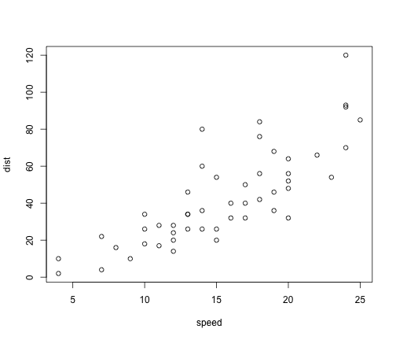

Summary Week 10
========================================================
Most studies correlating the native to exotic species richness have found negative and positive correlations at small and large scales, respectively.  Researchers have proposed that at smaller scales native species competitively exclude exotic species.  Conversely, at larger scales researchers have proposed that environmental effects mask the negative effects of native species richness on exotics, leading to a positive correlation.  

Fridley et al. (2004) proposed that the spatial relationships could not be due to biological interactions between native and exotics.  Instead, the spatial correlation may be due to chance.  As such, they tested two datasets relating native to exotic species against a null distribution, and found that the null distrubution fit both datasets well.  As such, they concluded that native species may have no biological influence on exotic species, and the patterns seen at various spatial scales may be due primarily to stastical artifacts (i.e chance).
<br/>

*Two main objectives*
----------------------
>>1) Use the code published with Fridley et al. (2004) to recreate the null distribution used by Fridley et al.
<br/>
>>2) Test sample dataset of exotic: native species to determine whether the null distribution fits the dataset

<br/>
Objective 1:
--------------

```r
###### Defining all variables

reps <- 100  #Number of replicates for each sample size

samps <- c(5, 10, 20, 50, 100, 800)  #sample sizes, in number of represented individuals

pool.range <- c(20, 100)

NEprop <- c(0.75, 0.15, 0.1)  #proportion of, respectively, natives, exotics, and bare spaces in pool (totals to 1)

tot.pool <- round(runif(reps, pool.range[1], pool.range[2]))  #randomly generate [reps]-length vector of total pool sizes

# make a output matrix to fill all the different simulations (why we have
# a third dimension, so that it does not replace the earlier matrix)

output <- array(0, dim = c(2, length(samps), reps))

# loop to simulate the matrixes

for (j in 1:reps) {
    
    # determine pool composition for replicate
    
    natives <- paste("N", c(1:round(NEprop[1] * tot.pool[j])))  #list of native species
    
    exotics <- paste("E", c(1:round(NEprop[2] * tot.pool[j])))  #list of exotic species
    
    zeros <- paste("Z", c(1:round(NEprop[3] * tot.pool[j])))
    # list of free spaces
    
    allspp <- c(natives, exotics, zeros)
    # list of all species and blanks
    
    # randomly construct simulated community
    
    ind.vec <- floor(rlnorm(length(allspp), 8, 1))
    # create list of abundances for each species, from lognormal abundance
    # distribution
    
    comm <- rep(allspp[1], ind.vec[1])
    # populate first species in pool with its associated abundance
    
    for (i in 2:length(allspp)) {
        # loop over all remaining species
        
        comm <- c(comm, rep(allspp[i], ind.vec[i]))
        # populate remaining species with associated abundances
        
    }  #close loop
    
    for (i in 1:length(samps)) {
        # Loop for different sample sizes
        
        rs <- sample(comm, samps[i])  #draw randomly from community pool of individuals with given sample size
        
        output[1, i, j] <- length(unique(rs[is.element(rs, natives)]))  #total richness of natives in the sample
        
        output[2, i, j] <- length(unique(rs[is.element(rs, exotics)]))  #total richness of exotics in the sample
        
    }
}  #end sample size loop
```


Recreate Figure 1 from Fridley et al. (2004)

```r
par(mfrow = c(2, 3))
# Graph N=800
plot(output[1, 6, ], output[2, 6, ], pch = ".", xlab = "native richness", ylab = "exotic richness", 
    xlim = c(0, max(output[1:2, 6, ])), ylim = c(0, max(output[1:2, 6, ])))

abline(lsfit(output[1, 6, ], output[2, 6, ]))
# least-squares regression line

# Graph N=100
plot(output[1, 5, ], output[2, 5, ], pch = ".", xlab = "native richness", ylab = "exotic richness", 
    xlim = c(0, samps[5]), ylim = c(0, samps[5]))

abline(lsfit(output[1, 5, ], output[2, 5, ]))  #least-squares regression line

abline(samps[5], -1, lty = 4)
# data constraint envelope, based on sample size

# Graph N=50
plot(output[1, 4, ], output[2, 4, ], pch = ".", xlab = "native richness", ylab = "exotic richness", 
    xlim = c(0, samps[4]), ylim = c(0, samps[4]))

abline(lsfit(output[1, 4, ], output[2, 4, ]))
# least-squares regression line

abline(samps[4], -1, lty = 4)
# data constraint envelope, based on sample size

# Graph N=20
plot(jitter(output[1, 3, ]), jitter(output[2, 3, ]), pch = ".", xlab = "native richness", 
    ylab = "exotic richness", xlim = c(0, samps[3]), ylim = c(0, samps[3]))

abline(lsfit(output[1, 3, ], output[2, 3, ]))
# least-squares regression line

abline(samps[3], -1, lty = 4)
# data constraint envelope, based on sample size

# Graph N=10
plot(jitter(output[1, 2, ]), jitter(output[2, 2, ]), pch = ".", xlab = "native richness", 
    ylab = "exotic richness", xlim = c(0, samps[2]), ylim = c(0, samps[2]))

abline(lsfit(output[1, 2, ], output[2, 2, ]))
# least-squares regression line

abline(samps[2], -1, lty = 4)
# data constraint envelope, based on sample size

# Graph N=5
plot(jitter(output[1, 1, ]), jitter(output[2, 1, ]), pch = ".", xlab = "native richness", 
    ylab = "exotic richness", xlim = c(0, samps[1]), ylim = c(0, samps[1]))

abline(lsfit(output[1, 1, ], output[2, 1, ]))
# least-squares regression line and have a data constraint envelope, based
# on sample size
abline(samps[1], -1, lty = 4)
```

 

<br/>
Objective 2:
-------------

```r
require(RCurl)
```

```
## Loading required package: RCurl
```

```
## Warning: package 'RCurl' was built under R version 2.15.2
```

```
## Loading required package: bitops
```

```r

options(RCurlOptions = list(cainfo = system.file("CurlSSL", "cacert.pem", package = "RCurl")))

url <- getURL("https://raw.githubusercontent.com/PermuteSeminar/PermuteSeminar-2014/master/Week-10/speciescounts.csv")

species <- read.csv(text = url, header = T)

library(reshape)
```

```
## Loading required package: plyr
## 
## Attaching package: 'reshape'
## 
## The following object(s) are masked from 'package:plyr':
## 
##     rename, round_any
```

First, sum up invasive and native species to get totals, but need to make sure species are not double counted. 

```r
sites <- aggregate(Count ~ Site + Origin + Species, data = species, FUN = "sum")

sites$Count <- factor(sites$Count)

sites$count = 1

sites.new <- aggregate(count ~ Site + Origin, data = sites, FUN = "sum")
# does not have zeros for when invasive/natives are absent

colnames(sites.new) <- c("Site", "Origin", "value")

site.sp.quad <- cast(sites.new, Origin ~ Site)

site.sp.quad[is.na(site.sp.quad)] <- 0

column.quad <- melt(site.sp.quad, id = c("Site", "Origin"))
```

Correlate the number of exotics and natives to see how their abundances compare.

```r
# first need to pull the natives and invasives into two columnes
natives <- subset(column.quad, column.quad$Origin %in% c("N"))

natives$Origin <- factor(natives$Origin)

invasives <- subset(column.quad, column.quad$Origin %in% c("I"))

invasives$Origin <- factor(invasives$Origin)

# now bind the two
data.graph <- cbind(natives[, c(2, 3)], invasives$value)

# graph invasives against natives
plot(invasives$value ~ value, data = data.graph, ylab = "Invasive Species Richness", 
    xlab = "Native Species Richness")

data.lm <- lm(invasives$value ~ value, data = data.graph)

abline(data.lm)
```

 

When visually looking at the scatterplot, and the line of best fit from the linear model, does not look as if there is a strong positive relationship between native and invasive abundances.

```r
lm.r <- summary(data.lm)

r.square.O <- sqrt(lm.r$r.squared)
print(r.square.O)
```

```
## [1] 0.307
```

```r
s.O <- lm.r$coefficients[2]
print(s.O)
```

```
## [1] 0.1008
```

The R squared value is 0.1008 (not a good fit at all); maybe another function will have a better fit.  Further exploration could involve using a different model and comparing the new test statistic to a null distribution.  Yet, since we are mimicking Fridley et al. (2004), we will still use the null distribution of the correlation coefficient and s statistics.

To this, we will use permutation:
>>1)need to have the full species pool
<br/>
>>2)randomly assign native or invasive to each species, keeping the total number of species in overall pool + species richness for each quadrate constant (randomly shuffling the N/I labels)
<br/>
>>3) calculate the r and s statistics
<br/>
>>4) repeat 499 times to create a null distribution, and compare the r and s values from the data to find p value.

```r
require(RCurl)

options(RCurlOptions = list(cainfo = system.file("CurlSSL", "cacert.pem", package = "RCurl")))

url <- getURL("https://raw.githubusercontent.com/PermuteSeminar/PermuteSeminar-2014/master/Week-10/speciescounts.csv")

species <- read.csv(text = url, header = T)

# create two matrices for r and s statistics
matrix.r <- matrix(0, nrow = 500, ncol = 1)

matrix.s <- matrix(0, nrow = 500, ncol = 1)

# use loop for 500 permutations
for (i in 1:500) {
    new.data.Origin <- sample(species$Origin, size = length(species$Origin), 
        replace = F)
    
    species$Origin <- new.data.Origin
    
    # redo all the data manipulation listed earlier for the original dataset
    sites <- aggregate(Count ~ Site + Origin + Species, data = species, FUN = "sum")
    
    sites$Count <- factor(sites$Count)
    
    sites$count = 1
    
    sites.new <- aggregate(count ~ Site + Origin, data = sites, FUN = "sum")
    
    colnames(sites.new) <- c("Site", "Origin", "value")
    
    site.sp.quad <- cast(sites.new, Origin ~ Site)
    
    site.sp.quad[is.na(site.sp.quad)] <- 0
    
    column.quad <- melt(site.sp.quad, id = c("Site", "Origin"))
    
    natives <- subset(column.quad, column.quad$Origin %in% c("N"))
    
    natives$Origin <- factor(natives$Origin)
    
    invasives <- subset(column.quad, column.quad$Origin %in% c("I"))
    
    invasives$Origin <- factor(invasives$Origin)
    
    data.graph <- cbind(natives[, c(2, 3)], invasives$value)
    
    data.lm <- lm(invasives$value ~ value, data = data.graph)
    
    lm.r <- summary(data.lm)
    
    r.square <- sqrt(lm.r$r.squared)
    
    s <- lm.r$coefficients[2]
    
    matrix.r[i, ] <- r.square
    
    matrix.s[i, ] <- s
}
```

Now will compare the r and s statistics from the original dataset against the permutated distribution of r and s 

```r
# to get the original dataset values, the r and s values code is re-run
# from the original dataset (since r and s object names were used later)


hist(matrix.r, ylab = "Frequency", xlab = "R values", main = "")
abline(v = r.square.O, col = "blue", lwd = 5)  #value of the r.square from dataset
```

 

```r
p.value.r <- length(subset(matrix.r, matrix.r[, 1] <= r.square))/length(matrix.r)
print(p.value.r)
```

```
## [1] 0.018
```

```r

hist(matrix.s, ylab = "Frequency", xlab = "S values", main = "")
abline(v = s.O, col = "blue", lwd = 5)
```

 

```r
p.value.s <- length(subset(matrix.s, matrix.s[, 1] <= s))/length(matrix.s)
print(p.value.s)
```

```
## [1] 0.036
```

<br/>
Conclusions: 
-------------
Based on the dataset given in class, the correlation coefficient and slope were not significantly different from the null distribution.  This matches the findings from Fridley et al. (2004), where the r statistic and slope for a 1 $m^{2}$ and 0.1 $m^{2}$ scale was not significantly different from the null distribution, but not the slope (Table 1; Fridley et al., 2004).
<br/>
Readings:
-----------------
Fridley, J. D., R. L. Brown, and J. F. Bruno. 2004. Null models of exotic invasion and scale-dependent patterns of native and exotic species richness. Ecology 85:3215–3222.


  


