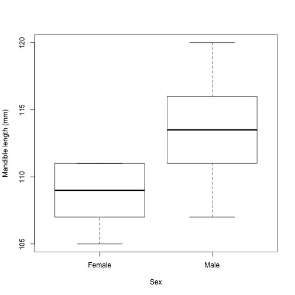

Week 5: Randomization
========================================================

Randomization is a method for formulating and testing a null hypothesis of "randomness" given a particular set of data.  In this conception, our alternative hypothesis (i.e., that there *is* some effect, difference, correlation, etc.) corresponds to a certain level of organization or structure in our data.  If this is the case, then shuffling the order of our measurements (randomizing) will destroy that structure and change the value of our test statistic.  If, on the other hand, the null hypothesis is true, and ther is *not* any structure, then reshuffling the data won't produce much change in the chosen test statistic.

A randomization test simply reshuffles the data and calculates the test statistic many times, counting what proportion of test statistics are at least as extreme as the one calculated from the original data.  The shuffling may be a simple reordering, or it may attempt to preserve certain features of the original data or the process that generated it.  One example mentioned in class was phylogenetic trees: if you just shuffle the order of species, OF COURSE you're going to get a significant result, since the process that created the species (evolution) is branching and autocorrelated.  To get meaningful significance levels, you would need to come up with a randomization scheme that preserves some of these characteristics.

Design of a randomization scheme for taxonomic relationships under the assumption of Intelligent Design is left as an exercise for the reader.


Jackal jaws
-------------
To show the idea of randomization in action, the following is a re-created example of the jackal jaws from the reading.

```r
jackals <- data.frame(mandible = c(120, 107, 110, 116, 114, 111, 113, 117, 114, 
    112, 110, 111, 107, 108, 110, 105, 107, 106, 111, 111), sex = rep(c("Male", 
    "Female"), each = 10))
boxplot(mandible ~ sex, jackals, xlab = "Sex", ylab = "Mandible length (mm)")
```

 

So it definitely appears like males have larger mandibles.  But how sure are we?  For a standard statistical test of the difference in means, we can just use R's `lm()` function (this is equivalent to doing a two-sample T-test, and gives us the same p-value).

```r
mod <- lm(mandible ~ sex, jackals)
summary(mod)
```

```
## 
## Call:
## lm(formula = mandible ~ sex, data = jackals)
## 
## Residuals:
##    Min     1Q Median     3Q    Max 
##   -6.4   -1.8    0.1    2.4    6.6 
## 
## Coefficients:
##             Estimate Std. Error t value Pr(>|t|)    
## (Intercept)  108.600      0.974  111.49   <2e-16 ***
## sexMale        4.800      1.378    3.48   0.0026 ** 
## ---
## Signif. codes:  0 '***' 0.001 '**' 0.01 '*' 0.05 '.' 0.1 ' ' 1 
## 
## Residual standard error: 3.08 on 18 degrees of freedom
## Multiple R-squared: 0.403,	Adjusted R-squared: 0.37 
## F-statistic: 12.1 on 1 and 18 DF,  p-value: 0.00265
```

```r
difference.observed <- mod$coefficients[["sexMale"]]
print(difference.observed)
```

```
## [1] 4.8
```

Looking at the results from this model, we can see that the male mandibles are
an average of 4.8 mm longer than the females,' and that we can be pretty confident this difference is real, given the small p-value (0.0026).

Now, we need to compare the observed mean effect statistic to a the distribution of mean effects from randomized samples. 
<br/>
>>First, we define a function to do the randomization: it takes a vector of data values from two groups (`x`) and an integer `k`, which says how many of the items in `x` belong to each factor/category (in our case, this will always be 10, the number of males).  The fuction shuffles the vector and assigns the first `k` values to group 1, then returns the difference beween the mean of the randomized "group 1" and "group 2."


```r
randomized.difference <- function(x, k) {
    n <- length(x)
    x.random <- sample(x, n, replace = FALSE)
    return(mean(x.random[1:k]) - mean(x.random[(k + 1):n]))
}
```


We repeat this randomizing and recalcuate the test statistic (in this case the mean effect between gender) each iteration. There are 4029 shuffles because we wanted to land on a weird number (the sum of all the divisor is greater than the number, and no subset of divisors equal the number).

```r
set.seed(70)
n.shuffles <- 4029
n.males <- sum(jackals$sex == "Male")
differences <- rep(0, n.shuffles)
for (i in 1:n.shuffles) {
    differences[i] <- randomized.difference(jackals$mandible, n.males)
}
differences  #the randomized mean effect values
```

```
##    [1] -1.2 -0.4 -0.8 -1.8  2.4  1.0 -1.8 -2.4  0.0 -1.0  0.8 -0.6  1.4
##   [14]  0.0  1.8  0.6  4.0 -0.4  0.4  2.2 -0.4  1.4  0.0 -1.8  0.0  1.4
##   [27] -1.4  3.2 -4.2  0.2 -0.6 -3.4  0.4 -1.0  0.8 -0.4 -0.6  0.6 -2.0
##   [40]  0.6  2.6 -0.2  1.2  0.8  0.6  0.6  0.6 -1.6 -0.8 -0.4  0.8  1.2
##   [53]  0.8 -0.4 -2.2 -1.6 -1.0 -0.4  1.0  0.8 -0.6  0.4 -1.4 -0.4  3.0
##   [66] -0.4 -2.2 -1.4 -1.4  3.4  1.6  2.0 -1.0 -0.4 -0.8 -3.2  0.2 -1.6
##   [79]  0.8 -3.2  2.0 -0.8  1.0 -3.2  2.0 -4.0 -0.6 -1.0 -2.8 -0.8 -2.8
##   [92]  4.2  0.0  0.4  0.2  3.2 -0.6  1.0 -1.2  1.0 -1.0 -0.4 -1.8 -0.4
##  [105] -1.0  1.6  0.4 -0.4 -1.8  1.4  2.8 -0.4  0.2  0.8 -0.2  3.0  3.2
##  [118] -0.2 -0.8  0.6  2.6  2.4 -2.2 -2.0  3.2  2.4 -0.2  1.6 -1.2  0.6
##  [131] -1.2  0.2 -0.4 -1.4  1.0  1.2  1.2  1.2  2.0  0.6  1.0  1.4  0.8
##  [144] -2.4 -1.2 -0.4 -1.2  2.8  1.4 -1.0 -0.6 -1.6  1.4 -0.6 -0.2  0.0
##  [157]  1.4  0.6 -0.2 -1.4 -0.4  3.4  1.8  0.6  0.8  2.0 -0.2 -0.4 -0.4
##  [170] -2.8 -3.0 -3.0  1.4 -1.2  1.4  2.4 -1.4 -0.2  0.4  0.0 -3.2 -2.0
##  [183]  1.0 -2.2  2.4 -2.4  2.8 -2.0  0.4 -0.6  1.2  0.2  0.2  1.6 -1.2
##  [196]  0.6  1.0  3.8  0.4  1.2  0.0 -3.4  1.4  1.0  0.2  0.4 -4.4  2.0
##  [209] -3.2  0.4  0.8  0.4 -4.0  0.0 -0.4 -0.8  2.6  1.4 -2.2  0.2  1.0
##  [222] -2.2  2.0 -0.8  0.0 -0.4  0.0 -1.4 -3.4  2.6  2.0  1.2 -0.2  2.6
##  [235]  0.6  1.4  1.8  1.4  2.6 -2.0  4.4  0.8  0.2  0.0  1.6 -1.2  2.8
##  [248] -3.0 -2.8 -1.0  0.8  0.0 -2.2  2.4  0.0  0.0  1.6 -1.6 -1.6 -4.4
##  [261] -0.6 -3.0  0.0  0.8  1.4  0.8 -0.8  0.0 -0.8  3.0 -0.4 -1.2  0.4
##  [274]  0.6  0.4  0.8 -0.4  1.0  1.8  0.2 -0.8  3.2  1.6 -0.2 -1.8 -1.2
##  [287]  1.2 -0.6  0.8 -0.8  0.8  0.0  1.2 -1.0  4.0  2.4  0.2  0.2  2.8
##  [300]  2.2  0.4 -0.2 -2.0 -0.4  1.4  0.4 -0.4 -1.0  0.2 -1.0  0.8  0.2
##  [313] -0.6 -1.6 -0.8  1.0 -1.4  1.2 -0.4  0.6  0.6 -1.4 -0.6  0.6 -0.4
##  [326]  0.0 -0.2 -2.4  0.6 -1.4 -1.6 -2.8  0.6 -1.0  2.6 -4.4  1.6 -1.2
##  [339]  2.2 -0.4  1.6  0.6 -0.4  1.0 -1.0 -3.4  0.8  2.0  1.4  0.0 -3.0
##  [352]  2.8  2.0 -0.4 -0.6  1.2  0.0  2.6  1.8  1.2  2.8 -1.0  2.8 -0.6
##  [365] -1.6 -2.4 -0.6 -0.2 -2.0  1.6  0.4 -0.4 -0.4 -1.6  0.8  1.0  3.6
##  [378]  0.4 -2.0 -1.6 -0.8 -1.8  1.2  0.4 -1.6  1.2  1.8 -1.2 -1.8  0.2
##  [391] -2.2 -1.4 -0.2  0.0  3.6 -0.6 -0.2 -1.2 -0.2  0.2 -1.2  0.2  2.8
##  [404] -3.8  0.0  3.0  0.4 -0.4 -1.2  0.6 -0.6  0.4 -1.8  1.2  3.0 -1.8
##  [417]  1.0 -3.0  1.2  4.4 -0.4 -1.0 -1.4 -3.0  1.4 -1.6 -1.2 -1.0 -1.2
##  [430] -1.8  1.8 -1.6 -0.8 -0.2  2.0  0.8 -1.4  1.6  2.2  1.2  4.4  1.8
##  [443]  1.2  0.2 -1.0 -2.6 -0.6  1.6  2.0  1.4  2.6 -0.6  0.0 -1.2  1.2
##  [456]  2.2  0.2 -0.4 -1.0  0.0  2.2  0.6  0.0 -1.8  1.2  3.0 -3.4  3.0
##  [469]  0.6 -2.0  1.0 -0.4  0.0  2.2  1.0 -1.4  2.8 -2.8 -0.2  1.6  0.4
##  [482] -0.4 -0.4  2.2  1.0  2.0 -2.8  0.2  1.4 -0.6  0.4  1.4 -2.8  0.4
##  [495]  0.2  2.4 -1.4  1.4  1.2  0.0  2.0  0.0  0.6 -1.8  0.8  0.8 -1.2
##  [508]  1.2  0.2  0.4 -1.6 -3.6  2.8 -1.4 -1.6 -2.0 -2.4  1.4 -2.8  0.6
##  [521]  2.0  0.8 -0.8 -1.2 -1.0  1.4  0.6 -0.2  2.8  0.4  0.4 -1.2 -3.4
##  [534] -2.2  0.2 -0.8  1.0 -0.8  2.0  4.0 -1.8 -1.4  1.4 -1.4 -1.4  0.8
##  [547] -1.6  1.2 -0.2  4.2  2.8 -1.0  3.6 -1.0 -3.6 -1.2 -3.0  1.0  1.2
##  [560] -0.2 -1.4  2.2 -0.6  0.2  1.6 -1.2  1.4  0.6 -0.6 -1.0  3.4  1.6
##  [573] -2.6  1.6  2.2  2.2  0.4 -1.4 -0.6  0.0  0.0 -1.8 -1.6  0.4  1.0
##  [586]  1.8 -0.2  1.8  0.4 -1.6  0.8  0.6  0.0  2.2  1.8 -2.0 -1.2  1.2
##  [599]  1.0  0.4  4.0  1.6 -0.2 -0.4 -1.8 -4.2 -1.4 -1.4 -1.0  0.6  0.8
##  [612]  0.8 -1.6 -1.2 -1.2  0.6 -0.6  3.8  1.2  1.6  1.2 -1.0 -1.0  2.8
##  [625]  0.0 -1.6  1.0  1.8 -2.2 -1.4 -4.2 -0.2  1.8 -2.2 -3.0  1.6  2.8
##  [638]  3.4  2.0  3.6  2.4  2.0  2.4  0.8  1.8 -0.6  1.2  3.6  0.2  1.8
##  [651]  1.2  1.8 -0.4  1.4  1.6 -1.6  2.6  1.4 -1.8 -1.0  1.4 -2.2  0.6
##  [664] -1.4  0.0 -1.8  2.2  0.4 -3.6 -0.8 -0.6  2.4 -2.0  0.0 -1.0  0.0
##  [677] -1.6  0.2 -4.6  0.4 -0.8 -2.4  0.0  0.8 -0.2  1.6 -2.4  1.0 -0.8
##  [690]  1.2 -0.6  0.8  2.4  2.2 -1.8 -1.6  0.2  0.8 -0.6  1.6  0.0 -2.2
##  [703]  0.8 -0.8 -0.2 -1.8  0.6  0.2 -1.2 -1.2 -4.0 -1.2 -1.4 -0.2 -1.8
##  [716]  1.2  0.4 -0.4  3.0 -1.8 -0.6 -0.4 -0.8  0.2  1.0 -1.0  1.4  1.2
##  [729]  1.2 -1.0 -0.4  3.0  2.4  2.0  1.0 -3.0  3.2 -0.4 -1.0  0.6  0.2
##  [742] -2.6 -3.8  2.0  3.8  0.6 -0.8 -0.2 -2.0 -1.8  2.0 -1.6  2.0  2.6
##  [755]  2.0 -0.4  1.0  1.8  0.8 -1.6 -1.0  0.6 -0.2 -0.2 -1.2  1.4 -0.6
##  [768]  2.0  3.2  0.0 -0.6 -0.2 -1.0  2.0  1.4 -1.8 -1.4 -2.6 -1.2  2.8
##  [781]  2.2 -1.4 -0.6  1.4  0.0 -3.8  0.0 -2.4 -0.4  0.2 -0.2 -1.6 -1.4
##  [794]  0.8 -2.4 -1.0  0.6 -1.2 -0.2 -3.4 -3.8  0.2 -0.6  0.4  3.8  0.0
##  [807]  2.0  2.2  0.2 -0.6 -0.2  0.6  0.0  2.2  2.4  0.6 -3.6  0.4  0.2
##  [820]  0.0 -0.2  0.8 -0.8  3.0  2.6  2.2  2.2 -2.8  1.0 -0.4  1.6  1.8
##  [833] -0.6  1.0  1.8 -1.6  1.4 -3.6 -1.8  0.8  4.0  1.4  0.4  0.0  2.6
##  [846] -0.8  2.2  0.6 -1.8 -2.8  1.0  0.6 -0.4 -2.6  1.8 -2.2 -0.4  2.0
##  [859] -0.8  3.2 -1.4 -3.6  0.0  0.6  2.0 -2.4 -1.2 -1.4  0.0 -0.4  0.0
##  [872] -1.4  1.6 -0.4  1.0  4.6  2.2 -0.6  1.4 -0.8 -1.2  0.2  0.0  0.4
##  [885] -1.2 -0.8  1.8 -4.0 -1.6 -1.0  1.4 -1.4  0.4  0.2  0.6  1.4  4.0
##  [898]  0.4 -1.6 -1.0  0.0 -2.2  2.2 -1.0  0.0 -1.6  0.2  0.6 -1.8  0.6
##  [911]  3.4 -2.2  0.6  0.2  2.0 -3.6 -2.2 -0.4  1.2  2.2  0.6 -0.6 -1.0
##  [924] -0.2  0.8  3.8  0.4  1.0 -0.2  0.8  0.2  4.8  0.8  0.6  2.4  0.4
##  [937]  2.4  0.0 -0.6 -1.4  0.2 -0.2  1.0  0.8  0.0 -1.0 -2.8 -3.8  1.2
##  [950] -3.0 -1.0 -1.6  1.4  2.2  3.6 -2.8 -0.6  0.0  1.8 -0.2  2.6  0.6
##  [963]  2.2  1.4 -1.2  1.8 -1.0  1.8 -1.0  2.2 -3.0  3.0 -1.2  0.4 -2.8
##  [976] -2.0  1.2 -2.8  1.4 -0.8  3.8  0.2 -0.4  1.0  2.2 -3.8  3.4  2.8
##  [989] -1.8 -0.2 -0.2 -1.8  0.0  1.2 -0.8 -1.2  1.2  0.6  2.0 -0.6  2.4
## [1002]  1.8  0.6 -2.2 -1.0 -3.4 -1.6  0.2 -0.2  0.4  0.8  0.8  3.2 -1.6
## [1015]  0.6  2.6 -1.4 -1.0  1.2 -0.6  1.8  3.2  0.4  2.0 -3.4  1.0 -1.8
## [1028]  0.2  0.2  1.0  2.0  1.4  2.0  0.4  3.8  0.0  1.6  0.8 -2.0  2.2
## [1041] -3.0  1.0  3.6 -3.0  1.0 -0.6  0.0  1.6  2.8  2.0  2.6 -4.0 -0.2
## [1054] -2.2 -1.4  0.8  2.2  4.4 -1.4 -3.0 -1.6  0.0 -1.8  3.2  0.6  2.8
## [1067] -1.8  2.0 -1.8 -0.2  0.8  0.2 -2.4  0.6  4.0 -0.8 -0.6 -0.4  0.0
## [1080] -0.4 -1.0 -0.4  0.2  2.4 -1.4 -0.8  0.8 -2.6 -1.0 -1.2  2.8 -0.6
## [1093] -2.8 -0.6  0.4  4.4  2.0 -1.2 -2.2  1.4  0.4 -0.2  2.8  0.2  1.6
## [1106] -3.6  4.4  0.0  0.0  1.4 -1.6 -0.8 -2.6 -0.2  1.0  2.2  2.2  1.0
## [1119] -0.6 -1.2 -5.0  2.0 -0.6  3.4  0.8 -0.8 -1.6 -0.8  0.6 -1.8  0.2
## [1132]  1.2 -3.0 -4.4  2.8 -1.0  1.8  2.0  0.0 -1.4  0.0  1.8 -0.6  0.0
## [1145]  0.6  0.2 -1.2  0.2  0.4  0.2  0.4  1.8 -1.4 -3.4 -1.0 -0.8 -0.6
## [1158] -0.8  1.6 -0.4  1.6  1.2  2.2  0.4  0.0  1.8  0.4 -0.6 -1.4 -2.0
## [1171]  1.6 -0.2 -0.4 -1.4 -0.2 -2.2 -0.6  0.2 -2.2  3.8 -1.0  0.8  1.4
## [1184]  1.0  1.0  0.6  0.0 -1.4  0.4  0.0 -0.8 -2.6 -0.4 -2.0 -1.8  0.6
## [1197]  0.0 -0.4  1.8  2.6  0.2  1.0  2.2  0.6 -0.6  0.8  0.8  0.4 -2.4
## [1210] -2.8 -0.6  2.2  2.6 -0.6  0.8  0.8  1.2 -0.2  1.8 -2.4 -1.4 -3.2
## [1223] -1.0  0.2  0.4 -1.0 -0.6  0.6  2.2  2.8  2.6 -2.0  0.0 -2.4 -2.6
## [1236]  2.2 -4.2 -0.2 -1.2  0.4 -0.6  1.0  0.2  0.4 -3.6 -1.4 -2.0 -2.6
## [1249]  2.8  0.2  0.0  1.0  1.8 -0.8  0.8 -3.4  2.6  0.2  1.8  2.6  1.8
## [1262] -3.0 -0.8 -1.2 -0.2 -1.0  1.6 -3.2 -1.8 -0.2  0.2  1.4  2.4 -3.8
## [1275]  0.2  0.0 -1.4  1.8  1.2 -2.6  0.4 -3.6 -0.4  0.8  0.4  3.2 -2.4
## [1288] -2.8 -1.0  0.8  0.8 -1.0 -3.4 -2.0 -0.8 -0.8  1.4  0.6 -0.6  1.0
## [1301]  1.0  1.2 -4.6 -1.2 -2.6  1.2  2.4 -2.2  2.2 -0.6  0.2 -2.4  1.0
## [1314] -1.2  1.4  2.8  2.0 -1.0  3.4 -1.8 -1.4 -3.6  2.0 -1.0  1.4  1.2
## [1327]  1.4 -0.2 -1.6  0.2 -0.6  0.0  2.2  1.6  0.6  1.2  1.0  0.2  3.6
## [1340]  0.0  1.8  0.8  1.6 -1.6 -1.6  2.0  2.0  1.8  0.0 -1.8  1.2  0.6
## [1353] -2.0 -3.0  2.8  2.6 -0.4  2.0  4.8  2.4 -1.6 -1.4 -0.2 -0.2  1.6
## [1366]  0.2 -1.2 -1.0 -1.6  1.8 -0.6  0.0  0.4  3.0 -2.8 -0.4 -0.6  1.6
## [1379] -1.6  1.6 -3.0 -1.6 -1.6 -0.4 -2.2  0.2  0.2 -0.6  0.0  1.0 -0.8
## [1392] -4.0 -0.6 -1.8 -1.6 -1.0 -2.4  1.4 -0.6 -1.4 -1.0 -2.0 -1.4  0.0
## [1405] -0.6 -2.2  0.4 -1.8 -0.8 -1.6 -1.2 -4.4 -0.2 -1.6  1.6  1.6 -1.2
## [1418]  1.0 -2.0 -1.4  1.0  0.0 -1.0  1.6 -0.2 -1.6  2.4 -2.4  2.8  1.2
## [1431] -1.0 -0.8 -1.2 -3.6 -0.6  1.0 -0.2 -0.8  1.0 -0.2  1.8 -1.6  0.6
## [1444]  0.0  1.6 -3.8  0.4  0.6  1.2  0.6 -0.6  2.4  0.8 -1.4  1.2 -1.4
## [1457] -2.2 -1.6 -0.6 -1.0  2.8 -1.2  0.2  1.6 -4.4 -0.6 -1.8 -1.2  1.2
## [1470]  0.2  0.4  0.4  1.0 -0.2  0.4  2.8  0.6 -2.2  1.0  1.0  1.4 -1.4
## [1483]  2.4 -2.4 -2.2  1.0  2.4  1.0  1.2 -2.6 -0.8  1.0 -2.6  1.4 -2.0
## [1496]  2.4  0.0  0.2  0.4  0.8 -3.0  0.0  1.4 -0.6 -0.6 -1.0  0.2 -1.0
## [1509] -0.6  0.2 -1.2 -2.8 -1.8  2.2 -1.0 -0.6 -0.2 -1.4  1.2 -1.0 -2.6
## [1522]  0.8  2.6 -1.8 -1.0 -1.6  0.0  0.6 -0.8 -0.6  1.2  0.0  2.4  1.0
## [1535] -0.2  2.6 -2.4  0.8  3.4 -1.4  2.0  0.4 -2.6 -2.8 -3.0 -1.2  1.6
## [1548] -1.8  0.4 -0.6  0.8  0.4  0.8 -0.4  2.4  0.8  1.8 -2.6  1.6 -0.4
## [1561] -2.0 -0.4  3.0  1.8  0.8  0.6 -1.0  2.6 -2.6 -2.4 -1.4  2.8  2.4
## [1574] -0.6  3.0  0.4  3.4  0.4 -0.4 -2.4  0.4  0.2  1.4  0.8 -1.0  0.2
## [1587]  0.8  3.8  1.4  0.2 -0.8 -2.6  0.6  2.4 -1.0 -2.6  3.8 -0.6 -2.6
## [1600] -1.4 -1.4  0.6  3.4 -1.8 -2.2  0.8 -0.8 -0.2 -1.2 -3.6 -0.6  0.2
## [1613] -1.6  1.0  0.0 -2.4 -0.6  2.6  0.6 -0.4  2.0  2.4 -1.6  0.0 -1.8
## [1626] -1.8  0.8 -0.4 -1.0  2.6 -1.0  0.6 -0.4  0.8 -3.0  1.2 -1.6  2.8
## [1639]  0.8  1.6  2.6 -0.2 -1.4  3.2 -1.4  0.0  0.6  1.4  4.4  2.8  1.6
## [1652] -2.2  3.4  1.4  0.8 -3.8 -1.8  2.6 -1.0  3.0 -0.2  1.2  2.4 -2.2
## [1665] -0.4  0.8 -1.8  0.8 -0.6 -1.6  0.2 -1.8 -0.2  0.0  0.2 -2.4 -0.4
## [1678] -0.8 -1.2 -0.4  2.2  2.0 -0.2 -1.0 -2.8  1.2 -1.4  3.2 -3.2  1.8
## [1691] -1.4 -3.6  2.6  2.6 -0.8  0.6 -0.6  2.2  0.0 -0.2 -0.6  0.0  0.8
## [1704] -0.2 -1.2  0.8 -2.8 -0.2 -0.8  0.8 -1.2  0.6  1.4 -0.8 -3.6  1.0
## [1717]  0.2  0.6 -2.8 -1.0  3.2  1.6 -2.2  1.6  1.8 -0.2 -2.4  0.8  1.8
## [1730] -1.4  3.8  0.4 -1.6  2.8 -0.6 -2.0 -1.8  1.6 -0.4  0.0  0.2 -0.2
## [1743] -1.2  0.2 -1.8  2.8 -1.2  0.4 -0.4  3.4  0.8  0.8  3.8  1.6  0.6
## [1756] -2.0 -1.0  0.8 -1.8 -4.0  1.4 -3.6  0.2  3.0 -1.2  1.4 -0.2 -2.2
## [1769] -0.4  1.8  4.2  3.0  0.8  0.2 -0.4  1.0  2.4 -2.2  1.0 -1.0  2.4
## [1782] -0.6 -0.8  0.2  0.0 -0.2 -1.2  2.6  1.8 -2.0  2.6 -1.6  2.2  3.2
## [1795]  0.2  2.2 -2.2  1.8  0.2  1.4  0.2  0.8 -0.2 -0.4  1.6 -2.0 -2.0
## [1808]  1.8 -0.2 -1.4  0.6 -1.4 -2.0 -2.0 -1.8  0.2  0.0  0.4  1.2 -2.0
## [1821]  0.0 -2.0  0.6 -1.0 -1.4 -0.8  2.0 -2.4  0.2 -1.0  4.4 -0.2 -1.4
## [1834] -0.4  0.2  1.8 -1.2  2.2  0.6 -1.8  2.4 -3.4  2.2  0.4 -2.2 -0.2
## [1847] -1.0  1.0 -1.4  2.4  2.4  0.2 -2.4 -0.4  0.4  1.2 -1.0 -0.2  0.0
## [1860]  0.2 -2.2  1.0 -1.8  1.4 -0.6 -0.4 -2.6  3.2  0.4  1.6 -0.2  3.4
## [1873]  0.4 -0.2  1.0 -1.0 -0.4  1.8 -1.8  3.0  0.0 -0.8  0.4 -1.4  0.2
## [1886]  2.8 -1.8 -1.2 -2.4  2.0  2.4  1.0  0.4 -0.2  0.2 -0.4 -0.6  1.2
## [1899] -0.4  1.0 -0.6 -2.2 -3.2 -0.6  2.8 -1.0  4.4  1.6 -0.2  2.8  1.0
## [1912]  1.2 -0.2  1.2  1.0 -2.4  0.0  0.8 -0.4 -0.6  0.6 -0.2 -1.4  0.8
## [1925] -4.2  1.2 -0.8  0.0 -3.0 -0.4  2.4  1.8 -1.6  1.6 -1.0  0.2  2.4
## [1938]  1.4  3.8  0.0  2.6 -3.0  0.0  1.0  1.8  1.6  1.0  1.2 -3.4 -0.4
## [1951]  0.0  1.8  0.2 -2.4  3.0  1.0 -0.6  0.2 -0.8 -2.2 -0.4  1.0 -0.6
## [1964]  0.0  2.4 -0.4  2.4 -3.0 -1.6  1.8 -0.6  2.2 -2.4 -2.6 -1.2 -0.2
## [1977]  0.0  0.0 -2.2 -1.0 -1.0  0.6  1.6  1.0  3.4  1.2 -1.8  0.8  3.2
## [1990]  1.4  1.0 -2.8 -1.0  0.8 -3.0  1.2 -0.8 -1.0 -2.2 -2.4 -2.4  0.0
## [2003] -0.8 -1.0  0.2  1.8  2.2  2.6 -0.8 -0.2  0.2 -0.6 -0.8  2.6  0.6
## [2016]  2.0  0.0  1.0 -3.2  1.6  1.6  2.2 -1.0 -1.8  1.8  1.4  2.4 -3.4
## [2029] -1.8  0.8 -0.6  0.8  0.2  0.0  1.0 -1.2  0.4 -2.6 -0.6 -0.2  1.8
## [2042] -1.0 -0.2 -3.0  0.2 -3.0 -2.4  0.4 -0.6  1.4 -0.4  1.0 -4.2  0.6
## [2055] -1.4 -0.8 -0.2 -0.2 -1.6 -0.4  0.4  1.2 -0.8 -1.4  2.0 -1.8 -0.2
## [2068] -0.4 -0.2 -2.6  0.2  2.0 -2.2 -2.6 -0.6  1.6 -0.6  0.8  1.0  0.4
## [2081] -1.0  1.0 -0.8 -3.2  1.6 -1.2  0.0 -2.0 -1.4 -0.4  0.8 -0.6 -0.4
## [2094] -0.8  0.8 -0.2 -0.4  2.0  0.4  4.0  2.6  1.6 -0.4  1.0  0.6 -1.2
## [2107] -0.2 -1.8 -1.8  1.2  0.0 -0.8  0.0  0.8  1.8 -1.4  1.2  3.6 -0.2
## [2120] -1.6  3.0 -0.8 -1.2  2.8 -0.6  0.8  1.4 -0.4  1.2  1.4  1.2 -1.2
## [2133] -2.4  1.2  4.2  1.2 -0.2 -2.8 -1.0 -1.2  1.4 -0.8  0.8  1.6  1.2
## [2146]  0.2  0.0 -2.0 -1.8  2.6  2.4  3.2 -2.4 -3.8 -2.8 -0.2 -0.2 -1.4
## [2159]  3.2 -2.4 -1.2  0.4  0.0 -1.0 -1.6  0.2 -1.2 -0.6  1.6  1.0 -0.6
## [2172] -2.8  1.4  1.6  1.4  0.2  0.4 -2.6 -1.2 -1.0  0.8 -0.2  1.0 -1.2
## [2185]  0.2 -2.2  0.0  0.8 -1.0  0.6 -1.4  0.4  1.4  0.8  1.8  1.8  1.8
## [2198] -0.8  2.6  2.6 -4.2 -0.6  1.2  3.0 -1.0  2.0 -2.0  0.6  0.2  0.6
## [2211]  1.2 -0.8  0.0  4.0  0.4  0.2  3.0  1.2 -0.2 -0.2 -1.0  2.6 -2.2
## [2224] -0.4  0.2  1.2  0.0  0.6 -0.6 -2.4 -0.2 -2.0  2.4  0.2  2.0 -0.6
## [2237] -1.2  0.0 -0.6 -4.6 -1.0 -3.6 -1.6 -2.4  1.4  1.0  1.8 -1.4 -0.2
## [2250]  0.2  1.4  3.6 -1.0 -0.6 -2.2 -2.6 -1.6 -1.6  0.0 -0.6  1.4  3.2
## [2263] -0.4 -3.0  1.6  1.2 -1.0  1.0  0.0 -3.0  2.6  0.0 -1.4  1.4 -0.8
## [2276]  0.2  0.2  1.6 -2.2  3.0 -0.4 -1.4 -3.2 -2.4 -3.0  2.8  0.0  2.4
## [2289]  1.8 -2.6 -2.2 -1.4 -1.4 -2.6 -0.8 -2.4 -2.6  1.8  1.6 -0.4 -1.2
## [2302] -2.8  0.6  0.6 -1.6 -1.8  1.6 -3.0 -0.2 -2.4  1.4 -0.4  2.0  2.0
## [2315] -0.4 -1.0  1.2 -1.6 -1.0  0.6  0.4 -1.0 -2.4  2.0  0.2  1.6 -0.6
## [2328]  3.0 -0.6  1.0 -1.4  0.4 -1.2 -1.2  1.4  0.2 -1.2 -1.6  3.0 -0.2
## [2341]  1.4 -1.2 -0.4 -3.4  0.4  2.2 -1.6 -3.2  1.4  0.0  5.0  2.0  0.4
## [2354] -1.2  1.6 -1.2  0.4 -1.2 -0.2 -2.8  1.0  4.4  2.8 -2.8  0.2  1.6
## [2367]  0.6  2.2 -1.4  2.0 -0.6  1.6  2.4  1.2 -1.6 -0.2  1.8  0.2  0.2
## [2380] -3.4  0.6 -2.2  1.4 -2.0 -0.4 -0.2  0.2  1.2  1.4  1.6  1.2 -1.8
## [2393] -2.2  2.0 -2.2  3.2 -1.8 -2.4  0.4  0.4 -0.6 -0.4  1.4  0.4  0.2
## [2406] -2.0  2.4 -3.4  1.8 -0.8  0.6  1.0 -0.2 -0.4 -0.8  0.0  0.0  2.4
## [2419] -1.0  0.0 -2.8 -4.0 -4.8  1.0  1.8 -0.2 -2.2  0.6 -2.2  2.0  3.4
## [2432]  1.6  0.8 -0.4  0.0  0.8 -3.4 -1.4 -1.0 -0.6  0.0 -3.2  2.6 -1.0
## [2445]  0.0  1.6  1.8  0.6  0.8 -1.2  1.2  1.0  1.0  1.6  0.8 -1.0 -0.2
## [2458] -3.0 -0.4  0.4  1.8 -1.6  0.4  2.2  2.6 -0.6 -1.2 -1.4  0.4 -1.0
## [2471] -1.0 -0.8  1.4 -1.4 -0.4 -2.0 -2.6 -0.4 -1.8 -1.6 -1.6  2.0 -3.2
## [2484]  2.6 -3.0  1.2  0.2  0.8  1.8  0.2  3.0 -0.4 -2.8  0.6  1.6  1.2
## [2497]  1.2 -1.2  1.4  0.2 -4.8  1.2  0.0 -1.4 -1.6  0.0 -0.8  2.0 -1.8
## [2510]  1.6 -1.0  1.6 -0.6 -1.4 -1.0  1.6 -1.0  0.2  0.0 -2.2  1.4 -0.6
## [2523]  3.0 -0.8  1.6  0.6  3.0 -3.2  0.2 -2.8  1.4  0.8  1.0  2.0 -4.0
## [2536]  0.6  0.2  0.8  0.0 -1.0  1.2  0.6 -2.4 -3.8 -2.6 -0.8 -1.4  1.0
## [2549]  3.0 -1.2  2.4 -1.2 -2.8  1.8  1.0 -0.4  2.0  0.0 -0.8  1.4  2.2
## [2562]  0.0  3.0 -0.2 -0.2 -1.8 -2.2 -0.6 -0.6  3.4  1.4  0.0 -1.0  1.8
## [2575] -1.2 -1.4  0.8 -2.4 -1.2  1.4 -1.2  0.2 -3.2 -5.0  0.4 -1.4  2.2
## [2588] -3.2 -1.2 -2.6 -3.0  2.0 -1.8  0.6  0.6  2.0 -4.4 -0.8  1.4  2.6
## [2601]  2.6  2.0  1.8  3.2  2.0  0.6  0.0 -1.2  1.8  0.0 -3.2 -1.4 -1.2
## [2614]  2.6  0.4  0.0  0.2  1.0 -2.6 -2.6  1.8  2.0  1.6 -3.4 -1.6 -0.8
## [2627] -2.4 -2.0  1.8  0.4  2.8 -2.6  0.6  0.2 -1.2 -1.8 -0.2 -1.6 -1.4
## [2640]  0.2  0.8 -3.4  0.8 -0.8  2.2 -0.2 -1.0 -0.2  3.6 -0.4  1.6 -2.2
## [2653] -5.8 -1.2 -2.6  2.8  2.2  1.0  0.8 -1.2  0.2  2.6  1.8 -0.8 -1.8
## [2666]  1.6  0.6 -1.2  0.2  3.8  2.4 -2.2  0.6  0.0 -0.6  0.2 -0.8 -3.4
## [2679]  1.4 -0.4 -1.6 -0.6  0.4  1.0  0.2 -0.4 -0.6  2.8  0.2  1.2 -1.2
## [2692] -0.8  2.8  1.2  1.6  1.6  3.0 -2.2  1.2  0.0 -1.2  0.4  3.6  0.4
## [2705]  0.8  0.0  1.6 -0.6 -0.2  0.0 -1.0 -1.2 -4.2  1.4  0.4 -1.6  1.0
## [2718] -1.0  0.8  2.0 -0.8 -3.4  0.8 -2.8  0.6 -2.0  1.0  1.4 -1.6  2.0
## [2731]  2.8  1.0 -0.6 -0.8  3.2 -0.4  1.6  2.0 -0.2  1.6 -0.2 -2.4 -1.0
## [2744]  2.4  3.8  2.0  0.2  1.6 -0.8 -2.8 -2.0 -1.0 -0.6 -2.2  1.6  1.0
## [2757]  1.0  1.8  1.6 -1.2 -1.2 -1.0 -0.4  1.0 -1.6  0.2  1.0  4.0 -1.0
## [2770] -1.8  0.8 -0.4  2.2 -0.2  1.6  0.8  0.6 -0.4  2.2 -1.8  1.8  2.4
## [2783] -0.4  0.0 -1.8  0.0  2.0  1.6 -3.0  2.2 -1.4  2.4  1.0 -0.4  2.2
## [2796]  1.2  1.2 -1.4  1.2 -3.2  0.0  2.0  0.8  1.2  3.2 -0.2 -1.8 -1.0
## [2809] -2.0 -1.6 -2.0 -4.0  0.2 -0.2  2.2  0.0  0.2  0.2 -0.6 -0.8 -1.2
## [2822] -3.6  0.0  1.6 -1.4 -0.2 -0.4  0.6 -0.4  2.2  2.2  2.0 -1.8 -1.4
## [2835] -2.6  0.0 -0.6  3.6  3.4  2.0 -2.4  0.0  0.6  2.2 -0.2 -0.8 -1.2
## [2848] -0.8 -0.6  3.4  0.0  0.6 -1.6 -0.2 -1.0 -0.4 -0.4  0.2 -2.8  2.0
## [2861]  2.2  2.2  2.2  0.8  1.0  1.4 -2.2 -1.2  0.8 -0.8  0.0  0.6 -3.0
## [2874]  1.8 -0.2  0.6  2.8  0.2 -0.2  0.0 -0.2  1.0 -3.6  0.6  0.2  2.2
## [2887]  1.0  1.0 -0.2  0.2  1.6 -2.0  1.0  1.6  2.2  2.8 -1.6 -3.8  3.4
## [2900]  0.8  1.2  0.2  2.6 -1.2 -0.2  0.6 -0.6 -0.8 -2.2 -0.8  0.4  0.4
## [2913]  0.0 -0.4 -0.8  2.2  1.0  1.2 -0.6 -1.0 -3.0 -0.4  1.2  0.4 -2.6
## [2926] -0.2  0.8 -2.8  0.2 -2.6  0.8 -1.6 -0.4  1.6 -0.2  0.6 -0.2  0.2
## [2939]  2.0 -3.2 -3.0 -2.4 -1.6  1.6  0.2 -1.4  0.8 -1.2  3.2  1.6 -1.8
## [2952]  3.4  2.2  1.0 -1.8 -2.4 -0.8  2.4  1.4  2.6 -1.6  0.8 -1.0  0.4
## [2965]  1.4 -1.4  1.6  1.4 -3.4 -2.4  0.8 -2.2 -0.8 -2.2  4.8 -1.0  0.2
## [2978]  0.2 -0.8 -1.8  0.6 -0.6 -0.6  1.8  1.0  2.0  1.4 -0.4 -3.6 -0.2
## [2991]  2.4 -2.2 -0.6  2.0 -2.0  0.8 -1.8 -0.4  4.0  0.0  0.4  1.0  0.2
## [3004]  0.8 -0.4 -2.6  0.0  2.4  0.4  0.4  1.6  1.8  0.6  2.0 -0.4 -1.8
## [3017]  1.6  1.8 -1.2 -1.2  3.6  1.4  2.4  0.0  3.8  0.4  0.4 -0.8  1.4
## [3030] -0.2 -2.4  0.2 -1.0  0.6 -1.2 -1.4  3.4 -0.2 -0.8  0.4  0.0 -1.8
## [3043]  2.0  1.8  1.0 -1.0  2.6 -2.6  3.8 -1.0  0.0 -1.8  0.8 -1.2 -0.6
## [3056] -3.0  2.0 -1.4  0.4 -0.4 -0.4  2.2  0.6 -1.4  1.4  1.6  2.0 -2.2
## [3069]  0.6  0.8 -2.4  2.8  3.0 -1.6 -1.6 -2.8 -2.0  1.6  0.8  0.6  1.0
## [3082] -1.4  0.6  3.6  2.2  2.0 -2.2 -1.6 -0.6 -3.0  1.6 -2.0  0.2 -1.4
## [3095]  0.0  1.4  1.2  0.6  0.6  0.4 -1.8 -0.8  1.6  0.0  1.0  1.6 -3.4
## [3108] -2.8 -0.8 -1.8 -0.8  0.2  1.2  0.8 -1.4 -2.4 -2.8  0.0 -0.4 -2.0
## [3121] -0.8 -1.8 -1.2 -1.4 -0.6  2.4  1.6 -1.2  0.4  2.4 -0.8 -0.6 -1.2
## [3134]  3.0 -1.0  2.6  0.2 -1.0 -0.4  1.0  2.8  1.6  1.8  2.0  0.0 -2.0
## [3147]  1.0  1.6 -1.4 -0.8  2.2  1.2 -1.2 -2.0 -1.2 -2.4 -0.2 -0.4 -3.0
## [3160] -0.6 -0.8  2.4 -4.4 -0.6  1.4  1.2 -1.6 -0.4 -0.8  1.6 -0.6 -3.4
## [3173]  2.4  0.6  0.0  0.4 -1.2  1.6  0.4  2.2  1.4  0.8 -1.6  0.2 -3.8
## [3186] -2.2  0.8  2.4 -0.6 -1.4 -1.0  0.4 -1.4 -1.2  0.2  2.8  2.8 -1.4
## [3199] -3.2 -1.8  1.2 -1.2 -0.2  3.2  1.2 -0.4  3.2  2.4 -2.0  2.4  1.2
## [3212]  0.4  4.2  1.0  0.2  2.0  0.4 -2.6 -1.6 -0.6  1.2 -0.8 -0.8 -1.6
## [3225]  0.8 -0.2 -1.8 -0.6 -1.6  0.0  2.4  0.0  0.8 -0.4 -0.8  2.8  1.6
## [3238] -1.8 -1.4 -3.4  0.8  1.4  2.4  0.6  2.4  0.2 -4.0 -1.6  2.8 -0.4
## [3251]  0.6 -1.0  0.4 -1.4  2.0  2.2  1.8 -1.6 -1.2 -1.0 -2.2  0.4 -1.8
## [3264] -2.0  1.6 -0.8 -1.0 -0.6 -0.8  1.4 -1.0  1.2 -1.8 -3.0 -0.2 -0.4
## [3277]  1.6 -0.8  0.4  2.4  1.4 -2.4  1.4  1.8 -1.0  0.0  1.6 -2.2  3.0
## [3290] -2.6 -2.0 -1.2 -1.4  1.8 -0.6 -2.0 -3.6  0.0 -1.4  0.8 -3.2  2.6
## [3303] -1.4 -2.4 -2.0  0.6  0.0 -2.0  1.0  3.0  0.0 -0.8 -0.4 -2.8 -1.8
## [3316]  0.0  2.0  2.2 -1.4 -1.6  0.0 -0.8  1.2 -0.6  0.6 -0.4 -1.4  0.2
## [3329] -0.4 -0.2 -0.8 -1.4 -0.6  1.0 -2.2  2.4 -1.4  0.8  3.4 -2.0 -3.2
## [3342]  1.2 -2.4  0.8  2.0 -2.2 -1.8 -1.8 -0.6  0.0  0.0 -0.8  0.0  1.6
## [3355] -1.0  3.6  0.4  0.2  3.4 -0.6 -1.0 -1.0 -1.4  0.4  0.2 -2.0 -2.4
## [3368]  1.2 -1.8 -0.6 -1.2 -2.2  0.8 -0.4  1.6 -0.2 -2.8  0.2 -1.0 -3.0
## [3381]  2.2 -0.4 -0.8  1.0 -0.6 -2.4  1.6  0.0  2.0 -0.8 -1.8 -1.8  3.6
## [3394] -1.0  0.6 -1.8  1.6 -1.2 -1.0  0.8  0.2 -1.6  0.6  1.8  0.2 -1.2
## [3407] -1.4 -1.8  0.4  0.2 -1.0 -2.0  2.0 -0.8 -0.2 -1.2 -0.2  0.6  2.4
## [3420]  0.8 -0.2  2.2 -2.2  2.6 -2.8  0.6  0.8  1.8  2.4  0.6 -2.6 -1.2
## [3433] -1.8  0.4  1.6  2.4 -2.4  0.8 -2.0  1.2  0.2 -1.4 -0.4 -0.6 -2.4
## [3446]  0.6  1.0 -1.6  2.6 -2.8 -0.2  0.0  1.2  0.0 -1.4  1.6 -2.0  2.8
## [3459] -1.8 -1.6 -2.2  0.2  0.6  3.0 -1.0 -0.6  0.0  2.0  3.2  2.0  0.2
## [3472] -0.6 -2.0 -3.2 -0.8  1.6 -1.6 -3.0  0.0 -3.4  0.0 -3.6  0.4 -1.2
## [3485]  0.0 -0.2 -0.8  3.2 -0.6  0.8 -1.2 -0.8  0.0 -1.0 -0.4  0.4  2.0
## [3498] -0.4  0.6  1.6  1.4  2.4  2.0  0.0 -3.0 -2.2  0.0 -0.8  3.4 -2.0
## [3511]  2.8  1.0  1.4  0.8  2.4 -1.2  0.6  2.8 -0.4  2.2  0.8  0.4 -1.8
## [3524] -0.2  0.8  2.6 -0.8  1.6 -0.6 -0.2  2.0  2.4  1.6  0.4  1.4 -0.2
## [3537]  2.4  2.4  0.8  0.8  2.2 -2.4  2.8 -1.2 -1.0 -2.4 -3.4  1.4 -2.6
## [3550]  0.0  3.8 -0.2  1.8 -1.8  0.8 -0.2  3.6 -1.2  0.6 -0.6  0.0  0.0
## [3563] -0.8 -3.4 -0.2  0.2  0.6  3.6  0.4  0.2 -1.2  2.0 -0.2 -0.8  0.2
## [3576] -2.0  1.0 -1.6 -1.4 -2.0  0.2 -1.0 -1.8 -2.4 -0.6 -1.2 -0.6 -1.0
## [3589] -1.2 -0.8  0.0  0.2  2.4  2.0  1.6 -0.2  1.0 -2.8 -0.8  3.0  1.2
## [3602]  0.8 -0.4 -0.8 -1.4 -0.2  0.6  1.6  2.8  0.4 -3.8  0.4 -2.2 -0.4
## [3615] -0.6 -0.4 -2.4  3.0 -2.8 -2.6 -0.2  1.8 -2.8  0.2  0.2 -0.8  0.4
## [3628]  0.4  0.4  0.0  2.0 -2.6  2.4  3.2  1.0  0.0 -2.2  0.2 -0.2  0.0
## [3641]  0.2 -0.2 -0.4 -1.0 -1.2  1.2  0.2 -0.4  0.6 -1.8 -3.2 -0.8  1.2
## [3654]  0.2  3.2  1.4  1.4 -3.2  2.0 -2.6  2.0 -1.6  1.2  2.8  0.0 -1.2
## [3667] -1.8 -1.2 -2.2  0.4 -0.2  1.8  0.0 -2.0  2.4 -2.0  0.8  3.8 -0.4
## [3680]  0.0  0.0  0.8  3.0 -4.4  1.0 -1.2 -0.2  0.6 -2.2  4.2 -1.4  1.0
## [3693]  1.2  1.2 -0.4 -0.2 -0.2  1.6  2.6 -2.6  1.2 -0.8 -1.0  2.8 -0.4
## [3706]  0.8  1.0 -0.2  1.4  0.6  1.0  0.6 -2.2  0.6  0.0 -0.6  0.4  0.0
## [3719]  0.8 -2.8  2.0 -2.6 -3.8  0.4 -0.2 -1.8  0.8  2.8  0.8 -1.2  2.4
## [3732]  0.4 -2.2 -2.4  2.6  1.0  1.4 -0.6  0.4  2.6  1.8 -0.8 -0.8 -3.4
## [3745]  3.2 -0.6  0.8  0.8 -1.4  0.8  1.2  1.6 -1.4  2.2  1.8  0.8 -0.8
## [3758]  1.8  1.6 -0.6  1.4 -3.6  0.6  1.0 -1.4 -0.8  1.6  0.6  2.6 -1.4
## [3771] -1.2  1.6  1.8  0.4  1.6  2.8  1.4 -1.0  0.6  1.2 -1.0 -0.2  0.2
## [3784]  0.4  0.0 -1.0  0.6 -2.2  1.8 -3.2  2.6 -0.4 -2.0  0.6  0.0 -1.2
## [3797] -0.8 -1.6  2.2  0.6  0.2 -0.6  0.0  1.6  0.8 -1.2 -2.6  0.4  3.2
## [3810] -0.2 -1.8  1.6  0.2  1.2 -0.4 -0.2  1.0  2.4 -1.4 -2.0 -1.4  1.0
## [3823] -0.6  5.0  0.4 -3.0 -1.0 -0.2  1.2  1.2  1.2  0.8 -0.4 -1.2  3.6
## [3836] -1.0  0.4 -1.8  0.6 -0.8 -2.4  2.2 -0.6 -0.8 -2.6  1.8  0.6 -3.6
## [3849]  1.2 -0.8 -1.0 -1.0  1.6  2.8  0.8 -1.8  2.2  0.4  3.0 -1.4  0.8
## [3862]  0.4 -4.8  0.8 -0.6  3.8 -0.8 -1.8 -1.0 -0.2 -1.2 -1.0  2.6  2.8
## [3875] -1.2 -1.2  1.4 -1.4  2.0  0.2 -1.8 -4.4 -0.4  0.6 -1.6  2.6  0.2
## [3888]  1.6 -0.4 -3.2  0.2  2.2 -3.2  1.4 -0.4 -1.2  2.8 -1.2 -1.0 -1.0
## [3901]  1.6 -2.8 -1.8 -0.2 -2.4 -1.4  2.2 -0.2 -1.8 -1.4 -1.8  3.2  3.0
## [3914]  0.4 -0.8 -1.4  3.8  1.0 -2.0 -1.0 -2.4  1.2  1.2 -1.8  0.4 -0.8
## [3927]  0.0 -1.6 -0.2  2.8  4.6  0.6 -0.6  3.8  1.0 -0.6  5.0  0.8  0.0
## [3940]  0.2 -0.4  1.6 -1.8  1.0  0.2 -2.0  1.4 -1.6  2.0 -2.8  3.2  0.8
## [3953] -2.0  1.0  1.2 -1.8 -1.2  1.0  3.0 -0.8 -0.6 -1.2  0.0  4.8 -2.2
## [3966]  0.2  1.8 -1.4 -0.4 -2.4  0.0  0.8  1.6  0.6 -0.4 -0.6  0.8 -2.2
## [3979]  1.0 -0.4  0.6  0.4  1.2  1.8  0.2  2.6  0.2 -0.6  1.0 -1.0  1.8
## [3992]  2.4 -1.6 -0.2  0.8  0.6 -0.4  0.2 -0.6  1.0  2.4  1.8 -2.8  0.2
## [4005]  1.6  2.8  2.0  3.0  1.4 -3.4 -2.0  0.8 -1.0 -3.2  0.2 -0.4  3.0
## [4018] -0.2  2.4  0.0 -0.6 -0.4  3.0 -1.2  2.8 -2.6 -1.2  2.8 -0.4
```

```r
p.rand <- (sum(differences >= difference.observed) + 1)/(n.shuffles + 1)
p.rand
```

```
## [1] 0.001985
```

The p-value given by the randomization procedure (0.002) is, as we would hope, pretty close to the one from our linear model (0.0026).  As such, we can conclude that the males are significantly different from females.
<br/>
Dolphin Association Data
------------------------
A more complicated randomization problem comes up when we try to test whether the a given dolphin individual in Porpoise Bay is more likely to associate with another dolphin individual in non-random groups (aka form non-random social groups).  Bejder et al. (1998) record their dolphin observations in a presence/absence table, where each row represents an "encounter" with a group of dolphins and each column represents a dolphin individual.  Ones or zeros indicate whether a presence and absence of a dolphin individual in a group.


```r
require(RCurl)
```

```
## Loading required package: RCurl
```

```
## Warning: package 'RCurl' was built under R version 2.15.2
```

```
## Loading required package: bitops
```

```r
options(RCurlOptions = list(cainfo = system.file("CurlSSL", "cacert.pem", package = "RCurl")))
url <- getURL("https://raw.githubusercontent.com/PermuteSeminar/PermuteSeminar-2014/master/Week-5/Dolphin+data.csv")
dolphins <- read.csv(text = url, row.names = 1, header = F)
dolphins <- as.matrix(dolphins[, 2:ncol(dolphins)])
dolphins
```

```
##    V3 V4 V5 V6 V7 V8 V9 V10 V11 V12 V13 V14 V15 V16 V17 V18 V19
## 1   1  0  0  1  0  1  1   0   0   0   1   1   0   0   0   0   0
## 2   1  1  1  1  0  1  0   0   1   0   1   0   0   1   1   0   0
## 3   1  1  1  1  0  0  0   0   1   0   1   1   0   0   0   0   0
## 4   0  0  0  1  0  0  0   0   0   0   0   0   0   0   0   0   0
## 5   0  0  0  1  0  0  0   0   1   0   1   0   0   0   0   0   0
## 6   1  0  0  0  1  0  0   0   0   0   0   0   0   0   0   0   0
## 7   1  0  1  1  0  0  0   0   1   0   1   0   0   0   0   0   0
## 8   1  0  0  0  1  1  1   0   0   0   0   1   0   0   0   0   0
## 9   0  0  0  0  0  0  0   0   0   0   0   1   0   0   0   0   0
## 10  0  1  1  0  0  0  0   0   0   0   0   0   0   0   0   0   0
## 11  1  0  0  1  0  0  0   0   0   1   0   1   0   1   1   0   0
## 12  1  0  0  1  0  0  0   0   0   0   0   0   0   0   0   0   0
## 13  0  0  0  0  0  0  0   0   0   0   0   0   0   0   0   0   0
## 14  1  0  0  1  0  0  1   0   0   0   1   1   0   0   0   0   0
## 15  1  0  0  0  0  0  0   0   1   0   0   0   0   0   1   0   0
## 16  1  0  0  0  0  0  0   0   0   0   0   1   0   0   0   0   0
## 17  0  0  1  0  0  0  1   1   0   0   1   0   0   0   0   0   0
## 18  1  0  1  0  0  0  0   0   0   0   0   1   0   0   0   1   0
## 19  0  0  0  1  0  0  0   0   1   0   1   1   0   0   1   1   0
## 20  1  0  0  0  0  0  0   0   1   0   0   1   0   0   0   0   1
## 21  1  0  1  1  1  1  0   0   1   1   0   1   0   0   1   0   0
## 22  1  1  0  1  1  1  0   0   0   1   0   1   0   0   1   1   0
## 23  1  0  1  1  1  1  0   0   0   0   1   1   1   0   1   0   0
## 24  0  0  0  1  0  0  0   0   1   0   0   0   0   0   0   0   0
## 25  0  0  1  1  1  1  0   1   0   0   1   1   0   0   1   0   0
## 26  0  0  0  0  0  1  1   0   0   0   1   1   0   0   0   1   0
## 27  1  0  1  1  0  1  0   0   0   0   1   1   0   0   0   0   0
## 28  0  0  0  0  1  0  0   0   0   0   0   0   0   0   0   0   0
## 29  1  0  0  0  0  0  0   0   0   0   0   0   0   0   0   0   0
## 30  0  0  0  0  0  0  0   0   0   0   0   1   0   0   0   0   0
## 31  0  0  0  0  1  0  0   0   0   0   1   0   0   0   1   0   0
## 32  1  1  0  0  0  0  0   0   0   0   0   1   0   0   0   0   0
## 33  0  0  0  1  0  0  0   0   0   0   0   0   0   0   0   0   0
## 34  1  0  0  0  0  0  0   0   0   0   0   0   0   0   0   0   0
## 35  0  1  0  1  0  0  0   0   0   0   1   1   0   0   0   0   0
## 36  0  1  0  0  0  0  0   0   0   0   1   1   0   0   0   0   0
## 37  1  0  0  0  0  0  0   0   0   0   0   1   0   0   1   0   0
## 38  1  0  1  0  0  0  0   0   0   0   0   1   1   0   0   0   0
## 39  1  0  0  0  0  0  0   0   0   0   0   1   0   0   1   0   0
## 40  1  0  1  0  0  0  0   0   0   0   0   1   0   0   0   0   1
```


### Measuring pairwise association

We want to know whether some dolphins are found together more freqently than we would expect based on random chance.  The first step is to come up with some statistic that tells us how often a given pair of dolphins are found together.  Bejder et al. (1998) use Cairns and Schwager's (1987) "half-weight index," or HWI:

\[
HWI = \frac{x}{x + y_{ab} + 0.5 (y_a + y_b)}
\]
where $x$ is the number of encounters including both dolphins a and b, $y_a$ and $y_b$ are the number of encounters with *only* dolphin a or b.   $y_{ab}$ is considering the number of groups that have both dolphin a and b at the same time.  But since this is not physically possible, it is 0.

I coded the HWI as a function:


```r
hwi <- function(a, b, m) {
  # m : co-occurrence matrix (individuals in columns, groups in rows)
  # a, b : column numbers for a pair of individuals
  both.present <- rowSums(m[ , c(a, b)]) == 2
  y.a  <- sum(m[! both.present , a]) # encounters with only a
  y.b  <- sum(m[! both.present , b]) # encounters with only b
  x <- sum(both.present)             # number of encounters with both a and b
  r
  eturn(x / (x + 0.5 * (y.a + y.b)))
}
```

The line-by line explanation is as follows:


```r
both.present <- rowSums(m[, c(a, b)]) == 2
```


Going from the innermost parentheses outwards, this line selects two columns from the co-occurrence matrix corresponding to the two dolphins (`m[ , c(a, b)]`), and sums them by row (`rowSums`).  This returns a vector with 0, 1, or 2 in each cell.  The cells with "2" in them correspond to encounters with both dolphins a and b, so I use the logical operator `==` to make a boolean vector that can be used to subset the encounters in the next three lines.


```r
y.a <- sum(m[!both.present, a])
y.b <- sum(m[!both.present, b])
```


The indexing vector `! both.present` selects the rows in column `a` or `b` where *only* that dolphin is present, then adding up the number of ones in that subset to get $y_a$ and $y_b$.


```r
x <- sum(both.present)
```

This line just adds up the `TRUE`'s in `both.present` to get the number of shared encounters.

```r
return(x/(x + 0.5 * (y.a + y.b)))
```

This line calculates the HWI and returns it, ignoring $y_{ab}$ (which is =0).

### Measuring overall association
With HWI in hand, we can calculate an association number for each pair of dolphins.  But we also want some overall, "population" measure of association. Belder et al. (1998) suggests using Manly's (1995) $S$ statistic:
\[
S = \sum_{i=1}^D \sum_{j=1}^D \frac{(o_{ij} - e_{ij})^2}{D^2}
\]
where $o_{ij}$ is the HWI value for dolphins $i$ and $j$, and $e_{ij}$ is the expected value of $o_{ij}$ if associations are random.

We want to compare the observed value of $S$ to a bunch of random values in order to see how likely our data is under the null hypothesis of randomness.  To do this, we need to generate a lot of randomized data matrices. But there are a few problems:

1. We need to generate all the random matrices and $o_{ij}$'s *before* we can calculate the $e_{ij}$'s.

2. We don't want our random matrices to be *too* random, as we want to preserve the within and between group structure (i.e. we want to preseve the number of dolphins in a group and total number of times a given dolphin was observed).  To do this, they randomly selected two rows and two columns of the matrix, and if the four cells at their intersections have either of the following 2x2 matrix values, then the positions of the 1s are switched for the 0s in each row to produce the other matrix option:
>>if the matrix is:
```
0 1    
1 0
```
>>then after the swap, it becomes:
```
1 0
0 1
```
>>and vice versa
 
<br/>
This preserves the row and column sums, *BUT*...

3. Each swap only changes one 2x2 group inside the matrix, meaning that most of the HWIs will remain the same from one iteration to the next.  This method of using the randomized matrix to generate the next randomized matrix is called Markov Chain Monte Carlo. As a result of using this technique, the series of random $S$-values will be highly autocorrelated, and we will need to deal with that fact to make sure we have enough truly random samples.  For instance, you will need to make sure you have done enough iterations to end-up with a matrix that different than the original matrix.

<br/>
Readings:
---------

Bejder, L., D. Fletcher, and S. BrÄger. 1998. A method for testing association patterns of social animals. Animal behaviour 56:719–725.
<br/>
Manly, B. F. 1995. A note on the analysis of species co-occurrences. Ecology:1109–1115.

