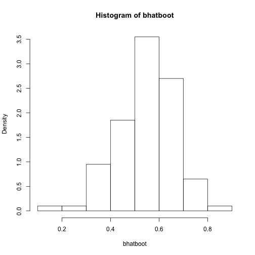

Week 9 Summary
=============

Null Models
==========

The first issue is to clarify what is a null model. That is, what constitutes a truly null biological model? A null model needs to provide the simplest possible answer to a question. Ideally, a null model requires no knowledge of a system, and should include no process of biological relevance. it is "the most boring explanation possible that could be observed".
However, null models are devised to test specific aspects of biology, and as such are drawn with respect to parameters (for example, one could decide to design a null model with respect to species richness, and therefore should keep species richness constant.) The trick is to understad what must be kept constant when bootstraping to test aginst a null model (for example, if we consider our dolphin dataset (weeks 5-6), part of the issue was deciding if we wanted to keep the rows, colums or both constant). Those could be considered biological factors that go into the model. Then, a null model is one that would produce "biological randomness".

In short, we want to determine how much biology there is in a system: if we consider null models to have no biology, any deviation from such a model will be a clue that there is in fact a biologically relevant process at work. If, for example, we want to look at species distribution, we need to first identify that there is a deviation from randomness. Only then can we identify areas of large deviance and study them in more details.

We examined a null model described in Colwell & Lees (2000): the Mid Domain Effect (MDE)

The MDE is a purely geometric model that predicts that the greatest richness of species will be found in the middle of given 2-D areas (as given by such gradients as latitude or elevation along a mountain flank)

What we did:
===========
We wanted to test two datasets against the MDE null model.


```r
require("RCurl")
```

```
## Loading required package: RCurl
## Loading required package: bitops
```

```r
require("reshape2")
```

```
## Loading required package: reshape2
```

```r

url.humming <- getURL("https://raw.githubusercontent.com/PermuteSeminar/PermuteSeminar-2014/master/Null%20models/Hummingbirds.csv")
url.hylids <- getURL("https://raw.githubusercontent.com/PermuteSeminar/PermuteSeminar-2014/master/Null%20models/Hylids.csv")
humming <- read.csv(text = url.humming, header = T, row.names = 1)
hylids <- read.csv(text = url.hylids, header = T, row.names = 1)

elev.hu <- as.numeric(gsub("Elev_", "", rownames(humming)))
elev.hy <- as.numeric(gsub("Elev_", "", rownames(hylids)))
```


the two datasets were presence/absence matrices for Hylids and Hummingbirds for given elevation on a mountain flank. Here, it was decided to keep the range of each species constant, as it is a primary predictor of the MDE.

Simply put, we wanted to randomize the range of each species to obtain a random distribution of species richness at each elevation, to compare the actual data with.

A good idea was to use the function 'rle', which returns the number of times a certain value is repeated consecutively (like 0s and 1s in our data set.) However, There are the possibilities that rle returns different vectors if ranges are located at the edge of the elevation gradient, so this would complicate the code by introducing several if conditions, as seen in Heather's code:


```r
matrix.store <- list()
maxit <- 500
colsum.matrix <- matrix(NA, ncol = maxit, nrow = 25)
for (i in 1:maxit) {
    # open fori
    matrix.ran <- c()
    for (j in 1:ncol(humming)) {
        # open forj
        temp <- rle(humming[, j])
        if (length(temp$lengths) == 3) 
            {
                # open if: The following 3 if conditions set the different outcomes of the
                # rle function
                temp
                shift <- sample(seq(-temp$lengths[1], temp$lengths[3]), size = 1)
                temp$lengths[1] <- temp$lengths[1] + shift
                temp$lengths[3] <- temp$lengths[3] - shift
                matrix.ran <- cbind(matrix.ran, inverse.rle(temp))
            }  #close if
        if ((length(temp$lengths) == 2) & (temp$values[1] == 0)) 
            {
                # open if
                temp
                shift <- sample(seq(0, temp$lengths[1]), size = 1)
                temp$lengths[1] <- temp$lengths[1] - shift
                temp$lengths[3] <- shift
                temp$values[1] <- 0
                temp$values[2] <- 1
                temp$values[3] <- 0
                matrix.ran <- cbind(matrix.ran, inverse.rle(temp))
            }  #close if
        if ((length(temp$lengths) == 2) & (temp$values[1] == 1)) 
            {
                # open if
                temp
                shift <- sample(seq(0, temp$lengths[2]), size = 1)
                range.length <- temp$length[1]
                c <- temp$lengths[2] - shift
                temp$lengths[1] <- shift
                temp$lengths[2] <- range.length
                temp$lengths[3] <- c
                temp$values[1] <- 0
                temp$values[2] <- 1
                temp$values[3] <- 0
                matrix.ran <- cbind(matrix.ran, c(rep(0, times = shift), rep(1, 
                  times = range.length), rep(0, times = c)))
            }  #close if
    }  #close forj
    matrix.store[[i]] <- matrix.ran
    colsum.matrix[, i] <- apply(matrix.store[[i]], 1, sum)
}  #close fori
```


When we plot the output of that code superimposing the real data, we obtain the graph "Heather's_plot_Hummingbird.png"

Jon decided to bypass the rle issue, and instead used summing and randomly assinging a single starting point for the ranges, and setting the following n-1 elevations to have a presence record for a species with range n.


```r
require(ggplot2)
```

```
## Loading required package: ggplot2
```

```r
ggplot(humming, aes(x = elev.hu, y = rowSums(humming[, 1:50]))) + geom_path()
```

 

```r

## Function to permute ranges open function
permute_range <- function(data) {
    elev <- as.numeric(gsub("Elev_", "", rownames(data)))  # replaces the first colums of the dataset with their actual value
    # Calculate range sizes for each species
    rangeSize <- colSums(data)  #creates a vector for each species indicating the size of their range
    # Create matrix to fill with new ranges
    new.ranges <- matrix(nrow = length(elev), ncol = length(rangeSize))  #creates an empty matrix to recieve the randomized data
    # For loop to shift range for each species open for
    for (i in 1:length(rangeSize)) {
        perm.mat <- matrix(0, nrow = length(elev), ncol = 1)  #creates a matrix with 1 column full of 0
        upperlim <- length(elev) - rangeSize[i]  #no clue creates a value that substracts the range size for spp i from the number of elevation points
        # this should be the number of 0s in the random data set
        start <- sample(c(1:upperlim), 1)  #will sample a random number between 1 an the number of 0s in the dataset
        perm.mat[start:(start + rangeSize[i]), ] <- 1  #gives that random number and the range size for spp i and sets it to 1
        new.ranges[, i] <- perm.mat  #Huzzah
    }  # close for
    return(list(ranges = new.ranges, tot.num = rowSums(new.ranges)))
}  #close function

## Function to wrap the permute function across any number of permutations
wrapper <- function(n, data) {
    p.ranges <- matrix(nrow = n, ncol = nrow(data))
    for (i in 1:n) {
        numSpec <- permute_range(data)$tot.num
        p.ranges[i, ] <- numSpec
    }
    return(p.ranges)
}

test <- wrapper(5000, humming)
boxplot(test)
points(1:25, rowSums(humming), typ = "l", col = "blue")
```

 

```r

# get quantiles
quant.hu <- apply(test, 2, quantile, probs = c(0.025, 0.975))
q.dat <- melt(data.frame(t(quant.hu)))
```

```
## No id variables; using all as measure variables
```

```r
q.dat2 <- cbind(q.dat, num = rep(1:25, 2))

## Make it pretty with ggplot2
colnames(test) <- elev.hu
mtest <- melt(test, id.vars = colnames(test))
g <- ggplot(mtest, aes(x = factor(Var2), y = value)) + geom_boxplot()
g <- g + geom_path(data = humming, aes(x = 1:25, y = rowSums(humming[, 1:50])), 
    col = "blue")
g <- g + geom_point(data = humming, aes(x = 1:25, y = rowSums(humming[, 1:50])), 
    col = "blue", size = 3)
g + geom_line(data = q.dat2, aes(x = num, y = value, col = variable))
```

 


For a reason I havent been able to recognize (but that probably has to do with the way the ranges were assigned to the randomized matrix), Jon's richness values are shifted upwards by a small number (less than 5).

The graphical representation of Jon's output can be found at "Jon_plot_Hummingbird.png"

For both datasets, the real data falls between the  97.5 and 2.5 quantiles in either cases. However, there is an intriguing trend that the data seems to "hug" the quantiles for both organisms. A way to test if there is any significance to this would be to preform a "bootstrap of the bootstrap", to test how probable this trend actually is.
