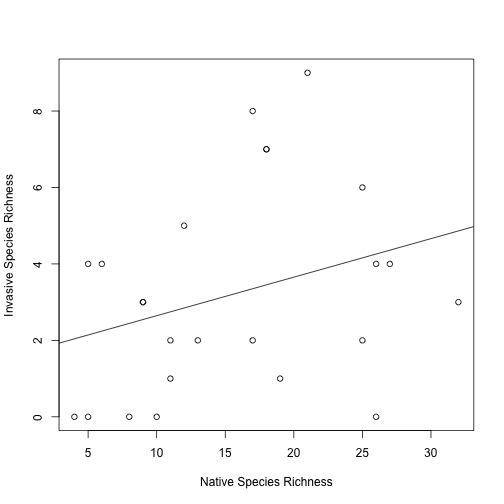
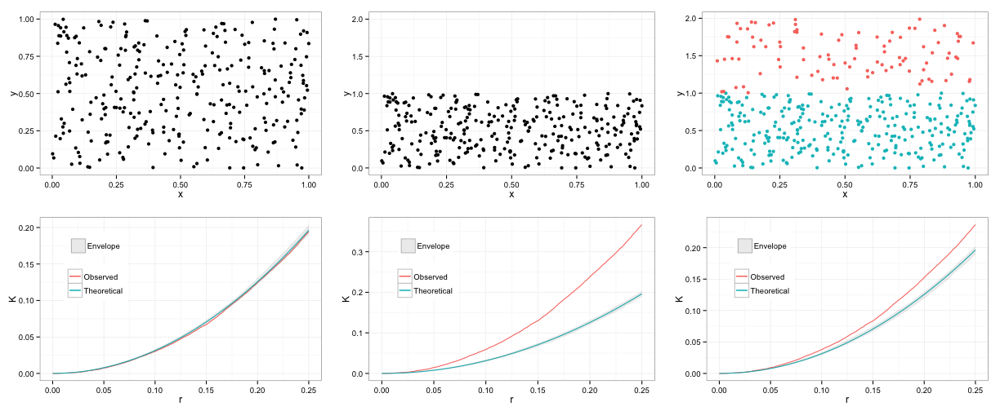
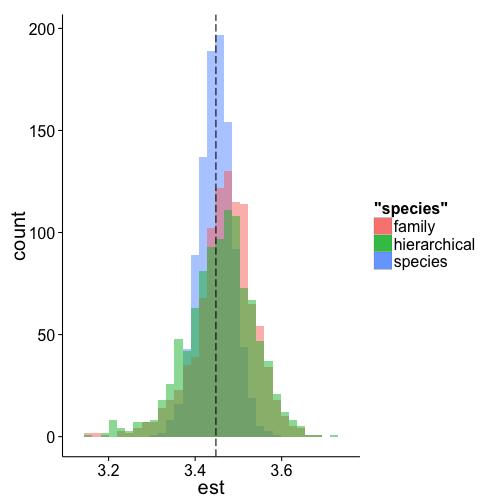

Week #1 Summary
========================================================

What we did:
-------------
1. Installed GitHub and introduced how to use a GitHub repository
2. Reviewed the non-parametric bootstrap
3. Worked through several exercises to demonstrate the use of the bootstrap and cases where the bootstrap fails

Basic idea behind the bootstrap:

We will get into more details in the next few chapters of Efron and Tibshirani, but the basic idea behind the bootstrap is that we can generate a statistical distribution for an estimator by sampling with replacement from the original data. (Ideally, you could generate this same distribution by  simply re-doing your experiment [or collecting another random sample from the population of interest] many many times. Each new experiment would yield another estimate for the parameter of interest, and the distribution of these estimates would give you information about the bias and variance of the estimator.)

Throughout our discussion of bootstrap, we will adopt Efron & Tibshirani's notation. Our original data will be called $x$ and bootstrapped datasets will be denoted $x^{*}$. The parameter of interest will be called $\theta$, and its estimation using the actual empirical (original) data will be called $\hat{\theta}$. We can use each bootstrapped dataset $x^{*}$ to calculate the bootstrapped estimate $\hat{\theta^{*}}$. Generally speaking, and in a way that will become clear over the next few weeks, bootstrapping 'works' if the distribution of the bootstrapped estimator relative to the original empirical estimate converges to that of the empirical estimate relative to the true population value

$$
\hat{\theta^{*}}-\hat{\theta} \rightarrow \hat{\theta}-\theta
$$

In the Week #1 seminar, we worked through three case studies to demonstrate both bootstrap 'working' and bootstrap 'failing'.

Case Study #1: When bootstrap works
----------------------------

To demonstrate bootstrap working, we did two things:

1. We drew 100 samples from 

$$
X \sim N(\mu=1,\sigma=3)
$$

and calculated the sample mean of each. This simulates doing the experiment 100 times (something we can rarely do in practice).

2. We drew 1 sample from 

$$
X \sim N(\mu=1,\sigma=3)
$$

and then created 99 bootstrapped replicates of the original dataset (so the original plus the 99 bootstrapped samples is equivalent to the 100 samples from the true underlying population). We then calculated the sample mean of each of these samples (one original+99 bootstrapped). 

To the extent to which these two distributions are approximately the same, and become more similar as the sample size increases, is a measure of whether bootstrapping has 'worked'. 

I show some example code below (slightly edited for formatting), in part to demonstrate some of the ways in which different people write code for the very same exercise (even when, in this case, the exercise is quite straightforward). [NB: Most people drew 100 bootstrapped datasets, as opposed to 99 bootstrapped datasets to add to the original empirical dataset. In practice, I don't think it matters, but we can certainly discuss this...]

From Jon Borrelli:

Exercise 1 - Normal

Drawing 1000 samples of 100 randomly drawn values from a normal


```r
samples <- matrix(nrow = 1000, ncol = 100)
for (i in 1:1000) {
    samples[i, ] <- rnorm(100, 1, 3)
}

meansSAMPLE <- rowMeans(samples)
```


  
Bootstrapping 


```r
norm1 <- rnorm(100, 1, 3)
boot <- matrix(nrow = 1000, ncol = 100)
for (i in 1:1000) {
    boot[i, ] <- sample(norm1, 100, replace = T)
}

meansBOOT <- rowMeans(boot)
```


Plot the histograms


```r
hist(meansBOOT, border = "red", main = NA, lwd = 3)
abline(v = mean(meansBOOT), col = "red", lwd = 2)
hist(meansSAMPLE, border = "blue", add = T, main = NA, lwd = 3)
abline(v = mean(meansSAMPLE), col = "blue", lwd = 2)
```

 


 


From Ben Weinstein:


```r
# Seminar 1 - Bootstrap test
require(ggplot2)
```

```
## Loading required package: ggplot2
```


```
## Loading required package: ggplot2
```


```r
# Repeat the experiment 1000 times
global_means <- replicate(1000, mean(rnorm(100, mean = 1, sd = 3)))  #HJL: Changed mean to 1
hist(global_means)
```

 


 


```r
# make a dataframe
draws <- data.frame(d = global_means)

# 1000 bootstrap replicates of 1 experiment
j <- rnorm(100, mean = 1, sd = 3)  #HJL: Changed mean to 1
b <- replicate(1000, mean(sample(j, replace = TRUE)))

boots <- data.frame(b = b)

# compare histograms
ggplot() + geom_histogram(data = draws, aes(x = d), fill = "blue") + geom_histogram(data = boots, 
    aes(x = b), fill = "red", alpha = 0.4)
```

```
## stat_bin: binwidth defaulted to range/30. Use 'binwidth = x' to adjust this.
## stat_bin: binwidth defaulted to range/30. Use 'binwidth = x' to adjust this.
```

 


```
## stat_bin: binwidth defaulted to range/30. Use 'binwidth = x' to adjust this.
## stat_bin: binwidth defaulted to range/30. Use 'binwidth = x' to adjust this.
```

 


If you run this several times, you'll notice that the two histograms are not always right on top of one another. As you make the sample sizes (not the number of bootstraps, but the size of the original dataset) bigger, there is closer (and more robust) correspondence between the two histograms. However, even when the bootstrap distribution is off (in the sense of shifted from the original), its variance is usually pretty close. This is good news, since we are often interested in using the standard deviation of the bootstrapped estimates to estimated an estimates standard error. This is a good illustration of the fact that bootstrap gets better as sample sizes get better (and special caution should be applied when bootstrapping small datasets).

Case Study #2: When bootstrap fails because of the sample statistic
----------------------------

One of the times when bootstrap is known to fail is when you are interested in the extremes of a distribution. To demonstrate this we worked through a classic example is which the bootstrap fails:

$$
X \sim Unif(0,5)
$$

with $\theta = max(X)$ (a.k.a. $X_{(n)}$).

From Jon Borrelli:

Exercise 2 - Uniform


Drawing 1000 samples of 100 randomly drawn values from a uniform


```r
samples2 <- matrix(nrow = 1000, ncol = 1000)
for (i in 1:1000) {
    samples2[i, ] <- runif(1000, 0, 5)
}

maxSAMPLE <- apply(samples2, 1, max)
```


  
Bootstrapping 


```r
unifsampl <- runif(1000, 0, 5)
boot2 <- matrix(nrow = 1000, ncol = 1000)
for (i in 1:1000) {
    boot2[i, ] <- sample(unifsampl, 1000, replace = T)
}

maxBOOT <- apply(boot2, 1, max)
```


Plot the histograms


```r
hist(maxSAMPLE, border = "blue", main = NA, lwd = 3)
hist(maxBOOT, border = "red", add = T, lwd = 3)
```

 


 

  
Probability of getting the largest value in original in the bootstrapped sample

$$
\LARGE{
1 - (1 - \frac{1}{n})^n
}
$$
  
so bootstrap is not very good with __extreme__ values  

From Ben Weinstein:


```r
# Seminar 1 - Bootstrap test
require(ggplot2)

# Repeat the experiment 1000 times
global_means <- replicate(1000, max(runif(1000, 0, 5)))
hist(global_means)
```

 


 


```r

# make a dataframe
draws <- data.frame(d = global_means)

# 1000 bootstrap replicates of 1 experiment
j <- runif(1000, 0, 5)
b <- replicate(1000, max(sample(j, replace = TRUE)))

boots <- data.frame(b = b)

# compare histograms

ggplot() + geom_histogram(data = draws, aes(x = d), fill = "blue") + geom_histogram(data = boots, 
    aes(x = b), fill = "red", alpha = 0.4)
```

```
## stat_bin: binwidth defaulted to range/30. Use 'binwidth = x' to adjust this.
## stat_bin: binwidth defaulted to range/30. Use 'binwidth = x' to adjust this.
```

```
## Warning: position_stack requires constant width: output may be incorrect
## Warning: position_stack requires constant width: output may be incorrect
```

 


```
## stat_bin: binwidth defaulted to range/30. Use 'binwidth = x' to adjust this.
## stat_bin: binwidth defaulted to range/30. Use 'binwidth = x' to adjust this.
```

```
## Warning: position_stack requires constant width: output may be incorrect
## Warning: position_stack requires constant width: output may be incorrect
```

 


```r

ggplot() + geom_density(data = draws, aes(x = d), fill = "blue") + geom_density(data = boots, 
    aes(x = b), fill = "red", alpha = 0.4)
```

 


 


Case Study #3: When bootstrap fails because the distribution has ill defined moments
----------------------------

One of the other times when bootstrap is known to fail is when you have a distribution will is poorly behaved, which is to say that it has moments that are ill defined. We demonstrated this with a classic porrly-behaved distribution, the Cauchy distribution (which has an undefined mean and variance)[The parameters are fairly arbitrary here]:

$$
X \sim Cauchy(1,2) 
$$

with $\theta = var(X)$.

I've included Jon and Ben's code below, but because the Cauchy is so pathalogical, the histograms aren't much use. Its better to just play around with the code to get a sense for what's going on.

From Jon Borrelli:


```r
hist(rcauchy(1000, 1, 2))
```

 


 


Drawing 1000 samples of 100 randomly drawn values from a cauchy


```r
samples3 <- matrix(nrow = 1000, ncol = 1000)
for (i in 1:1000) {
    samples3[i, ] <- rcauchy(1000, 1, 2)
}

varSAMPLE <- apply(samples3, 1, var)
```


  
Bootstrapping 


```r
cauchysampl <- rcauchy(1000, 1, 2)
boot3 <- matrix(nrow = 1000, ncol = 1000)
for (i in 1:1000) {
    boot3[i, ] <- sample(cauchysampl, 1000, replace = T)
}

varBOOT <- apply(boot3, 1, var)
```


Plot the histograms


```r
hist(varSAMPLE, border = "blue", main = NA, lwd = 3, freq = F)
hist(varBOOT, border = "red", lwd = 3, add = T, freq = F)
```

 


 


From Ben Weinstein:


```r
# Probability that the max value is the final dataset If we have 1000
# values, there is one max value

require(ggplot2)

# Repeat the experiment 1000 times
global_means <- replicate(1000, var(rcauchy(1000, 1, 2)))
hist(global_means)
```

 


 


```r
# make a dataframe
draws <- data.frame(d = global_means)

# 1000 bootstrap replicates of 1 experiment
j <- cauchy(1000, 1, 2)
```

```
## Error: could not find function "cauchy"
```


```
## Error: could not find function "cauchy"
```


## stat_bin: binwidth defaulted to range/30. Use 'binwidth = x' to adjust this.
## stat_bin: binwidth defaulted to range/30. Use 'binwidth = x' to adjust this.
```

 


```r
ggplot() + geom_density(data = draws, aes(x = d), fill = "blue") + geom_density(data = boots, 
    aes(x = b), fill = "red", alpha = 0.4)
```

 


 


References:
-----------------

For more information about Week #1's topics, a few helpful references are:

Athreya, K.B. 1987. Bootstrap of the mean in the infinite variance case. The Annals of Statistics 15(2): 724-731.

Bickel, P.J., and D. A. Freedman. 1981. Some asymptotic theory for the bootstrap. The Annals of Statistics 9(6): 1196-1217.

-----------------------------------------------------------------------------------------------

Week #4 Summary 
========================================================

**Solution to reading files (such as .csv) on Rmarkdown documents:**

Install the RCurl package
> Use getUrL() function:


```r
require(RCurl)
```

```
## Loading required package: RCurl
## Loading required package: bitops
```


I was experiencing a certificate error with getURL().  The following code seems to fix the problem in case you experience the same:

```r
options(RCurlOptions = list(cainfo = system.file("CurlSSL", "cacert.pem", package = "RCurl")))

raw <- getURL("https://raw.github.com/PermuteSeminar/PermuteSeminar-2014/master/Week-2/ClutchSize.csv")
clutch <- read.csv(text = raw)  #make sure to upload RAW data file
```


Lecture Notes 
==============
adapted from Emily Rollinsion
-------------------------------

> For this week, we read Chapter 8 in Efron and Tibshirani, and notes on bootstrapping dependent data (Steigerwald; posted to GitHub and on Blackboard).  This chapter provides an overview of bootstrapping procedues for more complicated data structures than the one-sample model, such as time-dependent data or otherwise non-IID data.

In-class discussion:
---------------------

The goal of the bootstrap algorithm is to estimate the probability distribution that underlies our data.  We can use our empirical distribution in lieu of the full distribution to understand the distribution of statisics of interest (mean, variance, etc.).

Bootstraps are often used to estimate standard errors.  We select $B$ independent bootstrap samples, calculate our test statistic using the bootstrap samples, and use the standard deviation of the $B$ replications as an estimate of the standard error of the unknown distribution $F$ that underlies our empirical data.  Resampled populations should equal the number of orginal samples. *'s are used to indicate resampled items.

This works for both a single unknown distribution (see Figure 8.1 in E&T) or a more complicated underlying process or a whole set of unknown distributions (see Figure 8.3 in E&T). We could easily imagine some biological measure influenced by many processes (i.e., many underlying and unknown statistical distributions). 


Today's example:
-------------------

We used the data from Leutenizing hormone example in Efron and Tibshirani (Ch. 8).  This formed a time series with some temporal stucture.
the whole distirbution may be normal.

We will model this using an autoregressive model of period 1.
$$
AR(1): z_{t} = \beta_{z_{t-1}} + \epsilon_{t}
$$
> where $z_{t}$ has an expectation 0 and $\beta$ is an unknown parameter, a number between -1 and 1.  


In class Excercises
=====================

**Use dataset from book:**

**1. Estimate $\hat{\beta}$ **
-------------------------------


Solution: Adapted from Jon Borrelli
---------------------------------------

Load Required Packages

```r
require(RCurl)
require(ggplot2)
```

```
## Loading required package: ggplot2
```


Load Dataset:

```r
rawURL <- getURL("https://raw.github.com/PermuteSeminar/PermuteSeminar-2014/master/Week-4/hormone_data.csv")
hormone <- read.csv(text = rawURL)
```


Calculate $z_t$ for each data point: $z_t = y_t-\mu$


```r
z.t <- hormone$level - mean(hormone$level)
```

Calculate residual squared errors for each value of $z_t$ and all possible values of $b$.
$$
RSE(b) = \sum_{t-U}^{V}(z_t - bz_{t-1})^2
$$

Generate a function that does this calculation over these values and picks out the best value for $b$ that minimizes RSE.

```r
rse <- function(zt, b) {
    est.b <- c()
    for (i in 1:length(b)) {
        res <- c()
        for (j in 2:length(zt)) {
            res[j - 1] <- (zt[j] - b[i] * zt[j - 1])^2  #RSE equation
        }
        est.b[i] <- sum(res)
    }
    bhat <- b[which.min(est.b)]
    return(bhat)
}
```


Run the function and get $\hat{\beta}$

```r
b <- seq(-1, 1, 0.001)  #generates a sequence of possible values for b
bhat <- rse(z.t, b)  #runs the function 
```


**So our estimate of $\hat{\beta}$ is 0.586**

 2a. See how good our estimate of $\hat{\beta}$ is by figuring out confidence intervals (Standard error) of $\beta$ by bootstrapping methods
------------------------------------------------------------------------------------------------------------------------------------------------

We need to estimate $P = (\beta,F)$ from the data.

Since we have $\hat{\beta}$ we can use it to estimate $F$ distribution of the distubances and calculate $\epsilon_{t} = z_{t} - \beta z_{t-1}$ for every $t$  


```r
eps <- c()  #collects all the calculate values of epsilon

for (i in 1:length(z.t)) {
    eps[i] <- z.t[i] - bhat * z.t[i - 1]
}
```


A histrogram of the approximate disturbances. It is not a normal distribution.   The Mean = 0.0062

```r
hist(eps)
```

 


Resample $F$ Distribtuion of values of $\epsilon$ with replacement:

```r
boot.eps <- matrix(nrow = 200, ncol = 47)
for (rep in 1:200) {
    boot.eps[rep, ] <- sample(eps[2:48], 47, replace = T)
}
```


Generate bootstrap values for time series $z_{t}*$: 

```r
z.tmat <- matrix(nrow = 200, ncol = 48)
z.tmat[, 1] <- z.t[1]
for (rep in 1:200) {
    for (cols in 1:47) {
        z.tmat[rep, cols + 1] <- bhat * z.tmat[rep, cols] + boot.eps[rep, cols]
    }
}
```


Generate bootsrap replications of $\hat{\beta}$ 

```r
b.test <- seq(0, 1, 0.001)
bhatboot <- apply(z.tmat, 1, rse, b = b.test)  #Uses RSE function created above
```


Histogram of the generated $\hat{\beta}$ values. The mean = 0.5793  

```r
hist(bhatboot, freq = F)
```

 


2b. Use a moving blocks bootstrap
--------------------------------------


```r
head(hormone)
```

```
##   period level
## 1      1   2.4
## 2      2   2.4
## 3      3   2.4
## 4      4   2.2
## 5      5   2.1
## 6      6   1.5
```

```r
block <- matrix(nrow = 3, ncol = 46)
for (i in 1:46) {
    block[1, i] <- z.t[i]
    block[2, i] <- z.t[i + 1]
    block[3, i] <- z.t[i + 2]
}

boot.block <- matrix(nrow = 500, ncol = 48)
for (i in 1:500) {
    bcol <- sample(1:46, 16, replace = T)
    boot.block[i, ] <- as.vector(block[, bcol])
}


b.test <- seq(0, 1, 0.001)

bhatboot2 <- apply(boot.block, 1, rse, b = b.test)
```

Histogram of estimates generatated from the Moving Blocks BootStrap with mean of 0.3925


```r
hist(bhatboot2)
```

 

-------------------------------------------------------------------
Week 11 Summary
========================================================

Manly 1996 and Stutz and Eastabrook 2004
========================================================

In archeology, patterns of similarity between assemblages that vary in the number of artefacts have been analyzed using multivariate statistics. 

For presence/absence data of artefacts, Manly 1996 used a reduced metrics, Dij, 

$$
Dij = \sqrt{(x_{i1} - x_{j1})^2 + (x_{i2} - x_{j2})^2 + ... + (x_{in} - x_{jn})^2}
$$

which measures the difference between the two burials based on the presence(1) and absence(0) of artefact type. This reduced the number of variables for ordination analysis and allowed the groupings of burials that are simliar to each other.

Grouping of burials was also attempted for count data in Stutz and Eastabrook 2004 in which 

$$
Dij=\frac{\sum_{m}^{c}\left|f_{mi} - f_{mj}\right|}{2}
$$

was used as the difference between any two assemblages.

Based on the ordination results, the paper tried to test two hypotheses, H1: The microlith assemblages within the same geogrphical region are more typologically similar.
H2: The microlith assemblages within the same archaeological culture are more similar regardless of geographic location.

Using ordination techniques, the authors first searched for significant clusters among assemblages and tested the 'gooodness of grouping' with the Dij value above (less Dij value represent better grouping).


Exercise
=========

1) Using the dataset in Stutz and Eastabrook 2004 (counts of 31 types of artefacts in 17 different sites for 3 distinct time periods and 2 distinct regions), we explored the similarities between the burials and artefacts using several ordination techniques such as Principal Component Aanalysis (PCA), Non-metric multidimensional scaling (NMDS), and Canonical Correspondence Analysis (CCA). 

2) Based on the results from several techniques, we tried to group the burials or artefacts together into groups that represent similar types.

Loading the data
----------------

Import data from GitHub


```r
require(RCurl)
```

```
## Loading required package: RCurl
## Loading required package: bitops
```

```r
options(RCurlOptions = list(cainfo = system.file("CurlSSL", "cacert.pem", package = "RCurl")))

raw <- getURL("https://raw.githubusercontent.com/PermuteSeminar/PermuteSeminar-2014/master/Week%2011/epipalassemblages.csv")
data <- read.csv(text = raw)
```


Using the function 'melt' in package 'reshape2', one can convert an object into a molten data frame which helps to visualize the data in a nicer fashion.


```r
library(reshape2)

molten.data <- melt(data, id.var = c("Site", "Total", "Period", "Region"))
head(molten.data)
```

```
##    Site Total   Period        Region variable value
## 1  KDr8   951  Kebaran Mediterranean       T1   516
## 2  HayC   537  Kebaran Mediterranean       T1    68
## 3   EGI   391 Nizzanan Mediterranean       T1     0
## 4  EGII    82  Kebaran Mediterranean       T1     0
## 5 EGIII   142  Kebaran Mediterranean       T1    16
## 6  EGIV   287  Kebaran Mediterranean       T1     0
```


Creating graphs of the data
----------------------------

To generate graphs of counts of each type of artefacts in the burials by different regions and periods, function 'ggplot' can be used in package 'ggplot2'.


```r
library(ggplot2)

# The variables in the molten data frame are the types of artefacts and the
# values are the counts of each artefact in the site
names(molten.data)[5:6] <- c("Artefact", "Count")

# ggplot function is used to show the counts of each artefact type separated
# by region and period as a bar graph
ggplot(molten.data, aes(x = Artefact, y = Count)) + geom_bar(stat = "identity") + 
    facet_grid(Period ~ Region)
```

 

```r
# same count data can be shown in a heat map form using ggplot here,
# absolute count of each artefact type is shown in each site
ggplot(molten.data, aes(x = Artefact, y = Site, fill = Count)) + geom_tile()
```

 

```r
# the heat map can be divided into different regions and periods in log
# scale
ggplot(subset(molten.data, Count > 0), aes(x = Artefact, y = Site, fill = log10(Count))) + 
    geom_tile() + facet_grid(Region ~ Period, scales = "free_y", space = "free_y") + 
    theme_bw()
```

 


1) Ordination
==================

In multivariate analysis, ordination is a method of data clustering in which objects that are characterized by values on multiple variables are ordered so that similar objects are near each other and dissimilar objects are farther from each other. These relationships between the objects, on each of several axes (one for each variable), are then characterized numerically and/or graphically.  


1. Principal Component Analysis (PCA)
---------------------------------------
Principal component analysis (PCA) is a statistical procedure that identifies a set of uncorrelated variables (called principal components) that accounts for the variability in the data set. The first principal component explains the largest variance in the data, and the succeeding components account for the next highest variance under the circumstance that they are uncorrelated to the preceeding components.   

In R, function 'prcomp' in package 'vegan' is used for PCA.

When using PCA, it is important that the units are standardized for different variables so that the results are relevant. 


```r
require(vegan)
```

```
## Loading required package: vegan
## Loading required package: permute
## Loading required package: lattice
## This is vegan 2.0-10
```

```r
counts <- data[, 2:32]
rownames(counts) <- data$Site
counts
```

```
##        T1  T2  T3  T4  T5  T6 T7 T8 T9 T10 T11 T12 T13 T14 T15 T16 T17 T18
## KDr8  516  93   9  32  45  86  3 77  0   3   6   0  30   0   0   1   0  14
## HayC   68 121   0  30  85  34 15 57  0   9   1   0  26  29   0  11   0  14
## EGI     0 128   0  54  49   0  1  0  0   0   0  38   0  19  47   0   0   4
## EGII    0  51   0   7   6   0  0  0  0   0   0   7   0   1   8   0   0   0
## EGIII  16  45  23  12   3   0 12  0  0   0   0   0   0   5   0   0  24   0
## EGIV    0   0   0  69   7   0 79  0  0  51  54   0   0   4   0   0   9   1
## UR2a   75   2   0   9  41   0  0  1  0   0   0  25   3   3   0   0   6   1
## Fa3B   85   6   0  18   7  10  1 39  0   0   1   0   0   1   0   1   6   0
## Fa3A  595 428  15 196 172 205  3  3  0   2   0   0  12  14   0  14   0   9
## Fa7     3  80   3   7   2  15 44  0  0   0   1   0  12   0   0   2   0   0
## WH26    3 128   0  14   2   3  0  0  0   0   0   0   0   1   0   0   0   2
## Jil6L  55   0  13   4   0   0  0  0 13   0   0   1   0   2   0   0   0   0
## Jil6M   4   0  48  17   0   0  2  0 49   0   0   1   0   0   0   0   0   0
## Jil6U  35   0  30  21   0   0 33  0  9  65  53   9   0   0   0   0   0   0
## Uw14M  42   0 109   5   1   0  0  0 17   0   0   0   0   0   0   8   0   0
## Uw14U   3   0  85   4   2   0  0  0 19   0   0   1   0   0   0  11   0   0
## Uw18  166   0 167   7   0   0  0  0  4   0   0   9   0   0   0   3   0   0
##       T19 T20 T21 T22 T23 T24 T25 T26 T27 T28 T29 T30 T31
## KDr8    0   5   0   3  13   0   7   0   4   3   1   0   0
## HayC    0  10  11   1   6   0   2   7   0   0   0   0   0
## EGI    40   8   1   0   0   0   0   2   0   0   0   0   0
## EGII    1   0   1   0   0   0   0   0   0   0   0   0   0
## EGIII   0   0   2   0   0   0   0   0   0   0   0   0   0
## EGIV    1   0   7   3   0   0   1   0   0   0   1   0   0
## UR2a    0   0   0   0   1   0   6   0   0   1   2   0   2
## Fa3B    1   1   0   0   0   0   1   0   0   0   0   0   0
## Fa3A    0  15  12   2   3   0   3   0   0   2   2   0   0
## Fa7     0   0   2   0   0   0   1   0   0   0   1   0   0
## WH26    0   0   0   0   0   0   0   0   0   0   0   0   0
## Jil6L   0   0   0   0   0   2   0   0   2   0   0   0   0
## Jil6M   0   0   0   0   0   3   0   0   0   2   0   3   0
## Jil6U   0   0   0  26   0   8   0   0   3   0   0   0   0
## Uw14M   0   0   0   0   0   1   0   0   0   0   0   0   0
## Uw14U   0   0   0   0   0   3   0   0   0   0   0   0   0
## Uw18    0   0   0   0   0   4   0   0   0   0   0   0   0
```

```r
# scale=T in function 'prcomp' to standardize the units
pca.counts <- prcomp(counts, scale = T)
biplot(pca.counts)
```

 

```r
plot(pca.counts)
```

 

```r
summary(pca.counts)
```

```
## Importance of components:
##                          PC1   PC2   PC3    PC4    PC5    PC6    PC7
## Standard deviation     3.112 2.073 1.917 1.7331 1.6624 1.5769 1.2542
## Proportion of Variance 0.312 0.139 0.119 0.0969 0.0891 0.0802 0.0507
## Cumulative Proportion  0.312 0.451 0.570 0.6665 0.7556 0.8358 0.8865
##                           PC8    PC9   PC10    PC11    PC12    PC13   PC14
## Standard deviation     1.1718 0.8528 0.8168 0.48562 0.46845 0.37691 0.3148
## Proportion of Variance 0.0443 0.0235 0.0215 0.00761 0.00708 0.00458 0.0032
## Cumulative Proportion  0.9308 0.9543 0.9758 0.98343 0.99051 0.99510 0.9983
##                           PC15    PC16     PC17
## Standard deviation     0.16588 0.15932 3.38e-16
## Proportion of Variance 0.00089 0.00082 0.00e+00
## Cumulative Proportion  0.99918 1.00000 1.00e+00
```


2. Canonical Correspondence Analysis (CCA)
-------------------------------------------
Canonical Correspondence analysis (CCA) is conceptually similar to principal component analysis, but applies to categorical rather than continuous data.

In R, function 'cca' in package 'vegan' is used for CCA.


```r
library(vegan)

cca.counts <- cca(counts)
cca.counts
```

```
## Call: cca(X = counts)
## 
##               Inertia Rank
## Total            2.19     
## Unconstrained    2.19   16
## Inertia is mean squared contingency coefficient 
## 
## Eigenvalues for unconstrained axes:
##      CA1      CA2      CA3      CA4      CA5      CA6      CA7      CA8 
## 0.582558 0.515972 0.329085 0.177881 0.142526 0.114697 0.094262 0.064363 
##      CA9     CA10     CA11     CA12     CA13     CA14     CA15     CA16 
## 0.061294 0.047783 0.021915 0.013921 0.009355 0.006944 0.004962 0.000966
```

```r
plot(cca.counts)
```

 

```r
summary(cca.counts)
```

```
## 
## Call:
## cca(X = counts) 
## 
## Partitioning of mean squared contingency coefficient:
##               Inertia Proportion
## Total            2.19          1
## Unconstrained    2.19          1
## 
## Eigenvalues, and their contribution to the mean squared contingency coefficient 
## 
## Importance of components:
##                         CA1   CA2   CA3    CA4    CA5    CA6    CA7    CA8
## Eigenvalue            0.583 0.516 0.329 0.1779 0.1425 0.1147 0.0943 0.0644
## Proportion Explained  0.266 0.236 0.150 0.0813 0.0651 0.0524 0.0431 0.0294
## Cumulative Proportion 0.266 0.502 0.652 0.7336 0.7987 0.8511 0.8942 0.9236
##                          CA9   CA10   CA11    CA12    CA13    CA14    CA15
## Eigenvalue            0.0613 0.0478 0.0219 0.01392 0.00936 0.00694 0.00496
## Proportion Explained  0.0280 0.0218 0.0100 0.00636 0.00427 0.00317 0.00227
## Cumulative Proportion 0.9516 0.9735 0.9835 0.98984 0.99412 0.99729 0.99956
##                           CA16
## Eigenvalue            0.000966
## Proportion Explained  0.000440
## Cumulative Proportion 1.000000
## 
## Scaling 2 for species and site scores
## * Species are scaled proportional to eigenvalues
## * Sites are unscaled: weighted dispersion equal on all dimensions
## 
## 
## Species scores
## 
##        CA1      CA2     CA3     CA4     CA5     CA6
## T1  -0.081  0.34127 -0.5047 -0.2509  0.0338 -0.0519
## T2  -0.592  0.07518  0.4097  0.5125  0.0507 -0.2534
## T3   1.839  0.70295  0.2843  0.0413  0.5663 -0.1016
## T4  -0.115 -0.33150  0.1826  0.0967 -0.1192  0.0283
## T5  -0.518  0.12884  0.1256 -0.1679 -0.1003  0.1570
## T6  -0.479  0.23341 -0.4357  0.2047 -0.1602 -0.2384
## T7   0.331 -1.87879 -0.0392  0.7152  0.2385  0.4133
## T8  -0.455  0.25513 -0.7568 -0.3207 -0.2877  0.7820
## T9   2.401  0.68923  0.7082  0.5020 -1.9585  0.4320
## T10  0.798 -2.47906 -0.3037 -0.4301 -0.1217 -0.3379
## T11  0.815 -2.59018 -0.3281 -0.3684 -0.0564 -0.2287
## T12 -0.233 -0.10115  1.3790 -1.3293  0.1810  0.2682
## T13 -0.477  0.07923 -0.4101  0.2554 -0.1703  0.2987
## T14 -0.526 -0.10653  0.6668 -0.0924 -0.0269  0.5643
## T15 -0.942 -0.07602  2.8567 -1.2871  0.0128 -0.0474
## T16  0.759  0.54289  0.1328  0.3693  0.3267 -0.0578
## T17  0.106 -0.67681  0.0926  0.7536  1.4730  2.4223
## T18 -0.532  0.11850 -0.1148 -0.0607 -0.2234  0.1822
## T19 -0.893 -0.14727  2.7839 -1.4562 -0.0111  0.1477
## T20 -0.606  0.15079  0.3118 -0.1849 -0.2013  0.0662
## T21 -0.315 -0.56266  0.0312  0.5461  0.0640  0.3999
## T22  0.910 -2.13053 -0.4108 -0.9336 -0.3263 -1.0614
## T23 -0.455  0.27841 -0.6694 -0.2779 -0.2666  0.2989
## T24  1.792 -0.38502  0.1243 -0.4016 -0.4847 -0.5125
## T25 -0.381  0.07525 -0.4491 -0.5468 -0.0150  0.6771
## T26 -0.701 -0.00795  0.5745 -0.0551 -0.3454  0.7555
## T27  0.480 -0.52532 -0.6963 -0.8372 -0.5765 -0.4385
## T28  0.414  0.48357 -0.1454 -0.0472 -1.2898  0.4566
## T29 -0.290 -0.34953 -0.2037 -0.0865  0.1430  0.4635
## T30  2.914  0.93135  1.2880  1.3047 -4.8129  1.4441
## T31 -0.409  0.24778  0.0137 -1.8943  0.3573  1.7827
## 
## 
## Site scores (weighted averages of species scores)
## 
##          CA1      CA2     CA3    CA4     CA5     CA6
## KDr8  -0.365  0.40310 -1.0727 -0.602 -0.2692  0.1153
## HayC  -0.632  0.01537 -0.1104  0.377 -0.4378  0.9397
## EGI   -0.942 -0.08958  2.9713 -1.567 -0.0221  0.1106
## EGII  -0.942  0.00364  2.1833  0.357  0.2177 -0.9755
## EGIII  0.177 -0.25969  0.5268  1.899  2.5852  3.2513
## EGIV   0.578 -3.06481 -0.1940  0.499  0.3221  0.9498
## UR2a  -0.409  0.24778  0.0137 -1.894  0.3573  1.7827
## Fa3B  -0.372  0.31209 -1.1355 -0.796 -0.1340  1.9546
## Fa3A  -0.506  0.27441 -0.2673  0.358 -0.1210 -0.6820
## Fa7   -0.409 -0.82940  0.3480  2.572  0.4753 -0.0217
## WH26  -0.917  0.08987  1.0500  2.435  0.1727 -1.8048
## Jil6L  0.997  0.70377 -0.4147 -0.632 -1.4270  0.0994
## Jil6M  2.914  0.93135  1.2880  1.305 -4.8129  1.4441
## Jil6U  1.263 -2.58260 -0.3821 -1.287 -0.4192 -1.5354
## Uw14M  2.294  1.11309  0.3994  0.165  1.1994 -0.3139
## Uw14U  2.865  1.17372  0.9567  0.609  0.6943 -0.1405
## Uw18   1.477  0.93491 -0.1594 -0.696  1.7965 -0.5684
```


3. Multidimensional Scaling (MDS)
----------------------------------------------

Multidimensional scaling (MDS) is a means of visualizing the level of similarity of individual cases of a dataset. 

An MDS algorithm aims to place each object in N-dimensional space such that the between-object distances are preserved as well as possible. Each object is then assigned coordinates in each of the N dimensions. The number of dimensions of an MDS plot N can exceed 2 and is specified a priori. Choosing N=2 optimizes the object locations for a two-dimensional scatterplot.

Non-metric multidimensional scaling (NMDS) is a special type of MDS that
finds both a non-parametric monotonic relationship between the dissimilarities in the item-item matrix and the Euclidean distances between items, and the location of each item in the low-dimensional space. 

In R, function 'metaMDS' in package 'vegan' performs Non-metric Multidimensional Scaling (NMDS). 


```r
library(vegan)

nmds.counts <- metaMDS(counts, distance = "bray", trymax = 20, trace = 1)
```

```
## Square root transformation
## Wisconsin double standardization
## Run 0 stress 0.1402 
## Run 1 stress 0.1803 
## Run 2 stress 0.1384 
## ... New best solution
## ... procrustes: rmse 0.03478  max resid 0.1055 
## Run 3 stress 0.1384 
## ... procrustes: rmse 4.096e-05  max resid 0.0001009 
## *** Solution reached
```

```r
# plot sites
plot(nmds.counts, type = "n")
text(nmds.counts, display = "sites", cex = 0.7)
```

 

```r
# plot artefact types
plot(nmds.counts, type = "n")
text(nmds.counts, display = "species", cex = 0.7)
```

 

```r
# overlay the two plots on top of one another
plot(nmds.counts)
ordilabel(nmds.counts, display = "sites", font = 3, col = "black")
ordilabel(nmds.counts, display = "species", font = 2, col = "red")
```

 


2) K-mean clustering
======================

Based on the above ordination techniques, one can perform a clustering analysis to group the items that are similar to each other. The number of clusters (k) is given a priori by the user and this can be determined based on the results from the ordination methods. 

In R, the function 'kmeans' conducts k-means clustering which partitions n observations into k clusters.


```r
# k-means clustering with 2 clusters
kmeans.counts2 <- kmeans(counts, 2)
kmeans.counts2
```

```
## K-means clustering with 2 clusters of sizes 2, 15
## 
## Cluster means:
##      T1    T2    T3     T4     T5      T6    T7     T8  T9   T10   T11
## 1 555.5 260.5 12.00 114.00 108.50 145.500  3.00 40.000 0.0 2.500 3.000
## 2  37.0  37.4 31.87  18.53  13.67   4.133 12.47  6.467 7.4 8.333 7.333
##     T12    T13   T14   T15 T16 T17    T18   T19    T20 T21 T22    T23 T24
## 1 0.000 21.000 7.000 0.000 7.5   0 11.500 0.000 10.000 6.0 2.5 8.0000 0.0
## 2 6.067  2.733 4.333 3.667 2.4   3  1.467 2.867  1.267 1.6 2.0 0.4667 1.4
##      T25 T26    T27 T28    T29 T30    T31
## 1 5.0000 0.0 2.0000 2.5 1.5000 0.0 0.0000
## 2 0.7333 0.6 0.3333 0.2 0.2667 0.2 0.1333
## 
## Clustering vector:
##  KDr8  HayC   EGI  EGII EGIII  EGIV  UR2a  Fa3B  Fa3A   Fa7  WH26 Jil6L 
##     1     2     2     2     2     2     2     2     1     2     2     2 
## Jil6M Jil6U Uw14M Uw14U  Uw18 
##     2     2     2     2     2 
## 
## Within cluster sum of squares by cluster:
## [1]  91147 152831
##  (between_SS / total_SS =  72.2 %)
## 
## Available components:
## 
## [1] "cluster"      "centers"      "totss"        "withinss"    
## [5] "tot.withinss" "betweenss"    "size"         "iter"        
## [9] "ifault"
```

```r
# Using 2 groups there's a vector of the clusters
clustergroups2 <- c(1, 2, 2, 2, 2, 2, 2, 2, 1, 2, 2, 2, 2, 2, 2, 2, 2)
comparison2 <- data.frame(data$Period, data$Region, clustergroups2)
comparison2
```

```
##    data.Period   data.Region clustergroups2
## 1      Kebaran Mediterranean              1
## 2      Kebaran Mediterranean              2
## 3     Nizzanan Mediterranean              2
## 4      Kebaran Mediterranean              2
## 5      Kebaran Mediterranean              2
## 6      Kebaran Mediterranean              2
## 7      Kebaran Mediterranean              2
## 8      Kebaran Mediterranean              2
## 9      Kebaran Mediterranean              1
## 10     Kebaran Mediterranean              2
## 11     Kebaran Mediterranean              2
## 12    Nizzanan        Steppe              2
## 13    Nebekian        Steppe              2
## 14    Nebekian        Steppe              2
## 15    Nebekian        Steppe              2
## 16    Nebekian        Steppe              2
## 17    Nebekian        Steppe              2
```

```r
# k-means clustering with 3 clusters
kmeans.counts3 <- kmeans(counts, 3)
kmeans.counts3
```

```
## K-means clustering with 3 clusters of sizes 5, 2, 10
## 
## Cluster means:
##      T1    T2   T3    T4    T5    T6   T7   T8   T9  T10  T11 T12  T13
## 1  14.8 101.6  0.6  22.4  28.8  10.4 12.0 11.4  0.0  1.8  0.4 9.0  7.6
## 2 555.5 260.5 12.0 114.0 108.5 145.5  3.0 40.0  0.0  2.5  3.0 0.0 21.0
## 3  48.1   5.3 47.5  16.6   6.1   1.0 12.7  4.0 11.1 11.6 10.8 4.6  0.3
##    T14 T15 T16 T17  T18 T19  T20 T21 T22 T23 T24 T25 T26 T27 T28 T29 T30
## 1 10.0  11 2.6 0.0  4.0 8.2  3.6 3.0 0.2 1.2 0.0 0.6 1.8 0.0 0.0 0.2 0.0
## 2  7.0   0 7.5 0.0 11.5 0.0 10.0 6.0 2.5 8.0 0.0 5.0 0.0 2.0 2.5 1.5 0.0
## 3  1.5   0 2.3 4.5  0.2 0.2  0.1 0.9 2.9 0.1 2.1 0.8 0.0 0.5 0.3 0.3 0.3
##   T31
## 1 0.0
## 2 0.0
## 3 0.2
## 
## Clustering vector:
##  KDr8  HayC   EGI  EGII EGIII  EGIV  UR2a  Fa3B  Fa3A   Fa7  WH26 Jil6L 
##     2     1     1     1     3     3     3     3     2     1     1     3 
## Jil6M Jil6U Uw14M Uw14U  Uw18 
##     3     3     3     3     3 
## 
## Within cluster sum of squares by cluster:
## [1] 26166 91147 79997
##  (between_SS / total_SS =  77.5 %)
## 
## Available components:
## 
## [1] "cluster"      "centers"      "totss"        "withinss"    
## [5] "tot.withinss" "betweenss"    "size"         "iter"        
## [9] "ifault"
```

```r
# Using 3 groups there's a vector of the clusters
clustergroups3 <- c(1, 2, 2, 2, 2, 2, 2, 2, 1, 2, 2, 2, 2, 2, 3, 3, 3)
comparison3 <- data.frame(data$Period, data$Region, clustergroups3)
comparison3
```

```
##    data.Period   data.Region clustergroups3
## 1      Kebaran Mediterranean              1
## 2      Kebaran Mediterranean              2
## 3     Nizzanan Mediterranean              2
## 4      Kebaran Mediterranean              2
## 5      Kebaran Mediterranean              2
## 6      Kebaran Mediterranean              2
## 7      Kebaran Mediterranean              2
## 8      Kebaran Mediterranean              2
## 9      Kebaran Mediterranean              1
## 10     Kebaran Mediterranean              2
## 11     Kebaran Mediterranean              2
## 12    Nizzanan        Steppe              2
## 13    Nebekian        Steppe              2
## 14    Nebekian        Steppe              2
## 15    Nebekian        Steppe              3
## 16    Nebekian        Steppe              3
## 17    Nebekian        Steppe              3
```

```r
# k-means clustering with 4 clusters
kmeans.counts4 <- kmeans(counts, 4)
kmeans.counts4
```

```
## K-means clustering with 4 clusters of sizes 2, 7, 6, 2
## 
## Cluster means:
##       T1      T2     T3      T4      T5      T6      T7     T8    T9  T10
## 1 555.50 260.500 12.000 114.000 108.500 145.500  3.0000 40.000  0.00  2.5
## 2  61.43   1.143 60.286   9.143   7.286   1.429  0.4286  5.714 14.57  0.0
## 3  15.00  92.167  4.333  20.667  24.500   8.667 12.0000  9.500  0.00  1.5
## 4  17.50   0.000 15.000  45.000   3.500   0.000 56.0000  0.000  4.50 58.0
##       T11   T12     T13    T14   T15   T16   T17     T18    T19     T20
## 1  3.0000 0.000 21.0000 7.0000 0.000 7.500 0.000 11.5000 0.0000 10.0000
## 2  0.1429 5.286  0.4286 0.8571 0.000 3.286 1.714  0.1429 0.1429  0.1429
## 3  0.3333 7.500  6.3333 9.1667 9.167 2.167 4.000  3.3333 6.8333  3.0000
## 4 53.5000 4.500  0.0000 2.0000 0.000 0.000 4.500  0.5000 0.5000  0.0000
##     T21     T22    T23   T24 T25 T26    T27    T28    T29    T30    T31
## 1 6.000  2.5000 8.0000 0.000 5.0 0.0 2.0000 2.5000 1.5000 0.0000 0.0000
## 2 0.000  0.0000 0.1429 1.857 1.0 0.0 0.2857 0.4286 0.2857 0.4286 0.2857
## 3 2.833  0.1667 1.0000 0.000 0.5 1.5 0.0000 0.0000 0.1667 0.0000 0.0000
## 4 3.500 14.5000 0.0000 4.000 0.5 0.0 1.5000 0.0000 0.5000 0.0000 0.0000
## 
## Clustering vector:
##  KDr8  HayC   EGI  EGII EGIII  EGIV  UR2a  Fa3B  Fa3A   Fa7  WH26 Jil6L 
##     1     3     3     3     3     4     2     2     1     3     3     2 
## Jil6M Jil6U Uw14M Uw14U  Uw18 
##     2     4     2     2     2 
## 
## Within cluster sum of squares by cluster:
## [1] 91147 48347 30910  3852
##  (between_SS / total_SS =  80.1 %)
## 
## Available components:
## 
## [1] "cluster"      "centers"      "totss"        "withinss"    
## [5] "tot.withinss" "betweenss"    "size"         "iter"        
## [9] "ifault"
```

```r
# Using 4 groups there's a vector of the clusters
clustergroups4 <- c(2, 3, 3, 3, 4, 4, 4, 4, 1, 3, 3, 4, 4, 4, 4, 4, 4)
comparison4 <- data.frame(data$Period, data$Region, clustergroups4)
comparison4
```

```
##    data.Period   data.Region clustergroups4
## 1      Kebaran Mediterranean              2
## 2      Kebaran Mediterranean              3
## 3     Nizzanan Mediterranean              3
## 4      Kebaran Mediterranean              3
## 5      Kebaran Mediterranean              4
## 6      Kebaran Mediterranean              4
## 7      Kebaran Mediterranean              4
## 8      Kebaran Mediterranean              4
## 9      Kebaran Mediterranean              1
## 10     Kebaran Mediterranean              3
## 11     Kebaran Mediterranean              3
## 12    Nizzanan        Steppe              4
## 13    Nebekian        Steppe              4
## 14    Nebekian        Steppe              4
## 15    Nebekian        Steppe              4
## 16    Nebekian        Steppe              4
## 17    Nebekian        Steppe              4
```


These groupings don't seem to be related to the Period or Region groups. Why?

Analysis of Similarities (ANOSIM)
=================================

Analysis of similarities (ANOSIM) provides a way to test statistically whether there is a significant difference between two or more groups of sampling units.

Function 'anosim' in package 'vegan' is used.


```r
library(vegan)

# make a dataframe for just the groupings of sites
data.grp <- data[c(1, 34:35)]

# test differences among periods
anosim(counts, data.grp$Period, permutations = 999, distance = "bray")
```

```
## 
## Call:
## anosim(dat = counts, grouping = data.grp$Period, permutations = 999,      distance = "bray") 
## Dissimilarity: bray 
## 
## ANOSIM statistic R: 0.423 
##       Significance: 0.001 
## 
## Based on  999  permutations
```

```r
# test differences between regions
anosim(counts, data.grp$Region, permutations = 999, distance = "bray")
```

```
## 
## Call:
## anosim(dat = counts, grouping = data.grp$Region, permutations = 999,      distance = "bray") 
## Dissimilarity: bray 
## 
## ANOSIM statistic R: 0.643 
##       Significance: 0.001 
## 
## Based on  999  permutations
```


