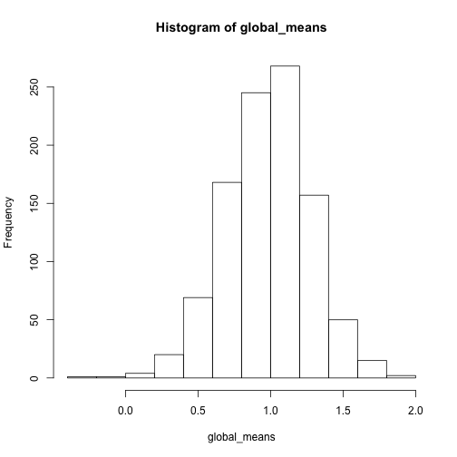

Week #1 Summary
========================================================

What we did:
-------------
1. Installed GitHub and introduced how to use a GitHub repository
2. Reviewed the non-parametric bootstrap
3. Worked through several exercises to demonstrate the use of the bootstrap and cases where the bootstrap fails

Basic idea behind the bootstrap:

We will get into more details in the next few chapters of Efron and Tibshirani, but the basic idea behind the bootstrap is that we can generate a statistical distribution for an estimator by sampling with replacement from the original data. (Ideally, you could generate this same distribution by  simply re-doing your experiment [or collecting another random sample from the population of interest] many many times. Each new experiment would yield another estimate for the parameter of interest, and the distribution of these estimates would give you information about the bias and variance of the estimator.)

Throughout our discussion of bootstrap, we will adopt Efron & Tibshirani's notation. Our original data will be called $x$ and bootstrapped datasets will be denoted $x^{*}$. The parameter of interest will be called $\theta$, and its estimation using the actual empirical (original) data will be called $\hat{\theta}$. We can use each bootstrapped dataset $x^{*}$ to calculate the bootstrapped estimate $\hat{\theta^{*}}$. Generally speaking, and in a way that will become clear over the next few weeks, bootstrapping 'works' if the distribution of the bootstrapped estimator relative to the original empirical estimate converges to that of the empirical estimate relative to the true population value

$$
\hat{\theta^{*}}-\hat{\theta} \rightarrow \hat{\theta}-\theta
$$

In the Week #1 seminar, we worked through three case studies to demonstrate both bootstrap 'working' and bootstrap 'failing'.

Case Study #1: When bootstrap works
----------------------------

To demonstrate bootstrap working, we did two things:

1. We drew 100 samples from 

$$
X \sim N(\mu=1,\sigma=3)
$$

and calculated the sample mean of each. This simulates doing the experiment 100 times (something we can rarely do in practice).

2. We drew 1 sample from 

$$
X \sim N(\mu=1,\sigma=3)
$$

and then created 99 bootstrapped replicates of the original dataset (so the original plus the 99 bootstrapped samples is equivalent to the 100 samples from the true underlying population). We then calculated the sample mean of each of these samples (one original+99 bootstrapped). 

To the extent to which these two distributions are approximately the same, and become more similar as the sample size increases, is a measure of whether bootstrapping has 'worked'. 

I show some example code below (slightly edited for formatting), in part to demonstrate some of the ways in which different people write code for the very same exercise (even when, in this case, the exercise is quite straightforward). [NB: Most people drew 100 bootstrapped datasets, as opposed to 99 bootstrapped datasets to add to the original empirical dataset. In practice, I don't think it matters, but we can certainly discuss this...]

From Jon Borrelli:

Exercise 1 - Normal

Drawing 1000 samples of 100 randomly drawn values from a normal

```{r}
samples <- matrix(nrow = 1000, ncol = 100)
for (i in 1:1000) {
    samples[i, ] <- rnorm(100, 1, 3)
}

meansSAMPLE <- rowMeans(samples)
```

  
Bootstrapping 

```{r}
norm1 <- rnorm(100, 1, 3)
boot <- matrix(nrow = 1000, ncol = 100)
for (i in 1:1000) {
    boot[i, ] <- sample(norm1, 100, replace = T)
}

meansBOOT <- rowMeans(boot)
```


Plot the histograms

```{r}
hist(meansBOOT, border = "red", main = NA, lwd = 3)
abline(v = mean(meansBOOT), col = "red", lwd = 2)
hist(meansSAMPLE, border = "blue", add = T, main = NA, lwd = 3)
abline(v = mean(meansSAMPLE), col = "blue", lwd = 2)
```

 


From Ben Weinstein:


```{r}
# Seminar 1 - Bootstrap test
require(ggplot2)
```

```
## Loading required package: ggplot2
```

```{r}
# Repeat the experiment 1000 times
global_means <- replicate(1000, mean(rnorm(100, mean = 1, sd = 3)))  #HJL: Changed mean to 1
hist(global_means)
```

 

```{r}
# make a dataframe
draws <- data.frame(d = global_means)

# 1000 bootstrap replicates of 1 experiment
j <- rnorm(100, mean = 1, sd = 3)  #HJL: Changed mean to 1
b <- replicate(1000, mean(sample(j, replace = TRUE)))

boots <- data.frame(b = b)

# compare histograms
ggplot() + geom_histogram(data = draws, aes(x = d), fill = "blue") + geom_histogram(data = boots, 
    aes(x = b), fill = "red", alpha = 0.4)
```

```
## stat_bin: binwidth defaulted to range/30. Use 'binwidth = x' to adjust this.
## stat_bin: binwidth defaulted to range/30. Use 'binwidth = x' to adjust this.
```

 


If you run this several times, you'll notice that the two histograms are not always right on top of one another. As you make the sample sizes (not the number of bootstraps, but the size of the original dataset) bigger, there is closer (and more robust) correspondence between the two histograms. However, even when the bootstrap distribution is off (in the sense of shifted from the original), its variance is usually pretty close. This is good news, since we are often interested in using the standard deviation of the bootstrapped estimates to estimated an estimates standard error. This is a good illustration of the fact that bootstrap gets better as sample sizes get better (and special caution should be applied when bootstrapping small datasets).

Case Study #2: When bootstrap fails because of the sample statistic
----------------------------

One of the times when bootstrap is known to fail is when you are interested in the extremes of a distribution. To demonstrate this we worked through a classic example is which the bootstrap fails:

$$
X \sim Unif(0,5)
$$

with $\theta = max(X)$ (a.k.a. $X_{(n)}$).

From Jon Borrelli:

Exercise 2 - Uniform


Drawing 1000 samples of 100 randomly drawn values from a uniform

```{r}
samples2 <- matrix(nrow = 1000, ncol = 1000)
for (i in 1:1000) {
    samples2[i, ] <- runif(1000, 0, 5)
}

maxSAMPLE <- apply(samples2, 1, max)
```

  
Bootstrapping 

```{r}
unifsampl <- runif(1000, 0, 5)
boot2 <- matrix(nrow = 1000, ncol = 1000)
for (i in 1:1000) {
    boot2[i, ] <- sample(unifsampl, 1000, replace = T)
}

maxBOOT <- apply(boot2, 1, max)
```


Plot the histograms

```{r}
hist(maxSAMPLE, border = "blue", main = NA, lwd = 3)
hist(maxBOOT, border = "red", add = T, lwd = 3)
```

 

  
Probability of getting the largest value in original in the bootstrapped sample

$$
\LARGE{
1 - (1 - \frac{1}{n})^n
}
$$
  
so bootstrap is not very good with __extreme__ values  

From Ben Weinstein:


```{r}
# Seminar 1 - Bootstrap test
require(ggplot2)

# Repeat the experiment 1000 times
global_means <- replicate(1000, max(runif(1000, 0, 5)))
hist(global_means)
```

 

```{r}

# make a dataframe
draws <- data.frame(d = global_means)

# 1000 bootstrap replicates of 1 experiment
j <- runif(1000, 0, 5)
b <- replicate(1000, max(sample(j, replace = TRUE)))

boots <- data.frame(b = b)

# compare histograms

ggplot() + geom_histogram(data = draws, aes(x = d), fill = "blue") + geom_histogram(data = boots, 
    aes(x = b), fill = "red", alpha = 0.4)
```

```
## stat_bin: binwidth defaulted to range/30. Use 'binwidth = x' to adjust this.
## stat_bin: binwidth defaulted to range/30. Use 'binwidth = x' to adjust this.
```

```
## Warning: position_stack requires constant width: output may be incorrect
## Warning: position_stack requires constant width: output may be incorrect
```

 

```{r}

ggplot() + geom_density(data = draws, aes(x = d), fill = "blue") + geom_density(data = boots, 
    aes(x = b), fill = "red", alpha = 0.4)
```

 


Case Study #3: When bootstrap fails because the distribution has ill defined moments
----------------------------

One of the other times when bootstrap is known to fail is when you have a distribution will is poorly behaved, which is to say that it has moments that are ill defined. We demonstrated this with a classic porrly-behaved distribution, the Cauchy distribution (which has an undefined mean and variance)[The parameters are fairly arbitrary here]:

$$
X \sim Cauchy(1,2) 
$$

with $\theta = var(X)$.

I've included Jon and Ben's code below, but because the Cauchy is so pathalogical, the histograms aren't much use. Its better to just play around with the code to get a sense for what's going on.

From Jon Borrelli:


```{r}
hist(rcauchy(1000, 1, 2))
```

 


Drawing 1000 samples of 100 randomly drawn values from a cauchy

```{r}
samples3 <- matrix(nrow = 1000, ncol = 1000)
for (i in 1:1000) {
    samples3[i, ] <- rcauchy(1000, 1, 2)
}

varSAMPLE <- apply(samples3, 1, var)
```

  
Bootstrapping 

```{r}
cauchysampl <- rcauchy(1000, 1, 2)
boot3 <- matrix(nrow = 1000, ncol = 1000)
for (i in 1:1000) {
    boot3[i, ] <- sample(cauchysampl, 1000, replace = T)
}

varBOOT <- apply(boot3, 1, var)
```


Plot the histograms

```{r}
hist(varSAMPLE, border = "blue", main = NA, lwd = 3, freq = F)
hist(varBOOT, border = "red", lwd = 3, add = T, freq = F)
```

 


From Ben Weinstein:


```{r}
# Probability that the max value is the final dataset If we have 1000
# values, there is one max value

require(ggplot2)

# Repeat the experiment 1000 times
global_means <- replicate(1000, var(rcauchy(1000, 1, 2)))
hist(global_means)
```

 

```{r}
# make a dataframe
draws <- data.frame(d = global_means)

# 1000 bootstrap replicates of 1 experiment
j <- cauchy(1000, 1, 2)
```

```
## Error: could not find function "cauchy"
```

```{r}

```
## stat_bin: binwidth defaulted to range/30. Use 'binwidth = x' to adjust this.
## stat_bin: binwidth defaulted to range/30. Use 'binwidth = x' to adjust this.
```

 

```{r}
ggplot() + geom_density(data = draws, aes(x = d), fill = "blue") + geom_density(data = boots, 
    aes(x = b), fill = "red", alpha = 0.4)
```

 


References:
-----------------

For more information about Week #1's topics, a few helpful references are:

Athreya, K.B. 1987. Bootstrap of the mean in the infinite variance case. The Annals of Statistics 15(2): 724-731.

Bickel, P.J., and D. A. Freedman. 1981. Some asymptotic theory for the bootstrap. The Annals of Statistics 9(6): 1196-1217.

-----------------------------------------------------------------------------------------------

Week #4 Summary 
========================================================

**Solution to reading files (such as .csv) on Rmarkdown documents:**

Install the RCurl package
> Use getUrL() function:


```r
require(RCurl)
```

```
## Loading required package: RCurl
## Loading required package: bitops
```


I was experiencing a certificate error with getURL().  The following code seems to fix the problem in case you experience the same:

```r
options(RCurlOptions = list(cainfo = system.file("CurlSSL", "cacert.pem", package = "RCurl")))

raw <- getURL("https://raw.github.com/PermuteSeminar/PermuteSeminar-2014/master/Week-2/ClutchSize.csv")
clutch <- read.csv(text = raw)  #make sure to upload RAW data file
```


Lecture Notes 
==============
adapted from Emily Rollinsion
-------------------------------

> For this week, we read Chapter 8 in Efron and Tibshirani, and notes on bootstrapping dependent data (Steigerwald; posted to GitHub and on Blackboard).  This chapter provides an overview of bootstrapping procedues for more complicated data structures than the one-sample model, such as time-dependent data or otherwise non-IID data.

In-class discussion:
---------------------

The goal of the bootstrap algorithm is to estimate the probability distribution that underlies our data.  We can use our empirical distribution in lieu of the full distribution to understand the distribution of statisics of interest (mean, variance, etc.).

Bootstraps are often used to estimate standard errors.  We select $B$ independent bootstrap samples, calculate our test statistic using the bootstrap samples, and use the standard deviation of the $B$ replications as an estimate of the standard error of the unknown distribution $F$ that underlies our empirical data.  Resampled populations should equal the number of orginal samples. *'s are used to indicate resampled items.

This works for both a single unknown distribution (see Figure 8.1 in E&T) or a more complicated underlying process or a whole set of unknown distributions (see Figure 8.3 in E&T). We could easily imagine some biological measure influenced by many processes (i.e., many underlying and unknown statistical distributions). 


Today's example:
-------------------

We used the data from Leutenizing hormone example in Efron and Tibshirani (Ch. 8).  This formed a time series with some temporal stucture.
the whole distirbution may be normal.

We will model this using an autoregressive model of period 1.
$$
AR(1): z_{t} = \beta_{z_{t-1}} + \epsilon_{t}
$$
> where $z_{t}$ has an expectation 0 and $\beta$ is an unknown parameter, a number between -1 and 1.  


In class Excercises
=====================

**Use dataset from book:**

**1. Estimate $\hat{\beta}$ **
-------------------------------


Solution: Adapted from Jon Borrelli
---------------------------------------

Load Required Packages

```r
require(RCurl)
require(ggplot2)
```

```
## Loading required package: ggplot2
```


Load Dataset:

```r
rawURL <- getURL("https://raw.github.com/PermuteSeminar/PermuteSeminar-2014/master/Week-4/hormone_data.csv")
hormone <- read.csv(text = rawURL)
```


Calculate $z_t$ for each data point: $z_t = y_t-\mu$


```r
z.t <- hormone$level - mean(hormone$level)
```

Calculate residual squared errors for each value of $z_t$ and all possible values of $b$.
$$
RSE(b) = \sum_{t-U}^{V}(z_t - bz_{t-1})^2
$$

Generate a function that does this calculation over these values and picks out the best value for $b$ that minimizes RSE.

```r
rse <- function(zt, b) {
    est.b <- c()
    for (i in 1:length(b)) {
        res <- c()
        for (j in 2:length(zt)) {
            res[j - 1] <- (zt[j] - b[i] * zt[j - 1])^2  #RSE equation
        }
        est.b[i] <- sum(res)
    }
    bhat <- b[which.min(est.b)]
    return(bhat)
}
```


Run the function and get $\hat{\beta}$

```r
b <- seq(-1, 1, 0.001)  #generates a sequence of possible values for b
bhat <- rse(z.t, b)  #runs the function 
```


**So our estimate of $\hat{\beta}$ is 0.586**

 2a. See how good our estimate of $\hat{\beta}$ is by figuring out confidence intervals (Standard error) of $\beta$ by bootstrapping methods
------------------------------------------------------------------------------------------------------------------------------------------------

We need to estimate $P = (\beta,F)$ from the data.

Since we have $\hat{\beta}$ we can use it to estimate $F$ distribution of the distubances and calculate $\epsilon_{t} = z_{t} - \beta z_{t-1}$ for every $t$  


```r
eps <- c()  #collects all the calculate values of epsilon

for (i in 1:length(z.t)) {
    eps[i] <- z.t[i] - bhat * z.t[i - 1]
}
```


A histrogram of the approximate disturbances. It is not a normal distribution.   The Mean = 0.0062

```r
hist(eps)
```

 


Resample $F$ Distribtuion of values of $\epsilon$ with replacement:

```r
boot.eps <- matrix(nrow = 200, ncol = 47)
for (rep in 1:200) {
    boot.eps[rep, ] <- sample(eps[2:48], 47, replace = T)
}
```


Generate bootstrap values for time series $z_{t}*$: 

```r
z.tmat <- matrix(nrow = 200, ncol = 48)
z.tmat[, 1] <- z.t[1]
for (rep in 1:200) {
    for (cols in 1:47) {
        z.tmat[rep, cols + 1] <- bhat * z.tmat[rep, cols] + boot.eps[rep, cols]
    }
}
```


Generate bootsrap replications of $\hat{\beta}$ 

```r
b.test <- seq(0, 1, 0.001)
bhatboot <- apply(z.tmat, 1, rse, b = b.test)  #Uses RSE function created above
```


Histogram of the generated $\hat{\beta}$ values. The mean = 0.5793  

```r
hist(bhatboot, freq = F)
```

 


2b. Use a moving blocks bootstrap
--------------------------------------


```r
head(hormone)
```

```
##   period level
## 1      1   2.4
## 2      2   2.4
## 3      3   2.4
## 4      4   2.2
## 5      5   2.1
## 6      6   1.5
```

```r
block <- matrix(nrow = 3, ncol = 46)
for (i in 1:46) {
    block[1, i] <- z.t[i]
    block[2, i] <- z.t[i + 1]
    block[3, i] <- z.t[i + 2]
}

boot.block <- matrix(nrow = 500, ncol = 48)
for (i in 1:500) {
    bcol <- sample(1:46, 16, replace = T)
    boot.block[i, ] <- as.vector(block[, bcol])
}


b.test <- seq(0, 1, 0.001)

bhatboot2 <- apply(boot.block, 1, rse, b = b.test)
```

Histogram of estimates generatated from the Moving Blocks BootStrap with mean of 0.3925


```r
hist(bhatboot2)
```

 

-------------------------------------------------------------------
Week 11 Summary
========================================================

Manly 1996 and Stutz and Eastabrook 2004
========================================================

In archeology, patterns of similarity between assemblages that vary in the number of artefacts have been analyzed using multivariate statistics. 

For presence/absence data of artefacts, Manly 1996 used a reduced metrics, Dij, 

$$
Dij = \sqrt{(x_{i1} - x_{j1})^2 + (x_{i2} - x_{j2})^2 + ... + (x_{in} - x_{jn})^2}
$$

which measures the difference between the two burials based on the presence(1) and absence(0) of artefact type. This reduced the number of variables for ordination analysis and allowed the groupings of burials that are simliar to each other.

Grouping of burials was also attempted for count data in Stutz and Eastabrook 2004 in which 

$$
Dij=\frac{\sum_{m}^{c}\left|f_{mi} - f_{mj}\right|}{2}
$$

was used as the difference between any two assemblages.

Based on the ordination results, the paper tried to test two hypotheses, H1: The microlith assemblages within the same geogrphical region are more typologically similar.
H2: The microlith assemblages within the same archaeological culture are more similar regardless of geographic location.

Using ordination techniques, the authors first searched for significant clusters among assemblages and tested the 'gooodness of grouping' with the Dij value above (less Dij value represent better grouping).


Exercise
=========

1) Using the dataset in Stutz and Eastabrook 2004 (counts of 31 types of artefacts in 17 different sites for 3 distinct time periods and 2 distinct regions), we explored the similarities between the burials and artefacts using several ordination techniques such as Principal Component Aanalysis (PCA), Non-metric multidimensional scaling (NMDS), and Canonical Correspondence Analysis (CCA). 

2) Based on the results from several techniques, we tried to group the burials or artefacts together into groups that represent similar types.

Loading the data
----------------

Import data from GitHub

```{r}
require(RCurl)
options(RCurlOptions = list(cainfo = system.file("CurlSSL", "cacert.pem", package = "RCurl")))
      
raw <- getURL("https://raw.githubusercontent.com/PermuteSeminar/PermuteSeminar-2014/master/Week%2011/epipalassemblages.csv")
data <- read.csv(text = raw) 
```

Using the function 'melt' in package 'reshape2', one can convert an object into a molten data frame which helps to visualize the data in a nicer fashion.

```{r}
library(reshape2)

molten.data <- melt(data, id.var=c("Site", "Total", "Period", "Region"))
head(molten.data)
```

Creating graphs of the data
----------------------------

To generate graphs of counts of each type of artefacts in the burials by different regions and periods, function 'ggplot' can be used in package 'ggplot2'.

```{r}
library(ggplot2)

# The variables in the molten data frame are the types of artefacts and the values are the counts of each artefact in the site
names(molten.data)[5:6] <- c("Artefact", "Count")

# ggplot function is used to show the counts of each artefact type separated by region and period as a bar graph
ggplot(molten.data, aes(x=Artefact, y=Count)) + geom_bar(stat='identity') +facet_grid(Period ~ Region)
# same count data can be shown in a heat map form using ggplot
# here, absolute count of each artefact type is shown in each site
ggplot(molten.data, aes(x=Artefact, y=Site, fill=Count)) + geom_tile()
# the heat map can be divided into different regions and periods in log scale
ggplot(subset(molten.data, Count > 0), aes(x=Artefact, y=Site, fill=log10(Count))) + geom_tile() + facet_grid(Region ~ Period, scales='free_y', space='free_y') + theme_bw()
```

1) Ordination
==================

In multivariate analysis, ordination is a method of data clustering in which objects that are characterized by values on multiple variables are ordered so that similar objects are near each other and dissimilar objects are farther from each other. These relationships between the objects, on each of several axes (one for each variable), are then characterized numerically and/or graphically.  


1. Principal Component Analysis (PCA)
---------------------------------------
Principal component analysis (PCA) is a statistical procedure that identifies a set of uncorrelated variables (called principal components) that accounts for the variability in the data set. The first principal component explains the largest variance in the data, and the succeeding components account for the next highest variance under the circumstance that they are uncorrelated to the preceeding components.   

In R, function 'prcomp' in package 'vegan' is used for PCA.

When using PCA, it is important that the units are standardized for different variables so that the results are relevant. 

```{r}
require(vegan)
counts <- data[ , 2:32]
rownames(counts) <- data$Site
counts
# scale=T in function 'prcomp' to standardize the units
pca.counts <- prcomp(counts, scale=T)
biplot(pca.counts)
plot(pca.counts)
summary(pca.counts)
```

2. Canonical Correspondence Analysis (CCA)
-------------------------------------------
Canonical Correspondence analysis (CCA) is conceptually similar to principal component analysis, but applies to categorical rather than continuous data.

In R, function 'cca' in package 'vegan' is used for CCA.

```{r}
library(vegan)

cca.counts<-cca(counts)
cca.counts
plot(cca.counts)
summary(cca.counts)
```

3. Multidimensional Scaling (MDS)
----------------------------------------------

Multidimensional scaling (MDS) is a means of visualizing the level of similarity of individual cases of a dataset. 

An MDS algorithm aims to place each object in N-dimensional space such that the between-object distances are preserved as well as possible. Each object is then assigned coordinates in each of the N dimensions. The number of dimensions of an MDS plot N can exceed 2 and is specified a priori. Choosing N=2 optimizes the object locations for a two-dimensional scatterplot.

Non-metric multidimensional scaling (NMDS) is a special type of MDS that
finds both a non-parametric monotonic relationship between the dissimilarities in the item-item matrix and the Euclidean distances between items, and the location of each item in the low-dimensional space. 

In R, function 'metaMDS' in package 'vegan' performs Non-metric Multidimensional Scaling (NMDS). 

```{r}
library(vegan)

nmds.counts<-metaMDS(counts, distance="bray", trymax=20, trace=1)
# plot sites 
plot(nmds.counts, type="n")
text(nmds.counts, display ="sites", cex =0.7)
# plot artefact types
plot(nmds.counts, type="n")
text(nmds.counts, display ="species", cex =0.7)
# overlay the two plots on top of one another
plot(nmds.counts)
ordilabel(nmds.counts, display = "sites", font = 3, col = "black")
ordilabel (nmds.counts, display = "species", font = 2, col = "red")
```


2) K-mean clustering
======================

Based on the above ordination techniques, one can perform a clustering analysis to group the items that are similar to each other. The number of clusters (k) is given a priori by the user and this can be determined based on the results from the ordination methods. 

In R, the function 'kmeans' conducts k-means clustering which partitions n observations into k clusters.

```{r}
# k-means clustering with 2 clusters 
kmeans.counts2 <- kmeans(counts, 2)
kmeans.counts2
# Using 2 groups there's a vector of the clusters
clustergroups2 <- c(1,2,2,2,2,2,2,2,1,2,2,2,2,2,2,2,2)
comparison2 <- data.frame(data$Period, data$Region, clustergroups2)
comparison2
# k-means clustering with 3 clusters 
kmeans.counts3 <- kmeans(counts, 3)
kmeans.counts3
# Using 3 groups there's a vector of the clusters
clustergroups3 <- c(1,2,2,2,2,2,2,2,1,2,2,2,2,2,3,3,3)
comparison3 <- data.frame(data$Period, data$Region, clustergroups3)
comparison3
# k-means clustering with 4 clusters 
kmeans.counts4 <- kmeans(counts, 4)
kmeans.counts4
# Using 4 groups there's a vector of the clusters
clustergroups4 <- c(2,3,3,3,4,4,4,4,1,3,3,4,4,4,4,4,4)
comparison4 <- data.frame(data$Period, data$Region, clustergroups4)
comparison4
```

These groupings don't seem to be related to the Period or Region groups. Why?

Analysis of Similarities (ANOSIM)
=================================

Analysis of similarities (ANOSIM) provides a way to test statistically whether there is a significant difference between two or more groups of sampling units.

Function 'anosim' in package 'vegan' is used.

```{r}
library(vegan)

# make a dataframe for just the groupings of sites
data.grp<-data[c(1,34:35)]

# test differences among periods
anosim(counts,data.grp$Period, permutations=999, distance="bray")
# test differences between regions
anosim(counts, data.grp$Region, permutations=999, distance="bray")
```


