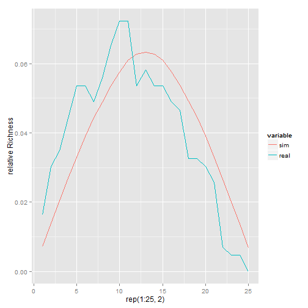

Title
========================================================


```r
setwd("~/R/PermuteSeminar/PermuteSeminar-2014/Null models")
data = read.csv("Hummingbirds.csv")

# Convert Elevations to Numeric... pointless
data$Elevation <- as.numeric(gsub(pattern = "Elev_", replacement = "", x = data$Elevation))

# get widths of ranges from data
ranges = as.numeric(colSums(data[, 2:ncol(data)]))

# number of species to fit
reps = 1e+06

# create a mountain to put them on
mountain <- matrix(nrow = nrow(data), ncol = reps)
for (i in 1:reps) {
    sp.range = sample(x = ranges, size = 1)
    potential.range = nrow(data) - sp.range
    boundary = sample(1:potential.range, 1)
    mountain[boundary:(boundary + sp.range), i] = 1
    
}
richness = rowSums(mountain, na.rm = TRUE)
plot(richness/sum(richness), type = "l", xlab = "Elevation", ylab = "Relative Species Richness", 
    ylim = c(0, 0.07))
abline(v = which.max(richness), col = "blue")
lines(x = 1:25, y = rowSums(data[2:ncol(data)])/sum(rowSums(data[2:ncol(data)])), 
    col = "green")
```

 


```r
setwd("~/R/PermuteSeminar/PermuteSeminar-2014/Null models")
data = read.csv("hylids.csv")

# Convert Elevations to Numeric... pointless
data$Elevation <- as.numeric(gsub(pattern = "Elev_", replacement = "", x = data$Elevation))
data = data[order(data$Elevation), ]

# get widths of ranges from data
ranges = as.numeric(colSums(data[, 2:ncol(data)]))

# number of species to fit
reps = 1e+06

# create a mountain to put them on
mountain <- matrix(nrow = nrow(data), ncol = reps)
for (i in 1:reps) {
    sp.range = sample(x = ranges, size = 1)
    potential.range = nrow(data) - sp.range
    boundary = sample(1:potential.range, 1)
    mountain[boundary:(boundary + sp.range), i] = 1
    
}
richness = rowSums(mountain, na.rm = TRUE)
plot(richness/sum(richness), type = "l", xlab = "Elevation", ylab = "Relative Species Richness", 
    ylim = c(0, 0.07))
abline(v = which.max(richness), col = "blue")
lines(x = 1:25, y = rowSums(data[2:ncol(data)])/sum(rowSums(data[2:ncol(data)])), 
    col = "green")
```

 

